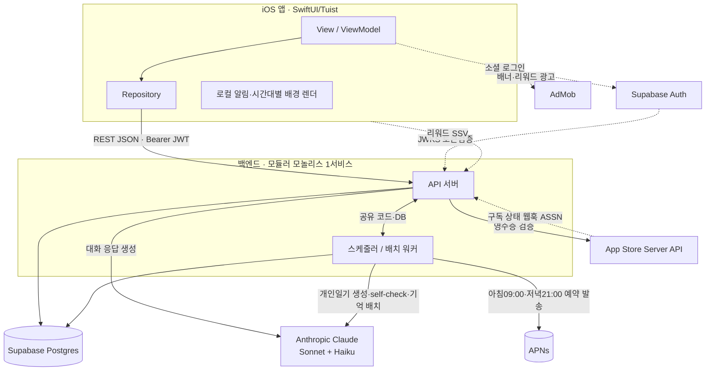
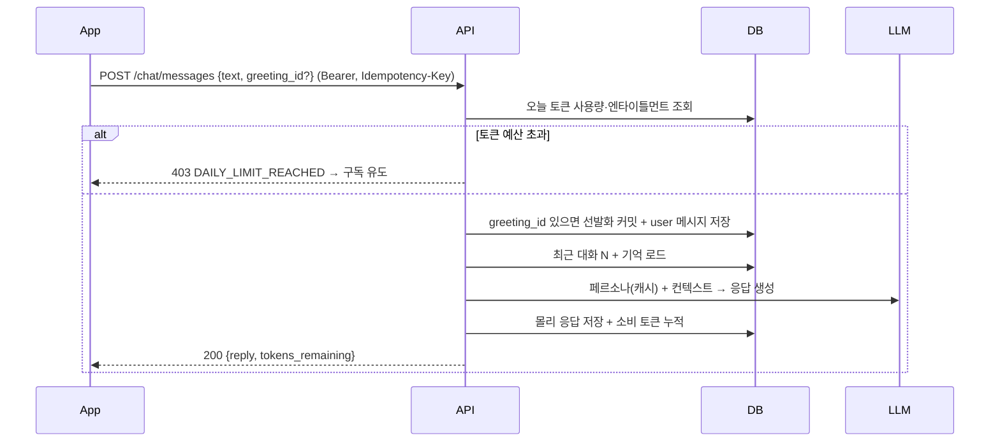
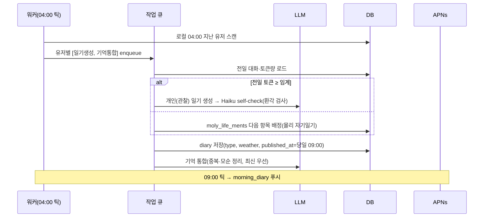

# Moly 아키텍처 설명서

> 2026-07-06. 현재 컨셉·기능 확정본 기준의 **백지 재설계**. 레거시 3-서비스(moly-voice WS 게이트웨이 / moly-llm / moly-server)는 폐기 전제 — 재사용은 "코드"가 아니라 **프롬프트·일기 로직 지식**만(§9).
> 기준 문서: `mvp.md`(정책) · `API_SPEC.md`(계약) · `ERD.md`(데이터) · `MVP_SCOPE.md`.

---

## 1. 설계 원칙

1. **서버가 진실.** 재화·토큰·구독·가격은 서버가 원본. 클라 위조 불가(mvp.md §9).
2. **단순함이 최우선.** 소규모 팀 → **모듈러 모놀리스** 1개 서비스. 마이크로서비스 금지(레거시가 3개로 쪼개져 유지보수 부담이 컸음).
3. **실시간 아님.** 대화는 HTTP 요청-응답(완성본). WebSocket·소켓·폴링 없음 → 무상태 API로 단순.
4. **배치 중심.** 일기 생성·기억 정리·알림은 사용자 행동이 아니라 **하루 경계(04:00) 서버 배치**가 담당.
5. **관리형 우선.** 직접 운영할 인프라 최소화(Auth·DB·배포는 매니지드).
6. **단일 계약.** 앱↔백엔드는 `API_SPEC.md` 하나로 통일(클라가 DB 직접 접근 안 함 — Auth만 예외).

---

## 2. 시스템 구성도

---

## 3. 컴포넌트 책임

### 3.1 iOS 클라이언트
- SwiftUI · MVVM · Repository · DI (기존 `moly-pivot` 규칙 유지). 
- **Auth만 Supabase SDK 직접**(Apple/Google/Kakao) → JWT 획득. 그 외 모든 데이터는 API 경유.
- 순수 클라 책임: **시간대별 배경 렌더**(기기 실제 시각), **루틴 로컬 알림**, 애니메이션/레이어 합성(테마·치장), 오프라인 캐시(일기·잔액 표시용), 로딩 화면.
- 재화·토큰·구독 값은 **서버 응답을 신뢰**(캐시로만 보관, 직접 계산 금지).

### 3.2 API 서버 (모듈러 모놀리스)
하나의 배포 단위, 내부는 도메인 모듈로 분리 — 나중에 필요한 모듈만 떼낼 수 있게.

| 모듈 | 책임 |
|---|---|
| `auth` | JWT 검증(Supabase JWKS), 유저 컨텍스트 |
| `chat` | 대화 1턴: 페르소나 프롬프트 + 기억 주입 → Claude 호출 → 응답 저장·토큰 집계. 선발화 발급·커밋(`greeting_id` 에코, 미커밋은 `greetings` 보관·만료 폐기) |
| `diary` | 일기 조회. (생성은 워커) |
| `economy` | 건초 지갑·원장, 지급/차감(멱등), 상점 구매 |
| `subscription` | StoreKit 영수증 검증, ASSN 웹훅, 엔타이틀먼트 판정 |
| `shop` | 상품 카탈로그, 인벤토리, 장착(배경/머리/목/몸 4슬롯) |
| `routine` | 루틴 CRUD·완료 |
| `ads` | 리워드 SSV 검증 → 건초 지급 |
| `account` | 프로필·알림설정·탈퇴 |
| `gating` | **토큰 예산** 판정·리셋 경계(04:00), 엔타이틀먼트별 한도 |

### 3.3 스케줄러 / 배치 워커 (같은 코드베이스, 별 프로세스)
- **하루 경계(사용자 로컬 04:00)**: 전일 대화 마감 → 일기 생성 잡 enqueue, 기억 통합 잡 enqueue, 일 토큰 카운터 리셋 경계 확정.
- **아침 09:00 / 저녁 21:00 (사용자 로컬)**: 푸시 예약 발송.
- 구현: **1시간 틱 크론**이 타임존별로 "지금 04:00/09:00/21:00을 지난 유저" 스캔 → 잡 처리. 일기 생성은 LLM 지연이 크므로 **작업 큐**로 비동기(요청 경로와 분리).

### 3.4 외부 관리형
- **Supabase**: Auth(소셜) + Postgres(전 데이터). 
- **Anthropic Claude**: Sonnet(대화·개인일기), Haiku(일기 self-check·기억 통합).
- **APNs**: 푸시. **App Store**: IAP/구독. **AdMob**: 광고.

---

## 4. 핵심 흐름

### 4.1 대화 1턴 (HTTP 요청-응답)

### 4.2 일기·기억 배치 (하루 경계 → 다음날 아침)

### 4.3 건초 획득/소비 (서버 권위·멱등)
- 획득: 출석/광고(SSV 검증)/루틴2개 → `economy`가 `(user, activity_date)` 멱등 지급 + 원장 기록 + `balance_after` 반환.
- 소비: 상점 구매 → 서버가 가격·잔액 검증 후 차감 + 인벤토리 추가. 클라는 결과만 반영.

### 4.4 구독 검증
- StoreKit 결제 → App 이 `POST /subscription/verify(JWS)` → API가 App Store Server API로 검증 → 엔타이틀먼트 활성 + 최초 1회 건초 증정.
- 갱신·해지·환불은 **ASSN 웹훅**으로 서버가 수신해 상태 동기(클라 신뢰 안 함).

---

## 5. 데이터 계층
- **Postgres(Supabase)** 단일 소스. 스키마·ERD = `ERD.md`(2026-07-07 API_SPEC과 교차검수 완료).
- 접근: **API 서버만 DB 쓰기**(서비스 롤) — 클라 직접 쓰기 전면 금지 확정(ERD §8, 2026-07-07). RLS는 읽기·심층 방어로 유지 → 계약 단일화(`API_SPEC.md` 하나)·검증 일원화. (읽기 최적화가 필요해지면 RLS 직접읽기를 선택적 도입)
- 일 단위 로직 키 = **`activity_date`**(앱 기준일, 로컬 04:00 경계 — ERD 명칭). 토큰/출석/광고/루틴/일기 귀속 전부 이 키. 미확정 수치(한도·임계·낮밤 구간)는 `app_config`(ERD §6.2).
- 멱등: 채팅 POST는 `Idempotency-Key` 필수, 재화 이동은 `Idempotency-Key` 또는 자연키(`user+activity_date`, SSV/영수증 트랜잭션ID).

---

## 6. 기술 선택 & 근거

| 선택 | 이유 |
|---|---|
| **모듈러 모놀리스 1서비스** | 소팀엔 마이크로서비스가 순손해(배포·관측·정합성 비용). 모듈 경계만 지키면 후에 분리 쉬움 |
| **Supabase (Auth+DB)** | 소셜 로그인 3종·Postgres·관리형을 한 번에. 직접 운영 최소화 |
| **HTTP 요청-응답(스트리밍 X)** | 완성본 반환 결정 → 무상태 API로 가장 단순. WS/폴링 불필요 |
| **배치+큐로 일기 생성** | LLM 지연을 요청 경로에서 분리 → 응답 빠르고 실패 격리·재시도 용이 |
| **Claude Sonnet+Haiku 2티어** | 품질 필요한 대화·개인일기=Sonnet, 검증·기억정리=Haiku로 비용↓ |
| **기억 = mem0 OSS(같은 Supabase pgvector)** | 검증된 기억 파이프라인 재사용, 같은 DB라 인프라 추가 없음(ERD §7). user 연결은 metadata(FK 아님) → **탈퇴 시 mem0 삭제 API 병행 필수** |
| **API 언어 = Python / FastAPI (확정, 2026-07-07)** | 일기 생성·self-check·기억통합·토큰카운팅 등 핵심 난도가 Python LLM 생태계에 네이티브 + mem0 OSS(Python)·`moly-llm` 프롬프트 자산 직접 재사용. **OpenAPI/Swagger UI 자동 생성**(Pydantic 모델 → `/docs`, 무설정)이라 `API_SPEC.md`와 실제 스키마를 코드가 자동 동기 |

---

## 7. 배포·운영 (지속가능성)
- **컨테이너 1이미지 → API/워커 2프로세스**(같은 코드, entrypoint만 분리).
- **매니지드 플랫폼**(Fly.io/Render/Railway 또는 ECS Fargate) + **GitHub Actions CI/CD**(레거시의 수동 EC2 deploy.sh 탈피).
- 시크릿 = 플랫폼 시크릿 매니저. **코드/.env 커밋 금지.**
- 관측: 구조적 로그 + **Sentry**(에러) + 기본 지표(요청·LLM 비용·잡 성공률).
- 백업: Supabase 자동 백업 + 마이그레이션은 버전관리(예: Alembic/SQL 마이그레이션).

---

## 8. 보안·안전
- 인증: Supabase JWT, 서버가 JWKS로 검증. 전 엔드포인트 Bearer.
- 서버 권위: 재화·토큰·구독·가격은 서버만 변경(§1). 상품 가격 클라 하드코딩 금지.
- IAP: 영수증 JWS 서버 검증 + ASSN 웹훅(서명 검증). 광고: SSV 서버 검증.
- 페르소나 프롬프트는 **코드가 단일 소스**(과거 SSM 오버라이드로 "Molly" 오염 사고 → 외부 주입 금지).
- 개인정보: 대화·일기·기억은 민감. 탈퇴 시 완전 삭제. 접근은 API 서비스 롤로 한정.

---

## 9. 레거시 재사용 vs 신규
| 항목 | 처리 |
|---|---|
| moly-voice WS 게이트웨이 | **폐기**(실시간 불필요) |
| moly-llm/서버 코드 | 런타임은 **신규**. 단 **페르소나·일기 생성·self-check 프롬프트 로직**(`PROMPTS_DRAFT.md`)은 이관 가치 있는 지식 자산 |
| iOS `moly-pivot` 템플릿 | 유지(현재 컨셉의 앱 베이스) |
| mem0 | **채택 확정** — 같은 Supabase pgvector에 저장(ERD §7) |

---

## 10. 확장 경로 (필요할 때만)
- LLM/일기 워커가 병목 → 워커만 독립 스케일(같은 코드, 프로세스 분리라 쉬움).
- 읽기 트래픽 급증 → 캐시(Redis) 또는 Supabase RLS 직접읽기 선택 도입.
- 실시간 타이핑 필요해지면 → 대화 엔드포인트만 SSE로 승격(계약 국소 변경).
- 안드로이드 → API 그대로, 클라만 추가.

---

## 11. 결정 필요 (선택지)
1. **호스팅**: Fly.io/Render/Railway(빠름) vs AWS ECS(친숙·통제).
2. **토큰 예산 값**: 체험·구독/무료 일 토큰 상한 + 개인일기·리뷰·경고 임계 수치 — 확정 시 `app_config`에만 반영(배포 불필요).

(종결: **API 언어 = FastAPI** · **기억 = mem0** — §6·ERD §7)
