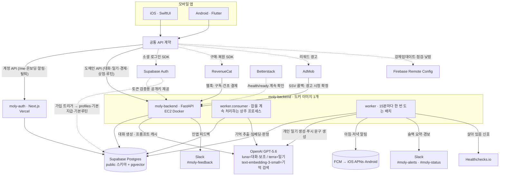
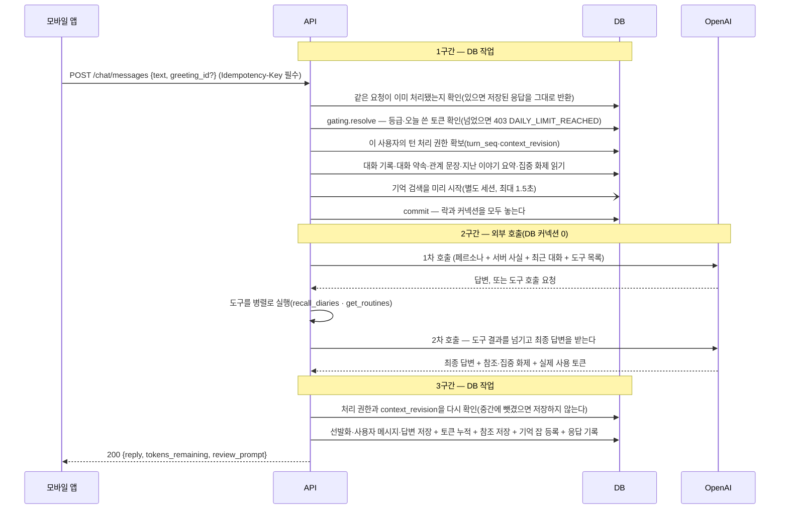

# Moly 백엔드 구조

홈 배너는 서버 이미지의 JSON을 시작 시 검증해 불변 snapshot으로 읽는다. `/banners`가 필요한 실제 날짜·루틴 수만
조합하며 배너 테이블이나 게시 API는 두지 않는다. 세부 구현과 배포 검증은 [BANNER_SDUI.md](BANNER_SDUI.md)를 따른다.


> **2026-08-28 개정** — 현재 코드와 공개 계약을 다시 대조했다.
> 짝 문서: `API_SPEC.md`(앱과 서버가 주고받는 약속) · `ERD.md`(테이블 정의) ·
> `DAILY-FORTUNE.md`(오늘의 운세 상세).
> 기억 시스템의 자세한 설계는 이 문서가 아니라 `docs/ARCHITECTURE-capi.md`가 가지고 있다.
> 이 문서는 백엔드 전체를 훑는 문서라 기억은 5.2절에서 요약만 한다.

---

## 0. 이 문서를 읽기 전에

이 백엔드는 **BeCappy** iOS·Android 앱의 도메인 서버다. 사용자는 카피바라 캐릭터 **캐피**와
한국어·영어·일본어로 대화하고, 캐피는 대화를 바탕으로 일기를 쓴다. 루틴·꾸미기·장기 기억도
같은 사용자 관계에 연결된다.

문서 전체에서 반복해서 나오는 말들을 먼저 정리한다.

| 말 | 뜻 |
|---|---|
| **턴(turn)** | 대화 한 번 주고받기. 사용자 메시지 1개 + 캐피 답변 1개(+ 캐피가 먼저 건넨 인사 1개)를 묶은 단위 |
| **선발화** | 사용자가 말을 걸기 전에 캐피가 먼저 건넨 인사. 사용자가 답을 해야 비로소 대화 기록에 저장된다 |
| **건초** | 앱 안에서 쓰는 재화 이름 |
| **활동일(`activity_date`)** | 사용자 현지 시각 **04:00**을 경계로 하는 날짜 값. 대화 토큰 한도와 일기 귀속에 사용한다 |
| **보상일(`reward_date`)** | 사용자 현지 시각 **00:00**을 경계로 하는 날짜 값. 출석·광고·루틴 보상에 사용한다 |
| **entitlement** | 그 사용자가 지금 무엇을 쓸 수 있는지(등급, 하루 토큰 한도, 광고 제거 여부 등)를 정리한 값 |
| **잡(job)** | 요청을 처리하는 도중에 하지 않고 나중에 따로 돌리는 작업. `async_jobs` 테이블에 한 줄로 쌓인다 |
| **큐(queue)** | 잡을 성격별로 나눈 칸. 한쪽이 밀려도 다른 쪽이 같이 멈추지 않게 한다 |
| **처리 권한(lease)** | "지금 이 작업은 내가 처리 중이다"라는 기한이 붙은 표시. 기한이 지나면 다른 프로세스가 가져갈 수 있다 |
| **같은 요청을 여러 번 보내도 결과가 한 번 보낸 것과 같다** | 재시도해도 중복 지급·중복 차감이 생기지 않는 성질. 영어로는 idempotent라고 쓴다 |
| **원장** | 재화가 움직인 내역을 한 줄씩 append(추가만)로 쌓아 둔 기록. 잔액은 이 기록에서 나온 값이다 |
| **기능을 끄고 켜는 설정** | 배포를 다시 하지 않고 값 하나로 기능을 멈출 수 있게 만든 스위치 |

약어는 처음 나올 때 풀어 쓴다.
FCM = Firebase Cloud Messaging(푸시 발송 서비스) · IAP = In-App Purchase(앱 안에서 하는 결제) ·
SSV = Server-Side Verification(광고 시청을 광고사 서버가 우리 서버로 직접 알려주는 방식) ·
RC = RevenueCat(구독·결제 검증을 대행하는 서비스) · RLS = Row Level Security(PostgreSQL의 행 단위 접근 제어).

---

## 1. 설계 원칙

1. **서버가 기준이다.** 재화·토큰·구독·가격·장착 상태의 원본은 서버에 있다. 앱은 서버가 준 값을 화면에
   보여줄 뿐이고 스스로 계산하지 않는다.
2. **단순하게 간다.** 팀이 작아서 도메인 백엔드는 **하나의 프로젝트**로 묶는다. 서버를 나누는 것은 책임이
   확실히 다른 곳(계정 = moly-auth)에만 허용한다.
3. **실시간이 아니다.** 대화는 HTTP 요청을 보내고 완성된 답변을 한 번에 받는다. WebSocket도, 조금씩
   흘려보내는 스트리밍도, 계속 물어보는 폴링도 쓰지 않는다.
4. **오래 걸리는 일은 뒤로 미룬다.** 기억 만들기는 대화 트랜잭션이 잡으로 등록해 두고, 일기와 푸시는
   15분마다 도는 배치가 처리한다.
5. **직접 만들지 않고 빌려 쓴다.** 로그인·DB·파일 저장은 Supabase, 결제 검증은 RevenueCat, 푸시는 FCM,
   앱 원격 설정은 Firebase.
6. **앱과의 약속은 문서 하나다.** `API_SPEC.md`가 그 문서다. 앱이 DB에 직접 쓰는 것은 전면 금지이며
   (로그인 SDK만 예외), RLS는 그것이 지켜지지 않았을 때를 대비한 두 번째 차단 장치다.
7. **재화는 원장을 지난다.** 건초의 원본은 `hay_transactions` 테이블이다. 잔액은 거기서 계산된 값이고,
   재화가 움직이는 모든 경로는 `hay_ledger.apply` 함수 하나를 반드시 지난다.

---

## 2. 시스템 구성


```mermaid
flowchart TB
  subgraph C[모바일 앱]
    IOS[iOS · SwiftUI]
    AND[Android · Flutter]
  end
  IOS --> V[공통 API 계약]
  AND --> V
  V -->|"계정 API (/me·온보딩·알림·탈퇴)"| AUTH[moly-auth · Next.js<br/>Vercel]
  V -->|"도메인 API (대화·일기·경제·상점·루틴)"| API[moly-backend · FastAPI<br/>EC2 Docker]
  V -.->|소셜 로그인 SDK| SA[Supabase Auth]
  V -.->|구매·복원 SDK| RC[RevenueCat]
  V -.->|리워드 광고| AD[AdMob]
  V -.->|강제업데이트·점검·낮밤| FB[Firebase Remote Config]

  subgraph BE[moly-backend · 도커 이미지 1개]
    API
    W1[worker.consumer · 잡을 계속 처리하는 상주 프로세스]
    W2[worker · 15분마다 한 번 도는 배치]
  end

  AUTH --> DB[(Supabase Postgres<br/>public 스키마 + pgvector)]
  API --> DB
  W1 --> DB
  W2 --> DB
  SA -. 토큰 검증용 공개키 제공 .-> API
  SA -. 가입 트리거 → profiles·기본지급·기본루틴 .-> DB

  API -->|"대화 생성 · 프롬프트 캐시"| OAI["OpenAI GPT-5.6<br/>luna=대화·보조 / terra=일기<br/>text-embedding-3-small=기억 검색"]
  W1 -->|"기억 추출·임베딩·판정"| OAI
  W2 -->|"개인 일기 생성·푸시 문구 생성"| OAI
  W2 -->|아침·저녁 알림| FCM[(FCM → iOS APNs·Android)]

  RC -->|웹훅: 구독·건초 결제| API
  AD -->|SSV 콜백: 광고 시청 확정| API

  W2 -->|"슬랙 요약·경보"| SLK[Slack<br/>#moly-alerts · #moly-status]
  API -->|"인앱 피드백"| SLKF[Slack<br/>#moly-feedback]
  W2 -->|"살아 있음 신호"| HC[Healthchecks.io]
  BS[Betterstack] -.->|"/health/ready 계속 확인"| API
```

앱이 직접 호출하는 서버는 둘뿐이다.

| 주소 | 서버 | 담당 |
|---|---|---|
| `https://moly-server.vercel.app` | moly-auth | 계정: `/me`·온보딩·알림 설정·푸시 토큰·로그아웃·탈퇴 |
| `https://voice.moly.asia` | moly-backend | 그 외 전부 |

Android 앱은 로그인 전에 `POST /attribution/meta-referrer/decrypt`를 호출해 Meta 설치 리퍼러의
암호문을 복호화할 수 있다. 이 공개 경로는 상태를 저장하지 않고 요청 크기와 출력 필드를 제한한다.

서버끼리 들어오는 요청은 웹훅 둘이다.

| 경로 | 보낸 곳 | 확인 방법 |
|---|---|---|
| `POST /webhooks/revenuecat` | RevenueCat | 미리 정한 비밀값을 헤더로 받아 대조 |
| `GET /webhooks/ad-ssv` | AdMob | AdMob 공개키로 서명을 검증 |

---

## 3. 서버가 왜 두 개인가

| 서버 | 스택·배포 | 담당 영역 | 이유 |
|---|---|---|---|
| **moly-backend** | Python FastAPI · EC2 도커(API 프로세스 + 워커 프로세스, 같은 이미지) | 대화·일기·경제·상점·루틴·광고·구독 반영·배치 | 대화 생성, 배치, 재화 거래가 서로 얽혀 있어 한 프로젝트 안에 두어야 정합성을 지키기 쉽다 |
| **moly-auth** | Next.js · Vercel | 계정 조회(`GET /me`)·온보딩·프로필·알림 설정·탈퇴 | 가입과 앱 시작 경로를 빠르게 응답하기 위해 분리했다. `profiles` 행이 없으면 그 자리에서 만들어 주는 복구 로직도 여기 있다 |

두 서버는 **같은 Supabase DB**를 본다. 등급 판정 로직(entitlement)과 기준값(`app_config`)도 공유한다.
moly-auth가 `/me` 응답에 entitlement를 실어 주고, moly-backend는 요청마다 자기가 다시 판정한다.
판정을 두 곳에서 하지만 보는 데이터와 규칙이 같아서 결과가 갈라지지 않는다.

---

## 4. 코드 구조 (moly-backend)

### 4.1 레이어 — 의존은 한 방향으로만

```
app/
├── api/        # HTTP 어댑터. 라우터·요청 파싱·인증 확인만 한다. 로직은 서비스에 넘긴다
├── services/   # 도메인 로직. 트랜잭션 경계, 업무 규칙, 외부 서비스 연동이 여기 있다
├── schemas/    # 요청·응답 형태 정의(pydantic)
├── models/     # SQLAlchemy ORM. db/schema.sql과 1:1로 대응한다
├── core/       # 여러 곳에서 함께 쓰는 것들 — db(세션)·security(토큰 검증)·errors(에러 형식)·time_utils(활동일 계산)
└── config.py   # 모든 조정값의 코드 기본값. app_config 테이블에 값이 없으면 여기 값을 쓴다
worker/         # 배치·잡 처리 진입점(5.5절). app/services를 그대로 가져다 쓰고 HTTP는 없다
db/             # schema.sql(테이블 생성 DDL) + migrations/ + 시드. DB 정의의 기준
```

의존 방향은 `api → services → models·core` 한 방향뿐이다. 반대 방향은 금지다.
서비스끼리 서로 부르는 것은 서비스 레이어 안에서만 허용한다(예: subscription → payment → order).

**지켜야 할 규칙**

- **api는 얇게 쓴다.** 라우터 함수는 인증 확인 한 줄과 서비스 호출 한 줄이면 끝난다. 검증·분기·쿼리를
  라우터에 쓰지 않는다.
- **트랜잭션은 서비스가 연다.** `session.commit()`은 요청당 한 번, 해당 기능의 서비스 함수가 호출한다.
  아래 단계의 도우미 함수는 `flush()`까지만 한다(예: `hay_ledger.apply`).
- **models에는 로직을 넣지 않는다.** 컬럼과 제약은 `db/schema.sql`과 자동으로 대조할 수 있어야 한다.
- **에러는 `core/errors`의 `AppError`만 쓴다.** 에러 코드가 곧 앱과의 약속이라, 서비스가 던지면 전역
  핸들러가 정해진 형식으로 바꿔 내보낸다.

### 4.2 도메인 맵

경제 쪽은 일반적인 커머스 구분을 따른다.

| 하위 도메인 | 서비스 모듈 | 담당 테이블 | 책임 |
|---|---|---|---|
| **상품 목록** | `shop.get_products`, `economy` | `products` | 파는 것 전부를 한 테이블에 둔다(`product_type`: 건초 묶음 / 꾸미기) |
| **주문** | `order` | `orders` `order_items` | 모든 구매가 지나는 입구. 현금 결제와 건초 결제가 같은 구조를 쓰고, 그때의 가격을 그대로 남긴다 |
| **결제** | `payment` | `payments` | 실제 현금이 오간 기록. `store_transaction_id`가 유일해야 해서 같은 영수증으로 두 번 지급되지 않는다 |
| **지갑** | `hay_ledger` `economy` | `hay_transactions` `user_daily_stats` | 건초가 움직인 기록, 잔액, 하루 보상 지급 여부 |
| **보유·장착** | `shop` | `user_items` | 가지고 있는 것과 지금 입고 있는 것을 한 테이블에서 관리한다(`source`·`equipped_slot`) |
| **구독** | `subscription` `entitlement` `gating` `limits` | `subscriptions` `subscription_hay_grants` | RevenueCat 웹훅 반영, 증정과 회수, 등급 판정, 토큰 예산 |

경제 밖 도메인은 다음과 같다.

| 영역 | 주요 모듈 |
|---|---|
| 대화 | `chat` · `chat_turns`(턴 처리 권한과 순서) · `chat_references`(답변에 붙는 일기 참조) · `greetings` · `turn_context` · `prompt_assembly` · `prompts` |
| 대화 도구 | `agent/runtime`(모델 호출 루프) · `agent/tools/*`(`recall_diaries`·`get_routines`) |
| 일기 | `diary`(조회) · `diary_generation`(배치 생성) · `diary_prompts` · `recall_diaries` · `diary_recall_repo` |
| 기억 | `mem0_*` 계열(추출·판정·저장·검색) · `memory_pipeline`(사용자별 진행 상태) · `memory_embeddings` · `interaction_contract`·`contract_compiler`·`contract_repo`(사용자별 대화 약속) · `relationship`·`relationship_projector`(관계 단계) · `checkpoint_v2`·`checkpoint_repo`(긴 대화 줄거리 요약) |
| 잡 처리 | `jobs`(큐·처리 권한·재시도) · `job_telemetry` |
| 그 외 | `routine` · `ads`·`ads_ssv` · `review` · `account`(읽기 도우미만) · `llm` · `usage_ledger`(모델 사용 원가 기록) · `notify`·`push` · `config_store` · `i18n` · `naming` · `privacy` · `feedback` · `slack_notify` |

**재화가 움직일 때의 순서는 항상 같다.**

```
주문 생성(order) → 원장 기록(hay_ledger, order_id로 연결) → 보유·결제 기록(user_items·payments)
  └─ 셋이 한 트랜잭션이다. 하나라도 실패하면 통째로 되돌린다 — 반만 지급되거나 반만 차감되는 상태가
     구조적으로 생길 수 없다
```

원장(`hay_transactions`)은 추가만 하고 수정하지 않으며, `order_id` 외래키로 주문·결제와 양방향으로
추적된다(고객 문의 대응을 자동화하기 위한 것이다). `ref_id` 같은 text 컬럼 하나로 여러 종류를 가리키는
방식은 쓰지 않는다 — 무엇을 가리키는지 DB가 검사할 수 없어서다.

### 4.3 반드시 지켜야 하는 규칙은 DB에도 넣는다

서비스 코드가 먼저 검사하지만, 돈과 소유가 걸린 규칙은 DB 제약으로도 한 번 더 막는다.
코드에 실수가 있어도 DB가 거부한다.

| 반드시 지켜야 하는 규칙 | DB가 막는 방법 |
|---|---|
| 잔액은 음수가 될 수 없다 | `profiles.hay_balance CHECK ≥ 0` + 갱신 시 행 잠금(`with_for_update`) |
| 같은 것을 두 번 살 수 없다 | `user_items UNIQUE(user_id, product_id)` — 동시에 사면 한쪽이 오류가 나고 되돌려져 409를 받는다 |
| 한 자리에는 하나만 장착한다 | 조건부 UNIQUE `(user_id, equipped_slot) WHERE NOT NULL` |
| 자리에 맞는 것만 장착한다 | 복합 외래키 `(product_id, equipped_slot) → products(id, slot)` |
| 같은 영수증으로 두 번 지급하지 않는다 | `payments.store_transaction_id UNIQUE` |
| 증정은 요금제당 한 번만 | `subscription_hay_grants UNIQUE(user_id, plan)` + 환불 회수는 `revoked_at` 표시로 처리해 여러 번 실행해도 결과가 같다 |
| 상품 종류에 맞는 컬럼만 채운다 | `products`의 종류별 CHECK(건초 묶음 컬럼과 꾸미기 컬럼이 서로 배타) |

⚠️ 구현 시 주의: 장착 자리를 바꿀 때는 "검사 → 기존 것 전부 해제 → `flush()` → 새로 장착" 순서로
두 단계에 나눠야 한다. 조건부 UNIQUE는 SQL 문 단위로 검사하기 때문에, 해제와 장착이 한 번의 flush에
섞이면 실행 순서에 따라 제약 위반이 난다(실제 DB에서 재현해 확인했다).

---

## 5. 핵심 흐름

### 5.1 대화 한 턴

한 턴은 세 구간으로 나뉜다. 가운데 구간(모델 호출)에서는 **DB 커넥션을 하나도 쥐지 않는다.**
모델 응답을 기다리는 동안 DB 락을 잡고 있으면 다른 요청이 전부 밀리기 때문이다.


```mermaid
sequenceDiagram
  participant App as 모바일 앱
  participant API
  participant DB
  participant LLM as OpenAI

  Note over API,DB: 1구간 — DB 작업
  App->>API: POST /chat/messages {text, greeting_id?} (Idempotency-Key 필수)
  API->>DB: 같은 요청이 이미 처리됐는지 확인(있으면 저장된 응답을 그대로 반환)
  API->>DB: gating.resolve — 등급·오늘 쓴 토큰 확인(넘었으면 403 DAILY_LIMIT_REACHED)
  API->>DB: 이 사용자의 턴 처리 권한 확보(turn_seq·context_revision)
  API->>DB: 대화 기록·대화 약속·관계 문장·지난 이야기 요약·집중 화제 읽기
  API-)DB: 기억 검색을 미리 시작(별도 세션, 최대 1.5초)
  API->>DB: commit — 락과 커넥션을 모두 놓는다

  Note over API,LLM: 2구간 — 외부 호출(DB 커넥션 0)
  API->>LLM: 1차 호출 (페르소나 + 서버 사실 + 최근 대화 + 도구 목록)
  LLM-->>API: 답변, 또는 도구 호출 요청
  API->>API: 도구를 병렬로 실행(recall_diaries · get_routines)
  API->>LLM: 2차 호출 — 도구 결과를 넘기고 최종 답변을 받는다
  LLM-->>API: 최종 답변 + 참조·집중 화제 + 실제 사용 토큰

  Note over API,DB: 3구간 — DB 작업
  API->>DB: 처리 권한과 context_revision을 다시 확인(중간에 뺏겼으면 저장하지 않는다)
  API->>DB: 선발화·사용자 메시지·답변 저장 + 토큰 누적 + 참조 저장 + 기억 잡 등록 + 응답 기록
  API-->>App: 200 {reply, tokens_remaining, review_prompt}
```

**이 흐름에서 알아 둘 것들**

- **프롬프트 캐싱이 비용의 핵심이다.** 같은 앞부분을 반복해서 보내면 그 부분은 훨씬 싸게 청구된다.
  그래서 잘 바뀌지 않는 것(페르소나, 사용자별 대화 약속, 관계 문장)은 system 앞쪽에 고정으로 두고,
  자주 바뀌는 것(지난 이야기 요약, 검색된 기억, 지금 상태)은 **system이 아니라 대화 배열 끝쪽**에
  `role="system"` 항목으로 끼워 넣는다. 자주 바뀌는 값을 앞에 두면 그 뒤 전부가 매 턴 새로 청구된다
  (실제로 측정했다: 요약이 갱신된 턴마다 캐시 읽기 0, 새로 쓰기 4,500토큰).
- **동시에 들어온 턴은 순서를 지킨다.** 모델을 호출하는 동안 DB 트랜잭션은 닫아 두되, 사용자별로
  기한이 붙은 처리 권한만 남긴다. 저장 직전에 그 권한과 `context_revision`이 그대로인지 확인한다
  (값이 그대로인지 확인한 뒤에만 바꾸는 방식이다). 이렇게 해야 늦게 끝난 답변이 먼저 끝난 답변을
  덮어쓰거나, 토큰이 두 번 차감되는 일이 없다.
- **일기 참조는 서버가 다시 검증한다.** 모델이 일기 원문을 다시 쓰게 하지 않는다. 답변에 일기 카드를
  붙이는 기능을 켠 앱에만, 서버가 그 일기가 이 사용자 것이고 이미 발행됐는지(`chat_references`) 다시
  확인한 뒤 붙인다. 검증에 실패하면 참조를 떼고 "지금 확실하게 떠올리지 못했어"로 답한다.
- **대화 배열의 첫 항목은 반드시 사용자 메시지다.** 그래서 배열 맨 앞에 온 캐피 메시지(= 이미 커밋된
  선발화)는 배열에서 빠진다. 하지만 버리지 않고 **system의 가변 블록**(`[먼저 건넨 말]`)으로 옮긴다.
  버리면 캐피가 방금 자기가 건넨 인사를 모른 채 또 인사한다. 이 값은 대화 앵커가 앞으로 밀리기 전까지
  같은 값이라, 캐시가 추가로 깨지지는 않는다. (코드: `app/services/chat.py`의 `_context`)
- **답변 문자열 정리는 코드가 확정한다.** 줄바꿈과 말줄임표는 페르소나 지시로 막아도 새어 나와서
  (실제로 측정했을 때 5번 중 3번), 저장 직전에 코드가 제거한다(`chat._clean_reply`).
  저장한 값과 앱에 보낸 값은 언제나 같다.
- **기억 저장은 대화 응답 경로에 없다.** 요청 처리 중에는 잡 하나만 등록하고 끝난다. 실제 추출과
  판정은 워커가 나중에 한다(5.2절).
- **토큰은 미리 막고 나중에 세는 방식이다.** 요청 전에 한도를 확인해 넘었으면 거절하고, 실제 사용량은
  응답을 받은 뒤에 누적한다. 그래서 마지막 한 번의 답변은 한도를 조금 넘긴 채로 완성될 수 있다.
  이건 의도한 동작이다.

### 5.2 기억 시스템 (요약)

> 이 절은 **요약만** 한다. 저장 형식, 판정 규칙, 실패 처리, 개인정보 삭제 절차 같은 자세한 내용은
> `docs/ARCHITECTURE-capi.md`(캐피의 기억·대화 설계 문서)가 가지고 있다.

**핵심은 두 가지다.**

1. 기억의 본문과 검색용 벡터는 pgvector 컬렉션 `vecs.moly_memories_v2`에 있다.
2. **어떤 기억이 지금 유효한지는 벡터 저장소가 아니라 `mem0_memory_registry` 테이블이 판정한다.**
   벡터 검색 결과는 이 테이블을 통과해야만 대화에 쓰인다.

두 개로 나눈 이유가 중요하다. 벡터 저장소는 새 기억을 계속 추가만 하기 때문에, "예전 회사에 다닌다"와
"이제 회사 안 다닌다"가 함께 남는다. 벡터 검색만 믿으면 캐피가 사용자가 이미 정정한 내용을 계속 꺼낸다.
그래서 어느 쪽이 현재인지를 별도 테이블이 기록하고(`semantic_status`), 검색은 `active`와 `ambiguous`만
통과시킨다. `ambiguous`는 "판정 실패"가 아니라 "어느 쪽이 현재인지 모른다"는 정상 상태이며, 이 경우
양쪽을 시각과 함께 넘겨 캐피가 단정하지 않게 한다.

**저장 절차** — 전부 `worker/mem0_jobs.py`가 잡으로 처리한다. 대화 요청은 잡 등록까지만 한다.

| 순서 | 하는 일 | 어디에 남는가 |
|---|---|---|
| 1 | 대화 턴이 커밋되면 `mem0_ingest` 잡을 등록한다 | `async_jobs` |
| 2 | 그 턴의 메시지를 읽어 모델에게 기억 후보를 뽑게 한다 | — |
| 3 | 후보가 가리키는 근거 구간이 실제 원문과 맞는지 대조한다. 안 맞는 후보는 버린다 | — |
| 4 | 적격성을 검사한다(`check_eligibility`). 비었거나 너무 긴 것, 사용자 발화 근거가 없는 것(모델의 추측), 근거 구간이 어긋난 것, 실명이 들어간 것, 대화 약속과 겹치는 것, 지시문처럼 생긴 것, 잔액·장착 같은 현재 상태, 테스트용 문구는 버린다 | — |
| 5 | 통과한 후보를 **벡터 저장소에 넣기 전에 먼저** `planned` 상태로 저장한다. 이때 저장할 id를 미리 정해 둔다 | `mem0_ingest_candidates`, `mem0_ingest_candidate_sources` |
| 6 | 통과 후보 전체를 **한 번에** 임베딩한다 | — |
| 7 | 벡터를 저장한다 | `vecs.moly_memories_v2` |
| 8 | 판정 대기 상태로 장부에 등록하고, 근거를 시각과 함께 옮긴다. 그 뒤 후보를 `committed`로 닫는다 | `mem0_memory_registry`, `mem0_memory_sources` |
| 9 | 판정 대기가 남아 있으면 `mem0_consolidate` 잡을 건다. 모델이 중복·대체 관계를 내고, 코드가 그 결과를 검증한 뒤 상태를 확정한다 | `mem0_memory_registry` |
| 10 | 중복·대체로 닫힌 기억은 `mem0_provider_delete` 잡이 벡터 저장소에서 지운다 | `vecs.moly_memories_v2` |

5번 순서가 중요하다. 저장할 id를 미리 정하고 후보를 먼저 기록해 두기 때문에, 벡터 저장에 성공한
직후 프로세스가 죽어도 재시도가 **모델을 다시 부르지 않고** 같은 계획을 읽어 같은 id로 다시 저장한다.
모델을 다시 부르면 결과가 달라져서 앞 시도가 남긴 행을 아무도 닫지 못한다(실제로 겪은 사고다).

**읽기** — 대화 중 기억 검색은 `app/services/chat.py`의 `_recall_memory_v2`가 한다.
질문을 임베딩해서 벡터 검색을 하고, 그 결과를 `mem0_memory_registry`로 거른 뒤 상위 몇 건만 쓴다.
검색은 **1.5초 안에 끝나야 하고**, 실패하거나 시간이 넘으면 기억 없이 대화를 계속한다.
기억 때문에 대화가 실패하지는 않는다.

**함께 쓰이는 테이블**

| 테이블 | 담당 |
|---|---|
| `memory_pipeline_states` | 사용자별 처리 상태. 어디까지 기록했고(`source_through_turn_seq`), 어디까지 추출했고(`ingest_through_turn_seq`), 어디까지 판정했는지(`consolidated_through_turn_seq`)를 들고 있다. 전환 단계(`mode`: legacy / shadow / v2)도 여기 있다 |
| `user_interaction_contracts` (+`_items`) | 사용자별 대화 약속("반말로 해줘" 같은 것). 검색 성공 여부와 무관하게 **항상** 프롬프트에 들어간다. 사용자가 쓴 문장을 그대로 넣지 않고, 정해진 항목 값으로 바꿔 서버 템플릿으로 렌더한다 — 그래야 사용자가 쓴 임의의 문장이 매 턴 명령 위치에 들어가지 않는다 |
| `user_relationship_states` · `relationship_events` | 관계 단계. 모델이 "가까워진 것 같다"고 써서 오르는 게 아니라, 성공한 턴 수와 활동일 수를 집계해 코드가 정한다. 단계는 내려가지 않는다 |
| `relationship_profile_renders` | 관계 상태를 언어별 문장으로 만들어 둔, 다시 만들 수 있는 파생 데이터 |
| `conversation_checkpoints` | 대화가 길어져 앵커 앞으로 밀려난 구간의 줄거리 요약. 기억이 아니라 대화 연속성을 위한 것이다 |

**대화 중 캐피가 스스로 부를 수 있는 도구는 둘뿐이다.**

| 도구 | 하는 일 |
|---|---|
| `recall_diaries` | 발행된 일기를 의미와 부분 문자열로 찾아, 존재 여부·개수·제목·발췌·요청한 전문을 한 번에 돌려준다 |
| `get_routines` | 사용자 현지 날짜 기준 루틴 상태를 읽는다 |

(`finish_response`는 도구 목록에 있지만 사용자에게 노출되는 조회 도구가 아니다. 2차 호출에서 답변
형식과 참조를 확정하기 위한 내부 약속이다.)

시각과 장착 상태 같은 값은 도구로 조회하지 않는다. 매 턴 서버가 알아서 넣어 준다.

일기는 `diaries`가 원본이고 기억 추출의 재료가 아니다. 그래서 "일기에 적혀 있다", "대화 요약에 있다",
"캐피의 기억에 있다"는 서로 다른 상태다.

### 5.3 상점 구매(건초 결제) / 건초 구입(현금 결제)

```
상점:  검증(비매품 403 · 이미 보유 409) → 주문 생성(HAY, paid) + 주문 항목
       → 원장에서 가격만큼 차감(모자라면 402) → 보유 기록 → commit

건초 구입: RevenueCat 웹훅(NON_RENEWING_PURCHASE 이벤트)
       → 같은 영수증이 이미 처리됐는지 확인 → 주문 생성(KRW, paid) + 주문 항목
       → 원장에 건초 지급(주문과 연결) → 결제 기록 → commit
```

앱은 건초 구입을 RevenueCat SDK로 결제하고 우리 서버 API를 부르지 않는다. 지급은 전적으로 웹훅으로만
일어난다. 앱은 `GET /wallet`을 다시 불러 반영을 확인한다.

### 5.4 구독 (RevenueCat 웹훅이 유일한 창구)

| 이벤트 | 처리 |
|---|---|
| `INITIAL_PURCHASE` `RENEWAL` `UNCANCELLATION` `PRODUCT_CHANGE` `SUBSCRIPTION_EXTENDED` | `subscriptions` 갱신 + 결제 기록 + 증정(요금제별 최초 1회, DB UNIQUE로 강제) |
| `CANCELLATION` (사유 `CUSTOMER_SUPPORT` = 환불) | 상태를 `revoked`로 바꾸고, 구독 전용 장착을 해제하고, 증정한 건초를 회수한다. 여러 번 실행돼도 결과가 같도록 `subscription_hay_grants.revoked_at`으로 표시한다 |
| `CANCELLATION` (그 외 사유) | 자동 갱신만 끈다. 남은 기간의 혜택은 유지된다 |
| `EXPIRATION` | 만료 처리 + 구독 전용 장착 해제 |
| `BILLING_ISSUE` | 유예 상태(`grace_period`)로 둔다 — 혜택은 유지된다 |
| `TRANSFER` | `SANDBOX`(TestFlight/테스트)는 경제·구독·결제 변경 없이 `processed` no-op. `PRODUCTION`과 환경 미확인 건은 즉시 실패로 표시하고 슬랙으로 알려 운영자가 직접 본다 |

등급은 DB에 저장하지 않는다. `entitlement.derive_entitlement`가 조회할 때마다 판정하며,
순서는 **실제 구독자 → 런칭 무료 기간 → 체험 기간 → 무료**다.
런칭 무료 기간(`app_config.free_launch_until`, 코드 기본값 2026-10-01 04:00 KST)에는 구독이 없어도
구독과 같은 혜택을 주되, 하루 토큰 한도는 전용 값(`free_launch_token_limit`, 코드 기본값 150,000)을 쓴다.

참고 — 하루 토큰 한도의 코드 기본값은 `app/config.py`에 있다.

| 등급 | 코드 기본값 |
|---|---|
| 무료 | 20,000 |
| 체험 | 100,000 |
| 구독 | 100,000 |
| 런칭 무료 기간 | 150,000 |

이 값들은 `app_config` 테이블로 덮어쓸 수 있다.

### 5.5 배치와 잡 처리 — 프로세스 두 개

워커는 하나가 아니라 **성격이 다른 두 프로세스**로 나뉜다. 도커 이미지는 API와 같고 실행 명령만 다르다.

**(1) `python -m worker.consumer` — 계속 떠 있는 잡 처리 프로세스**

`async_jobs` 테이블에 쌓인 잡을 계속 집어서 처리한다(`worker/consumer.py`).

- 큐마다 독립된 루프와 고정된 처리 슬롯을 가진다. 한 큐가 밀려도 다른 큐의 슬롯을 빌려 쓰지 않는다.
- 큐는 6종이다.

  | 큐 | 용도 | 동시 처리 수(코드 기본값) |
  |---|---|---|
  | `critical` | 결제 | 2 |
  | `interactive_async` | 대화 직후 후속 작업 | 2 |
  | `content` | 일기·요약 | 1 |
  | `memory` | 기억 색인 | 2 |
  | `notification` | 저녁 푸시 | 1 |
  | `maintenance` | 유지보수 | 1 |

  기억을 별도 큐로 뺀 이유는, `content`의 동시 처리 수가 1이라 일기 300건이 도는 동안 기억이
  통째로 밀렸기 때문이다.
- 잡을 집을 때 **기한이 붙은 처리 권한**을 받는다. 처리가 길어지면 주기적으로 기한을 연장하고,
  연장에 실패하면(= 다른 프로세스가 이미 가져갔으면) **결과를 저장하지 않고 그냥 포기한다.**
  이것이 늦게 돌아온 작업이 남의 결과를 덮어쓰지 못하게 막는 장치다.
- 실패는 세 가지로 나눈다. 시간 초과·429·일시적인 네트워크/DB 오류는 **재시도 간격을 점점 늘리며**
  다시 시도하고, 형식 검증 실패나 지원하지 않는 요청은 즉시 포기(dead)하며, 대상 사용자가 탈퇴한
  경우는 취소(cancelled)로 닫는다. 시도 횟수는 잡을 집는 순간에 늘어나기 때문에, 프로세스가 죽어서
  마무리를 못 한 잡도 결국은 포기 상태에 도달한다.
- 끝난 잡(`succeeded` `dead` `cancelled`)은 같은 행을 다시 살리지 않는다. 다시 돌려야 하면 원본을
  남기고 `replay_of`로 이어지는 새 행을 만든다. 성공·취소 payload는 24시간, 원인 조사에 필요한
  `dead` payload는 7일 뒤 자동으로 비우고 상태·시각·오류 코드만 남긴다. 정리 한 번에 테이블별
  최대 500건만 잠금 대기 없이 처리한다.
- 등록된 잡 종류: 기억 3종(`mem0_ingest`·`mem0_consolidate`·`mem0_provider_delete`), 기억 재판정
  (`mem0_reconsolidate`), 멈춘 기억 파이프라인 재개(`memory_gap_sweep`), 대화 요약(`conversation_checkpoint`,
  `shadow_checkpoint`), 대화 약속 컴파일(`contract_compile`), 관계 문장 생성(`relationship_project`),
  프롬프트 기록(`shadow_prompt_trace`), 탈퇴 정리(`privacy_cleanup`),
  일기 검색용 임베딩(`diary_recall_embed`). 모두 12종이다.

**(2) `python -m worker` — 15분마다 한 번 도는 배치**

외부 크론이 매시 :00, :15, :30, :45에 실행한다(`worker/tick.py`). 한 번 실행하고 끝난다.
같은 시간대를 두 번 돌아도 결과가 같도록 만들어져 있다.

| 사용자 현지 시각 | 하는 일 |
|---|---|
| 04:00 | 전날 일기 생성. 사용자가 쓴 글자 수가 기준(`diary_min_user_chars`, 코드 기본값 60자)을 넘으면 terra 모델로 개인 일기를 쓰고 luna 모델로 자체 점검을 한다. 미달이거나 접속이 없었으면 캐피 자기 일기(미리 준비한 문구)를 발행한다 |
| 09:00 | 아침 일기 도착 푸시. **현재 꺼져 있다**(`morning_push_enabled` 기본값 False). 코드는 그대로 두고 값만 True로 바꾸면 재개된다 |
| 20:00 | 저녁 안부 푸시. 미리 정해 둔 고정 문구를 언어별로 골라 보낸다(`app/services/notify.py`) |

이 밖에 매 틱마다 RevenueCat 웹훅 대기분을 처리하고, 워커가 끝까지 돌았다는 기록을 남기고,
멈춘 기억 파이프라인을 재개시키고, 슬랙 요약과 살아 있음 신호를 보낸다.

배치는 타임존별로 나눠 스케줄을 거는 게 아니라 **전체 사용자를 훑으면서 각자의 현지 시각을 계산**한다.
그래서 별도 스케줄러가 필요 없다. 대신 사용자가 늘면 비용도 같이 는다. 이 문제를 대비해
`user_schedules` 테이블에 사용자별 다음 실행 시각을 채워 두고 있지만, **아직 읽기 경로가 아니다** —
값이 정확한지 확인되기 전까지 전체 훑기를 제거하지 않는다.

한 사용자의 처리가 실패하거나 늦어도 배치 전체는 멈추지 않는다. 사용자마다 독립된 DB 세션을 쓰고,
사용자당 시간 제한(`worker_user_timeout_s`, 코드 기본값 120초)을 두며, 실패는 다음 틱이 다시 시도한다.

일기 생성은 15분 배치가 겹칠 수 있어서, 같은 (사용자, 날짜) 일기를 두 프로세스가 동시에 만들지 않도록
`diary_gen_claims` 테이블에 커밋된 표시를 남겨 서로 배제한다. 이 표시는 30분이 지나면 회수된다 —
살아 있는 프로세스는 시간 제한에 걸려 자기 표시를 먼저 지우므로, 30분 회수는 강제 종료된 프로세스만
대상으로 한다.

### 5.6 가입 — 코드 배포와 무관하게 DB 트리거가 처리한다

`auth.users`에 행이 생기면 `handle_new_user` 트리거가 `bootstrap_user` 함수를 부르고,
한 트랜잭션 안에서 다음을 만든다.

- `profiles` 행(체험 기간 = 가입 시각 + 48시간)
- 기본 지급 꾸미기 3종 — 기본 테마(`theme_default`), 운동 테마(`theme_workout`), 선글라스
  (`head_sunglasses`)를 `source='admin_grant'`로 지급하고 기본 테마만 장착한다
- 기본 루틴 2개 — "이불 정리하기", "물 마시기"(둘 다 주 7일)

어떤 경로로 가입해도 같은 상태가 보장된다. 필요한 상품 시드가 없으면 함수가 예외를 던져 가입이
실패하도록 되어 있다 — 조용히 반쪽짜리 계정이 만들어지는 것보다 낫기 때문이다.

### 5.7 유저에게 보이는 글의 언어

**서버가 만들어 내보내는 글은 한국어·영어·일본어 셋뿐이다.** 캐피의 대화 응답, 일기, 푸시 문구가
모두 여기 해당한다. 그 밖의 언어를 쓰는 유저는 영어를 받는다. 셋만 있는 이유는 페르소나도 말투
규칙도 검수 프롬프트도 셋만 준비돼 있어서, 나머지 언어는 품질을 보장할 수 없기 때문이다.

기준이 되는 값은 `profiles.language`(유저의 앱 콘텐츠 언어) 하나다. 이 값을 셋으로 좁히는 일을
**두 겹으로** 한다.

| 겹 | 어디서 | 무엇을 하나 |
|---|---|---|
| 1 | DB | `trg_normalize_profile_language` 트리거가 저장되는 값 자체를 `ko`·`en`·`ja`로 바꾼다. 규칙은 `docs/ERD.md` 3.2절 |
| 2 | 코드 | `app/services/i18n.py`의 `resolve()`가 읽은 값을 한 번 더 셋으로 좁힌다 |

두 번 하는 이유는 이렇다. DB만 좁히면 `profiles`를 못 읽은 경우에 대비가 없고, 코드만 좁히면
저장된 값에 미지원 언어가 계속 남아 앞으로 새로 생기는 코드가 그 값을 다시 읽는다.

**프롬프트는 언어마다 번역이 아니라 각 언어로 새로 쓴 원본을 따로 둔다.**

| 쓰임 | 파일 | 한국어 | 영어 | 일본어 |
|---|---|---|---|---|
| 대화 | `app/services/prompts.py` | `CAPI_PERSONA` | `CAPI_PERSONA_EN` | `CAPI_PERSONA_JA` |
| 일기 | `app/services/diary_prompts.py` | `_DIARY_PERSONA` | `_DIARY_PERSONA_EN` | `_DIARY_PERSONA_JA` |

캐릭터 이름도 언어마다 다르다 — 한국어 `캐피`, 영어 `Cappy`, 일본어 `キャピー`. 예전에는 영어
유저에게도 한국어 페르소나를 그대로 썼고, 이름이 `캐피`로만 적혀 있어서 모델이 라틴 표기를
매번 지어냈다(개발 서버 실제 측정: "My name is Capi. C A P I.").

**응답에 그 언어에 없어야 할 글자가 섞이면 코드가 지운다.** `app/services/text_clean.py`의
`has_foreign`(섞였는지 판정)과 `strip_foreign`(지우기)이 담당한다. 언어마다 **남길 글자 계열**을
적어 두고 그 밖의 글자를 지우는 방식이다. 예전에는 반대로 지울 계열(한자·가나)을 나열했는데,
유니코드 문자 계열이 150종이 넘어서 그 목록은 완성될 수 없었다 — 목록에 없던 그리스·구자라트·키릴
글자가 그대로 나갔다. 유저 닉네임은 판정에서 빼둔다. 유저가 정한 값이라 응답 언어와 계열이 다를
수 있고, 이름이 통째로 지워진 답을 내보내는 쪽이 더 나쁘기 때문이다.

---

## 6. 데이터 계층

- **DB 정의의 기준은 `db/schema.sql`이다**(테이블 생성 DDL). 이후 변경은 `db/migrations/`에 날짜순
  파일로 쌓이며, `db/apply.py`로 적용하고 `schema_migrations` 테이블에 기록된다.
  ORM 모델은 이 정의와 1:1로 대조할 수 있어야 한다.
- enum은 PostgreSQL enum 타입 대신 **text + CHECK**로 둔다(asyncpg 드라이버와의 마찰을 피하려는 것이다).
  모델도 String으로 매핑한다.
- 대화 한도·일기 귀속은 사용자 로컬 04:00 경계 `activity_date`, 출석·광고·루틴 보상은 로컬
  00:00 경계 `reward_date`를 쓴다. 계산은 `core/time_utils`에 있다. **초기화 배치가 없다** — 새 날짜의
  행이 생기는 것이 곧 초기화다. `/charging-station.activity_date`는 호환 필드명이며 값은 reward date다.
- 조정값은 두 갈래다.

  | 용도 | 저장 위치 |
  |---|---|
  | 서버가 판정에 쓰는 값 | `app_config` 테이블. 값이 없으면 `app/config.py`의 코드 기본값을 쓴다. 앱에는 노출하지 않는다 |
  | 앱이 읽는 값(강제 업데이트·점검·낮밤 전환) | Firebase Remote Config |

- **기억 관련 데이터의 위치**

  | 데이터 | 위치 | 성격 |
  |---|---|---|
  | 대화 원문 | `messages` | 원본. 기억을 정리해도 지우지 않는다 |
  | 발행된 일기 | `diaries` | 원본 |
  | 기억 본문·검색 벡터 | `vecs.moly_memories_v2`(pgvector 컬렉션) | 대화에서 다시 만들 수 있는 파생 데이터 |
  | 기억의 유효 여부 판정 | `mem0_memory_registry` | 검색 결과를 거르는 기준 |
  | 기억의 근거 구간 | `mem0_memory_sources` | 어느 발화에서 나온 기억인지. 이게 없으면 정정을 기존 기억에 연결할 수 없다 |
  | 추출 계획(중간 상태) | `mem0_ingest_candidates`, `mem0_ingest_candidate_sources` | 재시도가 같은 결과로 수렴하게 하는 기록 |
  | 사용자별 처리 상태 | `memory_pipeline_states` | 어디까지 처리했는지 기록한 번호와 처리 권한 |
  | 대화 약속 / 관계 / 대화 요약 | `user_interaction_contracts`, `user_relationship_states`, `relationship_events`, `relationship_profile_renders`, `conversation_checkpoints` | 관계와 약속. 관계 단계는 `relationship_events`에서 다시 계산할 수 있다 |

  `vecs.moly_memories_v2` 컬렉션은 마이그레이션(`db/migrations/20260805_mem0_v2_collection.sql`)이 만든다.
  **서버가 돌면서 자동으로 만들지 않는다.**

  **2026-08-14 재추출 잔여물 정리 완료.** 재추출 때 롤백용으로 숨겨 두었던
  `classification_version IN ('pre-reextract-active', 'pre-reextract-ambiguous')` 기억 19,063건은
  provider 벡터 삭제 완료를 확인한 뒤 100건씩 순차 처리했다. 대응 candidate와 source, registry를
  제거하고 이미 닫힌 기억의 `duplicate_of_registry_id` / `superseded_by_registry_id` 참조 2,217건만
  `NULL`로 정리했다. `active` / `ambiguous` / `pending` 기억, `messages`, 파이프라인 커서, 대화 약속,
  관계, 일기, checkpoint는 변경하지 않았다. 작업 뒤 과거 표식·고아 candidate/source·끊어진 참조는
  모두 0건이며, 현행 기억의 벡터·근거 누락도 0건으로 확인했다.
- 일기 검색용 `diary_recall_documents`는 원문을 복제하지 않는, 다시 만들 수 있는 pgvector 파생 데이터다.
- 모든 사용자 데이터 행은 `profiles`에 외래키로 이어져 있고, 탈퇴 시 연쇄 삭제된다.

---

## 7. 배포와 운영

| 항목 | 현재 |
|---|---|
| moly-backend | **EC2(서울) 도커.** 이미지는 하나이고 실행 명령만 다르다 — API는 `uvicorn`, 잡 처리는 `python -m worker.consumer`, 15분 배치는 systemd 타이머가 `python -m worker`. nginx + certbot으로 TLS. GitHub main 브랜치에 머지하면 자동으로 빌드·배포된다 |
| moly-auth | **Vercel.** main 머지 시 자동 배포 |
| DB·로그인·파일 저장 | Supabase(운영 프로젝트 `qkgjlgzsharnilxnkytd`) — 자동 백업. 상품 이미지는 Storage의 `shop-assets` 공개 버킷 |
| 비밀값 | 서버 환경변수(AWS SSM Parameter Store / Vercel 환경변수). 코드와 저장소에는 절대 커밋하지 않는다 |
| 관측 | 모듈별 구조적 로그 + 모델 실제 원가 기록(`usage_ledger`) + 외부 모니터링(7.1절) |

배포 시 주의할 점이 둘 있다.

- **스키마를 바꾸면 두 서버를 함께 배포한다.** moly-auth도 `subscriptions`·`user_daily_stats`·
  `user_items`·`profiles`를 직접 읽기 때문이다.
- **DB 마이그레이션이 머지보다 먼저다.** 머지하면 배포가 자동으로 나가기 때문에, 순서를 바꾸면
  새 코드가 없는 컬럼을 참조한다.

15분 배치는 **한 대에서만** 돌아야 한다. 배포 스크립트가 `/etc/moly-worker-host` 마커 파일과
`moly-worker.timer` 상태를 확인한다.

### 7.1 관측·모니터링

**헬스 엔드포인트 5종**

| 경로 | 성격 | 인증 | 용도 |
|---|---|---|---|
| `GET /health` | 살아 있는지 | 없음 | 프로세스 생존과 배포된 커밋 확인 |
| `GET /health/ready` | 받을 준비가 됐는지 | 없음 | DB에 닿는지 확인. 실패하면 503. **Betterstack이 이것만 계속 확인한다** |
| `GET /health/deep` | 진단 | `X-Health-Token` 헤더 | 워커 상태와 비용 종합. 수동 확인·배포 직후 전용이며 계속 호출하면 안 된다 |
| `GET /health/queues` | 잡 큐 상태 | `X-Health-Token` 헤더 | 큐별 대기·처리 중·포기 건수와 가장 오래된 포기 잡의 나이 |
| `GET /health/synthetic` | 실제로 한 번 해 보기 | `X-Health-Token` 헤더 | DB와 모델에 실제로 요청을 보내 확인. 사용자 데이터와 통계는 건드리지 않는다 |

`X-Health-Token`은 `hmac.compare_digest`로 비교한다(비교에 걸리는 시간이 값에 따라 달라지지 않게 하는
함수다). 토큰이 설정돼 있지 않으면 로컬이 아닌 환경에서는 403으로 **거부한다.**

**외부에서 계속 감시하는 것들**

| 대상 | 방법 |
|---|---|
| 서버·DB 장애 | Betterstack이 `/health/ready`를 계속 호출한다 |
| 경보 전달 | 슬랙을 `#moly-alerts`(즉시 봐야 하는 서버·배치 경보), `#moly-status`(요약·배포), `#moly-feedback`(사용자 문의)로 나눈다. 피드백 웹훅 미설정 시는 배포 호환을 위해 alerts 웹훅으로 폴백한다. 같은 경보는 300초 안에 다시 보내지 않는다 |
| 워커 생존 | Healthchecks.io로 신호를 보낸다. 결과가 정상일 때만 신호를 보내고, 이상이 있으면 `/fail`을 보낸다. 강제 종료된 프로세스는 신호가 끊겨 자연히 감지된다 |
| 모델 비용 급증 | 전날 사용량 합계가 임계값(`daily_billable_alert_threshold`, 코드 기본값 5,000,000)을 넘으면 슬랙으로 알린다. UTC 04시 틱에서 집계한다 |
| 모델 도달성 | `/health/synthetic`이 실제로 모델을 호출해 확인한다 |
| 워커 멈춤 | 마지막 성공 시각을 `app_config`에 기록한다. 2시간이 넘으면 `/health/deep`이 503과 함께 상태 이상을 반환한다 |

---

## 8. 보안

- **인증**: Supabase가 발급한 JWT를 서버가 검증한다. 요청마다 네트워크를 타지 않고, 미리 받아 둔
  공개키(JWKS)로 서명을 로컬에서 확인한다(`app/core/security.py`). 모든 도메인 엔드포인트가 Bearer
  토큰을 요구한다.
- **웹훅**: RevenueCat은 비밀 헤더를 `hmac.compare_digest`로 대조하고, 값이 없거나 틀리면 **거부한다.**
  AdMob SSV는 AdMob 공개키로 서명을 검증한다.
- **RLS는 기본 차단이다.** 이 프로젝트는 정책(policy)을 하나도 만들지 않는다. "RLS 켬 + 정책 0개"는
  곧 전면 차단을 뜻하고, 서버는 `service_role`로 접근하므로 영향을 받지 않는다.
  대화에서 뽑은 개인정보가 들어가는 표(기억·관계·대화 요약·`chat_contexts`·프롬프트 기록·스케줄)는
  RLS에 더해 `anon`·`authenticated` 롤의 권한 자체를 회수한다.
  ⚠️ **새 테이블을 만들 때 이 두 줄을 빠뜨리면 앱에 내장된 공개 키만으로 읽고 쓰고 비울 수 있게 된다.**
  실제로 `shadow_prompt_traces`와 `user_schedules`가 이 상태였고
  `db/migrations/20260806_rls_gap.sql`로 막았다.
- **페르소나 프롬프트는 코드가 기준이다.** SSM 같은 외부에서 덮어쓰는 경로를 두지 않는다
  (과거에 외부 값이 잘못 들어가 캐릭터 이름이 오염된 사고가 있었다).
- **사용자가 쓴 문장을 명령 위치에 그대로 넣지 않는다.** 대화 약속은 정해진 항목 값으로 저장하고
  서버 템플릿으로 문장을 만든다. 기억 후보도 실명이 들어가면 버린다.
- **도구 결과는 지시가 아니라 참고 자료다.** 모델이 도구로 읽어 온 내용을 명령으로 취급하지 않는다.
- 컨테이너는 root가 아닌 계정으로 실행한다. 운영 환경에서는 OpenAPI 문서(`/docs`, `/openapi.json`)를
  노출하지 않는다(`local`·`development`에서만 켠다). 필수 비밀값이 없으면 부팅 자체를 실패시킨다.
- 대화·일기·기억은 민감한 데이터다. 탈퇴하면 같은 DB 안에서 외래키 연쇄 삭제로 지워지고,
  벡터 저장소 쪽은 `privacy_cleanup` 잡이 별도로 정리한다.

---

## 9. 앞으로 늘려야 할 때의 경로

지금 필요하지 않다. 필요해졌을 때 어디를 건드리면 되는지만 적어 둔다.

| 상황 | 대응 |
|---|---|
| 잡 처리가 밀린다 | 같은 이미지로 `worker.consumer` 프로세스를 더 띄운다. 처리 권한 구조가 중복 처리를 막는다 |
| 15분 배치가 사용자 수 때문에 느려진다 | `user_schedules`의 `next_due_at` 인덱스로 대상만 집는 방식으로 바꾼다(테이블은 이미 채우고 있다) |
| 묶음 상품·부분 환불이 필요하다 | `order_items`가 이미 항목·수량 단위라 스키마 변경 없이 로직만 추가하면 된다 |
| 개인 일기를 구독자 전용으로 바꾼다 | `diary_generation`의 분기 한 줄. 배치 전용이라 API와 앱은 그대로다 |
| 읽기 트래픽이 급증한다 | 캐시를 넣거나, 일부 읽기만 RLS 정책을 만들어 앱이 직접 읽게 한다 |
| 답변이 타이핑되듯 보이게 하고 싶다 | 대화 엔드포인트만 SSE로 올린다. 약속 변경이 그 하나로 끝난다 |
| 모바일 플랫폼이 더 늘어난다 | 현재와 같은 HTTP·FCM·RevenueCat 계약을 재사용하고 플랫폼별 클라이언트만 추가한다 |

---

## 10. 문서 지도

`docs/`의 핵심 기술 문서는 코드와 함께 버전 관리한다. 코드 계약과 충돌할 때는 실제 라우터·스키마·서비스,
canonical DDL, OpenAPI 순으로 확인하고 문서를 같은 변경에서 갱신한다. 전체 문서의 역할과 기준 우선순위는
`docs/README.md`에 정리한다.

| 문서 | 내용 | 읽는 사람 |
|---|---|---|
| `API_SPEC.md` | 앱과 서버가 주고받는 약속(단일 소스) | iOS·서버 |
| `ERD.md` | 테이블·제약·정책 | 서버 |
| `ARCHITECTURE.md` | 백엔드 전체 구조·흐름·운영(이 문서) | 서버 |
| `ARCHITECTURE-capi.md` | 캐피의 기억과 대화 설계(상세) | 서버 |
| `DAILY-FORTUNE.md` | 오늘의 운세 계산·문구·DB·API·배포 | 서버 |
