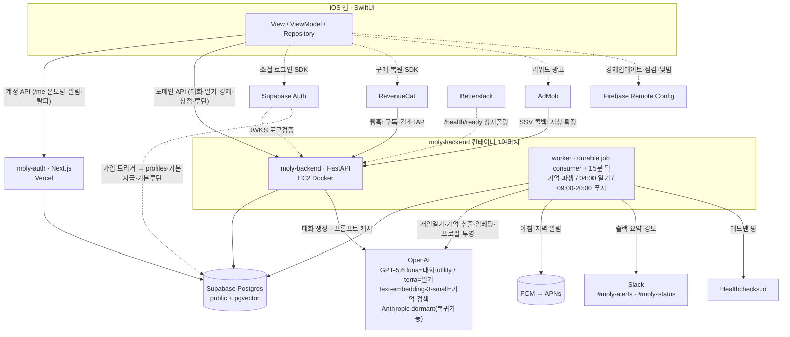
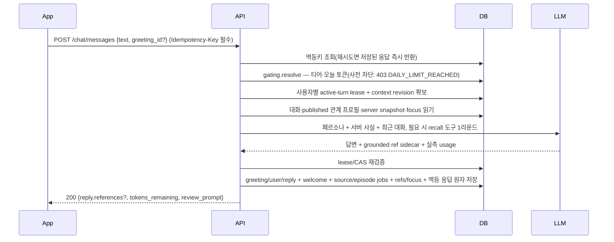
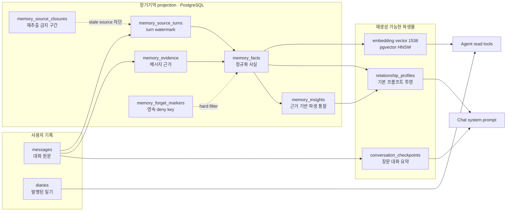
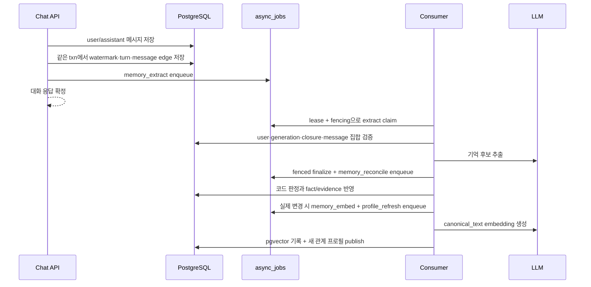

# Moly 아키텍처

> **2026-08-04 개정** — 실제 코드와 이번 단일 기억 구조 전환 기준.
> 짝 문서: `API_SPEC.md`(앱↔서버 계약) · `ERD.md`(데이터) · `DEV_STATUS.md`(현황판).
> 기억 시스템 런타임의 기준은 이 문서 §5.2, 물리 데이터 계약은 `ERD.md` §7이다.

---

## 1. 설계 원칙

1. **서버가 진실.** 재화·토큰·구독·가격·장착은 서버가 원본. 클라는 응답값을 캐시로만 반영, 직접 계산 금지.
2. **단순함이 최우선.** 소규모 팀 → 도메인 백엔드는 **모듈러 모놀리스 1개**. 서비스 분리는 책임이 명확히 다른 곳(계정 = moly-auth)에만 허용.
3. **실시간 아님.** 대화는 HTTP 요청-응답(완성본). WebSocket·스트리밍·폴링 없음 → 무상태 API.
4. **비동기 중심.** 기억 파생은 대화 트랜잭션이 enqueue한 durable job, 일기·푸시는 **15분 케이던스 크론 틱**이 담당한다.
5. **관리형 우선.** Auth·DB·Storage = Supabase, 결제 검증 = RevenueCat, 푸시 = FCM, 클라 원격설정 = Firebase.
6. **단일 계약.** 앱↔서버는 `API_SPEC.md` 하나. 클라의 DB 직접 쓰기 전면 금지(Auth SDK만 예외) — RLS는 deny-default 심층 방어.
7. **원장 우선.** 건초의 진실은 `hay_transactions` 원장. 잔액은 캐시. 모든 재화 이동은 단일 지점(`hay_ledger.apply`)을 지난다.

---

## 2. 시스템 구성도


```mermaid
flowchart TB
  subgraph C[iOS 앱 · SwiftUI]
    V[View / ViewModel / Repository]
  end
  V -->|"계정 API (/me·온보딩·알림·탈퇴)"| AUTH[moly-auth · Next.js<br/>Vercel]
  V -->|"도메인 API (대화·일기·경제·상점·루틴)"| API[moly-backend · FastAPI<br/>EC2 Docker]
  V -.->|소셜 로그인 SDK| SA[Supabase Auth]
  V -.->|구매·복원 SDK| RC[RevenueCat]
  V -.->|리워드 광고| AD[AdMob]
  V -.->|강제업데이트·점검·낮밤| FB[Firebase Remote Config]

  subgraph BE[moly-backend 컨테이너 1이미지]
    API
    W[worker · durable job consumer + 15분 틱<br/>기억 파생 / 04:00 일기 / 09:00·20:00 푸시]
  end

  AUTH --> DB[(Supabase Postgres<br/>public + pgvector)]
  API --> DB
  W --> DB
  SA -. JWKS 토큰검증 .-> API
  SA -. 가입 트리거 → profiles·기본지급·기본루틴 .-> DB

  API -->|"대화 생성 · 프롬프트 캐시"| OAI["OpenAI<br/>GPT-5.6 luna=대화·utility / terra=일기<br/>text-embedding-3-small=기억 검색<br/>Anthropic dormant(복귀가능)"]
  W -->|"개인일기·기억 추출·임베딩·프로필 투영"| OAI
  W -->|아침·저녁 알림| FCM[(FCM → APNs)]

  RC -->|웹훅: 구독·건초 IAP| API
  AD -->|SSV 콜백: 시청 확정| API

  W -->|"슬랙 요약·경보"| SLK[Slack<br/>#moly-alerts · #moly-status]
  W -->|"데드맨 핑"| HC[Healthchecks.io]
  BS[Betterstack] -.->|"/health/ready 상시폴링"| API
```

**요청 경로 요약** — 클라가 직접 부르는 서버는 둘뿐:
- `https://moly-server.vercel.app` → **moly-auth** (계정: `/me`·`/onboarding`·알림설정·푸시토큰·로그아웃·탈퇴)
- `https://voice.moly.asia` → **moly-backend** (그 외 전부)

서버-서버 인바운드는 웹훅 둘: RevenueCat(`POST /webhooks/revenuecat`, 시크릿 헤더) · AdMob SSV(`GET /webhooks/ad-ssv`, 서명 검증).

---

## 3. 서버 토폴로지 — 왜 2개인가

| 서비스 | 스택·배포 | 소유 영역 | 이유 |
|---|---|---|---|
| **moly-backend** | Python FastAPI · EC2 Docker (API + worker 2프로세스, 같은 이미지) | 대화·일기·경제(커머스)·상점·루틴·광고·구독 동기·배치 | LLM 파이프라인·배치·재화 트랜잭션 = 도메인의 심장. 모놀리스로 정합성 유지 |
| **moly-auth** | Next.js · Vercel | 계정 집계(`GET /me`)·온보딩·프로필·알림설정·탈퇴 | 가입/부팅 경로를 엣지에서 빠르게. profiles self-heal 포함 |

두 서버는 **같은 Supabase DB**를 보고, 등급 판정 로직(entitlement)과 기준값(`app_config`)을 공유한다 — moly-auth가 `/me`에 entitlement를 내려주고, moly-backend는 요청마다 자체 판정(이중화지만 같은 데이터·같은 규칙이라 불일치 없음).

---

## 4. 코드 아키텍처 (moly-backend)

### 4.1 레이어 — 단방향 의존

```
app/
├── api/        # HTTP 어댑터: 라우터·요청 파싱·인증 의존성. 로직 없음(서비스 위임 1줄)
├── services/   # 도메인 로직: 트랜잭션 경계·비즈니스 규칙·외부 연동. 시스템의 본체
├── schemas/    # pydantic 요청 모델 (chat·routine·shop)
├── models/     # SQLAlchemy ORM — db/schema.sql과 1:1 (파일 1개 = 테이블 1개 원칙)
├── core/       # 횡단 관심사: db(세션), security(JWT/JWKS), errors(에러 봉투), time_utils(activity_date)
└── config.py   # 설정 단일 소스 — 모든 조정값의 코드 기본값(＝app_config 미설정 시 폴백)
worker/         # 배치 엔트리포인트(§6) — app/services를 그대로 재사용, HTTP 없음
db/             # schema.sql(생성 전용 DDL) + 시드 2종. DB의 단일 소스
```

의존 방향은 위에서 아래로만: `api → services → models/core`. 역방향 금지, api끼리·services끼리 수평 호출은 services 레이어에서만 허용(예: subscription → payment → order).

**레이어 규칙 (지켜야 코드가 안 썩는 것들)**
- **api는 얇게**: 라우터 함수는 인증 의존성 + 서비스 호출 1줄. 검증·분기·쿼리를 라우터에 쓰지 않는다.
- **트랜잭션 경계는 services가 소유**: `session.commit()`은 요청당 한 번, 해당 유스케이스의 서비스 함수가 호출. 하위 헬퍼는 `flush()`까지만(예: `hay_ledger.apply`).
- **models는 스키마 미러**: 로직 금지. 컬럼·제약은 `db/schema.sql`과 자동 대조 가능해야 한다(모델↔DB 1:1 검증 스크립트로 확인).
- **에러는 `core/errors`의 AppError만**: 비즈니스 에러 코드(부록 B)가 곧 API 계약 — 서비스가 던지고 전역 핸들러가 봉투로 변환.

### 4.2 도메인 맵 — 커머스 리팩토링(2026-07-13) 반영

경제 도메인은 커머스 관례(DDD의 하위 도메인 구분)를 따른다:

| 하위 도메인 | 서비스 모듈 | 소유 테이블 | 책임 |
|---|---|---|---|
| **Catalog** | `shop.get_products`, `economy`(hay_pack 노출) | `products` | 판매 상품 단일 카탈로그(`product_type`: hay_pack/cosmetic) |
| **Ordering** | `order` | `orders` `order_items` | 모든 구매의 진입점 — KRW(IAP)·HAY(상점) 공통, 가격 스냅샷 |
| **Payment** | `payment` | `payments` | 실결제(현금) 기록 — IAP·구독 결제 통합, `store_transaction_id` 멱등, 매출 단일 소스 |
| **Wallet** | `hay_ledger` `economy` | `hay_transactions` `user_daily_stats` | 재화 원장(단일 기록 지점)·잔액 캐시·일일 보상 게이팅 |
| **Inventory** | `shop`(구매·장착) | `user_items` | 보유+장착 통합(source·equipped_slot) — 슬롯 규칙은 DB 제약이 강제 |
| **Subscription** | `subscription` `entitlement` `gating` `limits` | `subscriptions` `subscription_hay_grants` | RC 웹훅 동기·증정/회수 멱등·티어 파생 판정·토큰 예산 |

경제 외 도메인: `chat`(+`greetings`)·`diary`(조회)/`diary_generation`(배치)·`routine`·`ads`(+`ads_ssv`)·`review`·`account`·`memory_*`(정규화 사실·망각·검색·프로필)·`llm`·`notify`/`push`(FCM)·`config_store`·`i18n`·`naming`·`feedback`.

**도메인 간 연결 규칙** — 재화가 움직이는 유스케이스는 반드시 이 모양이다:

```
주문 생성(order) → 원장 이동(hay_ledger, order_id 연결) → 소유/기록(user_items·payments)
  └─ 전부 한 트랜잭션. 실패 시 통째로 롤백 — 부분 지급/부분 차감이 구조적으로 불가능
```

원장(`hay_transactions`)은 append-only이고 `order_id` FK로 주문·결제와 양방향 추적된다(CS 자동화). 다형 참조(`ref_id` 같은 text 컬럼)는 금지 — 이번 리팩토링에서 제거한 안티패턴.

### 4.3 무결성은 DB 제약이 최종 방어선

서비스 로직이 1차 검증을 하되, 돈·소유가 걸린 불변식은 전부 DB에도 박혀 있다:

| 불변식 | DB 강제 수단 |
|---|---|
| 잔액 음수 불가 | `profiles.hay_balance CHECK ≥ 0` + 행 잠금(`with_for_update`) |
| 중복 구매 불가 | `user_items UNIQUE(user_id, product_id)` — 동시 구매 레이스는 IntegrityError → 롤백 → 409 |
| 슬롯당 1장착 | 부분 UNIQUE `(user_id, equipped_slot) WHERE NOT NULL` |
| 슬롯 일치 장착 | 복합 FK `(product_id, equipped_slot) → products(id, slot)` |
| 영수증 중복 지급 불가 | `payments.store_transaction_id UNIQUE` |
| 증정 플랜별 1회 | `subscription_hay_grants UNIQUE(user_id, plan)` + 환불 회수는 `revoked_at` 표식 멱등 |
| 상품 타입 정합 | `products` 타입별 CHECK(hay_pack ↔ cosmetic 컬럼 상호 배타) |

⚠️ 구현 노트: 슬롯 교체는 "검증 → 해제 전부 → `flush()` → 장착" 2-pass 필수 — 부분 UNIQUE는 statement 단위 평가라 해제·장착이 한 flush에 섞이면 순서 운에 따라 위반된다(실DB 재현으로 확인된 함정).

---

## 5. 핵심 흐름

### 5.1 대화 1턴 — 비용 최적화가 설계의 반


```mermaid
sequenceDiagram
  participant App
  participant API
  participant DB
  participant LLM
  App->>API: POST /chat/messages {text, greeting_id?} (Idempotency-Key 필수)
  API->>DB: 멱등키 조회(재시도면 저장된 응답 즉시 반환)
  API->>DB: gating.resolve — 티어·오늘 토큰(사전 차단: 403 DAILY_LIMIT_REACHED)
  API->>DB: 사용자별 active-turn lease + context revision 확보
  API->>DB: 대화·published 관계 프로필·server snapshot·focus 읽기
  API->>LLM: 페르소나 + 서버 사실 + 최근 대화, 필요 시 recall 도구 1라운드
  LLM-->>API: 답변 + grounded ref sidecar + 실측 usage
  API->>DB: lease/CAS 재검증
  API->>DB: greeting/user/reply + welcome + source/episode jobs + refs/focus + 멱등 응답 원자 저장
  API-->>App: 200 {reply.references?, tokens_remaining, review_prompt}
```

- **프롬프트 캐싱이 원가의 핵심**: system의 페르소나와 검증된 관계 프로필은 안정 프리픽스로
  유지하고, 현재 시각·장착·루틴 snapshot과 focus는 서버 소유 system 블록으로 둔다. 상세 회상은
  답 완결형 `recall_memory`·`recall_diaries`가 담당하며 도구 결과는 지시가 아닌 untrusted evidence다.
- **동시 턴은 CAS로 직렬화**: 외부 LLM 호출 동안 DB 트랜잭션은 열지 않되 user별 만료 lease를 유지한다.
  저장 전 lease token과 context revision을 다시 확인해 답변 순서 역전과 중복 토큰 차감을 막는다.
- **전문은 모델이 재작성하지 않는다**: capability가 있는 클라이언트에만 Phase B가 소유권·공개·억제를
  재검증한 `diary-reference-v1` 원문 카드를 붙인다. focus는 카드 지원 여부와 무관하게 짧게 유지한다.
- **선발화는 대화 배열에 못 넣는다**: Anthropic이 `messages[0]`를 `user`로 강제하므로, 배열 맨 앞의 캐피 메시지(= 커밋된 선발화)는 잘려나간다. 버리지 않고 **system 가변 블록**(`[먼저 건넨 말]`)으로 넘긴다 — 안 그러면 캐피가 방금 건넨 인사를 모른 채 또 인사한다. 앵커가 전진하기 전까지 값이 고정이라 캐시가 추가로 깨지지 않는다.
- **대사 정제는 코드가 확정**: 줄바꿈·말줄임표는 페르소나로 막아도 새므로(실측 3/5) 저장 직전에 제거한다(`chat._clean_reply`). 저장본과 응답 본문은 항상 같은 값.
- **기억 쓰기는 핫패스 밖**: 요청은 관계 프로필을 읽고 source turn/job만 원자 저장한다. 워커가 추출→판정→임베딩·프로필 투영을 수행한다. 현재 자동 생성 원본은 `memory_facts`/`memory_evidence`이며 vector는 재생성 가능한 검색 인덱스다.
- 집계는 **사전 차단 + 사후 실측 누적** — 마지막 응답은 한도를 약간 넘기고 완결될 수 있음(의도).

### 5.2 기억 시스템 — 단일 PostgreSQL 구조

#### 5.2.1 최종 결정과 데이터 경계

장기기억은 **PostgreSQL 하나로 통합**한다. 이전 mem0 저장소, 외부 벡터 DB, 이중 쓰기,
legacy/normalized 유저별 분기와 런타임 fallback은 사용하지 않는다.


```mermaid
flowchart LR
  subgraph Records[사용자 기록]
    M[messages<br/>대화 원문]
    D[diaries<br/>발행된 일기]
  end

  subgraph Durable[장기기억 projection · PostgreSQL]
    ST[memory_source_turns<br/>turn watermark]
    F[memory_facts<br/>정규화 사실]
    E[memory_evidence<br/>메시지 근거]
    I[memory_insights<br/>근거 기반 파생 통찰]
    FM[memory_forget_markers<br/>영속 deny key]
    C[memory_source_closures<br/>재추출 금지 구간]
  end

  subgraph Derived[재생성 가능한 파생물]
    V[embedding vector 1536<br/>pgvector HNSW]
    RP[relationship_profiles<br/>기본 프롬프트 투영]
    CP[conversation_checkpoints<br/>장문 대화 요약]
  end

  A[Agent read tools]
  CHAT[Chat system prompt]

  M --> ST --> F
  M --> E --> F
  F --> V --> A
  F --> RP --> CHAT
  F --> I --> RP
  M --> CP --> CHAT
  D --> A
  FM -. hard filter .-> F
  C -. stale source 차단 .-> ST
```

| 계층 | 원본·파생 | 책임 |
|---|---|---|
| `messages`, `diaries` | 사용자 기록 원본 | 대화와 사용자에게 공개된 날짜별 일기. 기억 망각으로 삭제하지 않음 |
| `memory_facts`, `memory_evidence` | 재생성 가능한 장기기억 projection | 정규화 사실과 원본 메시지를 잇는 근거 edge |
| `memory_forget_markers`, `memory_source_closures` | 망각 원본 | 같은 내용과 닫힌 과거 구간의 재유입을 영구 차단 |
| `memory_facts.embedding` | 검색 파생값 | `canonical_text`에서 다시 만들 수 있는 pgvector 인덱스 |
| `relationship_profiles` | 프롬프트 파생값 | 매 턴 기본 주입하는 작고 안정적인 관계 요약 |
| `conversation_checkpoints` | 단기 대화 파생값 | 앵커 밖으로 밀려난 대화의 줄거리. Fact가 아님 |
| `memory_insights` | 비활성 호환 계층 | 자동 producer가 없고 최종 대화 경로의 진실 소스·필수 projection으로 사용하지 않음 |

자동으로 축적되는 장기기억은 **Fact + Evidence + user-message Episode**로 확정한다. 별도 insight
producer를 추가하는 후속 전제는 없다. 여러 fact에서 보이는 경향은 별도 장기기억 행을 만들지 않고,
fact source ref를 유지한 `relationship_profiles.inferred_tendencies` projection으로만 대화에 주입한다.
따라서 근거 없는 자유 추론이 검색 가능한 사실로 승격되는 경로가 없다.

#### 5.2.2 쓰기 파이프라인


```mermaid
sequenceDiagram
  participant API as Chat API
  participant DB as PostgreSQL
  participant Q as async_jobs
  participant W as Consumer
  participant LLM

  API->>DB: user/assistant 메시지 저장
  API->>DB: 같은 txn에서 watermark·turn·message edge 저장
  API->>Q: memory_extract enqueue
  API-->>API: 대화 응답 확정
  W->>Q: lease + fencing으로 extract claim
  W->>DB: user·generation·closure·message 집합 검증
  W->>LLM: 기억 후보 추출
  W->>Q: fenced finalize + memory_reconcile enqueue
  W->>DB: 코드 판정과 fact/evidence 반영
  W->>Q: 실제 변경 시 memory_embed + profile_refresh enqueue
  W->>LLM: canonical_text embedding 생성
  W->>DB: pgvector 기록 + 새 관계 프로필 publish
```

- 대화 턴마다 `chat_contexts.memory_source_watermark`를 정확히 1 증가시킨다.
- 대표 source는 inbound user 메시지이며, 같은 턴의 선발화·user·캐피 응답을 하나의 watermark에 묶는다.
- 메시지, source edge, extract 잡은 같은 유저락·트랜잭션에서 저장한다.
- LLM은 후보만 추출한다. 후보 스키마, 근거 소유권과 상태 전이는 서버 코드가 확정한다.
- closure/forget marker 후보는 `IGNORE`, 같은 hash의 새 근거는 `REINFORCE`, 더 새로운 single 값은
  `SUPERSEDE`, 다른 multi 값은 `KEEP_BOTH`, 신규는 `ADD`, 오래된 값과 no-op은 `IGNORE`다.
- `(normalization_version, content_hash)`가 사실 식별자다. 정규화 규칙을 바꾸면 새 version을 추가하고
  구 normalizer를 유지한다. 기존 fact/marker를 제자리 재해시하지 않는다.
- 실제 fact/evidence 변화가 있을 때만 `relationship_profile_input_revision`을 1 증가시킨다.

#### 5.2.3 읽기와 일기의 경계

> 아래는 현행 런타임 계약이다. 대화 중심 목표 계약과 차이는 `agentic-chat-ARCHITECTURE.md` §0.3~0.6을 따른다.

대화의 기본 기억은 published 관계 프로필이다. active fact를 결정적으로 `known_facts` 최대 5개,
`recent_threads` 최대 3개, `inferred_tendencies` 최대 2개와 stance에 배치하고 전체를 400토큰 이하로
렌더한다. 같은 내용은 `render_hash`가 같아 재발행하지 않는다. chat은 저장 문자열을 그대로 믿지 않고
매 턴 source가 active이며 marker에 걸리지 않는지 다시 검사해 유효 항목만 system prompt에 넣는다.

상세 회상은 에이전트 읽기 도구가 담당한다.

- `recall_memory`: query embedding으로 active fact와 user-message episode를 함께 찾는다. SQL에서 user scope,
  terminal status, forget marker, exact suppression을 ranking 전에 hard filter하고 정확 발언은 원본 hash를 재검증한다.
- `recall_diaries`: 날짜 명령이 없어도 의미·부분문자열로 발행 일기를 찾고 존재·개수·제목·발췌·요청된
  전문을 한 번에 반환한다. welcome placeholder는 egress에서 현재 닉네임으로 렌더한다.
- `get_routines`: 사용자 현지 날짜의 루틴 상태를 읽는다. 시간·장착 상태는 별도 조회 도구가 아니라
  매 턴 서버 소유 snapshot으로 기본 제공한다.

일기는 `diaries`가 원본이고 장기기억 추출 소스가 아니다. checkpoint도 Fact가 아니며 원본 대화의
연속성을 위한 단기 요약일 뿐이다. 그러므로 “일기에 적혀 있다”, “대화 요약에 있다”, “캐피의
장기기억에 있다”는 서로 다른 상태다.

#### 5.2.4 망각 계약

망각은 `POST /memory/forget`의 `confirm=true` 요청 또는 에이전트 최종 hop이 만든 명시적
`forget_memory` intent만 처리한다. intent 도구는 DB를 직접 쓰지 않고 chat Phase 2가 유저락 안에서
다음 순서로 원자 적용한다.

1. fact 근거 watermark 또는 predicate/all의 현재 cut까지 closure를 기록한다.
2. `memory_generation`과 관계 프로필 input revision을 증가시킨다.
3. fact hash/version, predicate 또는 all scope의 만료 없는 marker를 기록한다.
4. matching fact를 `forgotten`으로 바꾸고 embedding을 즉시 NULL로 만든다.
5. 관련 insight와 published 관계 프로필을 무효화한다.
6. 그 유저의 conversation checkpoint를 전부 삭제한다.
7. 새 generation/revision의 관계 프로필 refresh를 enqueue한다.

원본 `messages`와 발행된 `diaries`는 지우지 않는다. 검색과 프롬프트 렌더는 refresh 완료를 기다리지
않고 marker를 매번 hard filter하므로 stale profile이나 늦은 embedding 잡이 잊은 내용을 되살릴 수 없다.

#### 5.2.5 잡 신뢰성·재처리·활성화 경계

- `async_jobs`는 claim 시 attempt 증가, bounded retry/backoff, lease token fencing을 사용한다.
- 도메인 반영과 다음 잡 enqueue는 성공 finalize와 같은 트랜잭션에서 수행한다.
- `succeeded|dead|cancelled` 행은 되살리지 않는다. dead 재처리는 원본을 보존하고 `replay_of`가
  가리키는 새 잡으로만 실행한다.
- 과거 대화 이관은 `scripts/backfill_normalized_memory.py`, 알려진 배포 결함 dead 잡의 재실행은
  `scripts/replay_dead_memory_jobs.py`가 맡으며 둘 다 기본 dry-run이다.
- source 기록, extract, 관계 프로필 기본 주입에는 기억 mode나 별도 킬스위치가 없다.
- `agent_enabled=false`면 읽기 도구를 자율 호출하지 않지만 명시적 `/memory` API와 관계 프로필 기본
  주입은 계속 동작한다. `context_checkpoint_enabled`는 장기기억과 별도인 checkpoint 킬스위치다.

최종 contract migration은 모든 inbound user 메시지의 source 연결, 미해결 기억 잡 0건, 모든 active
fact의 embedding, active fact 사용자의 published profile을 확인한 뒤에만 이전 `memory_text`,
`memory_refreshed_at`, `memory_mode`를 제거한다. 조건 하나라도 어기면 전체 migration을 rollback한다.

### 5.3 상점 구매 (HAY) / 건초 IAP (KRW)

```
상점:  검증(비매품 403·중복 409) → Order(HAY,paid)+OrderItem → 원장 −price(402 가드) → UserItem → commit
IAP:   RC 웹훅 NON_RENEWING_PURCHASE → payments 멱등 확인 → Order(KRW,paid)+OrderItem
       → 원장 +hay_amount(order 연결) → Payment 기록 → commit
```

클라는 IAP를 RevenueCat SDK로 결제하고 서버 API를 부르지 않는다 — 지급은 전적으로 웹훅. 반영 확인은 `GET /wallet` 재조회.

### 5.4 구독 수명주기 (RevenueCat 웹훅 단일 창구)

- 활성 계열 이벤트 → `subscriptions` upsert + **결제 기록(payments)** + 증정(플랜별 최초 1회, UNIQUE 강제)
- `CANCELLATION(CUSTOMER_SUPPORT)` = 환불 → `revoked` + 구독 전용 장착 정리 + 증정 회수 `min(증정, 잔액)` — 멱등은 `grants.revoked_at`
- `EXPIRATION` → 만료 + 장착 정리 / `BILLING_ISSUE` → grace
- 티어는 저장하지 않는다 — `entitlement.derive`가 조회 시 판정(subscriber > 런칭 무료 > trial > free). 런칭 무료 기간(`app_config.free_launch_until`)은 전원 trial급 + 전용 토큰 한도.

### 5.5 배치 (worker — 15분 케이던스 크론 틱, 멱등)

```
python -m worker  (외부 크론이 15분(:00/:15/:30/:45) 실행 · 같은 이미지, CMD만 교체)
 ├─ content queue: 대화 source에서 사실 추출·판정 후 임베딩과 관계 프로필을 fenced finalize로 반영
 ├─ 로컬 04:00 지난 유저: 전일 일기 생성(문자수 게이트 → personal=terra 생성+luna self-check / preset 폴백)
 ├─ 로컬 09:00: 아침 일기 도착 푸시(FCM) — 현재 킬스위치 OFF(SOMA-338), 저녁만 발송 중. 코드 유지, True로 재개
 └─ 로컬 20:00: 저녁 안부 푸시
```

타임존별 경계 스캔이라 별도 스케줄러·큐 인프라 없음. 실패한 유저는 다음 틱이 자연 재시도(멱등).

### 5.6 가입 — 코드 배포와 무관한 DB 트리거

`auth.users` INSERT → `handle_new_user` 트리거가 한 트랜잭션으로: `profiles`(trial 48h) + **기본 지급 3종**(user_items, admin_grant — 집·운동 배경, 선글라스) + **기본 루틴 2개**(이불 정리하기·물 마시기). 어떤 가입 경로든 동일 보장.

---

## 6. 데이터 계층

- **단일 소스 = `db/schema.sql`** (생성 전용 DDL). 모델과 1:1 대조 검증.
- enum은 DB에 text + CHECK(asyncpg 바인딩 마찰 회피) — 모델도 String 매핑.
- 일 단위 로직 키 = `activity_date`(로컬 04:00 경계, `core/time_utils`). 토큰·출석·광고·루틴·일기 귀속 전부 이 키 — 리셋 잡 없음(새 행 생성이 곧 리셋).
- 조정값 이원화: **서버 판정용** = `app_config` 테이블(코드 기본값 폴백, 클라 미노출 — 실키 목록은 ERD §6.2) / **클라 노출용** = Firebase Remote Config(강제 업데이트·점검·낮밤).
- 장기기억의 authoritative record는 `messages`·`diaries`·domain event다. public의 `memory_facts`·`memory_evidence`는 자동 생성되는 재생성 가능 projection이고, 망각 정책 원본은 marker/closure다. `memory_insights`는 자동 producer가 없는 비활성 호환 계층이며 최종 런타임은 fact/episode와 fact-backed 관계 프로필만 사용한다. `memory_facts.embedding vector(1536)`은 검색용 파생값이며 동일 DB 안에서 재색인한다. 모든 행은 `profiles`에 FK/CASCADE로 연결된다.
- 대화 회상용 `memory_episodic_messages`와 `diary_recall_documents`는 원문을 복제하지 않는 pgvector
  projection이다. source hash·embedding model·index version·suppression generation을 write fence로 쓰고,
  terminal 잡 뒤 벡터가 비면 consumer reconciliation이 source version당 최대 3개의 새 repair 잡으로 수렴시킨다.

---

## 7. 배포·운영

| 항목 | 현행 |
|---|---|
| moly-backend | **EC2(서울) Docker** — 단일 이미지, API(uvicorn)/worker(크론 `python -m worker`) 프로세스 분리. nginx+certbot TLS. GitHub main merge → 자동 빌드·배포 |
| moly-auth | **Vercel** — main merge 자동 배포 |
| DB·Auth·Storage | Supabase(prod: `qkgjlgzsharnilxnkytd`) — 자동 백업. 상품 이미지는 Storage `shop-assets` public 버킷 |
| 시크릿 | 서버 환경변수(AWS SSM Parameter Store / Vercel env) — 코드·레포 커밋 금지 |
| 관측 | 구조적 로그(모듈별 logger) + LLM 실원가 텔레메트리 + 외부 모니터링 — 상세는 §7.1 |

주의: **스키마 변경은 두 서버 동시 배포**가 원칙 — moly-auth도 `subscriptions`·`user_daily_stats`·`user_items`·`profiles`를 직접 읽는다.

### 7.1 관측·모니터링 서브시스템 (SOMA-301)

**헬스 엔드포인트 4종**

| 경로 | 성격 | 인증 | 용도 |
|---|---|---|---|
| `GET /health` | liveness | 없음 | 프로세스 생존·배포 버전 확인 |
| `GET /health/ready` | readiness | 없음 | DB 도달성 — 실패 시 503. **Betterstack 유일 폴링 대상** |
| `GET /health/deep` | 진단 | X-Health-Token | 워커 상태·billable 종합. 수동/배포 직후 전용(상시폴링 금지) |
| `GET /health/synthetic` | 합성 | X-Health-Token | DB·LLM 능동 점검. 유저·통계 미오염 |

`X-Health-Token` — 상수시간 비교(hmac.compare_digest). 미설정 시 비-local 403(fail-closed).

**외부 상시감시**
- **Betterstack**: `/health/ready` 폴링 — DB down 즉시 감지
- **Slack 2채널 severity 라우팅**: `#moly-alerts`(크리티컬 즉시) · `#moly-status`(요약·배포). dedup 창 300s(상관 스톰 억제)
- **Healthchecks.io 데드맨 핑**: 워커 결과 정상일 때만 핑(`worker_ping_url`). 이상 시 `/fail`. 하드킬된 프로세스는 다음 틱에 자연 감지
- **LLM 비용 이상치 경보**: 전일 billable 합계가 임계(`daily_billable_alert_threshold`) 초과 시 Slack. UTC 04시 틱에서 집계
- **합성 대화 모니터**: `/health/synthetic` — LLM 도달성 능동 점검(`synthetic_check_llm` 킬스위치)
- **워커 stale 감지**: `app_config`에 기록된 마지막 성공 시각이 2h 초과 시 `/health/deep`에서 503·degraded 반환

---

## 8. 보안

- 인증: Supabase JWT를 서버가 JWKS로 검증(전 엔드포인트 Bearer). 웹훅은 별도 — RC = 시크릿 헤더 상수시간 비교(fail-closed), SSV = AdMob 공개키 서명 검증.
- RLS **deny-default**: 클라 데이터 경로는 전부 서버 API — 서버는 owner 롤이라 우회. 기억 테이블과 `chat_contexts`는 클라이언트 직접 접근을 금지한다.
- 페르소나 프롬프트는 코드가 단일 소스(외부 주입 금지 — 과거 오염 사고 재발 방지).
- 컨테이너 비루트 실행, 프로덕션에서 OpenAPI 문서 비노출, 필수 시크릿 누락 시 부팅 실패(fail-fast).
- 개인정보: 대화·일기·기억은 민감 — 탈퇴 시 동일 DB의 FK CASCADE로 제거한다.

---

## 9. 확장 경로 (필요할 때만)

- 워커 병목 → 같은 이미지로 워커 인스턴스만 추가(틱 멱등이라 중복 실행 안전장치는 유니크 제약).
- 묶음 상품/부분 환불 → `order_items`가 이미 수량·항목 단위 — 스키마 변경 없이 로직만.
- 개인 일기 구독 게이트 → `diary_generation`의 분기 한 줄(배치 전용 — API·앱 무변경).
- 읽기 트래픽 급증 → 캐시 도입 또는 RLS 직접읽기 선택 도입.
- 실시간 타이핑 → 대화 엔드포인트만 SSE 승격(계약 국소 변경).
- 안드로이드 → API 그대로(푸시가 이미 FCM), 클라만 추가.

---

## 10. 문서 지도

현행 문서는 4개(로컬 `docs/`는 gitignore 작업사본 — 팀 노션이 단일 소스):

| 문서 | 내용 | 독자 |
|---|---|---|
| `API_SPEC.md` | 앱↔서버 계약(단일 소스) | iOS·서버 |
| `ERD.md` | 테이블·제약·정책 매핑 | 서버 |
| `ARCHITECTURE.md` | 백엔드 구조·흐름·운영(이 문서) | 서버 |
| `DEV_STATUS.md` | 스프린트 현황·남은 작업 | 팀 |
