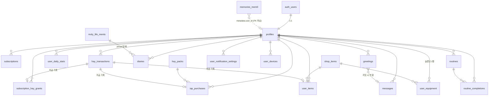

# Moly ERD

> 기준 문서: `API_SPEC.md`(계약) · `mvp.md`(정책 원본) · `USER_STORIES.md`(요구사항) · `DESIGN.pen`(UI) — **2026-07-07 API_SPEC 교차검수 반영판**
> 대상 DB: **Supabase (PostgreSQL)** — 소셜 로그인(Apple/Kakao/Google)은 Supabase Auth(`auth.users`) 사용
> 장기기억: **mem0 (오픈소스)** — 같은 Supabase의 pgvector에 저장 (외부 관리, §7 참조)
> 짝 파일: `ERD.dbml` (dbdiagram.io 등에서 시각화 가능) — ⚠️ 본 개정(세션 제거·`greetings` 추가·`weather`/`published_at` 등)을 dbml에도 반영 필요

---

## 1. 설계 원칙

1. **서버 권위 (US-1002)** — 건초 지급/차감, 결제·구독 상태, 상품 가격, 대화 토큰 사용량, 광고 시청 횟수는 모두 서버가 원본. **클라이언트의 DB 직접 쓰기는 전 테이블 금지 — 모든 쓰기는 서버 API 경유**(ARCHITECTURE 원칙·계약 단일화, 2026-07-07 확정). RLS는 읽기 허용 + 심층 방어(§8).
2. **앱 기준일 = 현지 시간 04:00 경계** — 모든 일 단위 로직(`activity_date`)은 `(유저 타임존 현재시각 − 4시간)::date`로 계산. 이를 위해 `profiles.timezone`(IANA)을 저장한다.
3. **대화 제한은 토큰 기준** — 토큰 = **LLM 입력+출력 합산**. 메시지별 사용량을 기록하고 일 단위로 집계(`user_daily_stats.tokens_used`). **그날 누적 토큰**이 대화 한도·일기 LLM 분기·리뷰 팝업 판단의 공통 지표. 몰리의 인사(greeting)는 차감 제외. 집계는 응답 후 — 마지막 응답으로 한도를 초과할 수 있고, 초과 상태에서 다음 요청 차단.
4. **유저 티어는 파생값** — trial/free/subscriber를 컬럼으로 저장하지 않고 조회 시 판정한다 (§6.1). 상태 이중화로 인한 불일치를 원천 차단.
5. **미정 수치는 `app_config`로** — 일일 토큰 한도, 일기/리뷰 토큰 기준, 낮/밤 구간, 알림 발송 시각 등 TBD 수치는 스키마가 아니라 서버 설정값. 수치가 확정되면 config만 갱신하면 된다.
6. **원장 우선** — 건초의 진실은 `hay_transactions` 원장. `profiles.hay_balance`는 조회 성능용 캐시이며 서버 트랜잭션 안에서만 갱신.

---

## 2. 다이어그램



---

## 3. 계정·프로필

### 3.1 `auth.users` — Supabase 관리 (건드리지 않음)

Apple/Kakao/Google 소셜 로그인 결과. `id uuid`가 전체 스키마의 루트 (US-101).

### 3.2 `profiles`

`auth.users`와 1:1. 가입 트리거로 자동 생성.

| 컬럼 | 타입 | 설명 |
| --- | --- | --- |
| `id` | uuid PK, FK→`auth.users.id` (CASCADE) | |
| `nickname` | text NULL | 온보딩에서 설정, 최대 10글자 — 앱+CHECK 검증 (US-201). NULL이면 온보딩 미완료 → 온보딩 화면 라우팅 |
| `language` | text, default `'ko'` | **앱 콘텐츠 언어** (US-103, ISO 639-1) — 온보딩 때 기기 시스템 언어로 초기화, 변경 가능. **서버 생성물(몰리 응답·일기·푸시)은 유저 입력 언어와 무관하게 항상 이 언어**(API_SPEC 1장). UI 문자열은 클라 로컬라이제이션 |
| `timezone` | text, default `'Asia/Seoul'` | IANA 타임존. 앱 기준일(04:00 경계) 계산의 근거 — 클라이언트가 갱신하되 **서버가 마지막 적용 경계를 기억해 리셋 되돌림 방지** (타임존 변경으로 하루 2회 리셋 악용 차단) |
| `hay_balance` | int, default 0, **CHECK ≥ 0** | 건초 잔액 **캐시** (원본: `hay_transactions`). 서버 전용 쓰기 — 잔액 하한 0을 DB 안전망으로 강제 |
| `trial_ends_at` | timestamptz | 가입 시각 + **48시간 (절대 시각, 의도된 정책 — 하루 중간 종료 가능)** (US-202). 재가입 어뷰징 방지 정책 TBD |
| `review_prompted_at` | timestamptz NULL | 리뷰 팝업 노출 이력 — **최초 1회 제한** (US-1101). NOT NULL이면 재노출 금지 |
| `created_at` / `updated_at` | timestamptz | |

- **탈퇴(US-106)**: `auth.users` 삭제 → 전 테이블 CASCADE. 단 **mem0 기억은 FK가 없으므로 mem0 API로 별도 삭제 필요** (§7). App Store 구독도 자동 해지되지 않음 — 안내 필요.

---

## 4. 경제 (건초·구독·상점)

### 4.1 `hay_transactions` — 건초 원장 (US-906, US-1002)

모든 획득/소비의 단일 원장. 충전소 거래 내역 화면이 이 테이블을 그대로 페이지네이션.

| 컬럼 | 타입 | 설명 |
| --- | --- | --- |
| `id` | bigint PK (identity) | 시간순 커서 페이지네이션 키 |
| `user_id` | uuid FK→`profiles` | |
| `type` | enum `hay_transaction_type` | `attendance` `ad_reward` `routine_reward` `iap_purchase` `subscription_grant` `shop_purchase` `refund_revoke` `admin_adjustment` |
| `amount` | int, CHECK ≠ 0 | +획득 / −소비. `refund_revoke`는 환불 시 증정 건초 회수(−) — 회수액은 `min(증정량, 현재 잔액)`으로 잔액 하한 0 유지 |
| `balance_after` | int | 거래 후 잔액 — 거래 내역 UI 표시 항목 (US-906) |
| `ref_id` | text NULL | 연관 레코드 id (`iap_purchases.id`, `user_items.id` 등) |
| `created_at` | timestamptz | |

- 인덱스: `(user_id, created_at DESC)`.
- 일일 보상 중복 방지는 이 테이블이 아니라 `user_daily_stats`의 유니크/카운터로 강제 (§4.2).

### 4.2 `user_daily_stats` — 앱 기준일 단위 상태

유저 × 앱 기준일 1행. 토큰 한도, 일일 보상 게이팅을 한 곳에서 관리.

| 컬럼 | 타입 | 설명 |
| --- | --- | --- |
| `id` | bigint PK | |
| `user_id` | uuid FK→`profiles` | |
| `activity_date` | date | 앱 기준일 (04:00 경계, 유저 타임존) |
| `tokens_used` | int, default 0 | 그날 누적 토큰 (**LLM 입력+출력 합산**, US-403). greeting 제외. **대화 한도·일기 LLM 분기·리뷰 팝업의 공통 판정 지표** — 한도·기준치는 `app_config` |
| `ad_reward_count` | smallint, default 0 | 리워드 광고 수령 횟수 — 일 최대 10회 서버 검증 (US-903). SSV 콜백은 **멱등 처리**(재전송 중복 지급 방지) + 원자 증가 |
| `attendance_claimed_at` | timestamptz NULL | 출석 수령 시각 — NOT NULL이면 당일 수령 완료 (US-902) |
| `routine_reward_claimed_at` | timestamptz NULL | 루틴 2개 완료 보상 수령 시각 (US-904) |

- 유니크: `(user_id, activity_date)`.
- 04:00 리셋 = 새 행 생성일 뿐, 별도 리셋 잡 불필요.

### 4.3 `subscriptions` — 구독 (US-702~705)

App Store Server API / Server Notifications가 갱신하는 서버 원본.

| 컬럼 | 타입 | 설명 |
| --- | --- | --- |
| `id` | uuid PK | |
| `user_id` | uuid FK→`profiles` | |
| `plan` | enum `plan_type` | `monthly`(₩5,900) / `yearly`(₩59,000) — 가격은 StoreKit 상품이 원본 |
| `status` | enum `subscription_status` | `active` `grace_period` `expired` `revoked` |
| `original_transaction_id` | text UNIQUE | Apple 구독 식별자 — 복원(US-703)·중복 매핑 방지 키 |
| `latest_transaction_id` | text | |
| `purchased_at` / `expires_at` | timestamptz | |
| `auto_renew_enabled` | bool | 구독 관리 화면 표시용 (US-705) |
| `environment` | text | `Production` / `Sandbox` |
| `created_at` / `updated_at` | timestamptz | |

- **환불(`revoked`) 처리**: 혜택 즉시 회수(구독 전용 `user_equipment` 행 삭제 포함) + 증정 건초 회수 — `refund_revoke` 원장 기록, **잔액 하한 0**. `subscription_hay_grants` 이력은 유지 → 재구독해도 재지급 없음 (구독→증정 소비→환불→재구독 루프 차단).
- **복원 충돌**: `original_transaction_id`는 Apple ID(기기 결제 계정) 소유라 소셜 로그인 계정과 독립 — 같은 기기에서 다른 소셜 계정으로 로그인 후 복원하면 이미 매핑된 UNIQUE 키와 충돌한다. 처리 = **거부 + 안내 확정**(API `409 RESTORE_CONFLICT`).

### 4.4 `subscription_hay_grants` — 구독 건초 증정 이력 (US-704)

월간 1,000 / 연간 4,000 — **각 플랜 최초 1회**를 DB 제약으로 강제.

- `user_id` + `plan` **UNIQUE** → 재구독 시 중복 지급이 구조적으로 불가능.
- `hay_transaction_id` FK→`hay_transactions` (`type='subscription_grant'` 기록과 연결), `granted_at`.

### 4.5 `hay_packs` — 건초 더미 IAP 상품 (US-905)

서버가 원본인 상품 목록: 300개 ₩1,500 / 1,500개 ₩6,500 / 3,000개 ₩10,000.

- `id`, `app_store_product_id` UNIQUE, `hay_amount`, `price_krw`(표시 참고용 — 결제가는 StoreKit), `is_active`, `sort_order`.

### 4.6 `iap_purchases` — 건초 IAP 결제 기록

- `id`, `user_id`, `hay_pack_id` FK, `transaction_id` text UNIQUE (영수증 중복 지급 방지), `status` enum(`pending` `verified` `failed` `refunded`), `hay_transaction_id` FK NULL (검증 후 지급 시 연결), `purchased_at`, `created_at`.
- 흐름: 결제 → `pending` 생성 → 서버 영수증 검증 → `verified` + 원장 지급 (US-905).

### 4.7 `shop_items` — 상점 상품 (배경 테마·아이템) (US-801)

| 컬럼 | 타입 | 설명 |
| --- | --- | --- |
| `id` | uuid PK | |
| `slot` | enum `equipment_slot` | `background` / `head` / `neck` / `body` — 장착 부위이자 상점 탭 분류(background = 배경 탭, 나머지 = 아이템 탭). **슬롯 종류는 추후 추가 가능** (enum 값 추가) |
| `name` / `description` | text | 한국어만 (MVP) |
| `price_hay` | int NULL | 서버가 원본 (US-801). **NULL = 비매품(구독 전용 — `is_subscriber_only=true`)**. 정책(최소 1,000, 200단위)은 운영·앱 검증 — DB CHECK로 안 박음(정책 변경 대비) |
| `is_subscriber_only` | bool | **구매 대상 아님(사용권)** — 구독 활성 상태에서만 장착 가능, 체험·무료 사용 불가 (US-805) |
| `assets` | jsonb | background: `{day, night, thumbnail}` (낮/밤 2버전, US-303) · item: `{head_layer, body_layer, thumbnail}` (머리/몸 레이어 분리) |
| `is_active` / `sort_order` | | |

- **기본 배경/기본 몰리는 상품이 아님** — `user_equipment`에 해당 슬롯 행이 없으면 기본 상태 (장착 해제, US-804).
- CHECK: `is_subscriber_only = (price_hay IS NULL)` — 구독 전용 ↔ 비매품을 DB로 상호 강제.
- UNIQUE `(id, slot)` — `user_equipment`의 복합 FK 대상 (슬롯 일치를 DB가 강제).

### 4.8 `user_items` — 인벤토리 (US-802, US-804)

- `id`, `user_id`, `shop_item_id` FK, `hay_transaction_id` FK **NULL 허용** (구매 차감 원장과 연결 — **NULL = 운영 무상 지급**(이벤트/CS 보상), 일반 구매는 필수), `acquired_at`.
- 유니크: `(user_id, shop_item_id)` — 중복 구매 방지.
- **일반 상품(건초 구매)만 저장** — 구독 전용 아이템·테마는 구매 개념이 없으므로 행이 생기지 않음 (사용 자격은 구독 상태에서 파생, US-805).

### 4.9 `user_equipment` — 장착 상태 (US-804)

배경 1 + 부위 슬롯(머리·목·몸 — 확장 가능)당 아이템 1개. **슬롯당 1행**, 행이 없으면 기본 상태.

| 컬럼 | 타입 | 설명 |
| --- | --- | --- |
| `user_id` | uuid FK→`profiles` | |
| `slot` | enum `equipment_slot` | `background` `head` `neck` `body` |
| `shop_item_id` | uuid | 장착 중 아이템 — **복합 FK `(shop_item_id, slot) → shop_items(id, slot)`로 슬롯 일치를 DB가 강제** |
| `equipped_at` | timestamptz | |

- 유니크: `(user_id, slot)` — 같은 슬롯 재장착 = upsert(기존 자동 해제), 장착 해제 = 행 삭제.
- 장착 서버 검증: `user_items` 보유 OR (`is_subscriber_only` AND 구독 활성). 슬롯 일치는 복합 FK가 담당.
- **구독 만료 시**: 장착 중인 구독 전용 아이템·테마 행을 서버가 삭제(기본 복귀) — 만료 처리(Server Notification)·티어 판정 시점에 정리 (US-704, US-805).

---

## 5. 대화·일기·루틴

### 5.1 `greetings` — 선발화 발급 보관 (미커밋)

`GET /chat/greeting`이 발급한 선발화. **대화 이력이 아님** — 유저가 응답할 때 `POST /chat/messages`에 `greeting_id`를 에코하면 그 시점에 `messages(kind='greeting')`로 커밋되고, 미커밋 건은 이력에 나타나지 않고 만료 폐기(API_SPEC 3장).

- `id` uuid PK, `user_id` FK, `context` enum `greeting_context`(`onboarding` `home_enter` `morning` `evening` `comeback`), `content` text, `activity_date` date, `committed_message_id` bigint NULL FK→`messages`(커밋 시 연결), `created_at`.
- 유니크: `(user_id, context, activity_date)` — **일·컨텍스트당 1건 캐시**(재호출 = 동일 건 반환, LLM 재호출 없음 — greeting은 토큰 미차감이라 이 캐시가 rate limit을 겸함).

> (구) `conversation_sessions`는 **제거**(2026-07-07 확정) — 대화는 세션·종료 개념 없는 연속 스레드이고, 리뷰 트리거도 세션 종료가 아니라 채팅 응답 플래그(당일 누적 토큰)로 처리. 진입~이탈 분석은 Firebase 계측으로 충분.

### 5.2 `messages` — 메시지 (US-401, US-406, US-407)

| 컬럼 | 타입 | 설명 |
| --- | --- | --- |
| `id` | bigint PK (identity) | 위로 스크롤 커서 페이지네이션 키 (US-407) |
| `user_id` | uuid FK→`profiles` | 채팅방(단일 연속 스레드) 전체를 시간순 조회 |
| `sender` | enum `message_sender` | `user` / `moly` |
| `kind` | enum `message_kind` | `normal` / `greeting` — greeting = **커밋된 선발화**(발급 보관 원본 = `greetings` §5.1). **토큰 한도 미차감**(US-406), 토큰 소진 상태에서도 발급 가능 |
| `content` | text | 길이 상한은 API 검증 (비용 통제) |
| `input_tokens` / `output_tokens` | int NULL | LLM 사용량 — `moly` 응답에 기록, `user` 메시지는 NULL. `kind='normal'`인 것만 `user_daily_stats.tokens_used`에 합산 |
| `activity_date` | date | 날짜 칩(US-401)·일 집계용 앱 기준일 |
| `created_at` | timestamptz | |

- 인덱스: `(user_id, id DESC)` + `(user_id, activity_date)` — 일기→해당 날짜 점프(`anchor_date` 조회, API_SPEC 3장)용.
- 보관 기간·조회 범위 정책 TBD — 스키마는 영구 보존 전제, 정책 확정 시 파티셔닝/아카이빙 검토.
- 몰리의 일기 LLM 생성 비용은 유저 한도와 무관 → messages와 분리된 배치에서 처리 (5.3).

### 5.3 `diaries` — 몰리의 일기 (US-501~503)

하루 마감(04:00) 배치가 **전 유저** 대상으로 생성 — **매일 1건, 절대 비지 않음**(2026-07-07 확정. 무료·미접속 날 포함, 분기는 `source`뿐).

| 컬럼 | 타입 | 설명 |
| --- | --- | --- |
| `id` | uuid PK | |
| `user_id` | uuid FK→`profiles` | |
| `diary_date` | date | 일기의 대상 앱 기준일 |
| `source` | enum `diary_source` | `llm`(그날 누적 토큰 ≥ `app_config.diary_llm_min_tokens` — 대화 기반 생성) / `preset`(기준 미만 — 멘트 풀 랜덤) |
| `preset_ment_id` | uuid NULL, FK→`moly_life_ments` | `source='preset'`일 때만 |
| `content` | text | 생성 결과 스냅샷 (preset이어도 본문 복사 저장 — 멘트 풀 수정이 과거 일기를 바꾸지 않게) |
| `weather` | enum `diary_weather` | 마음 날씨 스탬프 `sunny` `cloudy` `rainy` `windy` — llm은 생성 결과, preset은 멘트에 지정된 값 복사 |
| `published_at` | timestamptz | 발행 시각 — **UTC 저장, 값 = 유저 로컬 익일 09:00을 UTC로 환산**(타임존별 상이). 09:00 틱 배치가 설정. **목록·상세는 `published_at ≤ now()`만 노출**(배치 생성분 사전 노출 방지, API_SPEC 4장) |
| `first_read_at` | timestamptz NULL | 열람 여부 — 아침 알림/뱃지용 |
| `created_at` | timestamptz | |

- 유니크: `(user_id, diary_date)` — 배치 재실행에도 하루 1개 보장.
- **열람은 등급 무관 항상 무료(확정)** — 접근 제어 없음. 구독 가치 = 개인(`llm`) 일기 "발행"이지 열람이 아님.
- preset 배정은 유저별 최근 배정분 회피(`preset_ment_id` 이력 대조), 풀 소진 시 순환 재사용.

### 5.4 `moly_life_ments` — '몰리의 삶' 멘트 풀

임계 미달·미접속 날의 일기 소스(전원 매일 발행이므로 상시 사용). `id`, `content`, `weather`(멘트에 어울리는 마음 날씨 스탬프), `is_active`, `created_at`. (문구·개수 TBD — 운영 등록)

> 로딩 멘트 6종(US-402)은 확정 문구라 클라이언트 상수로 처리 — 테이블 없음.

### 5.5 `routines` / `routine_completions` (US-601~606)

**`routines`**: `id`, `user_id`, `name`, `frequency_per_week` smallint(주 N회), `reminder_enabled` bool, `reminder_time` time NULL(로컬 알림 — 발송은 기기에서), `deleted_at` NULL(**soft delete** — 삭제해도 통계 US-605 보존), `created_at`, `updated_at`.

**`routine_completions`**: `id`, `routine_id` FK, `user_id`, `activity_date`, `completed_at`. 유니크 `(routine_id, activity_date)` — 일 단위 체크/해제(해제 = 행 삭제).

- **루틴 2개 완료 보상**(US-904) 판정: `해당 activity_date의 completions ≥ 2` AND `user_daily_stats.routine_reward_claimed_at IS NULL` — 서버 트랜잭션에서 수령 처리. 완료 시점 자동 알림 없음(정책).
- API 응답 `completed_count_today`(API_SPEC 8장) = `routine_completions`에서 `(user_id, activity_date=오늘)` 행 수를 파생 계산(별도 컬럼 아님, 클라 UI·충전소 게이팅용).

---

## 6. 파생 로직·설정

### 6.1 유저 티어 (컬럼 아님 — 조회 시 판정)

```
subscriber : subscriptions에 status IN ('active','grace_period') AND expires_at > now() 존재
trial      : 위가 아니고 now() < profiles.trial_ends_at  (가입 후 2일)
free       : 그 외
```
- **체험(trial)은 구독과 동일 혜택** — 단 두 가지 제외: 구독 전용 아이템·테마 사용 불가, 건초 증정 없음.
- 티어별 게이팅: 일일 토큰 한도(`app_config` — trial은 subscriber와 동일 수준), 배너 광고(**free만 노출**), 구독 전용 아이템·테마 장착(**subscriber만**), 건초 증정(subscriber 결제 시, 플랜별 최초 1회).
- **일기 발행 자체는 전원 매일**(티어 무관) — 개인(`llm`)/`preset` 분기는 티어가 아니라 당일 토큰 임계(free는 한도상 사실상 preset).

### 6.2 `app_config` — 서버 설정 (key-value)

`key` text PK, `value` jsonb, `description`, `updated_at`. **TBD 수치의 착지점** — ERD가 수치 미확정에 영향받지 않게 하는 장치.

| key 예시 | 대응 정책 |
| --- | --- |
| `daily_token_limit.free / .trial / .subscriber` | 일일 토큰 한도 (수치 TBD) |
| `token_warning_threshold` | 소진 경고 임계치 (US-404) |
| `review_prompt_min_tokens` | 리뷰 팝업 기준 — **그날 누적 토큰** (수치 TBD) |
| `diary_llm_min_tokens` | 일기 LLM 분기 기준 — **그날 누적 토큰** (수치 TBD) |
| `day_night_schedule` | 낮/밤 구간 시각 (US-303, TBD) |
| `notification_time.morning_diary / .evening_chat` | 알림 발송 시각 — **09:00 / 21:00 확정**(운영 조정 가능) |
| `min_supported_version` / `maintenance` | 강제 업데이트(US-1302) / 점검(US-1303) |

### 6.3 `user_notification_settings` (US-104, US-907, US-408, US-503)

- `user_id`, `type` enum `notification_type`(`morning_diary` `evening_chat` — **2종 확정.** 루틴 알림은 클라 로컬(`routines.reminder_*`), 충전소 알림 없음), `enabled` bool default true. 유니크 `(user_id, type)`.
- **행이 없으면 enabled=true로 간주** (기본 on) — 명시적으로 끈 항목만 행 생성/갱신.

### 6.4 `user_devices` — 푸시 토큰

아침 09:00·저녁 21:00 알림 = **서버 APNs 푸시 확정**(ARCHITECTURE §3.3) — 발송 대상 토큰 저장.

- `id`, `user_id`, `platform`(`ios`), `push_token` UNIQUE, `last_active_at`, `created_at`.
- 로그아웃 시 해당 `push_token` 행 삭제(API `POST /auth/logout`이 토큰을 받음).

---

## 7. mem0 장기기억 — 외부 관리 (같은 Supabase)

mem0 오픈소스가 같은 Supabase 프로젝트의 pgvector에 저장 중. **우리 마이그레이션에서 생성/수정하지 않는다.**

- mem0가 만드는 것: `public` 스키마에 collection 테이블(기본명 `mem0`, 관례상 `memories`) — `id text PK`, `embedding vector(1536)`, `metadata jsonb`, `created_at`, `updated_at` + 유사도 검색용 `match_vectors()` 함수, `vector` 확장.
- **이름 충돌 회피**: 우리 테이블·함수에 `memories`, `mem0`, `match_vectors` 사용 금지 (본 ERD 준수 확인됨).
- **user 연결은 `metadata.user_id`(jsonb) — FK 아님**: 따라서
  - 탈퇴 시 CASCADE로 지워지지 않는다 → **탈퇴 플로우에서 mem0 API(`delete_all(user_id=...)`)를 반드시 호출** (US-106). Supabase 삭제는 동기(204 반환 기준), mem0 삭제는 실패 시 백그라운드 재시도(최종적 정리).
  - RLS 미적용 전제 — mem0 접근은 서버(서비스 롤/connection string) 경유만.
- 기억 저장 재설계(세션 → **하루 단위 배치**, mvp §9): 배치가 그날 `messages`를 읽어 mem0에 기록 + LLM으로 중복/모순 정리. 일기 생성 배치(5.3)와 같은 04:00 사이클에서 실행.
- 참고: mem0 OSS는 메모리 변경 이력용 로컬 SQLite(history db)도 사용 — 앱 DB와 무관, 서버 인프라에서 관리.
- 출처: [mem0 Supabase vector store 문서](https://docs.mem0.ai/components/vectordbs/dbs/supabase)

---

## 8. 보안(RLS) 요약

**쓰기 = 전 테이블 클라이언트 금지(서버 API 전용, 2026-07-07 확정).** 모든 쓰기는 API 경유로 단일화 — 계약은 `API_SPEC.md` 하나, 검증 일원화, 클라 네트워크 계층 한 벌(ARCHITECTURE 원칙). 읽기 RLS는 서버 결함에 대비한 **심층 방어**로 유지.

| 테이블 | 클라이언트 읽기 | 클라이언트 쓰기 |
| --- | --- | --- |
| `profiles` | 본인 행 | ❌ (닉네임·언어·타임존 변경도 API 경유 — `hay_balance` 등 서버 전용 컬럼과 한 행이라 컬럼 단위 부분 허용보다 단순·안전) |
| `hay_transactions` `user_daily_stats` `subscriptions` `subscription_hay_grants` `iap_purchases` `user_items` `user_equipment` | 본인 행 | ❌ |
| `messages` `greetings` `diaries` | 본인 행 | ❌ (LLM 프록시·배치가 기록 — 토큰 집계·한도 검증 일원화) |
| `routines` `routine_completions` `user_notification_settings` `user_devices` | 본인 행 | ❌ (완료 2개 = 건초 보상 조건 — `activity_date` 위조 차단. CRUD 계약은 API_SPEC 8장) |
| `hay_packs` `shop_items` `moly_life_ments` `app_config` | 전체 읽기(active만) | ❌ 운영 전용 |
| mem0 `memories` | ❌ | ❌ (서버 경유만) |

---

## 9. 정책 ↔ 스키마 매핑 체크리스트

| 정책 (확정 정책 표) | 스키마 반영 |
| --- | --- |
| 1·2 구독 가격/증정 | `subscriptions.plan` + `subscription_hay_grants` UNIQUE(user, plan) |
| 3·4 일일 토큰 한도 | `user_daily_stats.tokens_used` + `app_config` (수치 TBD 무관) |
| 5 하루 경계 04:00 | 모든 `activity_date` + `profiles.timezone` |
| 6·7 건초 획득/광고 한도 | `user_daily_stats` 카운터 + `hay_transactions` 원장 |
| 8 건초 IAP | `hay_packs` + `iap_purchases`(영수증 UNIQUE) |
| 9 상점 가격 | `shop_items.price_hay` (서버 원본) |
| 10 리뷰 1회 | `profiles.review_prompted_at` + 당일 `tokens_used` 임계 생애 최초 도달(채팅 응답 `review_prompt` 플래그 — API_SPEC 9장) |
| 11 몰리의 일기 | `diaries(source: llm/preset)` + `moly_life_ments` + 04:00 배치 — **전원 매일**(유니크 user+date), 발행 노출은 `published_at` |
| 12 2일 체험 (구독 동일 혜택) | `profiles.trial_ends_at` (티어 파생 — 토큰·일기·광고는 subscriber와 동일 처리) |
| 14 인사 미차감 | `greetings` 발급 보관(§5.1) → 커밋 시 `messages.kind='greeting'`, 집계 제외 |
| 15 낮/밤 | `shop_items.assets{day,night}` + `app_config.day_night_schedule` |
| 16 장착 해제 | `user_equipment` 해당 슬롯 행 삭제 (행 없음 = 기본) |
| 17 장착 규칙 (슬롯당 1개) | `user_equipment` UNIQUE(user_id, slot) — 같은 슬롯 장착 = upsert. 슬롯 일치는 복합 FK로 DB 강제 |
| 18 구독 전용 사용권 | `shop_items.is_subscriber_only` + `price_hay NULL`(비매품, CHECK 상호 강제) — 장착 자격은 구독 상태 파생, 만료 시 장착 행 삭제 |
| 19 토큰 정의 (입력+출력 합산) | `messages.input_tokens + output_tokens` → `user_daily_stats.tokens_used` (응답 후 집계, 초과 상태에서 다음 요청 차단) |
| 20 환불 처리 | `subscriptions.status='revoked'` + `hay_transactions(refund_revoke)` 잔액 하한 0 + 구독 전용 `user_equipment` 행 삭제. `subscription_hay_grants` 이력 유지 → 재지급 없음 |

**TBD여도 스키마가 안 흔들리는 것**: 토큰 수치 전부, 낮/밤 시각, 알림 문구, 멘트 풀 내용, 경고 임계치 → 전부 `app_config`/운영 데이터.
**TBD 확정 시 스키마 영향 가능**: 메시지 보관 기간(파티셔닝), 탈퇴 후 재가입 어뷰징 정책(식별자 보관 테이블 추가 가능성). ~~알림 발송 방식~~(서버 푸시 확정) · ~~일기 열람~~(항상 무료 확정) · ~~복원 충돌~~(거부+`RESTORE_CONFLICT` 확정)은 종결.
