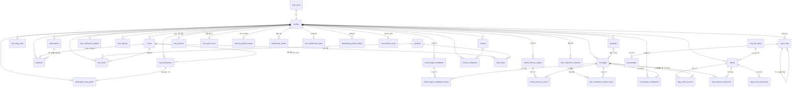

# Moly ERD

> 기준 문서: `API_SPEC.md`(계약) · `DB_REFACTOR.md`(2026-07 커머스 스키마 리팩토링 결정) — **2026-08-06 기억 구조 재작성**
> 대상 DB: **Supabase (PostgreSQL)** — 소셜 로그인(Apple/Kakao/Google)은 Supabase Auth(`auth.users`) 사용
> 장기기억: **후보·장부는 public 테이블, 임베딩은 `vecs.moly_memories_v2`** (7장). 대화·기억 런타임 설명은 `ARCHITECTURE-capi.md`
> DDL 원본: `db/schema.sql` + `db/migrations/`(schema.sql 이후 추가분 — 7장 테이블 다수가 여기에만 있다)
>
> **2026-07-13 개정 요약 (DB_REFACTOR)**: `hay_packs`+`shop_items`→**`products`** · `iap_purchases`→**`orders`+`order_items`+`payments`** · `user_items`+`user_equipment`→**`user_items`(통합)** · `hay_transactions.ref_id`(다형 text)→**`order_id` FK** · `subscription_hay_grants`에 환불 회수 멱등 컬럼 추가

---

## 1. 설계 원칙

1. **서버 권위 (US-1002)** — 건초 지급/차감, 결제·구독 상태, 상품 가격, 대화 토큰 사용량, 광고 시청 횟수는 모두 서버가 원본. **클라이언트의 DB 직접 쓰기는 전 테이블 금지 — 모든 쓰기는 서버 API 경유**(ARCHITECTURE 원칙·계약 단일화, 2026-07-07 확정). RLS는 읽기 허용 + 심층 방어(8장).
2. **앱 기준일 = 현지 시간 04:00 경계** — 모든 일 단위 로직(`activity_date`)은 `(유저 타임존 현재시각 − 4시간)::date`로 계산. 이를 위해 `profiles.timezone`(IANA)을 저장한다.
3. **대화 제한은 토큰 기준** — 토큰 = **LLM 입력+출력 합산**. 메시지별 사용량을 기록하고 일 단위로 집계(`user_daily_stats.tokens_used`). **그날 누적 토큰**이 대화 한도·일기 LLM 분기·리뷰 팝업 판단의 공통 지표. 캐피의 인사(greeting)는 차감 제외. 집계는 응답 후 — 마지막 응답으로 한도를 초과할 수 있고, 초과 상태에서 다음 요청 차단.
4. **유저 티어는 파생값** — trial/free/subscriber를 컬럼으로 저장하지 않고 조회 시 판정한다 (6.1절). 상태 이중화로 인한 불일치를 원천 차단.
5. **미정 수치는 `app_config`로** — 일일 토큰 한도, 일기/리뷰 임계, 런칭 무료 기간 등 조정 가능 수치는 스키마가 아니라 서버 설정값(6.2절). 클라 노출용 원격 설정(강제 업데이트·점검·낮/밤 시각)은 Firebase — `GET /app-config` 엔드포인트는 제거됨.
6. **원장 우선** — 건초의 진실은 `hay_transactions` 원장. `profiles.hay_balance`는 조회 성능용 캐시이며 서버 트랜잭션 안에서만 갱신.

---

## 2. 다이어그램


```mermaid
erDiagram
    auth_users ||--|| profiles : "1:1"
    profiles ||--o{ subscriptions : ""
    profiles ||--o{ subscription_hay_grants : ""
    profiles ||--o{ hay_transactions : ""
    profiles ||--o{ user_daily_stats : ""
    profiles ||--o{ orders : ""
    profiles ||--o{ payments : ""
    profiles ||--o{ user_items : ""
    profiles ||--o{ greetings : ""
    profiles ||--o{ messages : ""
    profiles ||--o{ diaries : ""
    profiles ||--o{ routines : ""
    profiles ||--o{ routine_completions : ""
    profiles ||--o{ user_notification_settings : ""
    profiles ||--o{ user_devices : ""

    orders ||--o{ order_items : "주문 항목"
    products ||--o{ order_items : ""
    products ||--o{ user_items : ""
    orders ||--o| payments : "KRW 주문(IAP)"
    subscriptions ||--o{ payments : "구독 결제(구매·갱신)"
    orders ||--o{ hay_transactions : "구매 원장(iap·shop)"
    orders ||--o{ user_items : "구매 획득"

    greetings }o--o| messages : "커밋 시 연결"
    moly_life_ments ||--o{ diaries : "preset일 때"
    routines ||--o{ routine_completions : ""

    hay_transactions ||--o| subscription_hay_grants : "지급·회수 기록"

    profiles ||--o| chat_contexts : "대화 시작 지점"
    profiles ||--o| chat_active_turns : "진행 중인 턴"
    profiles ||--o| memory_pipeline_states : "기억 처리 위치"
    profiles ||--o{ mem0_ingest_candidates : "기억 후보"
    mem0_ingest_candidates ||--o{ mem0_ingest_candidate_sources : "후보 근거"
    messages ||--o{ mem0_ingest_candidate_sources : "근거 원문"
    profiles ||--o{ mem0_memory_registry : "기억 장부"
    mem0_memory_registry ||--o{ mem0_memory_sources : "기억 근거"
    messages ||--o{ mem0_memory_sources : "근거 원문"
    profiles ||--o{ user_interaction_contracts : "대화 약속"
    user_interaction_contracts ||--o{ user_interaction_contract_items : "약속 항목"
    messages ||--o{ user_interaction_contract_items : "약속 근거"
    profiles ||--o{ relationship_events : "관계 기록"
    profiles ||--o| user_relationship_states : "관계 상태"
    profiles ||--o{ relationship_profile_renders : "관계 문장"
    profiles ||--o{ conversation_checkpoints : "대화 요약"
    messages ||--o{ conversation_checkpoints : "요약 경계"
    diaries ||--o| diary_recall_documents : "일기 검색"
    diaries ||--o{ diary_claim_sources : "일기 근거"
    messages ||--o{ diary_claim_sources : "근거 원문"
    messages ||--o{ chat_response_references : "답변에 실은 일기 카드"
    diaries ||--o{ chat_response_references : "카드 대상"
    profiles ||--o| conversation_focus : "이어지는 화제"
    profiles ||--o{ async_jobs : "배치 작업"
    async_jobs ||--o{ async_jobs : "다시 실행한 작업"
    async_jobs ||--o{ job_attempts : "시도 이력"
```

> 계정 삭제 장벽(`privacy_subject_barriers`)은 프로필이 지워진 뒤에도 남아야 해서 외래 키를 걸지
> 않았다. 벡터 컬렉션 `vecs.moly_memories_v2`도 외래 키 없이 `mem0_memory_registry`의
> `provider_memory_id`로만 이어진다.

---

## 3. 계정·프로필

### 3.1 `auth.users` — Supabase 관리 (건드리지 않음)

Apple/Kakao/Google 소셜 로그인 결과. `id uuid`가 전체 스키마의 루트 (US-101).

### 3.2 `profiles`

`auth.users`와 1:1. **가입 트리거(`bootstrap_user`)가 자동 생성** — 같은 트리거가 기본 지급 아이템 3종(4.8절)과 기본 루틴 2개(5.5절)도 함께 생성한다(2026-07-13 확정).

| 컬럼 | 타입 | 설명 |
| --- | --- | --- |
| `id` | uuid PK, FK→`auth.users.id` (CASCADE) | |
| `nickname` | text NULL | 온보딩에서 설정, 최대 10글자 — 앱+CHECK 검증 (US-201). NULL이면 온보딩 미완료 → 온보딩 화면 라우팅 |
| `language` | text, default `'en'` | **앱 콘텐츠 언어** (US-103) — 값은 `ko`·`en`·`ja` 셋뿐이다(아래 설명). 온보딩 때 기기 시스템 언어로 초기화. **서버 생성물(캐피 응답·일기·푸시)은 유저 입력 언어와 무관하게 항상 이 언어**(API_SPEC 1장). UI 문자열은 클라 로컬라이제이션 |
| `timezone` | text, default `'Asia/Seoul'` | IANA 타임존. 앱 기준일(04:00 경계) 계산의 근거 — 클라이언트가 갱신하되 **서버가 마지막 적용 경계를 기억해 리셋 되돌림 방지** (타임존 변경으로 하루 2회 리셋 악용 차단) |
| `hay_balance` | int, default 0, **CHECK ≥ 0** | 건초 잔액 **캐시** (원본: `hay_transactions`). 서버 전용 쓰기 — 잔액 하한 0을 DB 안전망으로 강제 |
| `trial_ends_at` | timestamptz | 가입 시각 + **48시간 (절대 시각, 의도된 정책 — 하루 중간 종료 가능)** (US-202). 재가입 어뷰징 방지 정책 TBD |
| `review_prompted_at` | timestamptz NULL | 리뷰 팝업 노출 이력 — **최초 1회 제한** (US-1101). NOT NULL이면 재노출 금지 |
| `created_at` / `updated_at` | timestamptz | |

- **`language`는 저장될 때 `ko`·`en`·`ja` 셋 중 하나로 좁혀진다.** `db/migrations/20260806_normalize_profile_language.sql`이 만든 트리거 `trg_normalize_profile_language`(행이 들어오거나 `language`가 바뀔 때 값을 다듬는 DB 장치)가 처리한다. 값을 **거부하지 않고 조용히 바꾼다** — 거부하면 이 테이블을 함께 쓰는 moly-auth의 온보딩이 실패하기 때문이다.
  - 지역 태그는 앞부분만 남는다: `ko-KR`→`ko`, `en-US`→`en`, `ja-JP`→`ja`.
  - 셋이 아닌 언어는 전부 `en`이 된다: `zh-Hant-TW`→`en`, `th`→`en`.
  - 값이 비었거나 없으면 `en`이다. 컬럼 기본값도 `'en'`이다.
  - 같은 규칙이 코드에도 있다(`app/services/i18n.py`의 `resolve()`). 왜 두 곳에서 좁히는지는 `docs/ARCHITECTURE.md` 5.7절에 적었다.
- **탈퇴(US-106)**: `auth.users` 삭제 → 기억을 포함한 전 테이블 CASCADE(예외는 계정 삭제 장벽 하나 — 7.11절). App Store 구독은 자동 해지되지 않으므로 별도 안내한다.

---

## 4. 경제 (건초·구독·커머스)

> **도메인 구분(DB_REFACTOR)**: 카탈로그 = `products` / 주문 = `orders`·`order_items` / 실결제(현금) = `payments` / 재화 원장 = `hay_transactions` / 보유·장착 = `user_items`. 구매 이력(주문·결제)과 재화 이력(원장)을 분리하되 `order_id`로 연결 — 가격정책 변동·매출 집계·부분 환불 대비.

### 4.1 `hay_transactions` — 건초 원장 (US-906, US-1002)

모든 획득/소비의 단일 원장. 충전소 거래 내역 화면이 이 테이블을 그대로 페이지네이션.

| 컬럼 | 타입 | 설명 |
| --- | --- | --- |
| `id` | bigint PK (identity) | 시간순 커서 페이지네이션 키 |
| `user_id` | uuid FK→`profiles` | |
| `type` | enum `hay_transaction_type` | `attendance` `ad_reward` `routine_reward` `iap_purchase` `subscription_grant` `shop_purchase` `refund_revoke` `admin_adjustment` |
| `amount` | int, CHECK ≠ 0 | +획득 / −소비. `refund_revoke`는 환불 시 증정 건초 회수(−) — 회수액은 `min(증정량, 현재 잔액)`으로 잔액 하한 0 유지. **회수액 0이면 원장 기록 없이 4.4절의 회수 표식만 남김**(CHECK ≠ 0 보호) |
| `balance_after` | int | 거래 후 잔액 — 거래 내역 UI 표시 항목 (US-906) |
| `order_id` | uuid FK→`orders` NULL | **구매 관련 원장(`iap_purchase`·`shop_purchase`)의 주문 연결** — (구)다형 `ref_id`(text) 폐기. CS가 원장→주문→결제를 FK로 자동 추적 |
| `created_at` | timestamptz | |

- 인덱스: `(user_id, created_at DESC)` + `(order_id)`.
- type별 `order_id`: `iap_purchase`·`shop_purchase`만 값 있음. 보상류(출석·광고·루틴)와 구독 증정/회수는 NULL — 역추적은 각 소스 테이블의 `hay_transaction_id`가 담당(광고 멱등은 `reward_ad_sessions`).
- 일일 보상 중복 방지는 이 테이블이 아니라 `user_daily_stats`의 유니크/카운터로 강제 (4.2절).

### 4.2 `user_daily_stats` — 앱 기준일 단위 상태

유저 × 앱 기준일 1행. 토큰 한도, 일일 보상 게이팅을 한 곳에서 관리.

| 컬럼 | 타입 | 설명 |
| --- | --- | --- |
| `id` | bigint PK | |
| `user_id` | uuid FK→`profiles` | |
| `activity_date` | date | 앱 기준일 (04:00 경계, 유저 타임존) |
| `tokens_used` | int, default 0 | 그날 누적 토큰 (**LLM 입력+출력 합산**, US-403). greeting 제외. **대화 한도·일기 LLM 분기·리뷰 팝업의 공통 판정 지표** — 한도·기준치는 `app_config` |
| `ad_reward_count` | smallint, default 0 | 리워드 광고 수령 횟수 — 일 최대 5회 서버 검증 (US-903). SSV 콜백은 **멱등 처리**(재전송 중복 지급 방지) + 원자 증가 |
| `attendance_claimed_at` | timestamptz NULL | 출석 수령 시각 — NOT NULL이면 당일 수령 완료 (US-902) |
| `routine_reward_claimed_at` | timestamptz NULL | 루틴 2개 완료 보상 수령 시각 (US-904) |
| `morning_notified_at` | timestamptz NULL | 아침(09:00) 푸시 발송 멱등 마커 — NOT NULL이면 당일 발송 완료, 재발송 차단 |
| `evening_notified_at` | timestamptz NULL | 저녁(21:00) 푸시 발송 멱등 마커 — NOT NULL이면 당일 발송 완료 |

- 유니크: `(user_id, activity_date)`.
- 04:00 리셋 = 새 행 생성일 뿐, 별도 리셋 잡 불필요.

### 4.3 `subscriptions` — 구독 (US-702~705)

**RevenueCat 웹훅**(`POST /webhooks/revenuecat`)이 갱신하는 서버 원본 — RC가 영수증 검증 대행, Apple ASSN은 서버에 연결하지 않음(RC가 소비).

| 컬럼 | 타입 | 설명 |
| --- | --- | --- |
| `id` | uuid PK | |
| `user_id` | uuid FK→`profiles` | |
| `plan` | enum `plan_type` | `monthly`(₩5,900) / `yearly`(₩59,000) — 가격은 StoreKit 상품이 원본 |
| `status` | enum `subscription_status` | `active` `grace_period` `expired` `revoked` |
| `original_transaction_id` | text UNIQUE | Apple 구독 식별자 — 복원(US-703)·중복 매핑 방지 키 |
| `latest_transaction_id` | text | |
| `purchased_at` / `expires_at` | timestamptz | |
| `auto_renew_enabled` | bool | 구독 관리 화면 표시용 (US-705) |
| `environment` | text | `Production` / `Sandbox` |
| `created_at` / `updated_at` | timestamptz | |

- **환불(`revoked`) 처리**: 혜택 즉시 회수(증정 건초 회수) — `refund_revoke` 원장 기록, **잔액 하한 0**, 멱등은 `subscription_hay_grants.revoked_at`(4.4절). 증정 이력은 유지 → 재구독해도 재지급 없음 (구독→증정 소비→환불→재구독 루프 차단). 구독 전용 cosmetic 폐지(appearance_v2)로 장착 해제 처리 불필요.
- **복원 충돌**: `original_transaction_id`는 Apple ID(기기 결제 계정) 소유라 소셜 로그인 계정과 독립 — 다른 소셜 계정으로 로그인 후 복원하면 이미 매핑된 UNIQUE 키와 충돌한다. 처리(RC 전환 후) = **서버가 해당 웹훅을 무시**(다른 계정 소유 구독 스킵) — 원 계정의 구독 상태 유지.

### 4.4 `subscription_hay_grants` — 구독 건초 증정 이력 (US-704)

월간 1,000 / 연간 4,000 — **각 플랜 최초 1회**를 DB 제약으로 강제.

- `user_id` + `plan` **UNIQUE** → 재구독 시 중복 지급이 구조적으로 불가능.
- `hay_transaction_id` FK→`hay_transactions` (`type='subscription_grant'` 기록과 연결), `granted_at`.
- **환불 회수 멱등(2026-07-13)**: `revoked_at` timestamptz NULL(NOT NULL = 회수 완료 — 환불 웹훅 재수신에도 이중 회수 불가), `clawback_hay_transaction_id` FK NULL(`type='refund_revoke'` 원장 연결. 회수액 0이면 NULL). (구)원장 `ref_id` 스캔 방식 폐기.
- **증정 이력이 없으면 환불 시 회수도 없음** — 받은 적 없는 건초를 뺏지 않는다.

### 4.5 `products` — 판매 상품 카탈로그 (US-801, US-905) ★리팩토링: (구)hay_packs + (구)shop_items 통합

order_items가 가리키는 단일 상품 FK. `product_type`으로 두 판매 유형을 구분한다.

| 컬럼 | 타입 | 설명 |
| --- | --- | --- |
| `id` | uuid PK | 내부 참조용 |
| `product_type` | enum `product_type` | `hay_pack`(건초 IAP — KRW 실결제) / `cosmetic`(꾸미기 — HAY 결제) |
| `name` / `description` | text | 원문(한국어). 렌더 폴백의 최종 단계 |
| `name_i18n` | jsonb NULL | **다국어 이름**(SOMA-346) — `{"ko":…,"en":…,"ja":…}`. CHECK `jsonb_typeof='object'`. 렌더 = `resolve(lang)→en→ko→원문 name` 폴백(NULL·부분키 안전). 신규 언어는 키 추가만 |
| `public_id` | text UNIQUE NULL | **cosmetic 전용** — API 노출용 안정 문자열 식별자. 외부에 노출되는 키는 `id`(uuid) 대신 이 값을 사용 |
| `slot` | text NULL | **cosmetic 전용** — `theme`(테마/배경) \| `hat`(모자) \| `glasses`(안경) \| `neck`(목) \| `body`(몸). 장착 부위이자 상점 탭 분류. 기존 `background`·`head` enum이 `theme`·`hat`/`glasses`로 분리됨(appearance_v2 이후) |
| `price_hay` | int NULL | **cosmetic 전용** — 서버가 원본 (US-801). **NULL = 구매 불가(기본 지급품 등)**. 판매 상품이면 `≥ 1` 강제(0원 구매는 원장 CHECK `amount≠0`와 충돌하므로 금지). 정책(최소 1,000, 200단위)은 운영·앱 검증 |
| `is_subscriber_only` | bool NOT NULL default false | **항상 false — 구독 전용 cosmetic 폐지(appearance_v2).** 구독 전용 장착 사용권 방식 폐기 → 모든 cosmetic은 구독 여부 무관하게 HAY 구매 가능(가격 정책으로 조절). cosmetic CHECK로 `false` 강제 |
| `asset_version` | int NULL | **cosmetic 전용** — 에셋 구조 버전. 활성 cosmetic은 `≥ 1` 필수(inactive 상태로만 준비 가능) |
| `assets` | jsonb NULL | **cosmetic 전용** — v2 구조: `scene{canvas, layers, character_url, day_url}` · `thumbnail_url` · `detail_url` · `upright_layer_url` |
| `is_v2_only` | bool NOT NULL default false | **cosmetic 전용** — `true`이면 rightside(v2) 자세 계약에만 노출. 레거시 카탈로그·인벤토리 조회에서 제외 |
| `hay_amount` | int NULL | **hay_pack 전용** — 지급 건초량 (300/1,500/3,000) |
| `price_krw` | int NULL | **hay_pack 전용** — 표시 참고용(결제가는 StoreKit) |
| `app_store_product_id` | text UNIQUE NULL | **hay_pack 전용** — App Store Connect product id |
| `play_store_product_id` | text UNIQUE NULL | **hay_pack 전용** — Google Play 상품 ID(Play Console 확정 후 주입, NULL 허용) |
| `is_active` / `sort_order` | | |

- **타입별 컬럼 상호 강제(CHECK)**: `hay_pack` → hay_amount·app_store_product_id 필수, cosmetic 컬럼 전부 NULL, `is_subscriber_only = false` / `cosmetic` → public_id·slot·assets 필수, hay_pack 컬럼 전부 NULL, `is_subscriber_only = false` 강제. 활성 cosmetic은 `asset_version ≥ 1 AND assets IS NOT NULL` 필수(비활성으로만 준비 단계 가능).
- UNIQUE `(id, slot)` — `user_items` 장착 슬롯 일치 복합 FK 대상.
- **기본 테마/기본 캐피는 상품이 아님** — `user_items`에 테마 장착 행이 없으면 기본 상태 (US-804). 단 가입 시 bootstrap_user가 theme_default를 자동 장착하므로 신규 유저는 항상 테마 장착 상태로 시작(4.8절).

### 4.6 `orders` / `order_items` — 주문 (모든 구매의 단일 진입점) ★신설

**`orders`** — IAP 건초(KRW 실결제)와 상점 꾸미기(HAY 재화 차감) 모두 주문으로 기록.

| 컬럼 | 타입 | 설명 |
| --- | --- | --- |
| `id` | uuid PK | |
| `user_id` | uuid FK→`profiles` | |
| `currency` | enum `order_currency` | `KRW`(건초 IAP) / `HAY`(꾸미기 구매) |
| `status` | enum `order_status` | `pending` `paid` `failed` `refunded` — MVP 주문은 즉시확정이라 `paid`로 생성(HAY는 원장 차감과 한 트랜잭션, KRW는 RC 검증 완료 웹훅 시점) |
| `total_amount` | int ≥ 0 | KRW 결제금액 또는 HAY 차감량 |
| `created_at` / `updated_at` | timestamptz | |

**`order_items`** — 주문 항목. MVP는 항상 1건이지만 묶음 상품·부분 환불 대비(팀 결정).

- `id`, `order_id` FK(CASCADE), `product_id` FK, `quantity`(default 1), **`unit_price`(구매 시점 가격 스냅샷 — 가격정책 변동이 과거 주문을 바꾸지 않음)**.
- 인덱스: `orders(user_id, created_at DESC)`, `order_items(order_id)`, `order_items(product_id)`.

### 4.7 `payments` — 실결제(현금) 기록 ★신설: (구)iap_purchases 대체

매출의 단일 소스 — `SELECT sum(amount) WHERE status='paid'` 한 방. 건초 IAP + 구독 결제(구매·갱신 모두) 기록.

| 컬럼 | 타입 | 설명 |
| --- | --- | --- |
| `id` | uuid PK | |
| `user_id` | uuid FK→`profiles` | |
| `order_id` | uuid FK→`orders` NULL | 건초 IAP 주문과 1:1 |
| `subscription_id` | uuid FK→`subscriptions` NULL | 구독 결제(구매·갱신마다 1행) |
| `store` | text NOT NULL | 실제 스토어 — `app_store` \| `play_store` \| 그 외(확장 가능). **default 없음 — 코드가 항상 명시**. 인덱스 `payments_store_idx` |
| `store_transaction_id` | text UNIQUE NOT NULL | **영수증 멱등 키** — 재전송/중복 웹훅에도 이중 지급 불가 ((구)iap_purchases.transaction_id 승계) |
| `amount` | numeric(14,4) NULL | 결제금액 **원통화 무손실** 저장. RC 이벤트에 가격 있으면 기록, 없으면 NULL |
| `currency` | text NULL | 구매 통화(ISO 4217). **default 없음 — 미확인이면 NULL**(KRW로 임의 확정 금지) |
| `status` | enum `payment_status` | `paid` `refunded` |
| `paid_at` / `created_at` | timestamptz | |

- CHECK: `order_id IS NOT NULL OR subscription_id IS NOT NULL`.
- 흐름(건초 IAP): RC `NON_RENEWING_PURCHASE` 웹훅 → 멱등 확인 → `orders(KRW,paid)` + `order_items` + 원장 지급(`order_id` 연결) + `payments` — 한 트랜잭션 (US-905).

### 4.8 `user_items` — 보유 + 장착 (US-802, US-804) ★리팩토링: (구)user_items + (구)user_equipment 통합

| 컬럼 | 타입 | 설명 |
| --- | --- | --- |
| `id` | uuid PK | |
| `user_id` | uuid FK→`profiles` | |
| `product_id` | uuid FK→`products` | cosmetic만 |
| `source` | enum `user_item_source` | `purchase`(주문 구매) / `subscription`(구독 연동 지급 — 현재 미사용, 구독 전용 cosmetic 폐지로 사실상 레거시) / `admin_grant`(운영 무상 지급) |
| `order_id` | uuid FK→`orders` NULL | `purchase`는 주문 연결, 그 외 NULL |
| `equipped_slot` | text NULL | **NULL = 미장착**. 값 있으면 그 슬롯에 장착 중 — (구)user_equipment 역할. 허용값: `theme` \| `hat` \| `glasses` \| `neck` \| `body` |
| `equipped_at` | timestamptz NULL | 장착 시기 트래킹 |
| `acquired_at` | timestamptz | |

- UNIQUE `(user_id, product_id)` — 중복 구매 방지.
- **부분 UNIQUE `(user_id, equipped_slot) WHERE equipped_slot IS NOT NULL`** — 슬롯당 1개 장착 ((구)user_equipment PK 승계).
- **복합 FK `(product_id, equipped_slot) → products(id, slot)`** — 슬롯 일치를 DB가 강제 (equipped_slot NULL이면 미평가).
- 장착 서버 검증: 보유 확인(`source IN ('purchase','admin_grant')`). 같은 슬롯 교체 = 기존 자동 해제. **해제 = `equipped_slot` NULL**(소유 행 유지).
- ⚠️ **구현 주의**: 슬롯 교체는 "해제 전부 → flush → 장착" 순서 필수 — 부분 UNIQUE는 statement 단위 평가라 한 flush에 섞이면 순서에 따라 위반(2026-07-13 리뷰에서 실DB 재현·수정).
- **가입 기본 지급(2026-07-13 확정, 2026-07-27 장착 정책 갱신)**: 가입 트리거(`bootstrap_user`)가 `source='admin_grant'`로 3종 지급 — 테마(theme) 1종·기타 2종(hat/glasses 등). **테마 1종은 자동 장착(`equipped_slot='theme'`)** — 캐피가 항상 테마 있는 상태로 시작. 나머지 2종은 미장착. 상점에는 `owned:true`로 노출, 재구매는 UNIQUE로 차단.

### 4.9 `reward_ad_sessions` — 광고 SSV 세션 (US-903)

리워드 광고 1회 시청을 추적하고 SSV(Server-Side Verification) 콜백 중복 지급을 막는 멱등 레코드.

| 컬럼 | 타입 | 설명 |
| --- | --- | --- |
| `session_id` | uuid PK | 앱이 광고 노출 전에 발급 |
| `user_id` | uuid FK→`profiles` | |
| `activity_date` | date | 앱 기준일 — 일 5회 한도 게이팅용 |
| `ssv_transaction_id` | text UNIQUE NULL | SSV 콜백 도착 시 기록 — UNIQUE로 재전송 멱등 처리 |
| `granted` | bool NOT NULL default false | 건초 지급 완료 여부 |
| `created_at` | timestamptz | |

- 인덱스: `reward_ad_sessions_user_idx (user_id)`.
- `user_daily_stats.ad_reward_count`와 이 테이블이 이중 멱등: SSV `ssv_transaction_id` UNIQUE + 카운터 ≤ 5 서버 검증.

---

## 5. 대화·일기·루틴

### 5.1 `greetings` — 선발화 발급 보관 (미커밋)

`GET /chat/greeting`이 발급한 선발화. **대화 이력이 아님** — 유저가 응답할 때 `POST /chat/messages`에 `greeting_id`를 에코하면 그 시점에 `messages(kind='greeting')`로 커밋되고, 미커밋 건은 이력에 나타나지 않고 만료 폐기(API_SPEC 3장).

- `id` uuid PK, `user_id` FK, `context` enum `greeting_context`(`onboarding` `home_enter` `morning` `evening` `comeback`), `content` text, `activity_date` date, `committed_message_id` bigint NULL FK→`messages`(커밋 시 연결), `created_at`.
- 유니크: `(user_id, context, activity_date)` — **스키마는 그대로**(2026-07-14 변경에도 DDL 변경 없음).
- **발급 규칙(2026-07-14 변경): 하루 1건, `context` 무관.** 앱이 강제한다 — ①그날 유저 메시지가 하나라도 있으면 발급하지 않고(대화 중 난입 방지) ②그날 이미 발급한 인사는 재발급하지 않는다(재진입 시 같은 인사가 다시 뜨던 버그). 둘 중 하나면 `GET /chat/greeting`이 **빈 응답**(null)을 준다.
    - 앱 규칙이 위 유니크 제약보다 **엄격**하다(제약은 컨텍스트별 1건까지 허용). 충돌이 아니라 상위 집합이라 DDL을 바꾸지 않았다. 동시 진입 레이스는 `pg_advisory_xact_lock`(유저 단위)으로 직렬화.
    - greeting은 토큰 미차감이므로 이 규칙이 rate limit을 겸한다.
- 커밋된 선발화(`messages.kind='greeting'`)는 **LLM 대화 컨텍스트에 반드시 실린다.** Anthropic이 `messages[0]`를 `user`로 강제해 대화 배열 맨 앞의 캐피 메시지는 배열에 못 넣지만, 버리지 않고 system 가변 블록(`[먼저 건넨 말]`)으로 넘긴다. 버리면 캐피가 방금 건넨 인사를 모른 채 또 인사한다.

> (구) `conversation_sessions`는 **제거**(2026-07-07 확정) — 대화는 세션·종료 개념 없는 연속 스레드이고, 리뷰 트리거도 세션 종료가 아니라 채팅 응답 플래그(당일 누적 토큰)로 처리. 진입~이탈 분석은 Firebase 계측으로 충분.

### 5.2 `messages` — 메시지 (US-401, US-406, US-407)

| 컬럼 | 타입 | 설명 |
| --- | --- | --- |
| `id` | bigint PK (identity) | 위로 스크롤 커서 페이지네이션 키 (US-407) |
| `user_id` | uuid FK→`profiles` | 채팅방(단일 연속 스레드) 전체를 시간순 조회 |
| `sender` | enum `message_sender` | `user` / `moly` |
| `kind` | enum `message_kind` | `normal` / `greeting` — greeting = **커밋된 선발화**(발급 보관 원본 = `greetings` 5.1절). **토큰 한도 미차감**(US-406), 토큰 소진 상태에서도 발급 가능 |
| `content` | text | 길이 상한은 API 검증 (비용 통제) |
| `input_tokens` / `output_tokens` | int NULL | LLM 사용량 — `moly` 응답에 기록, `user` 메시지는 NULL. `kind='normal'`인 것만 `user_daily_stats.tokens_used`에 합산 |
| `cache_read_tokens` | int NULL | 프롬프트 캐시 히트 토큰 — 캐시 텔레메트리(실원가·히트율 분석용) |
| `cache_write_tokens` | int NULL | 프롬프트 캐시 기록 토큰 |
| `billable_tokens` | int NULL | 원가 가중 청구 스냅샷 — `input×1 + output×1 + cache_read×0.1 + cache_write×1.25` 가중합. 단가 변경 후 재감사 필요 |
| `activity_date` | date | 날짜 칩(US-401)·일 집계용 앱 기준일 |
| `turn_seq` / `turn_position` | bigint / smallint NULL | 성공한 user별 턴 순번과 greeting/user/reply 위치. 부분 UNIQUE로 한 턴의 위치 중복을 금지 |
| `created_at` | timestamptz | |

- 인덱스: `(user_id, id DESC)` + `(user_id, activity_date)` — 일기→해당 날짜 점프(`anchor_date` 조회, API_SPEC 3장)용.
- 보관 기간·조회 범위 정책 TBD — 스키마는 영구 보존 전제, 정책 확정 시 파티셔닝/아카이빙 검토.
- 캐피의 일기 LLM 생성 비용은 유저 한도와 무관 → messages와 분리된 배치에서 처리 (5.3).

### 5.3 `diaries` — 캐피의 일기 (US-501~503)

첫 성공 대화의 관계 프롤로그와 04:00 배치 daily를 같은 테이블에 보관하되 종류와 uniqueness를 분리한다.

| 컬럼 | 타입 | 설명 |
| --- | --- | --- |
| `id` | uuid PK | |
| `user_id` | uuid FK→`profiles` | |
| `diary_date` | date | 일기의 대상 앱 기준일 |
| `kind` | text | `welcome`(관계 프롤로그) / `shared_day`(대화 기반 daily) / `capi_day`(캐피의 삶 daily) |
| `activity_date` / `display_date` | date NULL / date | daily 귀속 04:00 날짜와 화면 표시 날짜. welcome은 activity_date가 NULL |
| `author` / `primary_subject` / `about_tags` | text / text / text[] | 저자는 항상 캐피. 누구에 관한 기록인지 생성 시 확정 |
| `occurred_at` / `occurred_timezone` | timestamptz / text | 실제 사건 시각과 당시 timezone snapshot |
| `source` | enum `diary_source` | `llm`(당일 **유저 메시지 문자수** ≥ `app_config.diary_min_user_chars` — 대화 기반 생성, LLM self-check 실패 시 preset 폴백) / `preset`(기준 미달·미접속 — 멘트 풀) / `welcome`(현행: 목록 최초 조회 때 보정 생성되는 첫 만남 일기. 목표는 일일 슬롯과 분리된 관계 프롤로그 — `ARCHITECTURE-capi.md` 2.4절) |
| `preset_ment_id` | uuid NULL, FK→`moly_life_ments` | `source='preset'`일 때만 |
| `content` | text | 생성 결과 스냅샷 (preset이어도 본문 복사 저장 — 멘트 풀 수정이 과거 일기를 바꾸지 않게) |
| `weather` | enum `diary_weather` | 마음 날씨 스탬프 `sunny` `cloudy` `rainy` `windy` — llm은 생성 결과, preset은 멘트에 지정된 값 복사 |
| `published_at` | timestamptz | 발행 시각 — **UTC 저장, 값 = 유저 로컬 익일 09:00을 UTC로 환산**(타임존별 상이). 09:00 틱 배치가 설정. **목록·상세는 `published_at ≤ now()`만 노출**(배치 생성분 사전 노출 방지, API_SPEC 4장) |
| `first_read_at` | timestamptz NULL | 열람 여부 — 아침 알림/뱃지용 |
| `created_at` | timestamptz | |

- 부분 유니크: user당 active welcome 1개, `(user_id,activity_date)`당 active daily 1개.
- 첫 성공 Phase B가 `relationship_started_*`와 welcome을 user/reply 메시지와 원자 삽입한다. 목록 GET은 쓰지 않는다.
- daily 미발행은 `diary_generation_results(user_id,target_date,status=no_entry)`가 소유하며 빈 diary/tombstone을 만들지 않는다.
- **열람은 등급 무관 항상 무료(확정)** — 접근 제어 없음. 구독 가치 = 개인(`llm`) 일기 "발행"이지 열람이 아님.
- preset 선택(5.4절): 그날 `diary_date` 지정본 우선 → 없으면 `diary_date IS NULL` 풀에서 랜덤 → 둘 다 없으면 안전 기본 문구.

### 5.4 `moly_life_ments` — '캐피의 삶' 멘트 풀 / 날짜 지정본

임계 미달·미접속 날의 일기 소스(전원 매일 발행이므로 상시 사용). `id`, `content`, `weather`(멘트에 어울리는 마음 날씨 스탬프), `is_active`, `diary_date` date NULL, `created_at`.

- **`diary_date` 있는 행 = 그 날짜 지정본**(직접 작성) — 생성 틱이 해당 `target_date`에 우선 선택. 부분 유니크 인덱스 `moly_life_ments_diary_date_uq (diary_date) WHERE diary_date IS NOT NULL`로 날짜당 1건(편집은 in-place).
- **`diary_date` NULL 행 = 랜덤 폴백 풀** — 지정본 없는 날에만 랜덤 선택. (기존 시드 10건이 여기 해당)
- 날짜 지정본 입력 = `db/capi_diaries.csv` + `scripts/seed_capi_diaries.py`(멱등 업서트, content 빈 행 스킵). 랜덤 풀 = `db/seed_moly_life_ments.sql`. (문구·개수 TBD — 운영 등록)

> 로딩 멘트 6종(US-402)은 확정 문구라 클라이언트 상수로 처리 — 테이블 없음.

### 5.5 `routines` / `routine_completions` (US-601~606)

**`routines`**: `id`, `user_id`, `name`, `name_i18n` jsonb NULL, `frequency_per_week` smallint NOT NULL(항상 `days_of_week` 요일 수 파생 — 응답 하위호환용 컬럼), `days_of_week` smallint[] **NOT NULL**(지정 요일, ISO 1=월…7=일 — 요일별 전용, 주 N회 모드 없음), `reminder_enabled` bool, `reminder_time` time NULL(로컬 알림 — 발송은 기기에서), `deleted_at` NULL(**soft delete** — 삭제해도 통계 US-605 보존), `created_at`, `updated_at`.

- **가입 기본 루틴(2026-07-13 확정)**: 가입 트리거(`bootstrap_user`)가 2개 자동 생성 — "이불 정리하기", "물 마시기" (days_of_week = 월~일 전체 7일, frequency_per_week = 7, 리마인더 off). 유저가 수정·삭제 가능(일반 루틴과 동일).
- **`name_i18n`(SOMA-346)**: 기본 루틴만 `{"ko","en","ja"}`로 생성(bootstrap_user). 렌더 = `resolve(lang)→en→ko→원문 name` 폴백. **유저 생성 루틴은 NULL**(입력 언어 그대로 name). CHECK `jsonb_typeof='object'`. 기존 루틴 백필 안 함(동명 유저 루틴 오염 방지 — 신규 가입자만 적용).

**`routine_completions`**: `id`, `routine_id` FK, `user_id`, `activity_date`, `completed_at`. 유니크 `(routine_id, activity_date)` — 일 단위 체크/해제(해제 = 행 삭제).

- **루틴 2개 완료 보상**(US-904) 판정: `해당 activity_date의 completions ≥ 2` AND `user_daily_stats.routine_reward_claimed_at IS NULL` — 서버 트랜잭션에서 수령 처리. 완료 시점 자동 알림 없음(정책).
- API 응답 `completed_count_today`(API_SPEC 8장) = `routine_completions`에서 `(user_id, activity_date=오늘)` 행 수를 파생 계산(별도 컬럼 아님, 클라 UI·충전소 게이팅용).

### 5.6 `diary_gen_claims` — 일기 생성 클레임 (SOMA-373, 워커 내부)

워커 틱 중첩(15분 케이던스·롤링 배포) 시 같은 `(user_id, diary_date)` 일기를 두 프로세스가 동시에 LLM 생성하지 않도록 하는 **상호배제 클레임**. 세션 advisory lock은 커넥션 풀 반환·pgbouncer 트랜잭션 풀링과 맞지 않아 **커밋된 행 기반**으로 구현.

| 컬럼 | 타입 | 설명 |
| --- | --- | --- |
| `user_id` | uuid | PK 복합 |
| `target_date` | date | PK 복합 |
| `claimed_at` | timestamptz, default now() | 만료 판정 기준 |

- 클레임 = `INSERT … ON CONFLICT DO UPDATE … WHERE claimed_at < now()-interval '30 min'`(만료된 크래시 클레임만 회수). 정상 종료 시 삭제(누적 방지).
- **RLS deny-default**(다른 테이블과 동일 불변식) — 서버는 owner 롤로 우회, 클라(anon/authenticated) 직접 차단(임의 유저 claim INSERT로 일기 스킵 유도 방지).
- 멱등 백스톱은 이 클레임 + `diaries (user_id, diary_date)` 유니크(= `_diary_exists`) 이중. 워커는 단일 호스트(`/etc/moly-worker-host` 마커)지만 롤링 배포·타임아웃 킬 대비 크로스프로세스 안전장치.

### 5.7 `chat_contexts` — 대화 컨텍스트 상태 (프롬프트 캐싱 인프라)

대화 시작 지점과 대화 버전을 유저별 1행으로 관리한다. **민감 테이블 — anon/authenticated 직접 접근 전면 차단(`REVOKE ALL`)**.

| 컬럼 | 타입 | 설명 |
| --- | --- | --- |
| `user_id` | uuid PK FK→`profiles` | 유저당 1행 |
| `anchor_message_id` | bigint NOT NULL CHECK ≥ 0 | 캐시 앵커 message id — 이 메시지까지 프롬프트 고정 블록에 포함 |
| `last_active_at` | timestamptz NULL | 직전 대화 활동 시각 — 첫 만남/재방문 판단 입력 |
| `context_revision` | bigint NOT NULL default 0 | 대화 버전. 저장 단계에서 1단계 때와 같은지 확인해 늦게 돌아온 결과를 막는다(7.10절) |
| `last_committed_turn_seq` | bigint NOT NULL default 0 | 마지막으로 저장된 턴 번호 |
| `memory_source_watermark` | bigint NOT NULL default 0 | **값을 올리는 코드가 없다(항상 0).** 계정 삭제 장벽 행을 만들 때 `high_watermark` 초기값으로 읽는 곳 하나만 남았다 |
| `memory_generation` | bigint NOT NULL default 0 | **값을 올리는 코드가 없다(항상 0).** 대화로 기억을 지우던 시절의 세대 번호 — 7.7절 |
| `relationship_profile_input_revision` | bigint NOT NULL default 0 | 삭제된 이전 기억 구조의 잔재. 읽는 곳이 없다 |
| `prompt_cache_generation` / `anchor_revision` / `pending_anchor_message_id` / `pending_plan_revision` / `checkpoint_job_id` / `checkpoint_source_hash` | | 마이그레이션이 추가만 하고 아직 쓰지 않는 컬럼 |
| `updated_at` | timestamptz NOT NULL | 상태 갱신 시각 |

- **`REVOKE ALL ON chat_contexts FROM anon, authenticated`** — 클라이언트가 대화 상태에 직접 접근하는 경로를 DB 레벨에서 차단. 서버(owner 롤)만 접근.
- RLS enable은 8장 공통 블록에 포함(REVOKE가 추가 보호층).

---

## 6. 파생 로직·설정

### 6.1 유저 티어 (컬럼 아님 — 조회 시 판정)

```
subscriber : subscriptions에 status IN ('active','grace_period') AND expires_at > now() 존재
trial      : 위가 아니고 now() < profiles.trial_ends_at  (가입 후 2일)
free       : 그 외
```
- **체험(trial)은 구독과 동일 혜택** — 단 한 가지 제외: 건초 증정 없음(구독 전용 아이템·테마 폐지됨, appearance_v2 이후 모든 cosmetic은 HAY 구매 가능).
- 티어별 게이팅: 일일 토큰 한도(`app_config` — trial은 subscriber와 동일 수준), 배너 광고(**free만 노출**), 건초 증정(subscriber 결제 시, 플랜별 최초 1회).
- **일기 발행 자체는 전원 매일**(티어 무관) — 개인(`llm`)/`preset` 분기는 티어가 아니라 당일 토큰 임계(free는 한도상 사실상 preset).

### 6.2 `app_config` — 서버 설정 (key-value)

`key` text PK, `value` jsonb, `description`, `updated_at`. **조정 가능 수치의 착지점** — 재배포 없이 운영 조정. **클라 미노출**(조회 API 없음 — 서버 판정용. 강제 업데이트·점검·낮/밤은 Firebase). 모든 키는 서버 코드 기본값이 있어 행이 없어도 동작한다.

| key (서버가 읽는 전체 목록) | 대응 정책 |
| --- | --- |
| `daily_token_limit` (`{free, trial, subscriber}`) | 일일 토큰 한도 |
| `token_warning_threshold` | 소진 경고 임계치 (US-404) |
| `review_prompt_min_tokens` | 리뷰 팝업 기준 — 그날 누적 토큰 |
| `diary_min_user_chars` | 개인(관찰) 일기 분기 — 당일 유저 메시지 문자수 |
| `diary_llm_min_tokens` | (레거시) 토큰 기반 일기 분기 — `diary_min_user_chars`로 대체 |
| `free_launch_until` | 런칭 무료 종료 시각 — 이전엔 전원 무료 (backend·moly-auth 공유) |
| `free_launch_token_limit` | 런칭 기간 일 토큰 한도 (현재 50,000) |

### 6.3 `user_notification_settings` (US-104, US-907, US-408, US-503)

- `user_id`, `type` enum `notification_type`(`morning_diary` `evening_chat` — **2종 확정.** 루틴 알림은 클라 로컬(`routines.reminder_*`), 충전소 알림 없음), `enabled` bool default true. 유니크 `(user_id, type)`.
- **행이 없으면 enabled=true로 간주** (기본 on) — 명시적으로 끈 항목만 행 생성/갱신.

### 6.4 `user_devices` — 푸시 토큰

아침 09:00·저녁 21:00 알림 = **서버 APNs 푸시 확정**(ARCHITECTURE 3.3절) — 발송 대상 토큰 저장.

- `id`, `user_id`, `platform`(`ios|android`), `push_token` UNIQUE, `last_active_at`, `created_at`.
- 로그아웃 시 해당 `push_token` 행 삭제(API `POST /auth/logout`이 토큰을 받음).

---

## 7. 대화 런타임·장기기억 테이블

캐피가 대화를 처리하고 기억을 만드는 과정은 `ARCHITECTURE-capi.md`가 설명한다. 이 장은 그 과정이
쓰는 **물리 테이블과 제약**을 소유한다.

- 사용자 데이터를 가진 표는 `profiles`를 참조하고 탈퇴 시 함께 삭제된다. 예외가 셋 있다.
  계정 삭제 장벽(7.11절)은 삭제 뒤에도 남아야 해서 외래 키를 걸지 않았고, 비용 원장은 사람과의
  연결만 끊고 집계는 남기려고 `ON DELETE SET NULL`이며, 벡터 컬렉션(7.4절)은 다른 스키마에 있어
  외래 키가 없다.
- 이 장의 public 테이블은 전부 RLS를 켜고 정책을 두지 않는다(= 클라이언트 전면 차단). 대화에서
  파생된 본문을 가진 표는 `anon`·`authenticated`의 권한까지 회수한다(8장).
- 2026-08-06에 이전 구조(`memory_facts`·`memory_evidence`·`memory_insights`·`memory_source_turns`·
  `memory_forget_markers`·`relationship_profiles` 등 13종)와 이관용 `legacy_recall_tombstones`를
  삭제했다(`db/migrations/20260806_drop_legacy_memory.sql`, `20260806_drop_legacy_tombstones.sql`).
  대화로 기억을 지우는 기능과 `/memory` 계열 API도 함께 없앴다. 의미 기반 장기기억은 아래 구조
  하나뿐이다.

### 7.1 `memory_pipeline_states` — 사용자별 기억 처리 상태

어디까지 처리했는지를 `(user_id, turn_seq)` 하나로 표현한다. 턴 번호는 `messages.turn_seq`이며
과거 대화는 `db/migrations/20260806_backfill_turn_seq.sql`이 시간순을 지키며 채웠다.

| 컬럼 | 타입 | 설명 |
| --- | --- | --- |
| `user_id` | uuid PK, FK→`profiles` (CASCADE) | 유저당 1행 |
| `mode` | text, default `'legacy'` | `legacy`(기억 기능 꺼짐) / `shadow`(기록만) / `v2`(응답에도 사용). CHECK로 3값 강제 |
| `bootstrap_status` | text, default `'legacy'` | `legacy` / `collecting`(과거 대화를 채우는 중) / `ready` |
| `source_through_turn_seq` | bigint ≥ 0, default 0 | 대화가 저장된 마지막 턴 번호 |
| `ingest_through_turn_seq` | bigint ≥ 0, default 0 | 기억으로 색인한 마지막 턴 번호 |
| `consolidated_through_turn_seq` | bigint ≥ 0, default 0 | 중복·대체 판정을 끝낸 마지막 턴 번호 |
| `historical_upper_turn_seq` | bigint NULL ≥ 0 | `shadow` 진입 시점에 고정한 과거 대화의 마지막 턴 번호 |
| `active_job_id` / `stage_token` / `lease_until` | uuid / uuid / timestamptz NULL | 외부 호출 동안 DB 잠금을 잡지 않으려고 두는 처리 권한 |
| `revision` | bigint ≥ 0, default 0 | 값이 그대로인지 확인한 뒤에만 바꾸기 위한 번호 |
| `privacy_epoch` | bigint ≥ 0, default 0 | 계정 삭제 사이클 번호 — 이전 사이클의 늦은 작업을 걸러낸다 |
| `repair_generation` | integer ≥ 0, default 0 | 재처리 세대 번호 |
| `updated_at` | timestamptz | |

- **세 커서의 순서를 DB가 강제한다**: CHECK `ingest ≤ source`, CHECK `consolidated ≤ ingest`.
  판정이 색인을 앞지를 수 없다.
- 인덱스: `(mode, bootstrap_status)` + 부분 인덱스 `(user_id) WHERE consolidated < source`
  (아직 못 따라잡은 사용자만 훑는다).
- 다음에 처리할 턴은 커서 + 1이 아니라 `MIN(turn_seq) > 커서`로 찾는다. 번호가 연속이라고
  가정하지 않는다.

### 7.2 `mem0_ingest_candidates` / `mem0_ingest_candidate_sources` — 기억 후보와 근거

벡터 저장소를 부르기 **전에** 후보를 저장한다. 저장 직후 프로세스가 죽어도 재시도가 같은 계획을
읽어 같은 ID로 다시 넣으므로 중복이 생기지 않는다.

| 컬럼 | 타입 | 설명 |
| --- | --- | --- |
| `id` | uuid PK | |
| `user_id` | uuid FK→`profiles` (CASCADE) | |
| `turn_seq` | bigint | 이 후보를 뽑아낸 턴 번호 |
| `candidate_hash` | text | 후보 내용의 해시 |
| `schema_version` / `extractor_version` / `normalizer_version` | text | 만들 때 쓴 규칙 버전 |
| `provider_memory_id` | uuid | 벡터 저장소에 쓸 ID를 미리 확정한 값 — `uuid5(고정 네임스페이스, 컬렉션버전:user:turn:후보해시:스키마[:g세대])`. 세대가 0이 아니면 뒤에 `:g세대`가 붙는다 — 같은 턴에서 같은 말이 다시 나와도 새 행으로 들어가게 |
| `candidate_text` | text | 정규화된 후보 문장 |
| `category` | text NULL | 기억의 종류(`preference` `relationship` `concern` `emotion` `routine_intent` `event`). **DB에 CHECK를 두지 않는다** — 목록 밖 값이 오면 코드가 `event`로 흡수한다. DB에서 막으면 값 하나 때문에 덩어리 전체 쓰기가 실패한다. NULL = v3 이전에 뽑힌 기억 |
| `temporal_proposal_json` | jsonb NULL | 시각 표현 해석 결과 원본 |
| `event_started_at` / `event_ended_at` / `event_time_precision` / `resolved_timezone` | timestamptz / timestamptz / text / text, NULL | 사건이 일어난 시각 |
| `status` | text, default `'planned'` | `planned` / `committed` / `dead` |
| `repair_generation` | integer, default 0 | 재처리 세대 |
| `scrubbed_at` | timestamptz NULL | 본문을 비운 시각 |
| `created_at` / `updated_at` | timestamptz | |

- UNIQUE `(user_id, turn_seq, candidate_hash, schema_version, repair_generation)` — 같은 세대의
  중복 계획을 막는다. UNIQUE `(id, user_id)`는 자식 표가 다른 사용자를 가리키지 못하게 하는
  복합 외래 키의 대상이다.
- 인덱스: `(user_id, turn_seq) WHERE status = 'planned'`.

**`mem0_ingest_candidate_sources`** — 후보의 근거가 된 사용자 발화 구간.

- `candidate_id`+`user_id` 복합 FK→`mem0_ingest_candidates(id, user_id)` (CASCADE).
- `(user_id, source_message_id, source_sender)` 복합 FK→`messages(user_id, id, sender)` (CASCADE).
  **CHECK `source_sender = 'user'`** — 캐피의 발화는 근거가 될 수 없다.
- `evidence_start_utf8` / `evidence_end_utf8` integer, CHECK `0 ≤ start < end`(UTF-8 기준 구간).
- `source_content_hash` text, `authority` text CHECK `explicit_user|confirmed_user`,
  `confidence` double 0~1 NULL, `created_at`.
- UNIQUE `(candidate_id, source_message_id, evidence_start_utf8, evidence_end_utf8)`.

### 7.3 `mem0_memory_registry` / `mem0_memory_sources` — 유효한 기억 장부

벡터 ID의 수명만 기록한다. **본문과 임베딩은 복사하지 않는다.** 검색은 이 장부를 거쳐야 하므로
판정되지 않은 기억이 프롬프트에 실리지 않는다.

| 컬럼 | 타입 | 설명 |
| --- | --- | --- |
| `id` | uuid PK | |
| `user_id` | uuid FK→`profiles` (CASCADE) | |
| `provider` / `collection_version` / `provider_memory_id` | text / text / uuid | 어느 벡터 컬렉션의 어느 ID인지 |
| `source_turn_seq` | bigint | 이 기억이 나온 턴 번호 |
| `content_hash` | text | 본문 해시 |
| `event_started_at` / `event_ended_at` / `event_time_precision` / `resolved_timezone` / `temporal_resolver_version` | NULL 허용 | **사건이 일어난 시각** — 서버 해석기가 검증한 경우에만 채운다. "말한 시각"(`mem0_memory_sources.source_occurred_at`)과 다르다 |
| `semantic_status` | text, default `'pending'` | `pending` `active` `duplicate` `superseded` `ambiguous` `excluded` `rejected_policy`. **검색에 통과하는 것은 `active`와 `ambiguous`뿐** |
| `provider_delete_state` | text, default `'kept'` | `kept` `pending` `deleted` `failed` |
| `provider_deleted_at` | timestamptz NULL | |
| `conflict_group_id` | uuid NULL | 우열을 가릴 수 없는 기억들을 묶는 값 |
| `duplicate_of_registry_id` / `superseded_by_registry_id` | uuid NULL | 중복·대체 판정 결과 |
| `classification_version` / `schema_version` | text | 판정·저장 규칙 버전 |
| `category` | text NULL | 기억의 종류. 회상에서 오래 남는 종류(취향·관계)를 일회성 사건보다 앞세우는 데 쓴다. 후보 표와 같은 값이며 CHECK도 같은 이유로 두지 않는다 |
| `last_reconsolidated_at` | timestamptz NULL | 마지막으로 하루 경계 재판정 비교에 참여한 시각. NULL = 아직 한 번도 안 봤다. **재판정 대상 선택의 기준**이며, 비교에 참여했으면 전이가 없어도 갱신한다 — 안 그러면 커서가 앞으로 못 가 같은 30건만 매일 다시 본다 |
| `revision` | bigint, default 0 | |
| `last_confirmed_at` / `source_count` / `max_source_confidence` | timestamptz NULL / integer ≥ 0 / double NULL | 근거에서 다시 계산할 수 있는 파생값 |
| `created_at` / `updated_at` | timestamptz | |

- UNIQUE `(user_id, provider, collection_version, provider_memory_id)` — 벡터 ID가 컬렉션을
  넘어 전역으로 유일하다고 가정하지 않는다. UNIQUE `(id, user_id)`는 복합 외래 키 대상이다.
- 인덱스: `(user_id, semantic_status, source_turn_seq) WHERE semantic_status IN ('active','ambiguous')` ·
  `(provider_delete_state, updated_at) WHERE provider_delete_state = 'pending'`(삭제가 밀리는지 관측) ·
  `(conflict_group_id) WHERE conflict_group_id IS NOT NULL`.

**`mem0_memory_sources`** — 기억의 근거 기록. 벡터 저장소에 붙는 부가 정보는 복구용 사본일 뿐이고
기준이 되는 값은 이 표다.

- `registry_id`+`user_id` 복합 FK→`mem0_memory_registry(id, user_id)` (CASCADE).
- `(user_id, source_message_id, source_sender)` 복합 FK→`messages` (CASCADE),
  **CHECK `source_sender = 'user'`**.
- `source_turn_seq`, `evidence_start_utf8` / `evidence_end_utf8`(CHECK `0 ≤ start < end`),
  `source_content_hash`, `source_occurred_at`(말한 시각), `source_activity_date`,
  `authority` CHECK `explicit_user|confirmed_user`, `confidence` 0~1 NULL, `extractor_version`,
  `created_at`.
- UNIQUE `(registry_id, source_message_id, evidence_start_utf8, evidence_end_utf8)`,
  인덱스 `(user_id, source_activity_date)`.

### 7.4 `vecs.moly_memories_v2` — 벡터 컬렉션

기억 본문의 임베딩은 같은 Supabase PostgreSQL 안의 별도 스키마에 있다
(`db/migrations/20260805_mem0_v2_collection.sql`).

| 컬럼 | 타입 | 설명 |
| --- | --- | --- |
| `id` | varchar PK | `mem0_memory_registry.provider_memory_id`와 같은 값 |
| `vec` | vector(1536) NOT NULL | `text-embedding-3-small` 임베딩 |
| `metadata` | jsonb NOT NULL, default `'{}'` | `user_id` 등 |

- 인덱스: `((metadata->>'user_id'))` · HNSW `vec vector_cosine_ops`.
- **테이블도 인덱스도 마이그레이션이 만든다.** 런타임은 만들지 않는다(어댑터는 이미 있는
  컬렉션만 연다). 서비스 롤에 CREATE 권한을 주지 않기 위해서다.
- 검색 결과는 반드시 7.3절 장부와 대조하고 `user_id`를 한 번 더 확인한 뒤에 쓴다.

### 7.5 `user_interaction_contracts` / `user_interaction_contract_items` — 대화 약속

"앞으로 반말해" 같은 합의를 정해진 형식으로만 저장한다. 사용자가 쓴 문장을 그대로 프롬프트에
넣지 않기 위한 구조다.

| 컬럼 | 타입 | 설명 |
| --- | --- | --- |
| `id` | uuid PK | |
| `user_id` | uuid FK→`profiles` (CASCADE) | |
| `version` | integer, CHECK > 0 | |
| `locale` | text | |
| `document_json` | jsonb | 언어와 무관한 기준 값 |
| `rendered_text` / `render_hash` | text | 그 언어로 만든 문장과 그 해시. 해시가 같으면 새 버전을 만들지 않는다 |
| `status` | text, default `'draft'` | `draft` `published` `superseded` `rejected` |
| `source_watermark` | bigint NULL | 삭제된 이전 구조의 잔재. 채우는 코드가 없다 |
| `created_at` / `published_at` | timestamptz | |

- UNIQUE `(user_id, locale, version)`, UNIQUE `(id, user_id)`(복합 외래 키 대상).
- **부분 UNIQUE `(user_id, locale) WHERE status = 'published'`** — 사용자·언어당 발행본은 정확히
  하나. 새로 발행할 때는 기존 행을 지우지 않고 `superseded`로 닫는다.
- 프롬프트에는 저장된 `rendered_text`를 그대로 쓰지 않고 `document_json`에서 다시 만든다. 저장분이
  옛 형식일 수 있기 때문이다.

**`user_interaction_contract_items`** — 약속 항목.

- `contract_id`+`user_id` 복합 FK→`user_interaction_contracts(id, user_id)` (CASCADE),
  UNIQUE `(contract_id, item_key)`.
- `section` text CHECK `address_policy` `communication_style` `comfort_style` `boundaries`
  `relationship_frame` `durable_commitments`.
- `value_json` jsonb(형식이 고정된 값) · `rendered_text` text ·
  `authority` CHECK `explicit_user|confirmed|repeated_observation` · `confidence` 0~1 NULL ·
  `effective_from` / `effective_to` · `status` CHECK `active|superseded|rejected`.
- `(user_id, source_message_id)` 복합 FK→`messages` **ON DELETE SET NULL** — 근거가 된 사용자
  발화. 원문이 사라져도 약속 자체는 남는다.
- 인덱스: `(user_id, section) WHERE status = 'active'`.

### 7.6 `relationship_events` / `user_relationship_states` / `relationship_profile_renders` — 관계

기록 → 상태 → 문장 세 겹이다. 문장은 언제든 다시 만들 수 있는 파생 데이터다.

**`relationship_events`** — 뒤로만 쌓이는 기록.

- `id` bigint identity PK, `user_id` FK→`profiles` (CASCADE).
- `event_type` text — **CHECK로 `normal_turn_committed`와 `active_day_started` 두 값만 허용**한다.
  자유 문자열이면 집계가 조용히 갈라진다.
- `activity_date` date, `occurred_at` timestamptz, `turn_seq` bigint NULL(≥ 0), `delta` jsonb NULL.
- `dedup_key` text + UNIQUE `(user_id, dedup_key)` — 같은 턴·같은 날이 두 번 집계되지 않는다.
  값은 `turn:{turn_seq}` 또는 `day:{activity_date}`.
- 인덱스: `(user_id, activity_date, id)`.

**`user_relationship_states`** — 기록을 집계한 상태. 유저당 1행(`user_id` PK).

| 컬럼 | 타입 | 설명 |
| --- | --- | --- |
| `relationship_started_at` | timestamptz NULL | 계산 편의용 사본. **기준이 되는 값은 `profiles`**에 있다 |
| `active_days` | integer ≥ 0 | 함께한 날 수 |
| `successful_turns` | bigint ≥ 0 | 성공한 턴 수(상한 없음) |
| `qualifying_turns` | bigint ≥ 0 | 단계 계산에만 쓰는 턴 수 — 하루 최대 10턴까지만 센다 |
| `last_interaction_at` | timestamptz NULL | |
| `relationship_stage` | text, default `'new'` | CHECK `new` `acquainted` `familiar` `close` |
| `stage_rule_version` | text, default `'relationship-v1'` | |
| `latest_event_id` | bigint NULL | |
| `version` | bigint, default 0 | 값이 그대로인지 확인한 뒤에만 바꾸기 위한 번호 |
| `prompt_revision` | bigint, default 0 | 단계·규칙이 바뀔 때만 올린다. 매 턴 바뀌는 숫자가 프롬프트 캐시를 깨지 않게 분리했다 |
| `updated_at` | timestamptz | |

- 단계는 뒤로 가지 않는다. 갱신 SQL이 숫자에는 `GREATEST`를, 단계에는 `new < acquainted <
  familiar < close` 비교를 써서 더 높은 쪽만 반영한다.

**`relationship_profile_renders`** — 상태를 언어별 문장으로 바꾼 결과.

- `id` uuid PK, `user_id` FK→`profiles` (CASCADE).
- UNIQUE `(user_id, prompt_revision, profile_relationship_revision, locale, renderer_version)` —
  **버전마다 새 행이 쌓이는 구조**라 이력이 남는다. 덮어쓰기라고 가정하고 다른 조합으로 충돌
  처리를 걸면 맞는 제약이 없어 실패한다. 읽을 때는 최신 하나를 정렬해서 집는다.
- `rendered_text` / `render_hash` text, `created_at`.
- 인덱스: `(user_id, locale, prompt_revision DESC)`.
- 짝이 되는 `profiles.relationship_revision`(bigint ≥ 0, default 0)은 관계 표시 3필드가 바뀔 때만
  올라간다.

### 7.7 `conversation_checkpoints` — 대화 요약

시작 지점 밖으로 밀려난 구간의 줄거리. 기능 자체는 `context_checkpoint_enabled`(기본 꺼짐)로
켜고 끈다.

| 컬럼 | 타입 | 설명 |
| --- | --- | --- |
| `id` | uuid PK | |
| `user_id` | uuid FK→`profiles` (CASCADE) | |
| `through_message_id` | bigint FK→`messages` **ON DELETE RESTRICT** | 이 요약이 덮는 마지막 메시지. 경계 메시지는 사라질 수 없다 |
| `summary` | text | 저장할 때 실제 이름이 없다(`{유저이름}` 형태) |
| `version` | text | 요약기 계약 버전 |
| `source_hash` | text | 결정적 입력 지문 — 이전 요약의 `(id, source_hash)`와 원본 메시지의 정렬된 `(id, sender, kind, content)`를 각 조각 앞에 길이를 붙여 이어 붙인 SHA-256 |
| `memory_generation` | bigint, default 0 | 아래 참고 |
| `kind` | text, default `'window'` | CHECK `window`(이어지는 요약) / `daily_digest`(하루 독립 요약) |
| `segment_*` / `coverage_*` `_message_id` | bigint NULL | 이번에 요약한 구간과 누적으로 덮는 구간 |
| `previous_checkpoint_id` | uuid NULL | 이어지는 요약의 앞 고리 |
| `locale` / `source_started_at` / `source_ended_at` / `activity_date_from` / `activity_date_to` | NULL 허용 | |
| `publish_state` | text, default `'published'` | CHECK `ready` / `published` / `superseded` |
| `created_at` | timestamptz | |

- UNIQUE `(user_id, through_message_id, source_hash)` + 작업의 중복 방지 키로 같은 입력을 두 번
  요약하지 않는다.
- 부분 UNIQUE `(user_id, coverage_through_message_id) WHERE kind='window' AND publish_state='published'` ·
  `(user_id, activity_date_from) WHERE kind='daily_digest'`.
- 인덱스: `(user_id, through_message_id DESC)` · `(user_id, memory_generation, through_message_id DESC)`.
- 복합 FK `(user_id, through_message_id) → messages(user_id, id)` (CASCADE)로 남의 메시지를 경계로
  삼지 못하게 한다.
- **요약은 사실이 아니다.** 요약에서 장기기억을 뽑는 경로는 만들지 않는다.
- `memory_generation`은 대화로 기억을 지우던 시절의 세대 번호다. 그 기능이 사라져 **값을 올리는
  코드가 없고 항상 0**이며, 비교 조건은 항상 참이다. `chat_contexts.memory_generation`,
  `diary_recall_documents.suppression_generation`도 같은 상태다. 조건이 여러 곳에 얽혀 있어
  일부러 그대로 두었다.

### 7.8 `diary_recall_documents` / `diary_claim_sources` — 일기 회상

`recall_diaries` 도구가 쓰는 검색용 파생 데이터와, 일기가 어느 발화에서 나왔는지의 기록이다.

**`diary_recall_documents`** — 일기 1건당 1행. 다시 만들 수 있는 파생 데이터다.

- PK `(user_id, diary_id)`, 복합 FK→`diaries(user_id, id)` (CASCADE).
- `search_text` text NOT NULL · `source_hash` text · `embedding` vector(1536) NULL ·
  `embedding_model` text default `'text-embedding-3-small'` · `index_version` text ·
  `suppression_generation` bigint(7.7절 참고, 항상 0) ·
  `embedding_repair_attempts` smallint CHECK 0~3 · `updated_at`.
- 인덱스: `search_text` gin trigram · `embedding` HNSW cosine `WHERE embedding IS NOT NULL` ·
  `(updated_at) WHERE embedding IS NULL`(임베딩이 빈 행 추적).

**`diary_claim_sources`** — 일기의 근거 메시지.

- PK `(user_id, diary_id, message_id)`, 복합 FK→`diaries(user_id, id)`·`messages(user_id, id)`
  둘 다 CASCADE. `source_hash` text, `created_at`.

### 7.9 `chat_response_references` / `conversation_focus` — 대화 참조와 이어지는 화제

**`chat_response_references`** — 답변에 실은 일기 카드의 위치. **본문은 복사하지 않는다.**

| 컬럼 | 타입 | 설명 |
| --- | --- | --- |
| `id` | uuid PK | |
| `user_id` / `reply_message_id` | uuid / bigint | 복합 FK→`messages(user_id, id)` (CASCADE) |
| `ordinal` | integer CHECK 0~2 | 한 답변에 최대 3개 |
| `schema_version` | text, default `'diary-reference-v1'` | 클라이언트와의 계약 이름 |
| `domain` | text, default `'diary'`, CHECK `='diary'` | 지금은 일기 카드만 |
| `mode` | text CHECK `full_card` / `reopen_reference` | |
| `state` | text, default `'available'`, CHECK `available` / `unavailable` | |
| `diary_id` | uuid NULL | 복합 FK→`diaries(user_id, id)` **ON DELETE RESTRICT** |
| `rendered_metadata` | jsonb, default `'{}'` | |
| `redacted_at` / `redaction_reason` | timestamptz NULL / text NULL | |
| `created_at` | timestamptz | |

- UNIQUE `(user_id, reply_message_id, ordinal)`, 인덱스 `(user_id, reply_message_id, ordinal)`.
- CHECK: `available`이면 `diary_id`가 있고 `redacted_at`이 비어 있어야 하며, `unavailable`이면
  `diary_id`가 비어 있어야 한다. 일기가 삭제되거나 비공개가 되면 `unavailable`로 바꾼다.

**`conversation_focus`** — "그거", "두 번째 거" 같은 말을 해석하기 위한 상태. 유저당 1행
(`user_id` PK, FK→`profiles` CASCADE).

- `domain` text · `facet` text NULL · `reference_ids` uuid[] **CHECK 개수 1~3**(보여준 순서 그대로) ·
  `context_revision` bigint · `expires_at` timestamptz · `expires_turn_seq` bigint · `updated_at`.
- 15분이 지나거나 6턴이 더 진행되면 만료다. 읽을 때 만료면 행을 지운다.

### 7.10 `chat_active_turns` — 턴 직렬화

한 사용자의 채팅 요청이 동시에 두 개 처리되지 않게 하는 표. 유저당 1행이다.

- `user_id` uuid PK FK→`profiles` (CASCADE).
- `turn_seq` bigint CHECK > 0 · `idempotency_key` text · `request_hash` text ·
  `base_context_revision` bigint(1단계에서 읽은 대화 버전) · `lease_token` uuid ·
  `lease_until` timestamptz · `created_at`.
- UNIQUE `(user_id, idempotency_key)`.
- 살아 있는 권한이 있는데 다른 요청이 들어오면 `CHAT_TURN_IN_PROGRESS`(409)다. 저장 단계에서
  `lease_token`과 `chat_contexts.context_revision`이 1단계 때와 같은지 확인하고, 다르면 늦게
  돌아온 결과를 저장하지 않는다.

### 7.11 `privacy_subject_barriers` / `privacy_ledger_events` — 계정 삭제

인증 계정 자체의 삭제는 moly-auth가 하고, 이쪽은 **차단과 파생 데이터 정리**를 맡는다.

**`privacy_subject_barriers`** — 사용자당 1행(`user_id` PK).

| 컬럼 | 타입 | 설명 |
| --- | --- | --- |
| `user_id` | uuid PK | **`profiles` 외래 키를 일부러 걸지 않았다** — 프로필이 지워진 뒤에도 남아야 한다 |
| `state` | text CHECK `active` / `deleting` / `deleted` | |
| `operation_id` | uuid NULL | CHECK: `active`가 아니면 반드시 있어야 한다 |
| `epoch` | bigint ≥ 0, default 0 | 삭제 사이클 번호. 이전 사이클의 진행 중 작업을 무효로 만든다 |
| `high_watermark` | bigint NULL | 삭제를 시작한 시점의 처리 위치 |
| `created_at` / `updated_at` | timestamptz | |

- 인덱스 `(state)`. `profiles`에 INSERT가 일어나면 트리거
  (`create_privacy_barrier_for_profile`)가 같은 트랜잭션에서 `active` 행을 만든다.
- 설정 `privacy_barrier_mode`: `compat`은 행이 없으면 통과, `enforced`는 행이 없으면 거부한다.
  **`active` 행 채우기와 개수 검증을 마친 뒤에만 `enforced`로 올린다.** 순서를 어기면 전 사용자의
  대화가 즉시 막힌다(구 코드가 "행이 있으면 차단"으로 읽던 시기의 사고).

**`privacy_ledger_events`** — 본문 없는 삭제 진행 기록.

- `id` bigint identity PK · `operation_id` uuid · `user_id` uuid · `event` text ·
  `high_watermark` bigint NULL · `created_at`. 인덱스 `(user_id, id)`.

### 7.12 `async_jobs` — 배치 작업 대기열

Redis·Celery 없이 PostgreSQL 표 하나로 대기열을 운영한다. 대기열은 `queue` 컬럼 값 6종
(`critical` `interactive_async` `content` `memory` `notification` `maintenance`)이며 별도
프로세스가 아니라 소비자 내부 슬롯으로 나뉜다. 값에 DB CHECK는 없고 코드가 목록을 갖는다.

| 컬럼 | 타입 | 설명 |
| --- | --- | --- |
| `id` | uuid PK | |
| `queue` / `job_type` | text | |
| `user_id` | uuid NULL FK→`profiles` (CASCADE) | |
| `dedup_key` | text | UNIQUE `(job_type, dedup_key)` — 같은 작업이 두 번 등록되지 않는다 |
| `payload` | jsonb | |
| `state` | text, default `'ready'` | CHECK `ready` `running` `succeeded` `dead` `cancelled` |
| `priority` | integer, default 100 | 작을수록 먼저 |
| `available_at` | timestamptz | 재시도 예약 시각 |
| `expires_at` | timestamptz NULL | 지나면 `cancelled`(늦은 알림을 보내지 않기 위한 상태) |
| `attempt` / `max_attempts` | integer | **시도 횟수는 집어 갈 때 올린다** — 프로세스가 죽어도 반드시 `dead`에 도달한다 |
| `lease_owner` / `lease_token` / `lease_until` | text / uuid / timestamptz NULL | 처리 권한 |
| `replay_of` | uuid NULL FK→`async_jobs` | 다시 실행한 작업이 원본을 가리킨다 |
| `replay_operation_id` | uuid NULL | |
| `payload_schema_version` / `payload_hash` / `payload_expires_at` / `payload_redacted_at` | | 내용 보존 기간 관리 |
| `result_code` / `result_detail` / `last_error_code` / `last_error_at` | | |
| `created_at` / `finished_at` | timestamptz | |

- **CHECK: 처리 권한 3컬럼은 `running`일 때만 전부 채워져 있고, 아니면 전부 비어 있어야 한다.**
- 최종 상태(`succeeded`/`dead`/`cancelled`)의 행을 `ready`로 되살리지 않고 `dead`를 자동으로
  지우지도 않는다. 다시 돌려야 하면 `dedup_key='replay:{원래 작업 id}:{작업 식별자}'`인 새 행을
  만들고 `replay_of`로 잇는다. 부분 UNIQUE `(replay_of, replay_operation_id)`가 같은 재실행이
  두 번 만들어지는 것을 막는다.
- 인덱스: `(queue, priority, available_at, created_at) WHERE state='ready'` ·
  `(queue, lease_until) WHERE state='running'` · `(state, queue)`(`/health` 집계용) ·
  `(replay_of) WHERE replay_of IS NOT NULL`.
- `provider` / `model` / `lane` / `eligible_at`과 인덱스 `async_jobs_provider_claim_idx`는 만들어
  뒀지만 **읽거나 쓰는 코드가 없다.**

### 7.13 `feedback` — 인앱 문의

유저가 앱 안에서 자유 텍스트로 보내는 의견·문의. 기프티콘 이벤트 등 후속 연락을 위한 선택
연락처를 함께 받는다.

- `id` uuid PK · `user_id` FK→`profiles` (CASCADE) · `message` text NOT NULL CHECK ≤ 2000자 ·
  `contact` text NULL CHECK ≤ 200자 · `created_at`.
- 인덱스: `feedback_user_idx (user_id)`. 클라이언트 직접 읽기·쓰기 모두 차단(8장).

### 7.14 `idempotency_keys` — 같은 요청을 다시 보냈을 때

유저 × 키 복합 PK. 같은 키·같은 본문이면 저장된 응답을 그대로 돌려준다.

- PK `(user_id, key)` · `request_hash` text · `response` jsonb **NULL 허용** ·
  `response_schema_version` bigint default 1 · `reply_message_id` bigint NULL ·
  `terminal_status` text default `'succeeded'` CHECK `succeeded|expired|redacted` ·
  `response_expires_at` / `dedupe_expires_at` / `redacted_at` timestamptz · `created_at`.
- 복합 FK `(user_id, reply_message_id) → messages(user_id, id)` (CASCADE),
  인덱스 `(user_id, reply_message_id) WHERE reply_message_id IS NOT NULL`.
- 응답 본문은 24시간(`response_expires_at`), 그 뒤 30일까지는 본문 없는 표시만 남겨
  (`dedupe_expires_at`) 같은 키로 새 턴이 생기는 것을 막는다. 계정 삭제는 즉시 본문을 비운다.
- 키가 같은데 본문 해시가 다르면 `IDEMPOTENCY_KEY_REUSED`(409)다. 저장된 응답이 지금 형식과 맞지
  않으면 **행을 지우지 않고** 500으로 실패시킨다 — 지우면 다음 재시도가 새 턴으로 실행되어
  메시지와 토큰이 두 번 쌓인다.

### 7.15 그 밖의 운영·계측 테이블

| 테이블 | 키 | 역할 |
| --- | --- | --- |
| `ai_price_catalog` | UNIQUE `(catalog_version, provider, model)` | 적용 시작일이 있는 모델 단가표(micro-USD / 1M 토큰). 값 변경은 새 버전 행 추가로만 |
| `ai_usage_ledger` | `call_id` uuid PK, `user_id` FK **ON DELETE SET NULL** | 모델 호출별 실제 비용(USD). 상태 `started` `completed` `unknown_usage` `failed`. **사용자 토큰 한도와 별개** — CHECK로 `completed` 행은 `price_catalog_version`을 반드시 갖는다 |
| `job_attempts` | UNIQUE `(job_id, attempt)` | 작업 시도별 이력. `outcome` = `succeeded` `retryable` `dead` `cancelled` `lease_lost` `timeout` |
| `shadow_prompt_traces` | UNIQUE `(user_id, turn_seq, assembler_version)` | 새 조립 방식의 프롬프트 크기·캐시 가능 비율만 재는 계측. 실제 응답에 쓰지 않는다 |
| `user_schedules` | UNIQUE `(user_id, kind)` | 사용자별 예정 시각 3종(`diary_generate` `diary_morning_notification` `evening_checkin`). `daily_digest`는 revert된 푸시 개인화의 예약 슬롯이었고 `20260807_drop_daily_digest_schedule.sql`이 제거했다. **채워 두기만 했고 읽기 경로는 아직 틱 방식**(`schedule_dispatcher_enabled` 기본 꺼짐) |
| `provider_backoffs` | PK `(provider, model, lane)` | 만들어 뒀지만 **읽거나 쓰는 코드가 없다** |

- `shadow_prompt_traces`와 `user_schedules`는 만들 때 RLS와 권한 회수가 빠져 있었고
  `db/migrations/20260806_rls_gap.sql`이 채웠다. 이 레포는 정책을 하나도 두지 않고
  "RLS 켜짐 + 정책 0 = 전면 차단"으로 운영하므로, RLS가 꺼진 표는 아무 방어가 없다.

---

## 8. 보안(RLS) 요약

**쓰기 = 전 테이블 클라이언트 금지(서버 API 전용, 2026-07-07 확정).** 모든 쓰기는 API 경유로 단일화 — 계약은 `API_SPEC.md` 하나, 검증 일원화, 클라 네트워크 계층 한 벌(ARCHITECTURE 원칙). 읽기 RLS는 서버 결함에 대비한 **심층 방어**로 유지.

| 테이블 | 클라이언트 읽기 | 클라이언트 쓰기 |
| --- | --- | --- |
| `profiles` | 본인 행 | ❌ (닉네임·언어·타임존 변경도 API 경유 — `hay_balance` 등 서버 전용 컬럼과 한 행이라 컬럼 단위 부분 허용보다 단순·안전) |
| `hay_transactions` `user_daily_stats` `subscriptions` `subscription_hay_grants` `orders` `order_items` `payments` `user_items` | 본인 행 | ❌ |
| `messages` `greetings` `diaries` | 본인 행 | ❌ (LLM 프록시·배치가 기록 — 토큰 집계·한도 검증 일원화) |
| `routines` `routine_completions` `user_notification_settings` `user_devices` | 본인 행 | ❌ (완료 2개 = 건초 보상 조건 — `activity_date` 위조 차단. CRUD 계약은 API_SPEC 8장) |
| `products` `moly_life_ments` `app_config` | 전체 읽기(active만) | ❌ 운영 전용 |
| `reward_ad_sessions` `idempotency_keys` `feedback` `diary_gen_claims` `revenuecat_events` | ❌ | ❌ (서버 내부 전용) |
| `memory_pipeline_states` `mem0_ingest_candidates`(+`_sources`) `mem0_memory_registry` `mem0_memory_sources` `user_interaction_contracts`(+`_items`) `user_relationship_states` `relationship_events` `relationship_profile_renders` | ❌ | ❌ (7장) |
| `async_jobs` `job_attempts` `ai_price_catalog` `ai_usage_ledger` `provider_backoffs` | ❌ | ❌ (워커·계측 전용) |

대화에서 파생된 본문을 가진 표는 RLS 위에 **`REVOKE ALL FROM anon, authenticated`**를 한 겹 더
건다. 읽기·쓰기 모두 ❌이며, 서버(owner 롤)만 접근한다.

| 테이블 | 왜 한 겹 더 거나 |
| --- | --- |
| `chat_contexts` `conversation_checkpoints` | 대화 원문·요약 |
| `chat_active_turns` `chat_response_references` `conversation_focus` | 진행 중인 턴과 답변에 실은 카드 |
| `diary_claim_sources` `diary_recall_documents` | 일기의 근거와 검색용 파생 데이터 |
| `privacy_subject_barriers` `privacy_ledger_events` | 계정 삭제 진행 상태 |
| `diary_generation_results` `schema_migrations` | 일기 미발행 기록과 마이그레이션 적용 이력 |
| `shadow_prompt_traces` `user_schedules` | 만들 때 빠져 있던 것을 `20260806_rls_gap.sql`이 채웠다. `user_schedules.next_due_at`이 열려 있으면 일기 발행과 저녁 푸시 일정이 망가진다 |

- 벡터 컬렉션 `vecs.moly_memories_v2`에는 RLS를 걸지 않았다. **`vecs` 스키마가 PostgREST 노출
  대상이 아니라는 전제**에 기대고 있으므로, 노출 스키마 설정을 바꿀 때 함께 확인해야 한다.

---

## 9. 정책 ↔ 스키마 매핑 체크리스트

| 정책 (확정 정책 표) | 스키마 반영 |
| --- | --- |
| 1·2 구독 가격/증정 | `subscriptions.plan` + `subscription_hay_grants` UNIQUE(user, plan) |
| 3·4 일일 토큰 한도 | `user_daily_stats.tokens_used` + `app_config` (수치 TBD 무관) |
| 5 하루 경계 04:00 | 모든 `activity_date` + `profiles.timezone` |
| 6·7 건초 획득/광고 한도 | `user_daily_stats` 카운터 + `hay_transactions` 원장 |
| 8 건초 IAP | `products(hay_pack)` + `orders`/`payments`(영수증 `store_transaction_id` UNIQUE) |
| 9 상점 가격 | `products.price_hay` (서버 원본) + `order_items.unit_price`(구매 시점 스냅샷) |
| 10 리뷰 1회 | `profiles.review_prompted_at` + 당일 `tokens_used` 임계 생애 최초 도달(채팅 응답 `review_prompt` 플래그 — API_SPEC 9장) |
| 11 캐피의 일기 | `kind=welcome|shared_day|capi_day`. welcome은 첫 성공 대화와 원자 생성, daily는 user+activity_date당 하나. 미발행은 별도 result 행. 발행 노출은 `published_at` |
| 12 2일 체험 (구독 동일 혜택) | `profiles.trial_ends_at` (티어 파생 — 토큰·일기·광고는 subscriber와 동일 처리) |
| 14 인사 미차감 | `greetings` 발급 보관(5.1절) → 커밋 시 `messages.kind='greeting'`, 집계 제외 |
| 15 낮/밤 | `products.assets` v2 구조 — `scene{canvas, layers, character_url, day_url}` · `thumbnail_url` · `detail_url` · `upright_layer_url`. 전환 시각 = Firebase(클라 원격 설정) |
| 16 장착 해제 | `user_items.equipped_slot` NULL — 장착 없음 = 기본. `theme` 슬롯은 가입 시 bootstrap_user가 자동 장착 |
| 17 장착 규칙 (슬롯당 1개) | `user_items` 부분 UNIQUE(user_id, equipped_slot) — 같은 슬롯 장착 = 기존 자동 해제. 슬롯 일치는 복합 FK로 DB 강제 |
| 18 구독 전용 cosmetic 폐지 | `products.is_subscriber_only` 항상 `false`(appearance_v2 이후 CHECK 강제) — 구독 전용 장착 사용권 방식 폐기. 모든 cosmetic은 HAY 구매 가능 |
| 19 토큰 정의 (입력+출력 합산) | `messages.input_tokens + output_tokens` → `user_daily_stats.tokens_used` (응답 후 집계, 초과 상태에서 다음 요청 차단) |
| 20 환불 처리 | `subscriptions.status='revoked'` + `hay_transactions(refund_revoke)` 잔액 하한 0. 멱등 = `grants.revoked_at`, 이력 유지 → 재지급 없음. 구독 전용 cosmetic 폐지로 장착 정리 불필요 |

**TBD여도 스키마가 안 흔들리는 것**: 토큰 수치 전부, 알림 문구, 멘트 풀 내용, 경고 임계치 → 전부 `app_config`(서버)·Firebase(클라)/운영 데이터.
**TBD 확정 시 스키마 영향 가능**: 메시지 보관 기간(파티셔닝), 탈퇴 후 재가입 어뷰징 정책(식별자 보관 테이블 추가 가능성). ~~알림 발송 방식~~(서버 푸시 확정) · ~~일기 열람~~(항상 무료 확정) · ~~복원 충돌~~(RC 웹훅 무시 처리 확정)은 종결.
