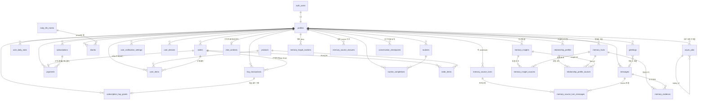

# Moly ERD

> 기준 문서: `API_SPEC.md`(계약) · `DB_REFACTOR.md`(2026-07 커머스 스키마 리팩토링 결정) — **2026-08-04 정규화 기억 구조 반영**
> 대상 DB: **Supabase (PostgreSQL)** — 소셜 로그인(Apple/Kakao/Google)은 Supabase Auth(`auth.users`) 사용
> 장기기억: **public PostgreSQL 정규화 테이블 + pgvector 파생 검색 인덱스** (§7)
> DDL 원본: `db/schema.sql` (이 문서와 1:1 — 모델↔DB 대조 스크립트로 검증)
>
> **2026-07-13 개정 요약 (DB_REFACTOR)**: `hay_packs`+`shop_items`→**`products`** · `iap_purchases`→**`orders`+`order_items`+`payments`** · `user_items`+`user_equipment`→**`user_items`(통합)** · `hay_transactions.ref_id`(다형 text)→**`order_id` FK** · `subscription_hay_grants`에 환불 회수 멱등 컬럼 추가

---

## 1. 설계 원칙

1. **서버 권위 (US-1002)** — 건초 지급/차감, 결제·구독 상태, 상품 가격, 대화 토큰 사용량, 광고 시청 횟수는 모두 서버가 원본. **클라이언트의 DB 직접 쓰기는 전 테이블 금지 — 모든 쓰기는 서버 API 경유**(ARCHITECTURE 원칙·계약 단일화, 2026-07-07 확정). RLS는 읽기 허용 + 심층 방어(§8).
2. **앱 기준일 = 현지 시간 04:00 경계** — 모든 일 단위 로직(`activity_date`)은 `(유저 타임존 현재시각 − 4시간)::date`로 계산. 이를 위해 `profiles.timezone`(IANA)을 저장한다.
3. **대화 제한은 토큰 기준** — 토큰 = **LLM 입력+출력 합산**. 메시지별 사용량을 기록하고 일 단위로 집계(`user_daily_stats.tokens_used`). **그날 누적 토큰**이 대화 한도·일기 LLM 분기·리뷰 팝업 판단의 공통 지표. 캐피의 인사(greeting)는 차감 제외. 집계는 응답 후 — 마지막 응답으로 한도를 초과할 수 있고, 초과 상태에서 다음 요청 차단.
4. **유저 티어는 파생값** — trial/free/subscriber를 컬럼으로 저장하지 않고 조회 시 판정한다 (§6.1). 상태 이중화로 인한 불일치를 원천 차단.
5. **미정 수치는 `app_config`로** — 일일 토큰 한도, 일기/리뷰 임계, 런칭 무료 기간 등 조정 가능 수치는 스키마가 아니라 서버 설정값(§6.2). 클라 노출용 원격 설정(강제 업데이트·점검·낮/밤 시각)은 Firebase — `GET /app-config` 엔드포인트는 제거됨.
6. **원장 우선** — 건초의 진실은 `hay_transactions` 원장. `profiles.hay_balance`는 조회 성능용 캐시이며 서버 트랜잭션 안에서만 갱신.

---

## 2. 다이어그램


```mermaid
erDiagram
    auth_users ||--|| profiles : "1:1"
    profiles ||--o{ subscriptions : ""
    profiles ||--o{ subscription_hay_grants : ""
    profiles ||--o{ hay_transactions : ""
    profiles ||--o{ user_daily_stats : ""
    profiles ||--o{ orders : ""
    profiles ||--o{ payments : ""
    profiles ||--o{ user_items : ""
    profiles ||--o{ greetings : ""
    profiles ||--o{ messages : ""
    profiles ||--o{ diaries : ""
    profiles ||--o{ routines : ""
    profiles ||--o{ routine_completions : ""
    profiles ||--o{ user_notification_settings : ""
    profiles ||--o{ user_devices : ""

    orders ||--o{ order_items : "주문 항목"
    products ||--o{ order_items : ""
    products ||--o{ user_items : ""
    orders ||--o| payments : "KRW 주문(IAP)"
    subscriptions ||--o{ payments : "구독 결제(구매·갱신)"
    orders ||--o{ hay_transactions : "구매 원장(iap·shop)"
    orders ||--o{ user_items : "구매 획득"

    greetings }o--o| messages : "커밋 시 연결"
    moly_life_ments ||--o{ diaries : "preset일 때"
    routines ||--o{ routine_completions : ""

    hay_transactions ||--o| subscription_hay_grants : "지급·회수 기록"

    profiles ||--o| chat_contexts : "기억 좌표·대화 앵커"
    profiles ||--o{ memory_source_turns : "턴 watermark"
    memory_source_turns ||--o{ memory_source_turn_messages : "턴 메시지"
    messages ||--o{ memory_source_turn_messages : "source 연결"
    profiles ||--o{ memory_facts : "정규화 사실"
    memory_facts ||--o{ memory_evidence : "대화 근거"
    messages ||--o{ memory_evidence : "근거 원문"
    profiles ||--o{ memory_insights : "파생 통찰"
    memory_insights ||--o{ memory_insight_sources : "통찰 근거"
    memory_facts ||--o{ memory_insight_sources : "통찰 원천"
    profiles ||--o{ memory_forget_markers : "영속 deny"
    profiles ||--o{ memory_source_closures : "닫힌 source 구간"
    profiles ||--o{ relationship_profiles : "프롬프트 투영"
    relationship_profiles ||--o{ relationship_profile_sources : "투영 근거"
    memory_facts ||--o{ relationship_profile_sources : "fact ref"
    memory_insights ||--o{ relationship_profile_sources : "insight ref"
    profiles ||--o{ conversation_checkpoints : "단기 대화 요약"
    profiles ||--o{ async_jobs : "내구 비동기 작업"
    async_jobs ||--o{ async_jobs : "replay_of"
```

---

## 3. 계정·프로필

### 3.1 `auth.users` — Supabase 관리 (건드리지 않음)

Apple/Kakao/Google 소셜 로그인 결과. `id uuid`가 전체 스키마의 루트 (US-101).

### 3.2 `profiles`

`auth.users`와 1:1. **가입 트리거(`bootstrap_user`)가 자동 생성** — 같은 트리거가 기본 지급 아이템 3종(§4.8)과 기본 루틴 2개(§5.5)도 함께 생성한다(2026-07-13 확정).

| 컬럼 | 타입 | 설명 |
| --- | --- | --- |
| `id` | uuid PK, FK→`auth.users.id` (CASCADE) | |
| `nickname` | text NULL | 온보딩에서 설정, 최대 10글자 — 앱+CHECK 검증 (US-201). NULL이면 온보딩 미완료 → 온보딩 화면 라우팅 |
| `language` | text, default `'ko'` | **앱 콘텐츠 언어** (US-103, ISO 639-1) — 온보딩 때 기기 시스템 언어로 초기화, 변경 가능. **서버 생성물(캐피 응답·일기·푸시)은 유저 입력 언어와 무관하게 항상 이 언어**(API_SPEC 1장). UI 문자열은 클라 로컬라이제이션 |
| `timezone` | text, default `'Asia/Seoul'` | IANA 타임존. 앱 기준일(04:00 경계) 계산의 근거 — 클라이언트가 갱신하되 **서버가 마지막 적용 경계를 기억해 리셋 되돌림 방지** (타임존 변경으로 하루 2회 리셋 악용 차단) |
| `hay_balance` | int, default 0, **CHECK ≥ 0** | 건초 잔액 **캐시** (원본: `hay_transactions`). 서버 전용 쓰기 — 잔액 하한 0을 DB 안전망으로 강제 |
| `trial_ends_at` | timestamptz | 가입 시각 + **48시간 (절대 시각, 의도된 정책 — 하루 중간 종료 가능)** (US-202). 재가입 어뷰징 방지 정책 TBD |
| `review_prompted_at` | timestamptz NULL | 리뷰 팝업 노출 이력 — **최초 1회 제한** (US-1101). NOT NULL이면 재노출 금지 |
| `created_at` / `updated_at` | timestamptz | |

- **탈퇴(US-106)**: `auth.users` 삭제 → 정규화 기억을 포함한 전 테이블 CASCADE. App Store 구독은 자동 해지되지 않으므로 별도 안내한다.

---

## 4. 경제 (건초·구독·커머스)

> **도메인 구분(DB_REFACTOR)**: 카탈로그 = `products` / 주문 = `orders`·`order_items` / 실결제(현금) = `payments` / 재화 원장 = `hay_transactions` / 보유·장착 = `user_items`. 구매 이력(주문·결제)과 재화 이력(원장)을 분리하되 `order_id`로 연결 — 가격정책 변동·매출 집계·부분 환불 대비.

### 4.1 `hay_transactions` — 건초 원장 (US-906, US-1002)

모든 획득/소비의 단일 원장. 충전소 거래 내역 화면이 이 테이블을 그대로 페이지네이션.

| 컬럼 | 타입 | 설명 |
| --- | --- | --- |
| `id` | bigint PK (identity) | 시간순 커서 페이지네이션 키 |
| `user_id` | uuid FK→`profiles` | |
| `type` | enum `hay_transaction_type` | `attendance` `ad_reward` `routine_reward` `iap_purchase` `subscription_grant` `shop_purchase` `refund_revoke` `admin_adjustment` |
| `amount` | int, CHECK ≠ 0 | +획득 / −소비. `refund_revoke`는 환불 시 증정 건초 회수(−) — 회수액은 `min(증정량, 현재 잔액)`으로 잔액 하한 0 유지. **회수액 0이면 원장 기록 없이 §4.4의 회수 표식만 남김**(CHECK ≠ 0 보호) |
| `balance_after` | int | 거래 후 잔액 — 거래 내역 UI 표시 항목 (US-906) |
| `order_id` | uuid FK→`orders` NULL | **구매 관련 원장(`iap_purchase`·`shop_purchase`)의 주문 연결** — (구)다형 `ref_id`(text) 폐기. CS가 원장→주문→결제를 FK로 자동 추적 |
| `created_at` | timestamptz | |

- 인덱스: `(user_id, created_at DESC)` + `(order_id)`.
- type별 `order_id`: `iap_purchase`·`shop_purchase`만 값 있음. 보상류(출석·광고·루틴)와 구독 증정/회수는 NULL — 역추적은 각 소스 테이블의 `hay_transaction_id`가 담당(광고 멱등은 `reward_ad_sessions`).
- 일일 보상 중복 방지는 이 테이블이 아니라 `user_daily_stats`의 유니크/카운터로 강제 (§4.2).

### 4.2 `user_daily_stats` — 앱 기준일 단위 상태

유저 × 앱 기준일 1행. 토큰 한도, 일일 보상 게이팅을 한 곳에서 관리.

| 컬럼 | 타입 | 설명 |
| --- | --- | --- |
| `id` | bigint PK | |
| `user_id` | uuid FK→`profiles` | |
| `activity_date` | date | 앱 기준일 (04:00 경계, 유저 타임존) |
| `tokens_used` | int, default 0 | 그날 누적 토큰 (**LLM 입력+출력 합산**, US-403). greeting 제외. **대화 한도·일기 LLM 분기·리뷰 팝업의 공통 판정 지표** — 한도·기준치는 `app_config` |
| `ad_reward_count` | smallint, default 0 | 리워드 광고 수령 횟수 — 일 최대 10회 서버 검증 (US-903). SSV 콜백은 **멱등 처리**(재전송 중복 지급 방지) + 원자 증가 |
| `attendance_claimed_at` | timestamptz NULL | 출석 수령 시각 — NOT NULL이면 당일 수령 완료 (US-902) |
| `routine_reward_claimed_at` | timestamptz NULL | 루틴 2개 완료 보상 수령 시각 (US-904) |
| `morning_notified_at` | timestamptz NULL | 아침(09:00) 푸시 발송 멱등 마커 — NOT NULL이면 당일 발송 완료, 재발송 차단 |
| `evening_notified_at` | timestamptz NULL | 저녁(21:00) 푸시 발송 멱등 마커 — NOT NULL이면 당일 발송 완료 |

- 유니크: `(user_id, activity_date)`.
- 04:00 리셋 = 새 행 생성일 뿐, 별도 리셋 잡 불필요.

### 4.3 `subscriptions` — 구독 (US-702~705)

**RevenueCat 웹훅**(`POST /webhooks/revenuecat`)이 갱신하는 서버 원본 — RC가 영수증 검증 대행, Apple ASSN은 서버에 연결하지 않음(RC가 소비).

| 컬럼 | 타입 | 설명 |
| --- | --- | --- |
| `id` | uuid PK | |
| `user_id` | uuid FK→`profiles` | |
| `plan` | enum `plan_type` | `monthly`(₩5,900) / `yearly`(₩59,000) — 가격은 StoreKit 상품이 원본 |
| `status` | enum `subscription_status` | `active` `grace_period` `expired` `revoked` |
| `original_transaction_id` | text UNIQUE | Apple 구독 식별자 — 복원(US-703)·중복 매핑 방지 키 |
| `latest_transaction_id` | text | |
| `purchased_at` / `expires_at` | timestamptz | |
| `auto_renew_enabled` | bool | 구독 관리 화면 표시용 (US-705) |
| `environment` | text | `Production` / `Sandbox` |
| `created_at` / `updated_at` | timestamptz | |

- **환불(`revoked`) 처리**: 혜택 즉시 회수(증정 건초 회수) — `refund_revoke` 원장 기록, **잔액 하한 0**, 멱등은 `subscription_hay_grants.revoked_at`(§4.4). 증정 이력은 유지 → 재구독해도 재지급 없음 (구독→증정 소비→환불→재구독 루프 차단). 구독 전용 cosmetic 폐지(appearance_v2)로 장착 해제 처리 불필요.
- **복원 충돌**: `original_transaction_id`는 Apple ID(기기 결제 계정) 소유라 소셜 로그인 계정과 독립 — 다른 소셜 계정으로 로그인 후 복원하면 이미 매핑된 UNIQUE 키와 충돌한다. 처리(RC 전환 후) = **서버가 해당 웹훅을 무시**(다른 계정 소유 구독 스킵) — 원 계정의 구독 상태 유지.

### 4.4 `subscription_hay_grants` — 구독 건초 증정 이력 (US-704)

월간 1,000 / 연간 4,000 — **각 플랜 최초 1회**를 DB 제약으로 강제.

- `user_id` + `plan` **UNIQUE** → 재구독 시 중복 지급이 구조적으로 불가능.
- `hay_transaction_id` FK→`hay_transactions` (`type='subscription_grant'` 기록과 연결), `granted_at`.
- **환불 회수 멱등(2026-07-13)**: `revoked_at` timestamptz NULL(NOT NULL = 회수 완료 — 환불 웹훅 재수신에도 이중 회수 불가), `clawback_hay_transaction_id` FK NULL(`type='refund_revoke'` 원장 연결. 회수액 0이면 NULL). (구)원장 `ref_id` 스캔 방식 폐기.
- **증정 이력이 없으면 환불 시 회수도 없음** — 받은 적 없는 건초를 뺏지 않는다.

### 4.5 `products` — 판매 상품 카탈로그 (US-801, US-905) ★리팩토링: (구)hay_packs + (구)shop_items 통합

order_items가 가리키는 단일 상품 FK. `product_type`으로 두 판매 유형을 구분한다.

| 컬럼 | 타입 | 설명 |
| --- | --- | --- |
| `id` | uuid PK | 내부 참조용 |
| `product_type` | enum `product_type` | `hay_pack`(건초 IAP — KRW 실결제) / `cosmetic`(꾸미기 — HAY 결제) |
| `name` / `description` | text | 원문(한국어). 렌더 폴백의 최종 단계 |
| `name_i18n` | jsonb NULL | **다국어 이름**(SOMA-346) — `{"ko":…,"en":…,"ja":…}`. CHECK `jsonb_typeof='object'`. 렌더 = `resolve(lang)→en→ko→원문 name` 폴백(NULL·부분키 안전). 신규 언어는 키 추가만 |
| `public_id` | text UNIQUE NULL | **cosmetic 전용** — API 노출용 안정 문자열 식별자. 외부에 노출되는 키는 `id`(uuid) 대신 이 값을 사용 |
| `slot` | text NULL | **cosmetic 전용** — `theme`(테마/배경) \| `hat`(모자) \| `glasses`(안경) \| `neck`(목) \| `body`(몸). 장착 부위이자 상점 탭 분류. 기존 `background`·`head` enum이 `theme`·`hat`/`glasses`로 분리됨(appearance_v2 이후) |
| `price_hay` | int NULL | **cosmetic 전용** — 서버가 원본 (US-801). **NULL = 구매 불가(기본 지급품 등)**. 판매 상품이면 `≥ 1` 강제(0원 구매는 원장 CHECK `amount≠0`와 충돌하므로 금지). 정책(최소 1,000, 200단위)은 운영·앱 검증 |
| `is_subscriber_only` | bool NOT NULL default false | **항상 false — 구독 전용 cosmetic 폐지(appearance_v2).** 구독 전용 장착 사용권 방식 폐기 → 모든 cosmetic은 구독 여부 무관하게 HAY 구매 가능(가격 정책으로 조절). cosmetic CHECK로 `false` 강제 |
| `asset_version` | int NULL | **cosmetic 전용** — 에셋 구조 버전. 활성 cosmetic은 `≥ 1` 필수(inactive 상태로만 준비 가능) |
| `assets` | jsonb NULL | **cosmetic 전용** — v2 구조: `scene{canvas, layers, character_url, day_url}` · `thumbnail_url` · `detail_url` · `upright_layer_url` |
| `is_v2_only` | bool NOT NULL default false | **cosmetic 전용** — `true`이면 rightside(v2) 자세 계약에만 노출. 레거시 카탈로그·인벤토리 조회에서 제외 |
| `hay_amount` | int NULL | **hay_pack 전용** — 지급 건초량 (300/1,500/3,000) |
| `price_krw` | int NULL | **hay_pack 전용** — 표시 참고용(결제가는 StoreKit) |
| `app_store_product_id` | text UNIQUE NULL | **hay_pack 전용** — App Store Connect product id |
| `play_store_product_id` | text UNIQUE NULL | **hay_pack 전용** — Google Play 상품 ID(Play Console 확정 후 주입, NULL 허용) |
| `is_active` / `sort_order` | | |

- **타입별 컬럼 상호 강제(CHECK)**: `hay_pack` → hay_amount·app_store_product_id 필수, cosmetic 컬럼 전부 NULL, `is_subscriber_only = false` / `cosmetic` → public_id·slot·assets 필수, hay_pack 컬럼 전부 NULL, `is_subscriber_only = false` 강제. 활성 cosmetic은 `asset_version ≥ 1 AND assets IS NOT NULL` 필수(비활성으로만 준비 단계 가능).
- UNIQUE `(id, slot)` — `user_items` 장착 슬롯 일치 복합 FK 대상.
- **기본 테마/기본 캐피는 상품이 아님** — `user_items`에 테마 장착 행이 없으면 기본 상태 (US-804). 단 가입 시 bootstrap_user가 theme_default를 자동 장착하므로 신규 유저는 항상 테마 장착 상태로 시작(§4.8).

### 4.6 `orders` / `order_items` — 주문 (모든 구매의 단일 진입점) ★신설

**`orders`** — IAP 건초(KRW 실결제)와 상점 꾸미기(HAY 재화 차감) 모두 주문으로 기록.

| 컬럼 | 타입 | 설명 |
| --- | --- | --- |
| `id` | uuid PK | |
| `user_id` | uuid FK→`profiles` | |
| `currency` | enum `order_currency` | `KRW`(건초 IAP) / `HAY`(꾸미기 구매) |
| `status` | enum `order_status` | `pending` `paid` `failed` `refunded` — MVP 주문은 즉시확정이라 `paid`로 생성(HAY는 원장 차감과 한 트랜잭션, KRW는 RC 검증 완료 웹훅 시점) |
| `total_amount` | int ≥ 0 | KRW 결제금액 또는 HAY 차감량 |
| `created_at` / `updated_at` | timestamptz | |

**`order_items`** — 주문 항목. MVP는 항상 1건이지만 묶음 상품·부분 환불 대비(팀 결정).

- `id`, `order_id` FK(CASCADE), `product_id` FK, `quantity`(default 1), **`unit_price`(구매 시점 가격 스냅샷 — 가격정책 변동이 과거 주문을 바꾸지 않음)**.
- 인덱스: `orders(user_id, created_at DESC)`, `order_items(order_id)`, `order_items(product_id)`.

### 4.7 `payments` — 실결제(현금) 기록 ★신설: (구)iap_purchases 대체

매출의 단일 소스 — `SELECT sum(amount) WHERE status='paid'` 한 방. 건초 IAP + 구독 결제(구매·갱신 모두) 기록.

| 컬럼 | 타입 | 설명 |
| --- | --- | --- |
| `id` | uuid PK | |
| `user_id` | uuid FK→`profiles` | |
| `order_id` | uuid FK→`orders` NULL | 건초 IAP 주문과 1:1 |
| `subscription_id` | uuid FK→`subscriptions` NULL | 구독 결제(구매·갱신마다 1행) |
| `store` | text NOT NULL | 실제 스토어 — `app_store` \| `play_store` \| 그 외(확장 가능). **default 없음 — 코드가 항상 명시**. 인덱스 `payments_store_idx` |
| `store_transaction_id` | text UNIQUE NOT NULL | **영수증 멱등 키** — 재전송/중복 웹훅에도 이중 지급 불가 ((구)iap_purchases.transaction_id 승계) |
| `amount` | numeric(14,4) NULL | 결제금액 **원통화 무손실** 저장. RC 이벤트에 가격 있으면 기록, 없으면 NULL |
| `currency` | text NULL | 구매 통화(ISO 4217). **default 없음 — 미확인이면 NULL**(KRW로 임의 확정 금지) |
| `status` | enum `payment_status` | `paid` `refunded` |
| `paid_at` / `created_at` | timestamptz | |

- CHECK: `order_id IS NOT NULL OR subscription_id IS NOT NULL`.
- 흐름(건초 IAP): RC `NON_RENEWING_PURCHASE` 웹훅 → 멱등 확인 → `orders(KRW,paid)` + `order_items` + 원장 지급(`order_id` 연결) + `payments` — 한 트랜잭션 (US-905).

### 4.8 `user_items` — 보유 + 장착 (US-802, US-804) ★리팩토링: (구)user_items + (구)user_equipment 통합

| 컬럼 | 타입 | 설명 |
| --- | --- | --- |
| `id` | uuid PK | |
| `user_id` | uuid FK→`profiles` | |
| `product_id` | uuid FK→`products` | cosmetic만 |
| `source` | enum `user_item_source` | `purchase`(주문 구매) / `subscription`(구독 연동 지급 — 현재 미사용, 구독 전용 cosmetic 폐지로 사실상 레거시) / `admin_grant`(운영 무상 지급) |
| `order_id` | uuid FK→`orders` NULL | `purchase`는 주문 연결, 그 외 NULL |
| `equipped_slot` | text NULL | **NULL = 미장착**. 값 있으면 그 슬롯에 장착 중 — (구)user_equipment 역할. 허용값: `theme` \| `hat` \| `glasses` \| `neck` \| `body` |
| `equipped_at` | timestamptz NULL | 장착 시기 트래킹 |
| `acquired_at` | timestamptz | |

- UNIQUE `(user_id, product_id)` — 중복 구매 방지.
- **부분 UNIQUE `(user_id, equipped_slot) WHERE equipped_slot IS NOT NULL`** — 슬롯당 1개 장착 ((구)user_equipment PK 승계).
- **복합 FK `(product_id, equipped_slot) → products(id, slot)`** — 슬롯 일치를 DB가 강제 (equipped_slot NULL이면 미평가).
- 장착 서버 검증: 보유 확인(`source IN ('purchase','admin_grant')`). 같은 슬롯 교체 = 기존 자동 해제. **해제 = `equipped_slot` NULL**(소유 행 유지).
- ⚠️ **구현 주의**: 슬롯 교체는 "해제 전부 → flush → 장착" 순서 필수 — 부분 UNIQUE는 statement 단위 평가라 한 flush에 섞이면 순서에 따라 위반(2026-07-13 리뷰에서 실DB 재현·수정).
- **가입 기본 지급(2026-07-13 확정, 2026-07-27 장착 정책 갱신)**: 가입 트리거(`bootstrap_user`)가 `source='admin_grant'`로 3종 지급 — 테마(theme) 1종·기타 2종(hat/glasses 등). **테마 1종은 자동 장착(`equipped_slot='theme'`)** — 캐피가 항상 테마 있는 상태로 시작. 나머지 2종은 미장착. 상점에는 `owned:true`로 노출, 재구매는 UNIQUE로 차단.

### 4.9 `reward_ad_sessions` — 광고 SSV 세션 (US-903)

리워드 광고 1회 시청을 추적하고 SSV(Server-Side Verification) 콜백 중복 지급을 막는 멱등 레코드.

| 컬럼 | 타입 | 설명 |
| --- | --- | --- |
| `session_id` | uuid PK | 앱이 광고 노출 전에 발급 |
| `user_id` | uuid FK→`profiles` | |
| `activity_date` | date | 앱 기준일 — 일 10회 한도 게이팅용 |
| `ssv_transaction_id` | text UNIQUE NULL | SSV 콜백 도착 시 기록 — UNIQUE로 재전송 멱등 처리 |
| `granted` | bool NOT NULL default false | 건초 지급 완료 여부 |
| `created_at` | timestamptz | |

- 인덱스: `reward_ad_sessions_user_idx (user_id)`.
- `user_daily_stats.ad_reward_count`와 이 테이블이 이중 멱등: SSV `ssv_transaction_id` UNIQUE + 카운터 ≤ 10 서버 검증.

---

## 5. 대화·일기·루틴

### 5.1 `greetings` — 선발화 발급 보관 (미커밋)

`GET /chat/greeting`이 발급한 선발화. **대화 이력이 아님** — 유저가 응답할 때 `POST /chat/messages`에 `greeting_id`를 에코하면 그 시점에 `messages(kind='greeting')`로 커밋되고, 미커밋 건은 이력에 나타나지 않고 만료 폐기(API_SPEC 3장).

- `id` uuid PK, `user_id` FK, `context` enum `greeting_context`(`onboarding` `home_enter` `morning` `evening` `comeback`), `content` text, `activity_date` date, `committed_message_id` bigint NULL FK→`messages`(커밋 시 연결), `created_at`.
- 유니크: `(user_id, context, activity_date)` — **스키마는 그대로**(2026-07-14 변경에도 DDL 변경 없음).
- **발급 규칙(2026-07-14 변경): 하루 1건, `context` 무관.** 앱이 강제한다 — ①그날 유저 메시지가 하나라도 있으면 발급하지 않고(대화 중 난입 방지) ②그날 이미 발급한 인사는 재발급하지 않는다(재진입 시 같은 인사가 다시 뜨던 버그). 둘 중 하나면 `GET /chat/greeting`이 **빈 응답**(null)을 준다.
    - 앱 규칙이 위 유니크 제약보다 **엄격**하다(제약은 컨텍스트별 1건까지 허용). 충돌이 아니라 상위 집합이라 DDL을 바꾸지 않았다. 동시 진입 레이스는 `pg_advisory_xact_lock`(유저 단위)으로 직렬화.
    - greeting은 토큰 미차감이므로 이 규칙이 rate limit을 겸한다.
- 커밋된 선발화(`messages.kind='greeting'`)는 **LLM 대화 컨텍스트에 반드시 실린다.** Anthropic이 `messages[0]`를 `user`로 강제해 대화 배열 맨 앞의 캐피 메시지는 배열에 못 넣지만, 버리지 않고 system 가변 블록(`[먼저 건넨 말]`)으로 넘긴다. 버리면 캐피가 방금 건넨 인사를 모른 채 또 인사한다.

> (구) `conversation_sessions`는 **제거**(2026-07-07 확정) — 대화는 세션·종료 개념 없는 연속 스레드이고, 리뷰 트리거도 세션 종료가 아니라 채팅 응답 플래그(당일 누적 토큰)로 처리. 진입~이탈 분석은 Firebase 계측으로 충분.

### 5.2 `messages` — 메시지 (US-401, US-406, US-407)

| 컬럼 | 타입 | 설명 |
| --- | --- | --- |
| `id` | bigint PK (identity) | 위로 스크롤 커서 페이지네이션 키 (US-407) |
| `user_id` | uuid FK→`profiles` | 채팅방(단일 연속 스레드) 전체를 시간순 조회 |
| `sender` | enum `message_sender` | `user` / `moly` |
| `kind` | enum `message_kind` | `normal` / `greeting` — greeting = **커밋된 선발화**(발급 보관 원본 = `greetings` §5.1). **토큰 한도 미차감**(US-406), 토큰 소진 상태에서도 발급 가능 |
| `content` | text | 길이 상한은 API 검증 (비용 통제) |
| `input_tokens` / `output_tokens` | int NULL | LLM 사용량 — `moly` 응답에 기록, `user` 메시지는 NULL. `kind='normal'`인 것만 `user_daily_stats.tokens_used`에 합산 |
| `cache_read_tokens` | int NULL | 프롬프트 캐시 히트 토큰 — 캐시 텔레메트리(실원가·히트율 분석용) |
| `cache_write_tokens` | int NULL | 프롬프트 캐시 기록 토큰 |
| `billable_tokens` | int NULL | 원가 가중 청구 스냅샷 — `input×1 + output×1 + cache_read×0.1 + cache_write×1.25` 가중합. 단가 변경 후 재감사 필요 |
| `activity_date` | date | 날짜 칩(US-401)·일 집계용 앱 기준일 |
| `turn_seq` / `turn_position` | bigint / smallint NULL | 성공한 user별 턴 순번과 greeting/user/reply 위치. 부분 UNIQUE로 한 턴의 위치 중복을 금지 |
| `created_at` | timestamptz | |

- 인덱스: `(user_id, id DESC)` + `(user_id, activity_date)` — 일기→해당 날짜 점프(`anchor_date` 조회, API_SPEC 3장)용.
- 보관 기간·조회 범위 정책 TBD — 스키마는 영구 보존 전제, 정책 확정 시 파티셔닝/아카이빙 검토.
- 캐피의 일기 LLM 생성 비용은 유저 한도와 무관 → messages와 분리된 배치에서 처리 (5.3).

### 5.3 `diaries` — 캐피의 일기 (US-501~503)

첫 성공 대화의 관계 프롤로그와 04:00 배치 daily를 같은 테이블에 보관하되 종류와 uniqueness를 분리한다.

| 컬럼 | 타입 | 설명 |
| --- | --- | --- |
| `id` | uuid PK | |
| `user_id` | uuid FK→`profiles` | |
| `diary_date` | date | 일기의 대상 앱 기준일 |
| `kind` | text | `welcome`(관계 프롤로그) / `shared_day`(대화 기반 daily) / `capi_day`(캐피의 삶 daily) |
| `activity_date` / `display_date` | date NULL / date | daily 귀속 04:00 날짜와 화면 표시 날짜. welcome은 activity_date가 NULL |
| `author` / `primary_subject` / `about_tags` | text / text / text[] | 저자는 항상 캐피. 누구에 관한 기록인지 생성 시 확정 |
| `occurred_at` / `occurred_timezone` | timestamptz / text | 실제 사건 시각과 당시 timezone snapshot |
| `source` | enum `diary_source` | `llm`(당일 **유저 메시지 문자수** ≥ `app_config.diary_min_user_chars` — 대화 기반 생성, LLM self-check 실패 시 preset 폴백) / `preset`(기준 미달·미접속 — 멘트 풀) / `welcome`(현행: 목록 최초 조회 때 보정 생성되는 첫 만남 일기. 목표는 일일 슬롯과 분리된 관계 프롤로그 — `agentic-chat-ARCHITECTURE.md` §0.5) |
| `preset_ment_id` | uuid NULL, FK→`moly_life_ments` | `source='preset'`일 때만 |
| `content` | text | 생성 결과 스냅샷 (preset이어도 본문 복사 저장 — 멘트 풀 수정이 과거 일기를 바꾸지 않게) |
| `weather` | enum `diary_weather` | 마음 날씨 스탬프 `sunny` `cloudy` `rainy` `windy` — llm은 생성 결과, preset은 멘트에 지정된 값 복사 |
| `published_at` | timestamptz | 발행 시각 — **UTC 저장, 값 = 유저 로컬 익일 09:00을 UTC로 환산**(타임존별 상이). 09:00 틱 배치가 설정. **목록·상세는 `published_at ≤ now()`만 노출**(배치 생성분 사전 노출 방지, API_SPEC 4장) |
| `first_read_at` | timestamptz NULL | 열람 여부 — 아침 알림/뱃지용 |
| `created_at` | timestamptz | |

- 부분 유니크: user당 active welcome 1개, `(user_id,activity_date)`당 active daily 1개.
- 첫 성공 Phase B가 `relationship_started_*`와 welcome을 user/reply 메시지와 원자 삽입한다. 목록 GET은 쓰지 않는다.
- daily 미발행은 `diary_generation_results(user_id,target_date,status=no_entry)`가 소유하며 빈 diary/tombstone을 만들지 않는다.
- **열람은 등급 무관 항상 무료(확정)** — 접근 제어 없음. 구독 가치 = 개인(`llm`) 일기 "발행"이지 열람이 아님.
- preset 선택(§5.4): 그날 `diary_date` 지정본 우선 → 없으면 `diary_date IS NULL` 풀에서 랜덤 → 둘 다 없으면 안전 기본 문구.

### 5.4 `moly_life_ments` — '캐피의 삶' 멘트 풀 / 날짜 지정본

임계 미달·미접속 날의 일기 소스(전원 매일 발행이므로 상시 사용). `id`, `content`, `weather`(멘트에 어울리는 마음 날씨 스탬프), `is_active`, `diary_date` date NULL, `created_at`.

- **`diary_date` 있는 행 = 그 날짜 지정본**(직접 작성) — 생성 틱이 해당 `target_date`에 우선 선택. 부분 유니크 인덱스 `moly_life_ments_diary_date_uq (diary_date) WHERE diary_date IS NOT NULL`로 날짜당 1건(편집은 in-place).
- **`diary_date` NULL 행 = 랜덤 폴백 풀** — 지정본 없는 날에만 랜덤 선택. (기존 시드 10건이 여기 해당)
- 날짜 지정본 입력 = `db/capi_diaries.csv` + `scripts/seed_capi_diaries.py`(멱등 업서트, content 빈 행 스킵). 랜덤 풀 = `db/seed_moly_life_ments.sql`. (문구·개수 TBD — 운영 등록)

> 로딩 멘트 6종(US-402)은 확정 문구라 클라이언트 상수로 처리 — 테이블 없음.

### 5.5 `routines` / `routine_completions` (US-601~606)

**`routines`**: `id`, `user_id`, `name`, `name_i18n` jsonb NULL, `frequency_per_week` smallint NOT NULL(항상 `days_of_week` 요일 수 파생 — 응답 하위호환용 컬럼), `days_of_week` smallint[] **NOT NULL**(지정 요일, ISO 1=월…7=일 — 요일별 전용, 주 N회 모드 없음), `reminder_enabled` bool, `reminder_time` time NULL(로컬 알림 — 발송은 기기에서), `deleted_at` NULL(**soft delete** — 삭제해도 통계 US-605 보존), `created_at`, `updated_at`.

- **가입 기본 루틴(2026-07-13 확정)**: 가입 트리거(`bootstrap_user`)가 2개 자동 생성 — "이불 정리하기", "물 마시기" (days_of_week = 월~일 전체 7일, frequency_per_week = 7, 리마인더 off). 유저가 수정·삭제 가능(일반 루틴과 동일).
- **`name_i18n`(SOMA-346)**: 기본 루틴만 `{"ko","en","ja"}`로 생성(bootstrap_user). 렌더 = `resolve(lang)→en→ko→원문 name` 폴백. **유저 생성 루틴은 NULL**(입력 언어 그대로 name). CHECK `jsonb_typeof='object'`. 기존 루틴 백필 안 함(동명 유저 루틴 오염 방지 — 신규 가입자만 적용).

**`routine_completions`**: `id`, `routine_id` FK, `user_id`, `activity_date`, `completed_at`. 유니크 `(routine_id, activity_date)` — 일 단위 체크/해제(해제 = 행 삭제).

- **루틴 2개 완료 보상**(US-904) 판정: `해당 activity_date의 completions ≥ 2` AND `user_daily_stats.routine_reward_claimed_at IS NULL` — 서버 트랜잭션에서 수령 처리. 완료 시점 자동 알림 없음(정책).
- API 응답 `completed_count_today`(API_SPEC 8장) = `routine_completions`에서 `(user_id, activity_date=오늘)` 행 수를 파생 계산(별도 컬럼 아님, 클라 UI·충전소 게이팅용).

### 5.6 `diary_gen_claims` — 일기 생성 클레임 (SOMA-373, 워커 내부)

워커 틱 중첩(15분 케이던스·롤링 배포) 시 같은 `(user_id, diary_date)` 일기를 두 프로세스가 동시에 LLM 생성하지 않도록 하는 **상호배제 클레임**. 세션 advisory lock은 커넥션 풀 반환·pgbouncer 트랜잭션 풀링과 맞지 않아 **커밋된 행 기반**으로 구현.

| 컬럼 | 타입 | 설명 |
| --- | --- | --- |
| `user_id` | uuid | PK 복합 |
| `target_date` | date | PK 복합 |
| `claimed_at` | timestamptz, default now() | 만료 판정 기준 |

- 클레임 = `INSERT … ON CONFLICT DO UPDATE … WHERE claimed_at < now()-interval '30 min'`(만료된 크래시 클레임만 회수). 정상 종료 시 삭제(누적 방지).
- **RLS deny-default**(다른 테이블과 동일 불변식) — 서버는 owner 롤로 우회, 클라(anon/authenticated) 직접 차단(임의 유저 claim INSERT로 일기 스킵 유도 방지).
- 멱등 백스톱은 이 클레임 + `diaries (user_id, diary_date)` 유니크(= `_diary_exists`) 이중. 워커는 단일 호스트(`/etc/moly-worker-host` 마커)지만 롤링 배포·타임아웃 킬 대비 크로스프로세스 안전장치.

### 5.7 `chat_contexts` — 대화 컨텍스트 상태 (프롬프트 캐싱 인프라)

앵커 append-only 캐싱 + 정규화 기억 처리 좌표를 유저별 1행으로 관리한다. **민감 테이블 — anon/authenticated 직접 접근 전면 차단(`REVOKE ALL`)**.

| 컬럼 | 타입 | 설명 |
| --- | --- | --- |
| `user_id` | uuid PK FK→`profiles` | 유저당 1행 |
| `anchor_message_id` | bigint NOT NULL CHECK ≥ 0 | 캐시 앵커 message id — 이 메시지까지 프롬프트 고정 블록에 포함 |
| `last_active_at` | timestamptz NULL | 직전 대화 활동 시각 — 첫 만남/재방문 판단 입력 |
| `memory_source_watermark` | bigint NOT NULL | 유저별 source turn 단조 증가 좌표 |
| `memory_generation` | bigint NOT NULL | 망각 시 증가해 진행 중인 이전 세대 잡을 폐기 |
| `relationship_profile_input_revision` | bigint NOT NULL | 실제 기억 변경 때만 증가하는 프로필 입력 버전 |
| `updated_at` | timestamptz NOT NULL | 상태 갱신 시각 |

- **`REVOKE ALL ON chat_contexts FROM anon, authenticated`** — 클라이언트가 기억 평문에 직접 접근하는 경로를 DB 레벨에서 차단. 서버(owner 롤)만 접근.
- RLS enable은 §8 공통 블록에 포함(REVOKE가 추가 보호층).

---

## 6. 파생 로직·설정

### 6.1 유저 티어 (컬럼 아님 — 조회 시 판정)

```
subscriber : subscriptions에 status IN ('active','grace_period') AND expires_at > now() 존재
trial      : 위가 아니고 now() < profiles.trial_ends_at  (가입 후 2일)
free       : 그 외
```
- **체험(trial)은 구독과 동일 혜택** — 단 한 가지 제외: 건초 증정 없음(구독 전용 아이템·테마 폐지됨, appearance_v2 이후 모든 cosmetic은 HAY 구매 가능).
- 티어별 게이팅: 일일 토큰 한도(`app_config` — trial은 subscriber와 동일 수준), 배너 광고(**free만 노출**), 건초 증정(subscriber 결제 시, 플랜별 최초 1회).
- **일기 발행 자체는 전원 매일**(티어 무관) — 개인(`llm`)/`preset` 분기는 티어가 아니라 당일 토큰 임계(free는 한도상 사실상 preset).

### 6.2 `app_config` — 서버 설정 (key-value)

`key` text PK, `value` jsonb, `description`, `updated_at`. **조정 가능 수치의 착지점** — 재배포 없이 운영 조정. **클라 미노출**(조회 API 없음 — 서버 판정용. 강제 업데이트·점검·낮/밤은 Firebase). 모든 키는 서버 코드 기본값이 있어 행이 없어도 동작한다.

| key (서버가 읽는 전체 목록) | 대응 정책 |
| --- | --- |
| `daily_token_limit` (`{free, trial, subscriber}`) | 일일 토큰 한도 |
| `token_warning_threshold` | 소진 경고 임계치 (US-404) |
| `review_prompt_min_tokens` | 리뷰 팝업 기준 — 그날 누적 토큰 |
| `diary_min_user_chars` | 개인(관찰) 일기 분기 — 당일 유저 메시지 문자수 |
| `diary_llm_min_tokens` | (레거시) 토큰 기반 일기 분기 — `diary_min_user_chars`로 대체 |
| `free_launch_until` | 런칭 무료 종료 시각 — 이전엔 전원 무료 (backend·moly-auth 공유) |
| `free_launch_token_limit` | 런칭 기간 일 토큰 한도 (현재 50,000) |

### 6.3 `user_notification_settings` (US-104, US-907, US-408, US-503)

- `user_id`, `type` enum `notification_type`(`morning_diary` `evening_chat` — **2종 확정.** 루틴 알림은 클라 로컬(`routines.reminder_*`), 충전소 알림 없음), `enabled` bool default true. 유니크 `(user_id, type)`.
- **행이 없으면 enabled=true로 간주** (기본 on) — 명시적으로 끈 항목만 행 생성/갱신.

### 6.4 `user_devices` — 푸시 토큰

아침 09:00·저녁 21:00 알림 = **서버 APNs 푸시 확정**(ARCHITECTURE §3.3) — 발송 대상 토큰 저장.

- `id`, `user_id`, `platform`(`ios|android`), `push_token` UNIQUE, `last_active_at`, `created_at`.
- 로그아웃 시 해당 `push_token` 행 삭제(API `POST /auth/logout`이 토큰을 받음).

---

## 7. 정규화 장기기억 — public PostgreSQL + pgvector

기억의 런타임 흐름은 `ARCHITECTURE.md` §5.2를 따른다. 이 절은 물리 테이블, 상태 전이와 DB
불변조건을 소유한다. 모든 사용자 기억 행은 `profiles`와 연결되고 탈퇴 시 CASCADE된다. 기억 테이블은
RLS enable + `REVOKE ALL FROM anon, authenticated`로 클라이언트 직접 접근을 차단한다.

### 7.1 `memory_source_turns` / `memory_source_turn_messages`

대화 턴을 유저별 단조 watermark에 연결하는 provenance 원본이다.

| 테이블 | 키·필드 | 제약 |
|---|---|---|
| `memory_source_turns` | PK `(user_id, source_watermark)`, `representative_message_id`, `committed_at` | watermark > 0, 대표 메시지는 유저별 UNIQUE이며 코드가 inbound user인지 검증 |
| `memory_source_turn_messages` | PK `(user_id, source_watermark, message_id)` | `(user_id,message_id)` UNIQUE로 한 message는 정확히 한 turn에만 속함 |

`chat_contexts.memory_source_watermark`는 대화 Phase 2의 같은 유저락 안에서 증가한다. messages, turn,
message edge와 `memory_extract` 잡이 같은 트랜잭션에서 커밋되므로 “메시지만 있고 기억 source가 없는”
부분 성공을 허용하지 않는다.

### 7.2 `memory_facts` / `memory_evidence`

원본 `messages`에서 재생성 가능한 현재 장기기억 projection이다. `memory_evidence`는 진실 자체가 아니라
fact와 authoritative user message span을 잇는 provenance edge다.

| 필드 | 계약 |
|---|---|
| `kind` | `profile|preference|relationship|event|emotion` 코드 registry |
| `canonical_text` | 저장 직전 살균·`{유저이름}` placeholder 적용된 자연어 표면 |
| `subject`, `predicate`, `object_json` | 선택 구조화 값. predicate는 13종 registry와 cardinality를 따름 |
| `status` | `active|superseded|forgotten`. 뒤의 두 상태는 terminal |
| `content_hash`, `normalization_version` | versioned 정규화 결과. marker와 동일 hash 산출물 사용 |
| `superseded_by` | 같은 user의 새 fact만 가리키는 복합 FK, DELETE RESTRICT |
| `embedding vector(1536)` | 검색용 파생값. 원본이 아니며 NULL에서 전량 재생성 가능 |

인덱스는 active user/predicate/event 조회, `(user_id, normalization_version, content_hash)` dedup,
active non-null embedding의 HNSW cosine 검색을 지원한다.

`memory_evidence`의 PK는 `(fact_id, source_type, source_id)`이고 v1 `source_type`은
`conversation_turn`만 허용한다. `source_id`는 `messages.id`, `source_excerpt_hash`는 근거 원문의 SHA-256,
`observed_at`은 관찰 시각이다. messages FK가 user id를 포함하지 않으므로 repository가 evidence insert
전에 같은 트랜잭션에서 `messages.user_id == memory_facts.user_id`를 검증한다.

상태 전이는 다음으로 제한한다.

- `ADD`: 새 active fact + evidence
- `REINFORCE`: active fact의 confidence와 새 evidence만 갱신
- `SUPERSEDE`: 새 active fact를 먼저 만들고 기존 active를 terminal `superseded`로 닫음
- `KEEP_BOTH`: multi predicate의 기존·신규 fact를 모두 active 유지
- `IGNORE`: 쓰기와 input revision 증가 없음

terminal 행을 active로 되돌리는 UPDATE 경로는 없다.

### 7.3 `memory_insights` / `memory_insight_sources`

여러 fact에서 파생할 수 있는 통찰 계층이다. `memory_insights.status`는
`active|invalidated|superseded`, `derivation_version`으로 생성 규칙을 식별한다.
`memory_insight_sources`는 `(user_id, insight_id, fact_id)` 복합 PK와 user id를 포함한 복합 FK로
타 사용자의 fact를 근거로 연결하지 못하게 한다.

이 테이블은 이전 스키마와의 호환을 위한 비활성 계층이다. **새 insight를 자동 생성하는 producer는
없으며 추가할 후속 전제도 없다.** 최종 런타임의 반복 경향은 fact source ref를 가진
`relationship_profiles.inferred_tendencies`로만 투영한다. 검색·기본 주입의 활성 원천은 §7.2 fact/evidence와
user-message episode이고, 빈 insight 계층에 의존하지 않는다.

### 7.4 `memory_forget_markers` / `memory_source_closures`

망각을 재처리 뒤에도 유지하는 영속 deny 데이터다.

- marker scope는 `fact|predicate|all` 중 하나다.
- fact marker는 대상 행의 `content_hash`와 `normalization_version`을 그대로 복사한다. 재계산하지 않는다.
- predicate marker는 canonical predicate만, all marker는 범위 필드를 갖지 않는다.
- `expires_at IS NULL` CHECK로 사용자 망각이 만료돼 되살아나는 것을 금지한다.
- fact marker FK는 deferred라 retention 트랜잭션에서 관련 파생 데이터를 먼저 제거하고 marker를 마지막에
  처리할 수 있다.
- closure는 `(from_watermark, through_watermark)`와 `forget_operation_id`를 기록하며 범위 겹침 인덱스를
  가진다. 닫힌 범위와 하나라도 겹친 extraction 결과는 부분 반영하지 않는다.

망각 트랜잭션은 generation/revision 증가, marker/closure, fact `forgotten`+embedding NULL, insight/profile
무효화, checkpoint 삭제, profile refresh enqueue까지 한 번에 커밋한다.

### 7.5 `relationship_profiles` / `relationship_profile_sources`

active 기억에서 만든 locale별 안정 프롬프트 투영이다.

| 필드 | 계약 |
|---|---|
| `(user_id, locale, version)` | 버전 UNIQUE |
| `memory_generation`, `relationship_profile_input_revision` | draft가 본 입력 좌표. publish 직전 현재 좌표와 재대조 |
| `document_json` | `stance`, `known_facts`, `recent_threads`, `inferred_tendencies`와 source ref |
| `rendered_text`, `render_hash` | 최대 400토큰 투영과 내용 hash. 같은 hash면 새 version 미생성 |
| `status` | `draft|published|invalidated|superseded`; terminal 상태를 되살리지 않음 |

부분 UNIQUE 인덱스가 `(user_id,locale)`당 published 한 개만 허용한다. source edge는 item별 fact 또는
insight 중 정확히 하나만 참조하고, 모든 FK에 user id를 포함한다. publish 시 JSON ref와 edge가
`type/id/item_key`까지 양방향으로 같아야 한다. chat render도 매 턴 source active 상태와 forget marker를
재검증해 refresh 지연 중 stale 항목을 제외한다.

### 7.6 `conversation_checkpoints`

긴 대화에서 앵커 밖으로 밀려난 구간의 단기 줄거리다. `through_message_id`, placeholder `summary`,
요약기 `version`, 결정적 `source_hash`, `memory_generation`을 저장한다. UNIQUE
`(user_id, through_message_id, source_hash)`와 잡 dedup key로 같은 입력의 중복 생성을 막는다.

checkpoint는 Fact가 아니고 장기기억 추출 source도 아니다. 망각 시 그 유저의 checkpoint를 전부
삭제하며, 늦은 이전 generation 잡은 결과를 publish하지 않는다.

### 7.7 `async_jobs`의 기억 잡 계약

기억 파이프라인은 `memory_extract`, `memory_reconcile`, `memory_embed`,
`relationship_profile_refresh` job type을 content queue에서 처리한다.

- 상태: `ready → running → succeeded|dead|cancelled`, retry는 running에서 새 `available_at`의 ready로 전환
- claim 시 attempt 증가, `max_attempts`로 poison job 무한루프 차단
- running에만 `lease_owner`, `lease_token`, `lease_until`이 존재한다는 CHECK
- `(job_type, dedup_key)` UNIQUE로 동일 producer의 중복 enqueue 흡수
- terminal 원본은 수정·삭제하지 않고, 재처리는 self FK `replay_of`가 가리키는 새 행으로 실행
- 최종 contract는 dead 원본에 succeeded replay 자식이 있어야 해소된 것으로 인정

### 7.8 기억 API 읽기 표면

- `GET /memory`: active + marker hard filter를 통과한 fact 최대 100건
- `POST /memory/search`: query embedding으로 fact/insight cosine 검색, 결과 최대 20건
- `POST /memory/forget`: `fact|predicate|all`, `confirm=true` 필수

자연어 대화용 읽기 표면은 다음 projection을 사용한다.

- `memory_episodic_messages`: user 원문의 hash·watermark·embedding만 저장한다. 원문은 `messages`에서
  소유권·sender·hash·suppression을 재검증한 뒤 읽는다. `embedding_model`, `index_version`,
  `suppression_generation`이 stale write를 막고 `embedding_repair_attempts(0..3)`가 terminal job 이후 복구를 제한한다.
- `diary_claim_sources` / `diary_recall_documents`: 일기의 user-message provenance와 재생성 가능한
  lexical/vector 문서를 분리한다. 문서 hash는 SHA-256이며 model/index/generation을 함께 fence한다.
  근거는 일기 생성 시각까지의 실제 입력 message에만 수렴하고, 하나라도 suppress되면 모델 recall 후보에서 제외한다.
- `memory_suppression_operations` / `memory_recall_suppressions`: marker/closure와 별개인 message/span 노출 차단면.
- `chat_response_references`: capability가 있는 응답의 diary 원문 카드 위치를 보존한다. 삭제/망각 시
  `unavailable`로 redaction하며 본문 사본을 두지 않는다.
- `conversation_focus`: user별 최대 3개 diary ID와 만료 시각/턴을 보관해 “그거/전문”을 이어 간다.
- `chat_active_turns`와 `chat_contexts.context_revision`: 외부 추론 동안 user별 lease, Phase B publish CAS를 강제한다.
- `privacy_subject_barriers` / `privacy_ledger_events`: 탈퇴 시작부터 serving과 late worker publish를 막고
  본문 없는 삭제 좌표를 남긴다. barrier는 profile 삭제 뒤에도 남아야 하므로 profile FK를 두지 않는다.

### 7.9 `feedback` — 인앱 문의

유저가 앱 내에서 자유 텍스트로 보내는 의견/문의. 기프티콘 이벤트 등 후속 연락을 위한 선택 연락처 포함.

- `id` uuid PK, `user_id` FK→`profiles`, `message` text NOT NULL CHECK ≤ 2000자, `contact` text NULL CHECK ≤ 200자(이메일·전화·인스타 등 이벤트용 선택 연락처), `created_at`.
- 인덱스: `feedback_user_idx (user_id)`.
- 클라이언트 직접 읽기/쓰기 모두 차단(§8).

### 7.10 `idempotency_keys` — API 멱등 키

유저 × 키 복합 PK로 동일 요청 재시도 시 저장된 응답을 그대로 반환.

- `(user_id, key)` PK, `request_hash`, nullable `response`, `response_schema_version`, `reply_message_id`,
  `terminal_status`, `response_expires_at`, `dedupe_expires_at`, `redacted_at`.
- 같은 key+body의 응답은 24시간 replay하고, 이후 30일까지는 body를 scrub한 terminal tombstone으로
  중복 실행을 막는다. 계정 삭제 장벽은 즉시 redaction한다.
- 클라이언트 직접 접근 차단(§8). 서버가 키 만료·정리 담당.

---

## 8. 보안(RLS) 요약

**쓰기 = 전 테이블 클라이언트 금지(서버 API 전용, 2026-07-07 확정).** 모든 쓰기는 API 경유로 단일화 — 계약은 `API_SPEC.md` 하나, 검증 일원화, 클라 네트워크 계층 한 벌(ARCHITECTURE 원칙). 읽기 RLS는 서버 결함에 대비한 **심층 방어**로 유지.

| 테이블 | 클라이언트 읽기 | 클라이언트 쓰기 |
| --- | --- | --- |
| `profiles` | 본인 행 | ❌ (닉네임·언어·타임존 변경도 API 경유 — `hay_balance` 등 서버 전용 컬럼과 한 행이라 컬럼 단위 부분 허용보다 단순·안전) |
| `hay_transactions` `user_daily_stats` `subscriptions` `subscription_hay_grants` `orders` `order_items` `payments` `user_items` | 본인 행 | ❌ |
| `messages` `greetings` `diaries` | 본인 행 | ❌ (LLM 프록시·배치가 기록 — 토큰 집계·한도 검증 일원화) |
| `routines` `routine_completions` `user_notification_settings` `user_devices` | 본인 행 | ❌ (완료 2개 = 건초 보상 조건 — `activity_date` 위조 차단. CRUD 계약은 API_SPEC 8장) |
| `products` `moly_life_ments` `app_config` | 전체 읽기(active만) | ❌ 운영 전용 |
| `reward_ad_sessions` `idempotency_keys` `feedback` `diary_gen_claims` | ❌ | ❌ (서버 내부 전용) |
| `chat_contexts` | ❌ (**REVOKE ALL**, RLS 위에 추가 차단) | ❌ |
| `memory_*` `relationship_profiles` | ❌ | ❌ (서버 API 경유만) |

---

## 9. 정책 ↔ 스키마 매핑 체크리스트

| 정책 (확정 정책 표) | 스키마 반영 |
| --- | --- |
| 1·2 구독 가격/증정 | `subscriptions.plan` + `subscription_hay_grants` UNIQUE(user, plan) |
| 3·4 일일 토큰 한도 | `user_daily_stats.tokens_used` + `app_config` (수치 TBD 무관) |
| 5 하루 경계 04:00 | 모든 `activity_date` + `profiles.timezone` |
| 6·7 건초 획득/광고 한도 | `user_daily_stats` 카운터 + `hay_transactions` 원장 |
| 8 건초 IAP | `products(hay_pack)` + `orders`/`payments`(영수증 `store_transaction_id` UNIQUE) |
| 9 상점 가격 | `products.price_hay` (서버 원본) + `order_items.unit_price`(구매 시점 스냅샷) |
| 10 리뷰 1회 | `profiles.review_prompted_at` + 당일 `tokens_used` 임계 생애 최초 도달(채팅 응답 `review_prompt` 플래그 — API_SPEC 9장) |
| 11 캐피의 일기 | `kind=welcome|shared_day|capi_day`. welcome은 첫 성공 대화와 원자 생성, daily는 user+activity_date당 하나. 미발행은 별도 result 행. 발행 노출은 `published_at` |
| 12 2일 체험 (구독 동일 혜택) | `profiles.trial_ends_at` (티어 파생 — 토큰·일기·광고는 subscriber와 동일 처리) |
| 14 인사 미차감 | `greetings` 발급 보관(§5.1) → 커밋 시 `messages.kind='greeting'`, 집계 제외 |
| 15 낮/밤 | `products.assets` v2 구조 — `scene{canvas, layers, character_url, day_url}` · `thumbnail_url` · `detail_url` · `upright_layer_url`. 전환 시각 = Firebase(클라 원격 설정) |
| 16 장착 해제 | `user_items.equipped_slot` NULL — 장착 없음 = 기본. `theme` 슬롯은 가입 시 bootstrap_user가 자동 장착 |
| 17 장착 규칙 (슬롯당 1개) | `user_items` 부분 UNIQUE(user_id, equipped_slot) — 같은 슬롯 장착 = 기존 자동 해제. 슬롯 일치는 복합 FK로 DB 강제 |
| 18 구독 전용 cosmetic 폐지 | `products.is_subscriber_only` 항상 `false`(appearance_v2 이후 CHECK 강제) — 구독 전용 장착 사용권 방식 폐기. 모든 cosmetic은 HAY 구매 가능 |
| 19 토큰 정의 (입력+출력 합산) | `messages.input_tokens + output_tokens` → `user_daily_stats.tokens_used` (응답 후 집계, 초과 상태에서 다음 요청 차단) |
| 20 환불 처리 | `subscriptions.status='revoked'` + `hay_transactions(refund_revoke)` 잔액 하한 0. 멱등 = `grants.revoked_at`, 이력 유지 → 재지급 없음. 구독 전용 cosmetic 폐지로 장착 정리 불필요 |

**TBD여도 스키마가 안 흔들리는 것**: 토큰 수치 전부, 알림 문구, 멘트 풀 내용, 경고 임계치 → 전부 `app_config`(서버)·Firebase(클라)/운영 데이터.
**TBD 확정 시 스키마 영향 가능**: 메시지 보관 기간(파티셔닝), 탈퇴 후 재가입 어뷰징 정책(식별자 보관 테이블 추가 가능성). ~~알림 발송 방식~~(서버 푸시 확정) · ~~일기 열람~~(항상 무료 확정) · ~~복원 충돌~~(RC 웹훅 무시 처리 확정)은 종결.
