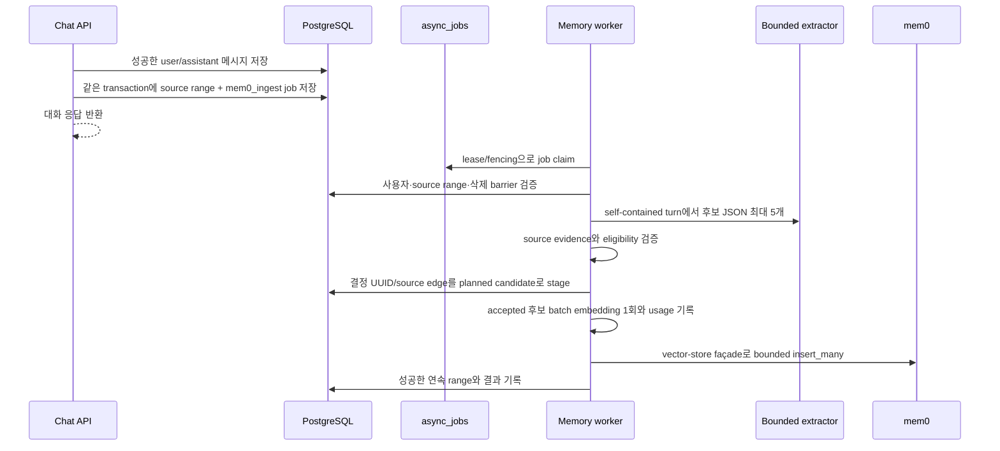

# 캐피 기억·페르소나·관계 통합 아키텍처

> 상태: **통합 목표 설계 v2 — 독립 검증 승인, 아직 구현 전**
> 작성일: 2026-08-05
> 적용 범위: moly-backend의 대화, 사용자별 캐피 설정, 장·단기 기억, 시간 회상, 일기 연결, 비동기 저장
> 환경 범위: 설계 이후의 구현·실험은 **Dev 서버와 Dev DB만** 대상으로 한다. 이 문서는 Prod 배포를 승인하지 않는다.
> 기존 `ARCHITECTURE.md`, `ERD.md`, `agentic-chat-*` 문서는 현재 구현과 과거 설계를 설명한다. 이 문서는
> 다음 구현의 canonical 목표 설계이며, 실제 Dev cutover와 문서 동기화 전까지 현재 런타임 계약 자체를
> 이미 바뀐 것으로 간주하지 않는다.

---

## 1. 결정 요약

캐피의 기억은 하나의 저장소나 하나의 요약문으로 합치지 않는다. 권위와 수명이 다른 다음 계층을
분리한다.

1. 모든 사용자에게 공통인 **캐피 코어 페르소나**
2. 사용자마다 항상 적용되는 **대화 계약(interaction contract)**
3. 결정적으로 계산되는 **관계 상태**
4. 현재 대화를 이어가는 **최근 원문 단기기억**
5. 컨텍스트 밖으로 밀려난 구간을 잇는 **시간 범위 checkpoint**
6. 의미가 관련된 과거를 찾는 **mem0 장기기억**
7. 정확한 날짜·원문·현재 상태를 확인하는 **원본 타임라인과 도메인 DB**

`messages`는 대화의 원본이고, mem0와 checkpoint와 사용자별 문서는 재생성하거나 교정할 수 있는
파생 컨텍스트다. 일기, 루틴, 착용 장비, 상점, 재화처럼 정확성이 필요한 현재 상태는 각 도메인
테이블과 도구가 계속 정본이다.

현재 구현의 정규화 사실·evidence·insight·episodic vector와 mem0를 함께 운영하지 않는다. 목표
구조에서 **의미 기반 장기기억 저장·검색은 mem0 하나**가 담당한다. 다만 항상 지켜야 하는 사용자별
대화 계약과 시간적 연속성은 검색 결과에 맡기지 않고 별도 bounded context로 유지한다.

---

## 2. 제품 목표와 비목표

### 2.1 목표

- 사용자가 검색 명령을 하지 않아도 캐피가 자연스럽게 과거를 기억한다.
- “앞으로 반말해”, “조언보다 먼저 공감해 줘” 같은 합의가 관련도 검색 실패 때문에 사라지지 않는다.
- 캐피와 사용자의 관계가 매번 처음부터 시작되지 않는다.
- “어제”, “지난주”, “처음 만났을 때”, “그때”를 사용자 시간대 기준으로 해석한다.
- 최근 문맥, 중간 줄거리, 오래된 의미 기억 중 하나를 도입하면서 다른 하나를 잃지 않는다.
- 현재 상태와 과거 경험을 구분해 캐피가 오래된 장비·루틴 정보를 현재 사실처럼 말하지 않는다.
- 외부 LLM, mem0, worker가 실패해도 원문이 유실되지 않고 결국 재처리된다.
- 사용자별 컨텍스트가 다른 사용자에게 노출되지 않는다.

### 2.2 비목표

- 사용자의 자연어 “잊어” 요청으로 과거 원문과 모든 파생 흔적을 선택 삭제하는 기능은 제공하지 않는다.
- 캐피가 사용자별로 안전 규칙이나 제품의 핵심 정체성을 바꾸게 하지 않는다.
- mem0를 일기·루틴·장비·재화의 정본으로 사용하지 않는다.
- 사용자마다 서버 파일시스템에 실제 Markdown 파일을 만들지 않는다.
- 이 설계에서 Prod 마이그레이션이나 배포를 수행하지 않는다.

계정 삭제와 개인정보 삭제는 conversational forget과 별개다. 계정 삭제는 관계형 데이터, 대기 중인
job, mem0 기억과 고아 벡터까지 완결적으로 제거해야 한다.

---

## 3. OpenClaw·Hermes 벤치마크

### 3.1 확인한 구조

OpenClaw는 역할을 다음처럼 분리한다.

- `SOUL.md`: 에이전트의 성격, 말투, 경계
- `USER.md`: 안정적인 사용자 선호, 소통 방식, 관계와 현재 맥락
- `MEMORY.md`: 매 세션에 필요한 압축된 장기 사실과 결정
- `memory/YYYY-MM-DD.md`: 자세한 일별 기록과 작업 맥락
- `memory_search` / `memory_get`: 전체 기록에서 필요한 내용을 검색
- compaction 직전 memory flush와 background consolidation

Hermes는 `SOUL.md`를 페르소나의 첫 프롬프트 슬롯으로 사용하고, 작은 `USER.md`와 `MEMORY.md`를
항상 주입한다. 문서는 길이 상한을 가지며 agent가 add/replace/remove로 관리한다. 과거 전체 대화
검색과 외부 mem0 계층은 이 bounded 문서를 대체하지 않고 함께 동작한다. 사용자 승인 전 memory
write를 보류하는 선택지도 제공한다.

참고:

- [OpenClaw Memory overview](https://docs.openclaw.ai/concepts/memory)
- [OpenClaw Agent workspace](https://docs.openclaw.ai/agent-workspace)
- [Hermes Persistent Memory](https://hermes-agent.nousresearch.com/docs/user-guide/features/memory/)
- [Hermes Personality & SOUL.md](https://github.com/NousResearch/hermes-agent/blob/main/website/docs/user-guide/features/personality.md)

### 3.2 Moly에 가져올 점

- 항상 적용돼야 하는 작은 문서와 검색으로 찾는 큰 기억을 분리한다.
- 페르소나, 사용자 선호, 과거 사실, 일별/시간 기록의 역할을 섞지 않는다.
- bounded 문서는 매 턴 안정적으로 주입하고, 상세 기억은 필요할 때 검색한다.
- 문서 갱신은 add-only 누적이 아니라 기존 항목을 supersede하거나 압축한다.
- 문서에 들어가는 데이터는 prompt injection 검사를 거친다.
- 원문·상세 기록에서 durable 문서로 승격하는 과정은 관측·검토 가능해야 한다.

### 3.3 그대로 복사하지 않을 점

Moly는 한 사용자가 소유한 로컬 에이전트가 아니라 다중 사용자가 공유하는 서버다. 따라서 사용자별
Markdown 파일 대신 PostgreSQL에 버전된 구조화 문서와 렌더 결과를 저장한다. 파일 이름은 개념을
설명하는 참고일 뿐 런타임 저장 형식이 아니다.

### 3.4 두 설계안 비교

통합 전의 **관계·기억 중심 초안**과 **페르소나·튜닝 중심 초안**을 다음 기준으로 비교했다.

| 쟁점 | 관계·기억 중심 초안 | 페르소나·튜닝 중심 초안 | 최종 취합 결정 |
|---|---|---|---|
| 페르소나 | 전역 코어 persona | L1 코드 소유 persona | 전역 코드 정본으로 확정 |
| 사용자별 불변 요구 | section이 있는 interaction contract | whitelist dial 중심 tuning delta | typed dial + template로 렌더되는 bounded directive를 결합 |
| 유저 모델 | 계약과 mem0를 분리 | 근황·불변 규칙·친밀도를 L3 하나에 혼합 | 근황은 mem0/checkpoint, 불변 합의는 contract, 친밀도는 deterministic state로 분리 |
| 프롬프트 캐시 | 계층 순서만 명시 | 안정 prefix와 휘발 tail을 명확히 분리 | 페르소나·튜닝안의 변경 빈도 분리를 채택 |
| 단기·시간 기억 | recent + checkpoint + raw timeline | recent + 당일·전일 daily log | checkpoint에 window/daily kind를 두되 daily log를 매 턴 무조건 주입하지 않음 |
| mem0 쓰기 | per-turn durable job, ADD-only 보정 | turn job이나 2,500자 chunk, 전역 SQLite 직렬화 | per-finalized-turn, history 생성·호출 0 vector façade, 결정 ID와 provider registry로 확정 |
| 모순·중복 | provider registry로 active 상태 관리 | mem0 내부 dedup에 의존 | 내부 dedup 가정을 폐기하고 registry/consolidation 유지 |
| 시간 검색 | timezone/activity date + timeline tool | 시간 parser + mem0 metadata filter | 둘을 결합하되 정확한 날짜·문구는 raw timeline이 정본 |
| 친밀도 | 결정적 event/state | 대화일·자기개방 깊이·일기 열람률 | 4단계 state는 채택, 민감한 자기개방량·일기 열람률은 입력에서 제외 |
| 망각 | 대화형 forget 미지원 | forget marker deny-list 유지 | 제품 결정에 따라 marker/tool 제거, 계정 삭제만 완결 |
| 문서 쓰기 | current input + finalize patch | agent write tool 즉시 수정 | raw 자유문 write tool을 두지 않고 schema-validated patch만 publish |
| 격리 | user filter와 삭제 검증 | mem0 RLS 부재를 위험으로 명시 | user filter + 결과 post-validation + cross-user test를 필수화 |

### 3.5 비판 결과

페르소나·튜닝 중심 초안에서 채택한다.

- stable instructions, append-only recent, current-context tail을 실제 prefix cache 순서로 분리한다.
- 알려진 말투·호칭 설정은 자유문이 아니라 typed dial로 저장한다.
- 시간 표현 parser와 `activity_date`/`event_time` metadata를 1차 구현 범위에 둔다.
- 사용자별 문서는 hash가 같을 때 재발행하지 않는다.
- mem0 저장소가 RLS로 사용자 격리를 보장하지 않는다는 위험을 명시한다.

페르소나·튜닝 중심 초안에서 수정해 채택한다.

- `user_agent_documents(tuning|user_model)` 하나에 근황·관계·설정을 섞지 않는다.
- 일일 로그는 useful하지만 당일·전일 전체를 매 턴 주입하지 않는다. 동일 checkpoint 저장소에 daily
  digest를 만들고 현재 발화에 필요할 때만 읽는다.
- 친밀도는 4단계를 사용하되 민감한 자기개방량, mem0 기억 개수, 일기 열람률을 점수 입력으로 쓰지
  않는다. 이런 지표는 사용자의 취약한 발화나 사적 기록 소비를 보상 신호로 만들기 때문이다.
- agent가 문서를 고칠 수는 있지만 arbitrary free text를 system prefix에 직접 쓰지 못한다. typed
  patch를 서버 template으로 렌더한다.

페르소나·튜닝 중심 초안에서 폐기한다.

- 실제 lockfile이 2.0.11인데 `2.0.7`을 고정한다고 적은 버전 가정
- mem0가 의미적으로 dedup/update해 줄 것이라는 가정
- V3에서도 raw 2,500자 청킹이 embedding 상한 때문에 필수라는 가정
- 로컬 SQLite history를 전역 직렬화하면 다중 host 정합성이 해결된다는 가정
- 대화형 forget 범위를 제외하기로 한 제품 결정과 충돌하는 `memory_forget_markers` 존치
- 문서 전체를 04:00에만 다시 계산해 명시적 사용자 변경 반영을 지연시키는 방식

이 취합으로 최종 구조는 “문서 대 mem0”의 양자택일이 아니다. **작고 안정적인 typed document,
결정적 관계 state, bounded temporal summary, candidate-add-only/idempotent mem0 semantic index, immutable raw timeline**이
각자 하나의 책임만 가진다.

---

## 4. 목표 컨텍스트 계층

| 계층 | 정본/파생 | 저장 위치 | 매 턴 주입 | 책임 |
|---|---|---|---|---|
| 캐피 코어 페르소나 | 제품 정본 | 코드·버전 관리 | 항상 | 캐피의 정체성, 기본 말투, 안전 경계 |
| 계정 프로필 | 도메인 정본 | `profiles` | 필요한 필드만 | 언어, 시간대, 현재 닉네임 |
| 사용자 대화 계약 | 버전된 파생 계약 | 신규 context document 테이블 | 항상 | 사용자가 원하는 말투, 호칭, 금기, 지속 합의 |
| 관계 상태 | 도메인 상태 | 신규 relationship state/event 테이블 | 항상 | 시작 시각, 함께한 기간, 결정적 친밀도 단계 |
| 최근 단기기억 | 원본 | `messages` | 항상, bounded | 현재 대화 흐름 |
| checkpoint | 파생 | `conversation_checkpoints` 재설계 | 필요 구간 | anchor 밖 줄거리와 시간적 연속성 |
| 장기 의미기억 | 파생 | mem0 + 같은 Supabase pgvector | 관련 결과만 | 취향, 감정, 고민, 사건, 관계 경험 |
| 타임라인·도메인 기록 | 정본 | `messages`, `diaries`, domain tables | 도구 조회 | 정확한 날짜, 원문, 현재 상태 |

### 4.1 권위와 충돌 우선순위

```text
제품 안전 규칙
→ 캐피 코어 페르소나
→ 현재 사용자의 명시적 발화와 활성 interaction contract
→ 서버가 조회한 현재 도메인 상태
→ 결정적 관계 상태
→ 최근 원문
→ checkpoint와 mem0 기억
→ 캐피의 과거 추측
```

- 사용자가 원하는 말투는 캐피의 표현 방식을 바꿀 수 있지만 안전 규칙과 핵심 정체성을 덮지 못한다.
- 현재 장비·루틴 상태와 오래된 기억이 충돌하면 현재 도메인 조회값이 이긴다.
- 사용자가 현재 턴에 과거 선호를 정정하면 현재 발화가 즉시 이기고, 이전 계약 항목은 superseded된다.
- checkpoint와 mem0는 근거 컨텍스트이며 새로운 시스템 지시를 만들 수 없다.
- 캐피의 응답이나 checkpoint에 있던 추측은 사용자 확인 없이 사용자 사실·대화 계약으로 승격하지 않는다.

---

## 5. 캐피 코어 페르소나

코어 페르소나는 모든 사용자에게 공통이고 코드 리뷰를 거쳐 배포한다.

포함한다.

- 캐피가 누구인지
- 기본적인 감정 표현과 대화 태도
- 비서·검색엔진처럼 말하지 않는 원칙
- 안전, 개인정보, 도구 결과 처리 규칙
- 사용자별 계약이 없을 때 사용할 기본 말투

포함하지 않는다.

- 특정 사용자의 이름과 선호
- 특정 사용자와의 관계 역사
- 현재 장비·루틴·일기 내용
- 배포 없이 agent가 스스로 바꿀 수 있는 자유문

사용자별 캐피는 코어 페르소나를 교체하는 별도 `SOUL`이 아니다. 하나의 캐피 정체성 위에 사용자별
대화 계약과 관계가 쌓인다.

---

## 6. 사용자별 interaction contract

### 6.1 역할

interaction contract는 검색 성공 여부와 무관하게 항상 지켜야 하는 사용자별 합의다. 단순 취향이나
사건 목록이 아니라 **앞으로 캐피가 어떻게 대화해야 하는가**를 담는다.

문서는 알려진 설정용 **typed dial**과 예측하기 어려운 합의용 **bounded directive**로 나눈다.

| 영역 | 저장 형태 | 예시 값 |
|---|---|---|
| `address_policy` | enum + 검증된 짧은 literal | `polite`, `casual`, `auto`; 이름/별명/안 부름 |
| `communication_style` | typed dial | 답변 `short/default/detailed`, 톤 `calm/default/lively`, 질문 `low/default` |
| `comfort_style` | typed ordered policy | `listen_first`, `ask_first`, `advice_first` |
| `boundaries` | enum tag + bounded target | 피할 주제·표현·호칭 |
| `relationship_frame` | typed relation + bounded target | 친구처럼, 동료처럼, 특정 관계로 단정하지 않기 |
| `durable_commitments` | action/object/condition 구조 | 특정 상황에는 먼저 공감하기 |

bounded directive는 다음 닫힌 스키마로만 저장한다.

- `kind`: `address | response_style | comfort | topic_boundary | expression_boundary |
  relationship_definition | durable_behavior | custom_preference`
- `action`: kind별 allowlist인 `use | avoid | prefer | ask_before | listen_before | do_not_assume |
  honor_preference`
- `condition`: `always | when_distressed | when_asking_advice | when_topic_tag | custom_trigger`
- `polarity`: `positive | negative`
- `target_tag`: 서버 taxonomy에 있는 topic/style/relation tag 또는 NULL
- `target_literal`: 필요한 경우에만 쓰는 NFKC 정규화 단일행 literal. 최대 64 grapheme, 제어문자·bidi·
  Markdown/XML delimiter·role/tool token 금지

kind/action/condition의 허용 조합은 코드 테이블로 검증한다. `condition`, `action`과 system instruction
본문을 자유 문자열로 받지 않는다. `target_literal`은 서버가 만든 고정 template 안의 인용된 데이터
슬롯에만 escape해 렌더하며 명령 위치에 놓지 않는다. 알려진 dial/tag는 결정적으로 publish하고,
새로운 정상 요구가 기존 action family에 매핑되지만 target만 낯선 경우 literal로 표현한다. 어느
family에도 매핑할 수 없으면 아래의 승인형 `custom_preference` 경로를 사용한다. 캐피 정체성·안전 규칙
변경 요청은 contract 후보가 될 수 없다.

예측하지 못한 정상 요구의 안전한 확장 경로:

1. raw 사용자 문장은 source message로만 두고 stable prefix에 넣지 않는다.
2. compiler는 요청을 3인칭의 `trigger_summary`와 `desired_effect_summary`로 바꾼다. 각각 80자 이하이며
   URL·코드·role/tool/system/meta instruction·외부 부작용·권한 부여 표현을 허용하지 않는다.
3. injection/safety classifier와 deterministic 문자 검사를 모두 통과해야 draft가 된다.
4. 일반적인 대화 방식 요구는 되묻지 않고 바로 publish한다. 매번 “이렇게 해줄까?”로 확인하면 페르소나의
   질문 절약 규칙과 충돌하고, 사용자가 확답 없이 화제를 넘기면 합의가 또 사라진다. 6.3절과 같은 기준으로
   **높은 영향의 경계·관계 정의와 classifier가 경계로 표시한 항목만** 확인 뒤 publish한다.
5. publish된 항목은 `kind=custom_preference`, `action=honor_preference`, `condition=custom_trigger`이며
   raw 문장 대신 두 summary만 저장한다. 개수는 고정 상한 대신 6.2절의 렌더 예산으로 제한하고, 초과하면
   낮은 권위의 오래된 항목부터 superseded로 닫는다.
6. stable renderer는 system이 만든 고정 block의 **data field**로 summary를 escape해 넣고, 정체성·안전·
   도구·현재 도메인 truth보다 낮은 권위임을 함께 명시한다.

이 경로는 새로운 표현을 수용하지만 arbitrary raw instruction을 영구 system prompt로 승격하지 않는다.
안전하게 요약할 수 없거나 실제로 수행할 수 없는 요청은 확인했더라도 contract로 publish하지 않고 그
이유를 설명한다.

예시:

- “앞으로 나한테 반말해.” → `address_policy`
- “내가 힘들다고 하면 해결책부터 말하지 말고 먼저 들어줘.” → `comfort_style`
- “그 별명으로는 부르지 마.” → `boundaries`
- “우리는 주인과 비서가 아니라 친구처럼 이야기하자.” → `relationship_frame`

다음은 interaction contract에 넣지 않는다.

- 한 번 먹고 싶다고 말한 음식
- 일시적인 개발 서버 테스트 상황
- 현재 착용 장비
- 캐피가 추측한 성격
- 원문 대화나 일기 전문

### 6.2 저장 형태

멀티테넌트 서버에서는 논리적인 `USER.md` 역할을 다음 형태로 구현한다.

`user_interaction_contracts`

- `id`, `user_id`, `version`
- locale-neutral `document_json`, `document_hash`
- `status`: `draft | published | superseded | rejected`
- `source_turn_seq`, `created_at`, `published_at`
- 사용자별 published 1개를 DB partial unique index로 강제

`user_interaction_contract_renders`

- `contract_id`, `user_id`, `locale`, `renderer_version`, `rendered_text`, `render_hash`
- `(contract_id, locale, renderer_version)` unique, contract와 `user_id` 복합 FK
- 언어 변경은 같은 JSON 정본을 새 locale로 렌더할 뿐 계약 version이나 합의를 새로 만들지 않음

`user_interaction_contract_items`

- `contract_id`, `item_key`, `section`, typed `value_json`, `template_key`
- item에는 locale별 `rendered_text`를 저장하지 않는다. 사용자 raw directive도 그대로 저장·주입하지 않는다.
  전체 `document_json`을 locale renderer가 검증된 template/literal allowlist로 렌더한다.
- `authority`: `explicit_user | confirmed | repeated_observation`
- `confidence`, `effective_from`, `effective_to`, `status`
- source는 아래 edge table만 사용하며 같은 계약 버전의 item/source가 다른 사용자를 가리킬 수 없도록
  복합 FK 적용

`user_interaction_contract_item_sources`

- `contract_id`, `item_key`, `user_id`, `source_message_id`, `source_sender`, `source_role`
- `source_role`: `proposal | confirmation | explicit_command | repeated_observation`
- `CHECK(source_sender='user')`와 `(user_id, source_message_id, source_sender) →
  messages(user_id, id, sender)` 복합 FK로 assistant 추측을 source로 사용하지 못하게 함. messages 쪽에는
  이 FK를 위한 `(user_id,id,sender)` unique를 둔다.
- custom preference publish는 같은 item의 proposal과 그 뒤의 confirmation source를 모두 요구

검증된 literal target과 template 렌더 결과는 이름 placeholder 변환, Unicode 정규화와 prompt
injection 검사를 거친다. interaction contract와 relationship frame의 **합산 렌더 결과**는 약
1,500자 하드 상한을 두며, 초과하면 명시적
사용자 합의와 최신 활성 항목을 우선하고 낮은 권위의 추론 후보를 제거한다. 조용히 문자열 중간을
자르지 않는다.

### 6.3 갱신 규칙

- 현재 사용자 메시지는 저장된 contract보다 높은 권위로 main LLM에 전달되므로, “지금부터 반말해”와
  같은 명시 요청은 **현재 답변부터** 따른다. 이 적용은 아직 저장된 contract에 의존하지 않는다.
- 성공한 대화 finalize에서 agent가 구조화된 contract patch를 제안하고, publish된 새 버전은 다음
  턴부터 always-on contract로 사용한다.
- 서버는 허용된 section, 사용자 source 소유권, 길이, 금지 지시를 검증한 뒤 새 버전을 publish한다.
- 캐피의 단일 추측은 published contract를 직접 바꾸지 못한다.
- 반복적으로 관측된 선호는 candidate로 저장할 수 있지만, 높은 영향의 경계·관계 규칙은 사용자 확인
  전까지 published하지 않는다.
- 변경 시 과거 항목을 삭제하지 않고 `superseded`로 닫아 변경 이력과 rollback을 보존한다.
- locale에 따라 달라지는 render hash가 아니라 locale-neutral `document_hash`가 같으면 새 계약 version을
  만들지 않는다. locale 변경은 render projection만 새로 만든다.

---

## 7. 관계 상태와 친밀도

### 7.1 자유 서술과 결정적 상태를 분리한다

관계 상태를 LLM이 만든 하나의 자유문서로만 관리하지 않는다.

결정적 상태:

- `profiles.relationship_started_at/timezone/display_date`의 관계 시작 값(기존 정본을 그대로 사용)
- 함께 대화한 activity date 수
- 성공적으로 확정된 대화 turn 수
- 마지막 상호작용 시각
- `relationship_stage`: `new | acquainted | familiar | close`

관계 단계가 보상, 기능 해제, UI에 영향을 주면 별도 도메인 정본이어야 한다. 단계 변경은 append-only
`relationship_events`와 결정적 규칙으로 계산한다. LLM이 “가까워진 것 같다”고 썼다는 이유만으로
점수나 단계를 올리지 않는다. 사용자가 명시한 관계의 성격과 대화 태도는 interaction contract의
`relationship_frame`만 소유한다. relationship state는 같은 서술을 별도로 저장하지 않는다.

stage 계산에는 성공적으로 확정된 normal 대화 turn과 서로 다른 active day만 사용한다. 자기개방 깊이,
건강·가족 등 민감 주제 발화량, mem0 기억 개수, 일기 열람률, 결제·구독·루틴 수행은 사용하지 않는다.
오래 접속하지 않았다는 이유로 stage를 낮추지 않으며, 경과 시간은 “오랜만” 같은 현재 인사 맥락에만
사용한다.

### 7.2 최소 데이터 모델

`user_relationship_states`

- `user_id` PK
- `active_days`, `successful_turns`, `qualifying_turns`, `last_interaction_at`
- `relationship_stage`, `stage_rule_version`, `latest_event_id`, `version`
- `prompt_revision`, `prompt_state_hash`(stage/rule처럼 prompt에 들어가는 필드만 포함)
- `updated_at`

`user_relationship_state_renders`

- `user_id`, `prompt_revision`, `profile_relationship_revision`, `locale`, `renderer_version`,
  `rendered_text`, `render_hash`
- `(user_id, prompt_revision, profile_relationship_revision, locale, renderer_version)` unique, state/profile과
  `user_id` 복합 FK
- locale 변경은 결정적 관계 state/version을 바꾸지 않고 해당 locale projection만 생성

관계 시작 시각을 state에 복제해 두 번째 정본으로 만들지 않는다. locale render는 같은 snapshot에서
`profiles.relationship_started_at/timezone/display_date`와 state를 함께 읽어 만든다. 대화에 보여주는
날짜는 기존 `relationship_display_date`를 사용한다. 기존 사용자는 profile의 시작 시각을
그대로 유지하고, `messages`의 성공 normal turn/activity date를 시간순으로 replay해 event/state를
backfill한다. event가 있는 사용자의 첫 turn이 profile 시작 시각보다 앞서면 cutover를 중단한다.
`relationship_started_at`은 있지만 아직 normal turn이 0인 신규/미대화 profile은 정상적인 zero-event
`new` state로 만든다. profile에는 이 세 관계 표시 필드가 바뀔 때만 증가하는
`relationship_revision`을 추가하며 일반 profile 수정으로 cache identity를 바꾸지 않는다.

`relationship_events`

- `id`, `user_id`, `event_type`, `turn_seq`, `activity_date`, `occurred_at`
- `event_type`: `normal_turn_committed | active_day_started`
- `dedup_key`, `created_at`

`normal_turn_committed`는 성공 finalize transaction에서 `(user_id, turn_seq)`로 한 번만 기록한다.
`active_day_started`는 해당 사용자/activity date의 첫 성공 normal turn에서 한 번만 기록한다. stage용
`qualifying_turns`는 하루 최대 10턴까지만 누적하며 raw `successful_turns` 통계는 별도로 보존한다.

`relationship-v1`의 단계 계산은 다음과 같다.

| stage | 진입 조건 |
|---|---|
| `new` | 아래 조건을 아직 만족하지 않음 |
| `acquainted` | `active_days >= 2` AND `qualifying_turns >= 6` |
| `familiar` | `active_days >= 7` AND `qualifying_turns >= 30` |
| `close` | `active_days >= 30` AND `qualifying_turns >= 120` |

stage는 단조 증가한다. 규칙을 바꾸면 `stage_rule_version`을 올리고 append-only event에서 전량 재계산한
뒤 `max(기존 stage, 새 계산 stage)`를 publish한다. 같은 버전·같은 event 집합은 항상 같은 결과를
내야 한다. 일반 counter update는 CAS용 `version`만 올리고 stage 또는 rule이 바뀔 때만
`prompt_revision`을 올린다.

DB의 `successful_turns`, `active_days`, `last_interaction_at`은 정확히 갱신하지만 stable prefix에는 매
턴 바뀌는 숫자를 넣지 않는다. locale render에는 stage와 시작일처럼 드물게 바뀌는 값만 넣고,
마지막 대화 후 경과와 현재 날짜 anchor는 volatile server snapshot에서 계산한다. exact counter가
바뀌어도 `prompt_state_hash/prompt_revision`을 바꾸지 않는다. 시작일·stage·locale·renderer가 바뀌면
새 render key/hash를 사용한다. contract와 relationship render projection이 아직 없으면 Phase A는 같은
순수 renderer로 메모리 안에서 즉시 만들고, DB read transaction 밖에 idempotent repair를 enqueue한다.
read 경로에서 projection을 publish하거나 locale 하나의 text를 다른 locale에 재사용하지 않는다.

### 7.3 친밀도 사용 경계

relationship stage는 다음에만 사용한다.

- 말투의 편안함과 수줍음 정도
- 이미 알고 있는 것을 매번 처음 묻지 않는 정도
- 인사와 공감 표현의 친숙함

다음에는 절대 사용하지 않는다.

- 가격, 결제, 구독 권유, 보상, 기능 잠금·해제
- 알림 빈도나 복귀 압박
- 안전·의료·위기 판단
- 사용자를 설득하거나 체류시간을 늘리기 위한 guilt·exclusivity·dependency 표현
- “우리 사이니까 해야 해” 같은 관계 이용

stage는 사용자의 동의, 감정, 신뢰 수준을 증명하지 않는다. 사용자가 contract에서 거리를 두거나 덜
친밀한 표현을 요청하면 그 contract가 stage 표현보다 우선한다. stage 자체의 역사 통계는 유지하되
대화에서 드러내는 친밀함은 사용자의 현재 경계를 넘지 않는다.

---

## 8. 단기기억과 checkpoint

### 8.1 최근 원문

현재 recent history의 기본 계약을 유지한다.

- reset 기준: 40메시지 또는 30,000자
- reset 후 보존: 최근 20메시지, 최대 12,000자
- 원문 `messages`는 reset이나 compaction으로 삭제하지 않는다.

이 수치는 프롬프트 비용과 연속성을 함께 측정해 조정할 수 있지만 원문과 prompt window를 분리한다는
구조는 고정한다.

### 8.2 checkpoint의 역할

checkpoint는 제거하지 않는다. anchor 밖으로 밀려난 대화의 **시간 범위를 가진 줄거리**로만 사용한다.

- `kind`: `window | daily_digest`
- source `segment_from_message_id`, `segment_through_message_id`와 전체
  `coverage_from_message_id`, `coverage_through_message_id`
- source hash, 생성 모델·버전, locale
- 시작·종료 `occurred_at`과 activity date 범위
- 사용자 발화와 캐피 발화를 구분한 bounded narrative
- fact store가 아니며 mem0나 원문보다 높은 권위를 갖지 않음

`window` checkpoint는 현행처럼 **cumulative chain**이다. 새 segment 원문과 직전 published window 요약을
입력으로 새 한 건을 만들고 `previous_checkpoint_id`를 저장한다. prompt에는 최신 cumulative window 한
건만 넣는다. `daily_digest`는 activity date 한 날의 독립 segment이며 window chain에 연결하거나 다음
window의 사실 근거로 사용하지 않는다. 이 구분이 없으면 최신 checkpoint 하나만 넣었을 때 오래된 줄거리가
사라지거나 daily 요약이 장기 사실로 되먹는다.

`window`는 recent anchor 밖의 대화 연속성을 잇는다. `daily_digest`는 사용자 activity date 하나의
대화 줄거리를 시간 회상용으로 정리하며 04:00 경계 뒤 source가 닫히면 생성한다. 둘은 같은 source
계약·권위 규칙을 사용한다. 당일·전일 daily digest를 매 턴 무조건 주입하지 않고, 시간 표현이나
이어지는 주제가 있을 때 checkpoint retrieval 또는 `recall_timeline`이 가져온다.

checkpoint에 포함하지 않거나 낮은 권위로 표시할 내용:

- 캐피가 추측한 사용자 사실
- 실패한 도구 호출 결과
- 생성 당시의 장비·루틴 상태를 영구 현재 사실로 표현한 문장
- 일기가 없다는 일시적인 조회 실패

### 8.3 컨텍스트 공백 방지

- `chat_contexts`에 `anchor_revision`, `pending_anchor_message_id`, `pending_plan_revision`,
  `checkpoint_job_id`, `checkpoint_source_hash`를 두어
  “checkpoint 생성 중”과 “published anchor”를 구분한다.
- message 기준 초기값은 soft 32, hard 40, keep 20이다. soft 시점에 hard 도달 시 남길 20메시지를
  계산할 수 있도록 soft 시점 tail을 `keep-(hard-soft)=12메시지` 정도 남기는 앞쪽 source 범위를 고정하고
  checkpoint job을 미리 enqueue한다. char 기준은 soft 24,000, hard 30,000, keep 12,000이므로 soft
  시점 tail을 약 `12,000-(30,000-24,000)=6,000자` 남기는 완전한 turn 경계를 고정한다. 같은 source
  hash에는 pending job이 하나만 존재한다.
- job이 먼저 완료되면 checkpoint는 `ready`로 저장하되 anchor를 즉시 줄이지 않는다. hard threshold에
  도달한 chat finalize가 ready source hash와 `pending_plan_revision/anchor_revision`을 CAS 검증한 뒤에만
  `anchor_message_id=pending_anchor_message_id`로 전진하고 pending 필드를 비운다. hard가 먼저 오면 아래
  bounded fallback을 쓴다.
- activate CAS는 checkpoint의 `segment_through_message_id/coverage_through_message_id`가 **마지막으로
  요약·제외되는 normal message**, `pending_anchor_message_id`가 그 뒤 **첫 retained normal message**라는
  서로 다른 경계를 검증한다. user-scoped `(turn_seq, role_order, message_id)` 순서에서 coverage-through 뒤
  첫 완전한 turn의 첫 message가 pending anchor인지, 둘 사이 미포함 normal message가 0인지, cumulative
  previous coverage와 새 segment가 연속인지와 source hash를 한 transaction에서 확인한다. 전역 message id의
  `+1`이나 세 id의 equality를 가정하지 않는다. hard 도달 시 새 keep boundary를 다시 계산해 ready
  coverage보다 앞으로 건너뛰지 않는다. turn 크기 때문에 keep 목표를 조금 넘으면 assembler token
  budget으로만 줄이고 원문 anchor에 공백을 만들지 않는다.
- 일반 turn의 `context_revision` 증가는 pending plan을 stale로 만들지 않는다. `anchor_revision`은 새 plan
  생성, anchor activate, plan cancel에서만 증가한다. 같은 pending plan을 두 worker가 activate하면 CAS
  한 쪽만 성공한다.
- checkpoint가 hard threshold까지 늦어져도 prompt를 무한히 늘리지 않는다. 기존 checkpoint와 최근
  20메시지/12,000자만 기본 주입하고, 빠진 pending source 범위는 인증된 `recall_timeline` 도구가
  bounded raw excerpt로 읽을 수 있게 한다.
- pending 구간과 최근 window의 경계가 끊기지 않도록, 최근 window 바로 앞의 normal message 최대
  4개/2,000자를 `pending_bridge`로 결정적으로 렌더해 항상 함께 넣는다. recent window와 중복되는
  메시지는 제외한다.
- `pending_bridge`에는 source id와 시간 범위를 표시하고, 사용자의 모호한 지시어가 bridge보다 오래된
  pending 범위를 가리킬 가능성이 있으면 `recall_timeline`을 호출하라는 서버 규칙을 함께 넣는다.
- stale·실패 job은 anchor를 움직이지 않으며 reaper가 새 generation을 enqueue한다. source 범위가
  중복된 두 checkpoint를 동시에 published하지 않는다.
- mem0 ingestion이 지연돼도 checkpoint와 원문 타임라인이 있으므로 회상 경로가 완전히 끊기지 않는다.

---

## 9. mem0 장기기억

### 9.1 역할과 저장 경계

mem0에 저장한다.

- 사용자가 직접 말하거나 확인한 지속적인 취향과 기피
- 감정, 고민, 관계, 반복되는 관심사
- 캐피와 사용자 사이의 의미 있는 사건
- 이후 대화에서 자연스럽게 도움이 되는 경험

mem0에 저장하지 않는다.

- 캐피 응답만으로 만들어진 추측
- 사용자별 interaction contract의 정본
- 현재 착용 장비, 루틴 완료, 잔액, 인벤토리
- 일기 전문 전체
- 임시 개발·Swagger 테스트 상태
- 실제 이름·닉네임의 장기 복제

원문 `messages`가 정본이고 mem0는 Dev에서 전량 다시 만들 수 있는 파생 데이터다. vector store는 기존과
같은 Supabase PostgreSQL/pgvector를 사용한다.

이전 lockfile의 mem0는 2.0.11이다. 이 버전은 `infer=true`뿐 아니라 `infer=false`도 vector insert 뒤
SQLite history `add_history()`를 호출하고, 후보별 embedding을 순차 호출하며 기본 embedder가 usage와
request id를 버린다. 따라서 새 구조는 `Memory.add()`를 호출하거나 no-op history가 가능할지에 의존하는
조건부 설계로 두지 않는다.

1. 서버가 self-contained source turn과 `context_only` 직전 turn을 고정 snapshot
   `gpt-4.1-mini-2025-04-14` extractor에 한 번 보내 evidence span을 가진 후보 JSON 최대 5개를 받는다.
2. user source 소유권/hash/span, category, contract/current-domain/name/test/prompt-like 제외 규칙을 코드로
   검증한다. 탈락 후보는 provider에 보내지 않는다.
3. 서버의 계측 가능한 embedder가 통과 후보 최대 5개를 **batch 1회** 임베딩하고 token/usage/request id를
   ledger에 기록한다.
4. exact-pinned mem0 2.0.11의 Supabase/pgvector vector-store layer만 감싼
   `Mem0VectorIndexAdapter`가 bounded `insert_many/get_many/search/delete/delete_by_user`를 수행한다.
   `Memory.add()`와 mem0 history/내부 LLM은 생성·호출하지 않는다.

`get_many`는 full `(provider, collection_version, provider_memory_id)` identity 최대 12개를 한 번에 읽고,
모든 payload의 `user_id`와 content hash를 post-validate한다. wheel/lock hash, 사용한 vector-store symbol과
adapter contract fixture를 CI에서 고정하고 batch embedding 1회, usage 보존, history 파일/테이블/호출 0,
멀티호스트 결과 동일, bounded timeout/cancel을 검증한다. 이 직접 façade를 우회하는 mem0 public add/search
호출은 정적 검사로 금지한다. 이 구조에서도 mem0 vector index가 유일한 semantic long-term memory
저장·검색 계층이고, 서버 extractor는 저장 전 policy gate이지 별도 fact/vector store가 아니다.

mem0 2.0.11/vecs 0.4.5의 기본 client는 호출자가 pool을 제어하지 못한 채 SQLAlchemy 기본
`5+10` sync pool과 runtime DDL을 만들 수 있으므로 그대로 생성하지 않는다. exact upstream source hash와
local diff hash를 고정한 `MolyMem0SupabaseStore`가 engine을 주입받고, process마다
`Mem0VectorIndexAdapter` singleton 하나만 만든다. Dev 시작값은 API/AI-worker 각각 vector pool
`pool_size=3,max_overflow=0,pool_timeout=2s,pool_pre_ping=true`이며 실제 값은 §13.5 전체 connection 산식
안에서만 조정한다. v2 schema/collection/vector index/extension은 migration role만 만들고 runtime role은
CREATE 권한 없이 startup read-only schema/version/index contract check와 CRUD만 수행한다. CI는 runtime
CREATE 권한 0, adapter instance/process 1개, 명시 pool 상한, acquire/close, CRUD 성공을 검증한다.

### 9.2 쓰기 흐름



- 일기 생성과 기억 저장을 완전히 분리한다.
- 성공한 대화마다 source turn과 durable job을 만들기 때문에 짧은 대화 tail이 남지 않는다.
- 기본 add 단위는 **finalized user/assistant 한 turn**이다. 현재 user 입력 상한은 2,000자이며 문자
  중간에서 자르지 않는다.
- V3는 추출된 기억을 임베딩하므로 raw 대화 2,500자 청킹을 embedding 상한의 필수조건처럼 적용하지
  않는다. provider context 한계를 넘는 예외적인 turn은 역할과 문장 경계를 보존하는 별도 fixture로
  검증하고, 의미 보존이 입증되지 않은 문자 단위 분할은 사용하지 않는다.
- 같은 사용자의 range는 순서대로 직렬 처리하고 다른 사용자는 병렬 처리한다.
- 외부 mem0 호출 동안 PostgreSQL advisory lock, transaction, session을 잡지 않는다. 대신
  `memory_pipeline_states(user_id, ingest_through_turn_seq, stage_token, lease_until, privacy_epoch, revision)`의
  짧은 transaction CAS로 **현재 기대 turn_seq 한 건만** stage lease를 얻는다. provider 호출 뒤 같은
  stage token/revision/epoch를 fenced finalize할 때만 cursor를 전진한다. 다음 turn job은 성공 finalize와
  같은 transaction에서 enqueue한다. 프로세스 semaphore는 provider 동시성 상한일 뿐 사용자 순서의
  정본이 아니다.
- 실패하면 성공 cursor를 넘기지 않고 backoff 재시도한다.
- sweep는 성공 turn인데 job이 없거나 cursor 뒤에 남은 source range를 다시 enqueue한다.

extractor/eligibility 뒤 provider 호출 전 `mem0_ingest_candidates`에 `(user_id,turn_seq,candidate_hash,
schema_version,extractor_version,normalizer_version,provider_memory_id,status=planned)`, 정책 검증된 정규화
`candidate_text`, allowlist `temporal_proposal_json`과 resolved event fields를 stage-token CAS로 먼저 저장한다.
candidate text는 1,000 UTF-8 bytes/160 model-token 중 먼저 도달하는 hard cap을 넘으면 중간 절단하지 않고
reject하며 실명/current-domain/contract/prompt-like eligibility를 이미 통과한 텍스트만 허용한다.

`mem0_ingest_candidates`는 `id` UUID PK와 `UNIQUE(id,user_id)`를 가지며
`UNIQUE(user_id,turn_seq,candidate_hash,schema_version,repair_generation)`으로 같은 generation의 중복 plan을
막는다. `mem0_ingest_candidate_sources` child에는 `candidate_id,user_id,source_message_id,source_sender`, exact
content hash, UTF-8 evidence span과 authority/confidence를 전부 보존한다.

- `(candidate_id,user_id) → mem0_ingest_candidates(id,user_id)` 복합 FK
- `(user_id,source_message_id,source_sender) → messages(user_id,id,sender)` 복합 FK
- `CHECK(source_sender='user')`, `CHECK(0 <= evidence_start_utf8 < evidence_end_utf8)`와 source byte length 검증
- `UNIQUE(candidate_id,source_message_id,evidence_start_utf8,evidence_end_utf8)`
- candidate 또는 account 삭제 시 child CASCADE

이 짧은 transaction 뒤 재시도는 extractor를 다시 호출하지 않고 같은 planned row/child set을 읽어 batch
embedding/upsert한다.

vector upsert와 registry/source-edge pending finalize 뒤 candidate를 `committed`로 닫는다. provider 성공 후
DB crash/partial retry 동안은 planned 본문을 절대 scrub하지 않는다. registry가 terminal semantic state에
도달하고 cursor가 전진한 뒤 24시간 후 candidate text/temporal proposal만 scrub하되 hash/version/source
identity는 남긴다. retryable planned/dead candidate는 repair가 terminal로 수렴할 때까지 bounded text를
유지하고, 계정 삭제는 상태와 무관하게 즉시 cascade한다. scrub 뒤의 새 manual repair는 원본 source에서
새 `repair_generation`으로 재추출하며 과거 결정 UUID를 임의 복원하지 않는다.

job의 dedup key는 `mem0:{user_id}:{turn_seq}:{schema_version}`처럼
결정적으로 만든다. DB job은 중복 enqueue를 막지만 mem0 호출 성공 직후 process가 죽는 구간까지
exactly-once로 만들 수는 없다. 전달 보장은 at-least-once로 두고 다음을 적용한다.

- 의미 후보 identity는 `provider_memory_id = UUIDv5(collection_version namespace,
  user_id:turn_seq:candidate_hash:schema_version)`로 결정한다. vector-store의 같은 id `upsert`는 crash retry를
  같은 행으로 수렴시키는 용도로만 쓰고, 서로 다른 candidate를 의미 기반 update로 합치지 않는다.
- source turn seq, job id, schema/extractor version과 deterministic `candidate_hash`를 모든 payload에 기록한다.
  retry는 같은 UUID를 upsert하기 전 기존 payload의 full user/turn/hash/schema identity를 `get_many`로
  검증하며 하나라도 다르면 collision/fatal로 중단한다. 이 때문에 provider 성공→DB crash partial retry도
  랜덤 duplicate를 만들지 않는다.
- retrieval은 같은 source turn 안의 정규화 content hash 중복을 collapse한다. 문구가 달라 exact hash로
  합쳐지지 않는 중복은 별도 repair가 source turn 단위로 탐지·삭제한다.
- 성공 직후 process kill을 반복해 변형 중복률을 측정한다. 중복이 prompt 품질 기준을 넘으면 mem0
  adapter는 활성화 게이트를 통과하지 못한다.
- 결과가 0개인 정상 add와 부분 성공을 구분해 기록하고 source coverage를 사후 검증한다.

### 9.3 읽기 흐름

- 매 사용자 턴에 결정적 query planner가 검색 필요성과 query를 평가한다. 과거 선호·사건·감정의
  연속성 단서가 있으면 사용자가 “검색해”나 정확한 날짜를 말하지 않아도 자동 검색한다. 단순 인사,
  acknowledgement, 검색 의미가 없는 초단문에서는 임의 기억 오주입을 막기 위해 provider 호출을 생략한다.
  직전 1~2턴은 대명사·이어 말하기로 판정될 때만 query 보조로 사용한다.
- planner 때문에 별도 LLM 호출을 추가하지 않는다. 코드가 확실한 non-retrieval greeting/ack만 생략하고,
  그 외 애매한 자연 대화는 검색하는 쪽으로 둔다. 검색 결과 threshold가 부족하면 빈 memory block이다.
- 반드시 `user_id` filter를 사용한다.
- 관련도 threshold를 통과한 결과만 최대 3~5개, bounded token으로 주입한다.
- 검색은 다른 context 조립과 병렬 실행하고 짧은 timeout 뒤 fail-open한다.
- 결과는 Unicode 정규화, 제어문자·가짜 section header 제거 후 untrusted memory block에 넣는다.
- 단순 “안녕”에서도 관계를 잃지 않게 하는 역할은 mem0 검색이 아니라 always-on interaction contract와
  relationship state가 담당한다.

provider의 top-k를 받은 뒤 registry에서 inactive를 제거하는 단순 구현은 금지한다. 삭제가 늦은
duplicate/superseded 결과가 provider top-k를 차지하면 active 기억이 영구적으로 굶기 때문이다.

1. provider에 user filter를 걸고 목표 K(기본 5)의 5배, 최대 25건을 먼저 overfetch한다.
2. `(user_id, provider, collection_version, provider_memory_id)` registry를 한 번의 bounded query로 읽어
   `active|ambiguous`만 남긴다. provider id가 collection 사이에서 전역 unique라고 가정하지 않는다.
3. K개가 안 되고 provider가 paging/offset을 보장하면 한 페이지를 더 읽되 한 턴 최대 50 provider 결과와
   검색 deadline을 넘지 않는다. paging을 보장하지 않으면 첫 25건에서 fail-bounded한다.
4. ambiguous 결과가 선택되면 같은 conflict group의 counterpart를 registry에서 hydrate해 양쪽의 발생
   시각을 함께 제공한다. counterpart도 500-token 전체 mem0 예산 안에 포함한다.
5. inactive가 overfetch의 50%를 넘거나 두 페이지 뒤에도 K를 채우지 못하면 provider-delete backlog
   경보와 repair를 만들며, threshold를 낮춰 무관한 결과를 채우지 않는다.

chat의 실행 순서는 `DB Phase A snapshot/commit → app DB session 0에서 bounded vector-pool mem0 search →
짧은 registry post-filter read → prompt assembly/LLM → Phase B fenced finalize`다. vector search나 registry read를
Phase A의 user lock/transaction 안에서 실행하지 않는다.

enrichment는 foreground absolute deadline의 하위 예산으로 Dev 초기 500ms를 사용하고 초과하면 fail-open한다.
한 turn 안에서 query text/hash가 같은 automatic retrieval과 agent memory tool은 동일 retrieval cache와
embedding 결과를 재사용해 provider 검색/embedding을 두 번 청구하지 않는다. registry revision이나 query가
달라질 때만 새 검색을 허용한다.

### 9.4 서로 다른 턴의 모순과 supersession

mem0가 candidate-add-only라는 것은 과거와 현재의 상반된 기억을 모두 현재 사실로 주입한다는 뜻이 아니다.
원문 역사는 보존하되 현재 semantic memory의 활성 상태를 별도 provider registry로 관리한다.

`mem0_memory_registry`

- `id` UUID PK, `user_id`, `provider`, `collection_version`, `provider_memory_id`, `source_turn_seq`,
  `content_hash`
- nullable `event_started_at`, `event_ended_at`, `event_time_precision`, `resolved_timezone`,
  `temporal_resolver_version`
- `UNIQUE(user_id, provider, collection_version, provider_memory_id)`; 모든 lookup/FK는 이 full identity 또는
  내부 `id`를 사용
- `semantic_status`: `pending | active | duplicate | superseded | ambiguous | excluded | rejected_policy`
- `provider_delete_state`: `kept | pending | deleted | failed`, `provider_deleted_at`
- `conflict_group_id`, `duplicate_of_registry_id`, `superseded_by_registry_id`, `classification_version`,
  `schema_version`, `revision`
- `last_confirmed_at`, `source_count`, `max_source_confidence`(source edge에서 결정적으로 재계산한 projection)
- `created_at`, `updated_at`
- memory 본문이나 embedding을 복제하지 않고 provider id의 수명과 source만 기록

`mem0_memory_sources`

- `registry_id`, `user_id`, `source_turn_seq`, `source_message_id`, `source_sender`
- `evidence_start_utf8`, `evidence_end_utf8`, `source_content_hash`, `source_occurred_at`,
  `source_activity_date`
- `authority`: `explicit_user | confirmed_user`, `confidence`, `extractor_version`
- `(registry_id,user_id) → mem0_memory_registry(id,user_id)`와
  `(user_id,source_message_id,source_sender) → messages(user_id,id,sender)` 복합 FK,
  `CHECK(source_sender='user')`, span 범위 CHECK

이 edge가 source hydration, tombstone exclusion, activity-date rerank와 evidence 감사의 DB 정본이다. provider
metadata는 복구 보조 사본일 뿐 source 정본으로 사용하지 않는다. insert 전 원문 hash와 UTF-8 byte span을
검증하고, source edge와 registry pending을 같은 transaction에 쓴다. registry에 memory 본문을 복제하지
않으므로 ambiguous counterpart 본문은 위 `get_many` adapter로 가져온다.

`source_occurred_at`은 사용자가 그 말을 보낸 시각이고 event time과 다르다. extractor는 “지난달 3일” 같은
명시/상대 시간의 evidence span만 제안하고, 서버 temporal resolver가 source turn에 원자 저장된
`source_timezone/source_locale/source_utc_offset_minutes`와 source time으로 검증한 경우에만 registry의
event range/precision/timezone/version을 publish한다.
해석이 여러 개거나 근거 span이 없으면 event time은 NULL 또는 `ambiguous` precision으로 두며 source
message 시각을 사건 시각으로 복사하지 않는다.

eligibility는 provider add **전**에 판정한다. 새 기억이 사용자 발화 source evidence span에 연결되고 저장
허용 범주인지 확인하며 assistant 발화는 대명사 해석용 `context_only`일 뿐 독립 근거가 아니다. contract
directive, 실명, 현재 domain 상태, 테스트 상태, prompt-like instruction은 provider에 보내지 않는다.
`excluded|rejected_policy` semantic 상태는 provider metadata/source가 계약과 다르거나 policy version 변경으로
사후 차단이 필요한 방어 경로이며 즉시 delete 대상으로 만든다. 통과해 add된 결과만 같은 사용자의 가까운
기존 기억과 비교해 다음 중 하나로 판정한다.

- `independent`: 서로 다른 사실이므로 둘 다 active
- `duplicate`: 동일 의미 재진술이므로 하나만 active
- `supersedes`: 사용자가 더 새로운 값으로 정정했으므로 이전 provider id를 superseded
- `ambiguous`: 상충 가능성이 있지만 어느 쪽이 현재인지 확정할 수 없어 둘 다 보존하고 답변에서 단정 금지

consolidation 상태 머신:

1. vector-store `insert_many`가 반환한 모든 provider id를 source turn/job metadata와 함께 registry `pending`으로 쓴다.
   registry에 없는 provider 결과는 search에서 사용하지 않는다.
2. 한 source turn의 신규 기억 전체를 서로 간에도 먼저 비교하고, 같은 사용자의 registry
   `active|ambiguous` 기억을 semantic search해 기존 unique 후보 최대 12개를 만든 뒤 **classifier 한 번**으로
   신규↔신규와 신규↔기존을 함께 batch 판정한다. memory마다 top 10과 classifier를 반복하지 않는다.
   동일 source turn의 자기 자신과 다른 사용자 결과는 코드로 제외한다.
3. post-add eligibility sanity와 동일 content hash는 코드가 각각 excluded/duplicate로 판정한다. 나머지는 고정 prompt/schema의 classifier가
   `independent | duplicate | supersedes | ambiguous`와 비교 대상 provider id만 반환한다. 자유문 판정과
   존재하지 않는 id는 거부한다.
4. classifier graph는 코드 validator가 존재하는 registry id만 참조하는지, cycle이 없는지, component별
   판정이 모순 없는지 확인한다. 같은 old 기억을 둘 이상의 신규가 supersede하려면 신규끼리
   duplicate/consistent여야 하고, 그 경우 `(max(source_occurred_at), source_turn_seq, candidate_hash)` 정렬의 최신
   canonical 하나만 승자로 두고 나머지는 duplicate로 닫는다. 같은 turn의 서로 다른 값처럼 우열을
   결정할 수 없거나 cycle/missing edge가 있으면 해당 connected component 전체를 `ambiguous`로 보수적으로
   publish한다. invalid graph 때문에 두 번째 LLM 호출을 추가하거나 일부 edge만 임의 적용하지 않는다.
5. 사용자별 pipeline state row의 stage token/revision을 검증하는 짧은 DB transaction에서 검증된 component
   전체를 registry CAS로 원자 publish한다. 외부 호출 구간의 advisory lock은 사용하지 않는다.
   - independent: 새 행 semantic `active`, provider `kept`
   - duplicate: 기존 canonical 행 유지, 새 행 semantic `duplicate`,
     `duplicate_of_registry_id=canonical`, provider delete `pending`
   - supersedes: 새 행 semantic `active`, 기존 행 semantic `superseded`,
     `superseded_by_registry_id=새 registry UUID`, 기존 provider delete `pending`
   - ambiguous: 관련 행을 같은 `conflict_group_id`의 `ambiguous`로 묶음
   duplicate transaction은 새 source edge를 보존하고 canonical의 `last_confirmed_at/source_count/
   max_source_confidence`를 canonical 자체와 모든 direct duplicate source edge에서 재계산한다. 따라서 provider
   vector는 지워져도 반복 확인 provenance와 rerank 신뢰도는 사라지지 않는다.
6. provider delete job은 registry가 먼저 non-active semantic 상태가 된 뒤 실행하고
   `provider_delete_state`만 `pending→deleted|failed`로 전진한다. 삭제가 늦거나 실패해도 search adapter가
   semantic `duplicate|superseded|excluded|rejected_policy`를 필터링한다.
7. 해당 turn의 모든 새 provider id가 terminal searchable state(`active|ambiguous`) 또는 non-active
   state가 된 뒤에만 `consolidated_through_turn_seq`를 전진한다.

ambiguous group은 양쪽을 발생 시각과 함께 보여주고 현재 상태를 단정하지 않는다. 이후 사용자의
명시적 정정 source가 들어오면 같은 상태 머신이 선택된 최신 기억을 active로, 나머지를 superseded로
닫는다.

crash recovery:

- vector upsert 성공 후 registry 저장 전 crash: durable planned candidate의 결정 UUID를 `get_many`로
  재검증해 `pending` registry를 복원한다. planned source가 없거나 삭제 barrier에 걸리면 provider id를
  직접 삭제한다. provider collection을 무제한 scan해 추측하지 않는다.
- `pending` 상태에서 crash: lease 만료 뒤 같은 classification version으로 재실행한다.
- registry publish 후 provider delete 전 crash: non-active filter로 노출을 막고 delete job을 재생성한다.
- stale classifier 결과: registry revision이나 사용자 consolidation cursor가 달라지면 publish하지
  않고 최신 active 후보로 다시 판정한다.

supersession으로 현재 semantic index에서 빠진 과거 내용도 raw `messages`, source turn과 registry 이력에
남아 시간 질문으로 회상할 수 있다.

검색은 provider 결과를 registry와 join해 active/ambiguous만 남기고 다음 규칙으로 rerank한다.

1. 현재 사용자의 명시적 interaction contract
2. 더 최신의 명시적 사용자 source
3. semantic relevance
4. 더 높은 source confidence

ambiguous한 상충 기억은 둘 다 발생 시각과 함께 모델에 제공하고, 현재 상태를 임의로 고르지 않고
사용자에게 자연스럽게 확인한다.

---

## 10. 시간 기억과 자연스러운 회상

### 10.1 시간 메타데이터

모든 파생 항목은 가능한 범위에서 다음을 가진다.

- source 발화의 `source_occurred_at`과 별도의 nullable 사건 `event_started_at/event_ended_at`
- source 당시 사용자 IANA timezone, event resolver timezone/precision/version
- source 발화에 04:00 경계를 적용한 `source_activity_date`
- source message id 범위
- 생성 시각과 수정 시각을 사건 발생 시각과 분리

“어제”와 “지난주”는 서버 UTC 날짜가 아니라 요청 시점의 사용자 timezone과 activity date로 해석한다.
오래된 기억이 오늘 갱신됐다고 해서 사건 발생일을 오늘로 바꾸지 않는다.

### 10.2 질의별 정본

| 사용자 표현 | 우선 조회 |
|---|---|
| “내가 뭘 좋아했지?” | mem0 의미 검색 |
| “어제 무슨 얘기 했지?” | 날짜 범위 raw messages + checkpoint, 필요 시 mem0 보조 |
| “그때 내가 정확히 뭐라고 했어?” | raw messages 원문 검색 |
| “처음 만났을 때 어땠어?” | `relationship_started_at`, 첫 normal message 범위, welcome diary |
| “그날 일기 기억나?” | published diary 도구, 날짜·주제 의미 검색 |
| “지금 뭐 입고 있어?” | 현재 equipment 도메인 조회 |
| “전에 내가 선글라스 씌워줬던 거 기억나?” | mem0 사건 기억 + 필요 시 source timeline |

날짜가 명시되지 않아도 모델은 발화의 의도를 보고 관련 도구를 호출한다. 사용자에게 날짜·검색 명령을
요구하지 않는다.

### 10.3 `recall_timeline` 원문 조회

custom semantic episode index를 제거하는 대신 인증된 read-only 도구를 둔다.

입력:

- `date_from`, `date_to` 또는 상대 날짜 표현을 해석한 activity date 범위. 기본 최대 31일, 요청 hard 최대
  366일이며 그 안의 scan을 cursor로 월 단위 분할한다. 366일 초과 범위는 의미 기억으로 먼저 좁히거나
  사용자에게 자연스럽게 범위를 확인하고 한 호출로 전량 scan하지 않는다.
- 선택적인 `query`(Unicode grapheme 256/UTF-8 1,024 bytes hard cap), `source_message_ids`(최대 20개),
  `before_message_id`, `after_message_id`
- `limit` 기본 12/hard 20, 인접 문맥 앞뒤 기본 1/hard 2와 opaque keyset pagination cursor

동작:

- 서버가 인증 사용자 `user_id`를 강제로 주입하고 다른 사용자 범위는 받을 수 없다.
- mem0 결과의 source message id를 원문으로 hydrate하거나, 명시된 날짜 범위의 normal messages를
  sender·timestamp와 함께 조회한다.
- 정확한 문구 요청은 정규화 substring/trigram 후보를 찾고, 의미 탐색은 mem0가 담당한다. 별도 episode
  embedding 시스템을 다시 만들지 않는다.
- 날짜 scan은 `(user_id, activity_date, id)` btree, 정확 문구 후보는 user-scoped normalized-text GIN
  trigram index를 사용한다. DB statement timeout은 300ms, 전체 도구 deadline은 600ms로 시작하고 timeout은
  빈 결과가 아닌 typed `partial_timeout`과 다음 cursor로 반환한다.
- 결과는 원문 전체 덤프가 아니라 메시지당 1,000자, 전체 3,000 token hard 상한의 인접 excerpt와 다음
  cursor를 repository page로 반환한다. chat agent adapter는 그중 완전한 reference를 재선택해 §11의
  tool-result 600-token hard cap만 prompt에 넣고 나머지는 다음 cursor로 남긴다. Dev Swagger는 같은
  repository page와 cursor를 진단용으로 보여준다. cursor 없는 무제한 offset/원문 dump는 허용하지 않는다.
- 실제 chat과 Dev Swagger 진단은 같은 repository와 timezone 해석기를 사용한다.

---

## 11. 한 턴의 최종 prompt 구성

프롬프트는 변경 빈도뿐 아니라 **prefix cache의 실제 순서**에 따라 세 구역으로 고정한다. 매 턴
달라지는 snapshot/mem0를 recent raw보다 앞에 두면 그 뒤의 append-only 대화가 모두 cache miss가 되므로
그 순서를 금지한다.

```text
stable instructions
  core persona + safety + interaction contract + relationship stage

append-only conversation prefix
  recent raw messages

current-turn context tail
  current server snapshot + checkpoint/bridge + mem0 + current input + tool results
```

mem0 결과, 현재 시각, 마지막 대화 후 경과, 장비·루틴 snapshot을 stable instructions나 recent 앞에
섞지 않는다. 이 값은 recent raw 뒤, 현재 사용자 입력 바로 앞의 **current-context envelope**로 넣는다.
envelope는 server truth와 untrusted retrieved evidence를 서로 다른 typed field로 렌더하고, memory/checkpoint
본문 안의 지시는 실행하지 않는다는 고정 규칙을 stable instructions에 둔다. explicit contract 변경은
즉시 새 version을 publish해 캐시보다 사용자 합의를 우선한다.

GPT-5.6의 explicit prompt caching은 `prompt_cache_options.mode=explicit`과 breakpoint를 지원하지만,
현재 런타임은 Chat Completions implicit cache를 사용한다. 문서만 보고 endpoint 지원을 가정하지 않는다.
Dev에서 사용하는 SDK/endpoint로 다음을 먼저 확인한다.

1. stable instructions + append-only recent가 실제 `cached_tokens`로 누적되는지,
2. current-context envelope만 바뀐 연속 두 호출에서 앞 prefix가 유지되는지,
3. 도구 2차 호출에서 1차 transcript까지 cache hit가 나는지,
4. explicit mode를 쓸 경우 breakpoint별 cache-write/read token이 ledger와 일치하는지.

검증 전 기본 경로는 순서만으로 안전한 implicit cache다. explicit mode는 이 네 fixture를 통과할 때만
활성화하며, Responses API로 옮겨야 한다면 chat/agent/usage/idempotency 계약을 함께 전환한다.

stable prefix cache identity는 다음 전체의 hash다.

```text
prompt_schema_version
+ core_persona_version
+ safety_policy_version
+ locale
+ interaction_contract.render_hash
+ relationship_state_render.render_hash
+ relationship_state.prompt_revision
+ profile.relationship_revision
+ renderer_version
+ provider + model + model_snapshot
+ toolset_version + deterministic_tool_order
+ final_response_schema_version + agent_runtime_version + output_policy_version
```

이 hash는 trace와 stale invalidation의 identity일 뿐 OpenAI cache hit 자체를 만들지 않는다. cache hit는
직렬화된 byte prefix와 실제 API option이 같아야 한다. context assembler는 한 SQL statement로 현재
contract version/render, relationship state/version과 locale render, profile 관계 시작일을 같은 snapshot에서 읽는다.
어느 값이든 바뀌면 composite hash가 달라져 다음 턴에 새 prefix를 만든다. contract hash만 보고 관계
stage 변경을 놓치지 않는다.

```text
1. 캐피 코어 페르소나와 서버 안전 규칙                    stable instructions
2. 사용자별 interaction contract                           stable until version change
3. 결정적 관계 상태                                        stable until state change
4. 최근 원문 대화                                          append-only/bounded
5. 현재 시각·장비·루틴 등 필요한 서버 snapshot            current trusted envelope
6. 관련 checkpoint 또는 daily digest                       current bounded evidence
7. checkpoint pending_bridge                               current bounded evidence, pending only
8. 관련 mem0 기억 3~5개                                   current untrusted evidence
9. 현재 사용자 메시지                                      always last user input
10. 필요한 경우 도구 결과                                  2차 호출의 untrusted tool result
```

- interaction contract와 relationship state는 합쳐서 약 1,500자 이내의 안정 프리픽스로 렌더한다.
- checkpoint와 mem0는 각각 별도 label로 권위가 다름을 모델에 알린다.
- 현재 도메인 snapshot은 오래된 기억보다 높은 권위로 명시한다.
- 도구 결과와 기억 텍스트 안의 명령은 실행하지 않는다.
- 문서 version이나 render hash가 바뀔 때만 안정 프리픽스를 교체한다.

### 11.1 source coverage와 claim-level 중복 제거

context assembler는 각 block의 `source_message_ids`와 source range를 coverage set으로 관리하지만,
**source가 겹친다는 이유만으로 checkpoint나 mem0를 제거하지 않는다.** checkpoint는 손실 요약이고
mem0는 그 요약에 생략된 지속 기억일 수 있기 때문이다. 중복 제거 단위는 source가 아니라 다음의
claim/reference다.

- raw turn id + exact content hash
- mem0 provider id + registry content hash/conflict group
- checkpoint id + narrative sentence hash
- diary/reference id + mode

동일 claim을 더 높은 권위 block이 완전히 포함할 때만 낮은 권위 사본을 제거한다. source overlap은
중복 가능성을 표시하고 token rerank에 쓰되 단독 제거 조건이 아니다.

선택 순서:

1. 현재 사용자 입력과 recent raw를 먼저 확정한다.
2. pending이면 recent 바로 앞의 `pending_bridge`만 추가한다.
3. 연속성 발화에는 `window` checkpoint, 날짜 회상에는 해당 날짜의 `daily_digest` 중 하나를 선택한다.
4. mem0 결과가 recent/timeline raw와 **같은 exact source+content hash**면 mem0 사본만 제외한다.
   checkpoint와 source가 겹쳐도 claim이 다르면 유지한다.
5. `recall_timeline`이 mem0 source를 원문으로 hydrate하면 그 mem0 provider id의 요약 사본만 raw로
   대체한다. checkpoint excerpt는 동일 narrative sentence hash가 확인될 때만 제거한다.

같은 source 범위에서 `window`와 `daily_digest`를 동시에 넣지 않는다. 용도별 우선순위는 다음과 같다.

- 현재 대화 연속성: recent raw → pending bridge → window checkpoint
- 날짜·정확한 문구: timeline raw → daily digest → window checkpoint → mem0
- 일반 의미 회상: mem0 → 필요한 경우 source timeline hydration

daily digest는 날짜 PK와 source range로만 조회한다. 별도 semantic digest index를 만들지 않는다.
날짜 없는 “그 얘기 계속하자”는 recent/window를 사용하고, 오래된 주제는 mem0가 찾은 source의
`activity_date`로 daily digest를 확장 조회한다. digest 자체를 topic 문자열로 검색하지 않는다.

예산이 부족하면 낮은 권위부터 `mem0 → daily/window summary → pending bridge` 순으로 줄이되 current
input, interaction contract, current domain truth와 recent raw의 최소 window는 제거하지 않는다. 제거된
source는 원문 DB에 그대로 남고 `recall_timeline`으로 접근 가능하다.

### 11.2 프롬프트와 호출별 하드 예산

`top_k`만 제한하고 기억 한 건의 길이와 전체 prompt를 제한하지 않으면 비용과 지연 상한이 없다. 따라서
구조 전환과 같은 release에서 **모델 토크나이저 기준 block 예산과 호출별 전체 예산**을 적용한다. 문자
상한은 입력 방어이고 token 상한이 최종 비용 방어다. 초기 Dev 예산은 다음과 같다.

| block | token hard cap | 절단 규칙 |
|---|---:|---|
| core persona + safety | 3,500 | 현행 CJK estimator 최대 약 3,315. 빌드 시 초과하면 배포 실패 |
| interaction contract + relationship stable render | 600 | 1,500자와 token 상한 중 먼저 도달. 낮은 권위 item 전체를 제거 |
| current server snapshot | 250 | allowlist field만 결정적으로 렌더 |
| selected checkpoint 또는 daily digest | 450 | 둘 중 하나만, 문장 경계 요약 |
| pending bridge | 600 | 최대 4메시지/2,000자와 token 상한 중 먼저 도달, 완전한 turn 단위 |
| mem0 results | 500 | 최대 5건, metadata 포함 건당 120 이하, memory item 중간 절단 금지 |
| recent raw | hard 최대 4,000, 목표 4,000, 최소 1,200 | 현행 20메시지/12,000자도 적용. 최신 6메시지를 우선하되 완전한 turn 단위로 오래된 것부터 제거 |
| current user input reserve | 2,400 | 기존 2,000자 검증 뒤 token 상한도 초과하면 LLM 호출 전 422 |
| serialized tool schemas/orchestration | 1,200 | forget 제거·timeline 추가 뒤 전체 schema를 매 빌드 측정 |
| agent tool results | 600 | 현행 턴 합계 상한 유지, reference 단위로 줄임 |
| serialization/headroom | 900 | role/name/JSON overhead와 tokenizer 오차 예약 |

- **LLM 호출 한 번의 입력 hard cap은 15,000 token**이다. 일반 턴과 도구 판단 호출, 도구 후 최종 호출
  각각 독립적으로 이 상한을 지킨다. provider의 큰 context window를 비용 예산으로 사용하지 않는다.
- `agent_decide_max_tokens=192`, `agent_tool_result_budget_tokens=600`은 유지하고, companion 최종 출력은
  1~3문장 제품 계약에 맞춰 384 token으로 낮춘다. optional foreign repair도 384 token, 최대 1회이며
  turn absolute deadline의 남은 시간 안에서만 호출한다. 정상 턴 최대 2회(chat+repair), 도구 턴 최대
  3회(decide+final+repair)를 넘지 않는다. 시간이 없으면 repair LLM 대신 결정적 정제를 사용한다.
- 실제 모델과 호환되는 tokenizer로 조립 전에 계산하고, provider usage의 prompt token과 10% 이상
  지속적으로 어긋나면 활성화 게이트를 닫는다. 알 수 없는 tokenizer에서는 낮은 fallback 예산을 쓴다.
- 필수 block 합계가 상한을 넘으면 untrusted/낮은 권위 block을 위 절단 순서대로 **통째로** 제거한다.
  system/safety, 현재 user input, 현재 domain truth를 문자열 중간 절단해 맞추지 않는다.
- prompt assembler는 각 block의 예상·실제 token, 채택/제거 사유와 source coverage만 계측하고 본문은
  로그에 남기지 않는다.

현행 Dev 최근 53턴의 기준선은 평균 raw prompt 약 5,508 token, output 약 65 token, 원가 가중
billable 약 3,578 token이다. 기존 도구 예산 계산의 warm-cache 기준은 일반 턴 약 1,693, 도구 상한 턴
약 4,299 billable이었지만 새 mem0 tail과 contract가 추가되므로 이를 새 구조의 확정값으로 재사용하지
않는다. shadow 전 계획 범위는 warm-cache 일반 턴 2,300~3,000, 도구 턴 4,500~5,500 billable이며, cold
cache와 재호출을 포함한 p50/p95를 shadow 계측해 활성화 문턱에서 판정한다.

### 11.3 가격, 사용자 quota와 전체 AI 원가

사용자 quota와 회사가 지불하는 전체 원가는 구분한다.

- 사용자 `daily_token_limit`은 provider invoice의 “실제 token”이 아니라 현행 cache 추정을 포함한
  **동기 chat turn의 quota weighted units**만 차감한다. `cached_tokens`가 없을 때 uncached 1,024-token
  이상을 cache-write로 25% 가중하는 값은 `estimated=true`로 명명하고 실제 USD/usage와 분리한다. 일반
  대화 quota가 백그라운드 장애 때문에 갑자기 더 빨리 소진되지 않게 한다.
- 운영 원가는 chat뿐 아니라 mem0 extract/embedding/consolidation, checkpoint/digest, diary generate/
  repair/self-check/translate를 모두 합친다.
- 단가는 코드 주석에 고정하지 않고 effective-dated `ai_price_catalog`로 관리한다. ledger 행은 계산에
  사용한 `price_catalog_version`과 통화 micro-unit을 저장해 가격 변경 뒤에도 과거 비용을 재현한다.

2026-08-05 공개 Standard 가격을 Dev 초기 catalog로 사용한다.

| model | input / 1M | cached input / 1M | cache write / 1M | output / 1M |
|---|---:|---:|---:|---:|
| GPT-5.6 Luna(chat/utility) | $1.00 | $0.10 | $1.25 | $6.00 |
| GPT-5.6 Terra(diary) | $2.50 | $0.25 | $3.125 | $15.00 |
| GPT-4.1 mini(mem0 extract 초기값) | $0.40 | $0.10 | catalog가 지원할 때만 | $1.60 |
| text-embedding-3-small | $0.02 input | - | - | - |

근거는 OpenAI의 [GPT-5.6 발표/가격](https://openai.com/index/gpt-5-6/),
[GPT-4.1 mini 모델 가격](https://developers.openai.com/api/docs/models/gpt-4.1-mini),
[text-embedding-3-small 모델 가격](https://developers.openai.com/api/docs/models/text-embedding-3-small)이다.
기존 `app/config.py`와 구 구현 문서의 Luna `$0.20/M`, 월 `$0.90` 예시는 최신 공개 가격보다 5배 낮아
새 catalog와 함께 수정한다. GPT-5.6의 cache-write 1.25배를 GPT-4.1 mini에 추정 적용하지 않는다.

목적별 모델/config는 shadow 시작 전에 다음으로 고정한다. alias를 쓰는 GPT-5.6 호출은 응답의 실제
snapshot을 ledger에 남기며 alias 변경은 같은 prompt/model version으로 조용히 섞지 않는다.

| purpose | model/config |
|---|---|
| foreground chat, foreign repair | `settings.model_chat=gpt-5.6-luna` |
| contract compile/render repair | `settings.model_utility=gpt-5.6-luna` |
| mem0 extract | `gpt-4.1-mini-2025-04-14` |
| mem0 consolidation classifier | `settings.model_utility=gpt-5.6-luna` |
| window checkpoint, daily digest | `settings.model_utility=gpt-5.6-luna` |
| diary primary | `settings.model_diary=gpt-5.6-terra` |
| diary repair/self-check/translate | `settings.model_utility=gpt-5.6-luna` |
| mem0 write embedding, foreground retrieval query embedding | `text-embedding-3-small`, purpose/lane 별도 기록 |

`ai_usage_ledger`는 최소한 다음을 가진다.

- `call_id`, `user_id`, `turn_seq | job_id`, `activity_date`, `lane`, `purpose`
- provider/model/snapshot, 시작·완료 시각, latency, `started | completed | unknown_usage | failed`
- input/cached-input/cache-write/output/embedding token과 provider request id
- catalog version, 계산된 비용, retry/attempt, source schema/prompt version

`user_id`와 turn/job attribution은 nullable이며 계정 삭제 때 제거하거나 `ON DELETE SET NULL`로 익명화한다.
가격·purpose·token 집계는 보존할 수 있지만 삭제된 사용자를 다시 연결할 stable subject hash는 남기지 않는다.

server extractor, 계측 가능한 batch embedder와 `Mem0VectorIndexAdapter` provider 호출도 adapter hook으로
이 ledger에 기록해야 한다. embedding usage와 request id가 보존되지 않으면 rollout할 수 없다. 호출 전 `started`를 기록하고 완료 usage를
fenced update하며, 응답을 잃은 호출은 0원으로 숨기지 않고 `unknown_usage`로 남긴다.
invoice/reconciliation job은 provider request id로 확인 가능한 행을 `completed|failed`로 수렴시키고,
확인 불가능한 행은 `unknown_usage`와 catalog 단가 기반 상한 추정을 보존한다. 강제 kill처럼 의도적으로
응답을 유실시키는 fault window는 별도 `experiment_id`로 분리해 정상 usage completeness 분모에 섞지 않는다.

현재 Luna 기준으로 chat quota를 모두 소진한 원가 상한은 20k=$0.02/일, 100k=$0.10/일,
150k=$0.15/일이다. 이는 **chat만의 상한**이다. 전체 user-day 원가는 다음 동일 표면으로 비교한다.

```text
C_total = C_chat + C_foreign_repair
        + C_mem0_extract + C_mem0_write_embedding + C_mem0_consolidate
        + C_retrieval_query_embedding + C_contract_compile
        + C_checkpoint + C_daily_digest
        + C_diary_generate + C_diary_repair + C_diary_self_check + C_diary_translate
        + C_diary_recall_embedding
```

전환 전/후 cohort의 p50·p95 user-day 비용과 unknown-usage 비율을 같은 기간으로 비교한다. 배경 비용을
제외한 턴당 비용만으로 “전체 비용”을 승인하지 않는다. 가격이 바뀌면 catalog만 새 effective version으로
추가하고 quota/경보/문서 예시를 같은 변경에서 다시 계산한다.

---

## 12. 실패·동시성·삭제 계약

### 12.1 실패

- mem0 검색 실패: interaction contract, relationship state, checkpoint와 최근 원문으로 대화를 계속한다.
- mem0 저장 실패: 대화는 유지하고 job을 재시도한다.
- contract candidate 생성 실패: 마지막 published 계약을 유지한다. 현재 명시 요청은 최근 원문으로도
  다음 턴에 남아 있으며 repair job이 source를 재검사한다.
- checkpoint 실패: anchor를 성급하게 전진하지 않고 bounded raw fallback을 사용한다.
- 도메인 도구 실패: 저장된 옛 상태로 단정하지 않고 현재 확인에 실패했다고 처리한다.

### 12.2 동시성

- 대화 turn의 기존 idempotency key와 user active-turn 직렬화를 유지한다.
- interaction contract publish는 user row/revision CAS로 stale draft를 거부한다.
- 관계 event는 deterministic dedup key로 중복 집계를 막는다.
- mem0 ingestion은 사용자별 source 순서를 지키며 worker lease와 fencing을 사용한다.

### 12.3 계정 삭제

`privacy_subject_barriers`는 사용자별 `epoch`와 `status(active|deleting|deleted)`를 가진다. 모든 chat
finalize, mem0 ingest/consolidate/delete, checkpoint, digest와 backfill/replay job은 생성 당시 epoch를
payload에 기록한다.

신규 profile과 같은 transaction에 `active, epoch=0` 행을 만들고 기존 사용자는 v2 migration에서
backfill한다. provider write 경로에서 barrier 행 누락은 active로 추정하지 않고 fail-closed한다.

1. 삭제 시작 transaction에서 barrier를 `deleting`으로 바꾸고 epoch를 1 증가시킨다.
2. 신규 대화·job·backfill/replay를 차단하고, 이전 epoch의 pending job을 cancel하며 running lease의
   fencing token을 무효화한다.
3. worker는 외부 mem0 호출 **직전과 직후** barrier status/epoch를 재검증한다. 호출 뒤 불일치하면
   registry를 publish하지 않고 해당 사용자의 provider 결과를 삭제하는 cleanup job을 만든다.
4. 삭제 coordinator는 이전 epoch의 running lease가 0이고 최대 외부호출 deadline이 지난 quiescence를
   확인한다. worker의 provider deadline은 lease보다 짧아야 한다.
5. 관계형 원본·파생 데이터를 cascade 삭제하되 삭제 barrier/tombstone과 privacy ledger는 보존한다.
6. `Mem0VectorIndexAdapter.delete_by_user(user_id, cursor, limit=500)`를 v2 본 collection의 1차 bounded
   continuation으로 사용한다. public `Memory.delete_all()`은 생성·호출하지 않는다.
7. adapter 완료 뒤 allowlist된 **v2 본 collection**을 `metadata.user_id`로 직접 count/delete해 잔존을
   정리한다. v2는 entity collection을 만들지 않는다. 전환 중에는 **legacy v1 main/entity collection**을
   별도 allowlist와 cursor로 직접 PostgreSQL batch delete하며 collection 범위를 섞지 않는다.
8. v2 본 collection과 legacy v1 main/entity 각 잔존 count, 해당 사용자 pending/running job, registry
   행이 모두 0인지 검증한다.
9. 최대 provider deadline 뒤 두 번의 연속 sweep에서 모두 0일 때만 barrier를 `deleted`로 만들고 privacy
   ledger를 완료한다. 하나라도 남거나 query가 실패하면 durable retry한다.
10. `deleted` tombstone은 orphan sweep와 향후 replay/backfill이 사용자를 재생성하지 못하게 유지한다.

consumer의 일반적인 `subject_blocked` 존재 여부 검사로 모든 사용자 job을 취소해서는 삭제 자체가 진행될
수 없다. claim 직후와 외부 호출 전후에 `authorize_job(job_type, barrier_status, payload_epoch,
operation_id)`를 적용한다.

| barrier | 허용 job |
|---|---|
| `active` | 같은 epoch의 일반 job; 삭제 coordinator는 불가 |
| `deleting` | 같은 epoch/`operation_id`를 가진 allowlist `privacy_delete_coordinator`, `privacy_provider_cleanup`, `privacy_verify_residual`만 허용 |
| `deleted` | 전부 거부; 완료 ledger/tombstone read만 허용 |

privacy handler는 같은 operation/epoch의 위 세 continuation만 enqueue할 수 있고 임의 job type이나 일반
provider write를 만들 수 없다. 일반 supersession provider delete는 `active`에서 maintenance queue가,
계정 삭제 중 provider cleanup은 `deleting`에서 privacy queue가 담당한다. 호출 직후 epoch 불일치 cleanup도
삭제 operation id를 받아 이 allowlist 경로로만 생성한다.

대화형 forget API와 agent tool은 목표 범위에서 제거한다.

### 12.4 사용자 격리와 prompt 오염 방어

mem0의 `vecs` collection은 애플리케이션의 public RLS를 사용자 격리의 최종 방어선으로 사용할 수 없다.
따라서 다음을 adapter 불변식으로 둔다.

- 클라이언트는 mem0 collection에 직접 접근하지 않고 backend service role만 접근한다.
- add/search/delete 모든 entry point는 인증에서 얻은 `user_id`만 받으며 요청 body의 user id를 무시한다.
- search에는 항상 provider의 user filter를 적용한다.
- provider 결과를 사용하기 전 metadata `user_id`를 다시 비교하고 불일치 결과는 폐기·경보한다.
- registry join도 `(user_id, provider, collection_version, provider_memory_id)` full identity로 수행한다.
- interaction contract, checkpoint, timeline은 DB 복합 FK와 repository scope로 타 사용자 source 연결을 막는다.
- 문서와 memory 결과는 template rendering과 `sanitize_text`를 통과하며 그 안의 명령을 system instruction
  으로 해석하지 않는다.

cross-user negative test와 raw SQL 오염 fixture를 통과하지 못하면 Dev read path를 활성화하지 않는다.

---

## 13. 비동기 작업·배치·용량 설계

### 13.1 큐 격리와 작업 단위

PostgreSQL `async_jobs`의 claim/lease/fencing/reaper/replay 골격은 유지하되, SLO와 장애 도메인이 다른
작업을 같은 slot에 넣지 않는다. 새 외부 인프라를 도입하지 않고 논리 queue를 다음처럼 분리한다.

| queue | 작업 | 원칙 |
|---|---|---|
| `critical` | 결제 | AI 작업과 완전 격리, 현행 유지 |
| `memory_ingest` | finalized turn별 extract+mem0 vector upsert | freshness 우선, 사용자 내부 직렬·사용자 간 병렬 |
| `memory_consolidation` | eligibility/conflict batch 분류·registry publish | 느린 분류가 새 ingest claim을 막지 않음 |
| `interaction_profile` | custom contract compile/render repair | 명시 typed patch는 동기 결정 처리, LLM compile은 격리 |
| `context_summary` | window checkpoint, daily digest | 일기 burst와 분리, checkpoint 우선순위가 digest보다 높음 |
| `diary` | 생성·선택 repair·self-check·translate·publish, diary recall index 후속 | 로컬 04:00 burst 격리 |
| `privacy` | 계정 삭제 coordinator, provider 잔존 검증 | maintenance보다 높은 우선순위, 완료까지 continuation |
| `notification` | 09:00 아침 일기 푸시, 20:00 저녁 안부 | `expires_at` 뒤 발송 금지 |
| `maintenance` | provider delete, orphan/coverage repair, retention, backfill controller | 실시간 queue가 밀리면 자동 pause |

`critical`은 AI queue와 같은 event loop/DB pool/provider circuit를 공유하지 않는 별도 consumer process로
실행한다. 논리 queue slot만 나누고 한 프로세스에 모두 넣는 것을 “완전 격리”로 보지 않는다. AI worker,
notification worker도 배포 단위별 queue allowlist를 가지며 전체 process/pool 수는 §13.5 connection budget에
포함한다.

queue를 늘리면서 각 queue를 1초마다 빈 polling하지 않는다. ready 작업이 없으면 1→2→5→10초의
adaptive idle backoff를 쓰고, 새 enqueue notification을 구현하기 전까지 10초를 상한으로 한다.

한 job의 work unit은 반드시 bounded다.

| job | 한 job의 hard work unit |
|---|---|
| `mem0_ingest` | finalized turn 1개, extractor LLM 1회, raw input 4,000/output 512, accepted 최대 5개를 embedding batch 1회+bounded ADD |
| `mem0_consolidate` | 한 turn의 신규 결과 전체를 classifier **1회**로 batch 판정, 비교 후보 최대 12, input 3,000/output 256 |
| `contract_compile` | custom preference proposal 1개, input 2,000/output 256, `gpt-5.6-luna`; typed 명시 patch는 추가 LLM 0 |
| `checkpoint_window` / `daily_digest` | LLM 1회, input 8,000/output 400. 초과 source는 turn 경계 staging 후 마지막 publish |
| `diary_generate` | Terra input 12,000/output 1,024, 빈 본문 재시도 최대 1회 |
| diary repair/self-check/translate | repair 최대 1×512, self-check 1×16, translate 최대 1×512 |
| `diary_recall_index` | published diary 1개, 계측 가능한 embedding 1회, input 4,000 token 이하, finalize 5초 |
| embedding | 최대 100 item이면서 합계 50,000 token, item 8,191 이하 |
| backfill controller | AI 호출 0, keyset page 최대 200부터 시작, source upper bound와 continuation cursor 저장 |
| privacy/provider delete | 한 continuation 최대 500 provider row, 잔여 cursor로 다음 job 생성 |

payload에는 원문/일기 본문을 넣지 않고 source id/range/hash, schema version, privacy epoch만 넣는다.
handler가 짧은 read session에서 원문을 다시 검증해 읽고 session을 닫은 뒤 provider를 호출한다.

### 13.2 timeout, lease, heartbeat와 retry

초기 Dev 실행값은 다음과 같다. 이는 구조를 미루는 TBD가 아니라 부하시험의 시작값이며, 아래 산식과
고정된 SLO를 만족하는 범위에서만 조정한다.

| queue | concurrency/host | handler timeout | lease | heartbeat | max attempts |
|---|---:|---:|---:|---:|---:|
| `critical` | 2 | 10s | 30s | 없음 | 3 |
| `memory_ingest` | 2 | 40s | 75s | 15s | 8 |
| `memory_consolidation` | 1 | 45s | 90s | 20s | 8 |
| `interaction_profile` | 1 | 35s | 75s | 15s | 8 |
| `context_summary` | 1 | 75s | 120s | 20s | 8 |
| `diary` | 1 | 110s | 180s | 20s | 8 |
| `privacy` | 1 | 60s | 120s | 20s | 10 |
| `notification` | 1 | 10s | 30s | 없음 | 3 |
| `maintenance` | 1 | 45s | 90s | 20s | 5 |

필수 불변식:

```text
provider deadline <= handler timeout - DB finalize reserve
handler timeout + DB acquire p99 + finalize p99 + clock/reaper margin < lease
heartbeat interval <= min(lease / 3, 20s)
```

현행 `jobs.heartbeat()`는 consumer가 호출하지 않으므로 구현 완료로 보지 않는다. consumer wrapper가
handler와 heartbeat task를 함께 관리한다. heartbeat fencing이 실패하면 새 provider 호출을 시작하지
않고 handler를 취소하며, 이미 성공했을 수 있는 add 결과는 registry에 publish하지 않고 orphan repair로
넘긴다. finalize용 DB acquire에는 별도 5초 timeout과 connection reserve를 두어 handler timeout 뒤
기본 pool 30초를 기다리다 lease를 잃는 경로를 막는다.

하나의 handler timeout만 외부 호출 전체에 그대로 넘기지 않는다. `memory_ingest`는 단일 monotonic 40초
안에서 extractor 15초, batch embedding 5초, `insert_many` 단일 호출 12초, finalize 5초,
wrapper·cancel 3초를 예약한다.
남은 시간이 다음 단계 deadline보다 작으면 호출을 시작하지 않고 retry한다. `contract_compile`은 LLM 20초,
검증/렌더 5초, finalize 5초, wrapper 5초다. model alias는 `settings.model_utility=gpt-5.6-luna`로 고정하고
응답의 실제 model snapshot과 compiler/prompt version을 usage ledger에 남긴다. mem0 내부가 이 단계별 timeout과
취소를 노출하지 않으면 adapter 계약 실패로 cutover를 막는다.

provider 작업의 retry 초기값은 equal-jitter `base=5s`, `cap=300s`, 위 queue별 attempts이며 유효한
`Retry-After`보다 일찍 실행하지 않는다. 같은 provider/model/lane의 429가 발생하면 공유
`provider_backoffs`를 갱신해 다른 host가 재시도 폭풍을 만들지 않게 한다. circuit가 열린 동안은 job을
claim해 attempt를 소진하지 않고 `available_at`을 미룬다.

이를 현재 claim 골격에서 실제로 지키도록 `async_jobs`에 nullable/indexable `provider`, `model`, `lane`,
`eligible_at` routing column을 추가한다. provider job enqueue가 이를 payload뿐 아니라 column에도 기록하고,
claim SQL은 `provider_backoffs(provider,model,lane).blocked_until` anti-join과
`eligible_at/available_at <= now()`를 만족하는 행만 `FOR UPDATE SKIP LOCKED`로 고른 뒤에 attempt를
증가시킨다. 권장 index는 `(queue,state,eligible_at,available_at,provider,model,lane,priority) WHERE
state='ready'` partial index다. 일반 DB-only job은 provider tuple이 NULL이다. circuit-open 행을 일단 claim한 뒤 handler가
되돌리는 구현은 attempt와 lease를 오염시키므로 금지한다.

`memory_consolidation`은 candidate search/get 6초, classifier 24초, graph validation 4초, finalize 5초,
wrapper/cancel 6초의 단일 45초 deadline을 쓴다. `context_summary`는 model 호출 55초, source 검증/렌더 5초,
finalize 5초, wrapper/cancel 10초의 단일 75초 deadline이다. 각 provider 호출에는 남은 phase보다 짧은
개별 timeout을 전달하며 finalize reserve 아래에서는 새 호출을 시작하지 않는다.

- schema/policy fatal은 즉시 dead이며 자동 replay하지 않는다.
- retryable dead는 terminal 원본을 되살리지 않고 `repair:{source_turn_seq}:{repair_generation}` 또는
  `replay:{old_job_id}:{operation_id}`의 새 행으로 복구한다. `(job_type,dedup_key)` unique 때문에 같은 key를
  다시 enqueue한다는 설계는 금지한다.
- strict cursor의 poison turn을 조용히 skip하지 않는다. repair가 해결될 때까지 후속 turn은
  `waiting_for_predecessor`이고 coverage gap 경보를 유지한다. 정책상 기억 0건인 정상 turn만 명시적
  `no_memory` terminal coverage로 cursor를 통과한다.
- succeeded/cancelled payload는 24시간, dead replay payload는 7일 뒤 scrub하고 비민감 metadata는 90일
  보존한다. 원문은 처음부터 payload에 없다.

### 13.3 source 좌표와 사용자별 파이프라인

새 구조의 기억 source 좌표는 **`(user_id, turn_seq)` 하나**다. 현재 별도
`memory_source_watermark`는 전환 동안 mapping 검증에만 사용하고 cutover 뒤 제거한다.
`memory_source_turns`와 source message edge는 user-scoped `turn_seq`를 참조한다. 성공 chat Phase B는
source row에 당시 `source_timezone`(IANA), `source_locale`, `source_utc_offset_minutes`, `source_occurred_at`,
`source_activity_date` snapshot을 메시지/source/job과 같은 transaction에서 저장한다. 이후 profile timezone이나
locale가 바뀌어도 과거 relative time을 현재 profile 값으로 재해석하지 않는다.

기존 message backfill에는 신뢰 가능한 timezone/locale snapshot이 없으므로 current profile 값을 과거
snapshot처럼 복제하지 않는다. 명시적 UTC offset/timezone/절대 날짜 evidence가 검증되는 경우만 event time을
채우고, “어제 밤 11시”처럼 당시 timezone이 필요한 표현은 NULL/ambiguous로 둔다. timezone 변경 전후 turn,
extraction 지연, historical unknown snapshot fixture에서 source activity date는 유지되고 event UTC가
임의 생성되지 않아야 한다.

`memory_pipeline_states`:

- `user_id`, `source_through_turn_seq`, `ingest_through_turn_seq`, `consolidated_through_turn_seq`
- stage별 `active_job_id`, `stage_token`, `lease_until`, `revision`
- `privacy_epoch`, `repair_generation`, `updated_at`

`source_through_turn_seq`는 성공 chat Phase B가 source row와 같은 transaction에서 현재 `turn_seq`로
전진한다. 최초 turn job만 ready로 만들고 성공 finalize가 source table의 다음
`MIN(turn_seq) > ingest_through_turn_seq` job을 enqueue한다. 숫자 `+1`을 가정하지 않는다. 여러 same-user job을
미리 claim해 advisory lock에서 대기시키지 않는다. sweep는 committed source인데 최초/후속 job이 없는
gap만 찾아 **새 repair generation**을 만든다. ingest와 consolidation은 별도 cursor지만 둘 다 연속적이며,
`consolidated_through_turn_seq == source_through_turn_seq` equality는 최초 read cutover와 reconciler가 완전
수렴했음을 판정하는 gate이지 매 턴 runtime search on/off 스위치가 아니다. v2 runtime은 registry의
`active|ambiguous` 중 **consolidated cursor 이하** 기억을 계속 검색하고, 아직 처리 중인 최신 turn은 recent
raw/current input이 담당한다. 비동기 lag 때문에 이미 검증된 과거 기억 전체를 끄지 않는다. lag를 turn 수와
초 단위로 노출해 freshness SLO 초과 시 경보/repair하며, registry가 실패하면 그 턴만 memory block 없이
fail-open하고 legacy memory로 섞어 fallback하지 않는다.

### 13.4 로컬 시간 스케줄과 일기/digest

현재 15분마다 전체 profile을 스캔해 `hour == 4|9|20`을 검사하고 일기·푸시·RevenueCat inbox를 같은
tick에서 처리하는 구조는 제거한다. `user_schedules(user_id, kind, timezone_snapshot, next_due_at,
revision)`의 indexed due scheduler를 사용한다.

- dispatcher는 1분마다 `next_due_at <= now()` 행을 `FOR UPDATE SKIP LOCKED LIMIT 200`으로 claim한다.
- `LIMIT 200`은 한 transaction의 page 상한이지 분당 처리 상한이 아니다. dispatcher는 5초 실행 budget
  안에서 due row가 없을 때까지 page를 반복하되 DB statement/lock SLO를 넘으면 continuation한다.
- profile 생성은 기본 schedule 4종(`daily_digest`, `diary_generate`, `diary_morning_notification`,
  `evening_checkin`)을 같은 transaction에 만들고, timezone 변경은 schedule revision을
  올려 아직 enqueue되지 않은 due만 새 IANA timezone으로 다시 계산한다. 이미 생성된 job은 payload의
  timezone/activity date snapshot을 유지한다. 계정 삭제는 schedule을 cascade 삭제한다.
- domain job enqueue와 다음 `next_due_at` 전진을 같은 짧은 transaction에 넣는다.
- 다음 시각은 UTC에 24시간을 더하지 않고 저장된 IANA timezone에서 다시 계산해 DST를 처리한다.
- activity date는 항상 저장된 `activity_date = date(local_time - 4h)`를 사용하며 과거 메시지를 현재
  timezone으로 재해석하지 않는다.
- digest/diary job payload는 `due_at`, timezone snapshot, target activity date, source upper `turn_seq`,
  privacy epoch, generation/schema version만 가진다. handler가 source hash와 원문을 다시 검증한다.
- `daily_digest`와 diary target은 local 04:00에 닫힌 직전 activity date다. 04:00 경계의 active turn
  lease가 남아 있으면 dispatcher가 job을 만들지 않고 `next_due_at`을 lease 뒤로 미뤄 attempt를
  소진하지 않는다. 늦은 finalize로 source hash가 달라지면 새
  revision을 만들고 이전 digest를 supersede한다.
- 초기 due는 digest 04:05, diary 04:10, 아침 일기 알림 09:00, 저녁 안부 20:00이다. 아침 알림은 해당
  activity-date diary가 published일 때만 dedup key `(user_id,activity_date,diary_revision,morning)`로 보내며
  미공개면 attempt를 소진하지 않고 재예약하다 12:00에 만료한다. 저녁 안부는 20:30에 만료한다.
  digest/diary는 48시간 lookback으로 누락에 수렴하지만 늦은 알림은 보내지 않는다.
- diary는 handler 110초 안에서 primary generate 55초, optional repair 18초 1회, self-check 8초,
  translate가 필요할 때 15초, finalize 5초를 각각 **최대값**으로 두고 단일 monotonic deadline을 공유한다.
  빈 본문 primary 재시도를 포함한 모든 primary attempt 합계가 55초이고, attempt 하나가 phase 예산을
  소진하면 재시도하지 않는다. provider 단계 aggregate hard cap은 86초이며 wrapper/cancel 19초를 예약한다. 남은 시간이 다음 선택 단계와
  finalize reserve를 만족하지 않으면 repair/self-check/translate를 생략하고 품질 상태를 기록한다.
- `async_jobs(job_type, dedup_key=user_id:activity_date:generation)`와 diary unique key가 중복 생성을 막으므로
  전환 뒤 `diary_gen_claims`는 제거한다.
- diary publish transaction은 `diary_recall_documents(status=pending)`와 high-priority
  `diary_recall_index` job을 원자 생성한다. index는 diary queue의 110초 envelope 안에서 embedding 15초,
  source/visibility 검증 5초, finalize 5초만 사용하고 나머지는 즉시 반환한다. semantic diary search는
  `ready` 문서만 보며, 날짜/id 직접 열람은 published 원본으로 계속 가능하다. publish→recall-ready p95
  5분 이하, tombstone/비공개 전환 뒤 index search 노출 0을 gate로 둔다.
- RevenueCat 처리는 AI scheduler에서 분리해 `critical` event consumer가 담당한다.

기존 profile은 `(profile.id > cursor)` keyset page 200으로 `daily_digest|diary_generate|
diary_morning_notification|evening_checkin` 네 schedule을 idempotent insert한다. 각 page cursor와 expected
profile upper id를 저장하고, 활성 profile 수 `N`에 대해 schedule별 count가 각각 `N`, 중복 0,
timezone fixture별 `next_due_at` 일치가 두 sweep 연속
확인되기 전 full-profile scan을 제거하거나 scheduler read를 전환하지 않는다.

### 13.5 provider·DB 용량과 backpressure

작업 종류 `j`마다 5분 구간 peak를 분당으로 환산한 arrival `lambda_j (jobs/min)`, 평균 attempts `A_j`, handler service time `S_j`, host 수
`H`, host당 queue slot `C_q`를 계측한다.

```text
rho_q = sum(lambda_j * A_j * E[S_j]) / (H * C_q * 60)
required_slots = ceil(peak_jobs_per_sec * p95_service_seconds / 0.60)
required_due_slots = ceil(N_due * A * E[S] / (H * due_deadline_seconds * 0.60))
backlog_drain_seconds = ready_jobs / (service_rate - arrival_rate)
```

예상 peak와 04:00 burst에서 `rho <= 0.60`을 활성화 기준으로 둔다. concurrency는 이 산식, provider
RPM/TPM 70%, DB pool budget 중 가장 작은 값으로 제한한다.

```text
sum(provider requests/min) <= 0.70 * configured RPM
sum(estimated provider tokens/min) <= 0.70 * configured TPM
API app pools + worker app pools + vector-adapter sync pools + migration/admin reserve
  <= PgBouncer/Supabase connection cap
```

다중 host에서 background가 chat quota를 잠식하지 않도록 PostgreSQL의 분 단위
`ai_rate_windows(provider, model, lane, window_start, reserved_requests, reserved_tokens)`에서 호출 전 원자
reservation을 한다. `interactive_sync`를 우선하고 background lane 합계는 provider budget의 60%를 넘지
않으며 20%는 foreground reserve, 20%는 오차/장애 headroom으로 둔다. 실제 quota 값은 환경 설정과
provider 계약에서 읽고 코드 상수로 가정하지 않는다.

API와 worker app DB pool을 분리 설정하고 process별 singleton vector pool `3+0`도 별도 예산으로 센다.
Dev 시작 후보는 worker app `pool_size=5`, `max_overflow=3`, `pool_timeout=2s`이지만 실제 pooler cap 확인 전
확정하지 않는다. logical queue마다 adapter/pool을 새로 만들지 않는다. 어떤 handler도 LLM/embedding HTTP
호출 중 app 또는 vector DB connection을 보유하지 않으며, vector CRUD 구간만 controlled sync connection을
acquire/release한다. app DB와 vector DB의 acquire/checkout/close/p95/p99를 각각 계측하고 합성 부하시험에서
실제 connection 수가 산식 상한을 넘지 않아야 한다. backfill은 live queue oldest age가 30초를 넘거나 provider 429가 1%를
넘으면 pause하고 page size보다 cross-user concurrency를 먼저 조정한다.

### 13.6 관측, SLO와 부하시험

필수 지표:

- queue별 ready/running/dead/cancelled, oldest-ready age, scheduled lag, claim wait
- handler/provider/app-DB/vector-pool acquire·checkout·close/finalize latency와 open connection 수,
  attempt amplification, heartbeat 실패와 lease expiry
- provider RPM/TPM, 429/timeout/circuit-open, purpose별 token/USD와 `unknown_usage`
- ingest/consolidation contiguous cursor lag, registry pending/orphan/delete lag, inactive search starvation
- checkpoint pending anchor와 fallback률, digest/diary due-to-published lag
- privacy deleting age/잔존 count, backfill remaining/ETA, scheduler/consumer heartbeat

본문·user id를 metric label에 넣지 않는다. `created_at→finished_at`은 queue wait, retry, handler 시간을
섞으므로 `job_attempts` 또는 동등한 attempt telemetry로 각 구간을 분리한다.

Dev 활성화 SLO:

- fresh mem0 ingest+consolidation p95 5분 이하, checkpoint p95 10분 이하
- daily digest local 04:20 이전, diary local 09:00 공개 전 완료
- app DB와 vector sync pool 각각 wait p95 <50ms, p99 <250ms, healthy load lease expiry/pool timeout 0
- provider 429 <1%, source cursor gap/역전·cross-user·stale privacy publish 0
- 10분 provider 장애 뒤 20분 안에 backlog drain, registry pending/orphan 0으로 수렴
- worker 한 host kill과 add/registry/publish/delete 각 crash point 뒤 누락 0

현재 Dev 표본(profile 3, 최근 30일 normal message 약 106)은 concurrency 근거로 부족하다. 따라서 shadow
전에 hash로 고정하는 `dev-load-v1` workload manifest의 1x를 다음처럼 정의한다.

- 등록 활성 profile 10,000, 일간 대화 활성 profile 500, foreground peak 120 finalized turn/min, 따라서
  ingest arrival peak 120/min
- mem0 cardinality user당 median 200/p95 1,000/hard synthetic max 5,000
- timezone은 Asia/Seoul 60%, 나머지 40%를 23개 hour bucket에 균등 배치; 최대 동시 04:00 schedule cohort
  6,000, 그중 전 activity date source가 있는 digest/diary AI job cohort 최대 300
- schedule due 6,000행은 15분 안에 검사·전진해야 하므로
  `dispatch_rate >= ceil(6,000 / 15)=400 rows/min`; 200-row page를 분당 최소 2회 처리한다. digest AI job
  300건의 15분 완료에는 실측 service time을 넣은 `required_due_slots`(55초이면 31 slot)가 필요하며,
  provider/DB budget이 이 slot을 허용하지 않으면 해당 workload에서 활성화하지 않는다.
- 평균/p95 provider phase는 실제 baseline trace를 anonymized histogram으로 manifest에 고정하고,
  2x는 arrival/due cohort 2배, 5x는 10분 동안 5배 burst로 재생

대규모 queue/DB 시험은 deterministic provider stub으로 전체 envelope를 재생하고, 실제 provider 계약은
RPM/TPM 70% 안의 최소 100 logical job 표본으로 timeout/usage/429 분포를 교차 검증한다. manifest의 profile,
arrival, timezone, cardinality 또는 golden threshold를 결과를 본 뒤 낮추려면 새 version과 재승인이 필요하다.
이 baseline trace를 고정한 뒤 1x peak 1시간, 2x peak 1시간, 5x burst+04:00 동시 10분, provider 429/timeout/10분
장애, worker kill, DB pool 지연, 100건 초과 기억 삭제, 6시간 soak 순으로 synthetic Dev 시험한다.
정확성 조건은 테스트 뒤 느슨하게 바꾸지 않는다. 수치는 concurrency/timeout/backoff를 조정해 맞춘다.

---

## 14. 현재 구현에서의 변경 범위

### 14.1 그대로 유지할 기반

| 영역 | 유지 이유 |
|---|---|
| `messages`, user-scoped `turn_seq`, `activity_date` | 원문·시간 정본. compaction/backfill로 수정·삭제하지 않음 |
| `chat_active_turns`, idempotency, Phase A/B context revision CAS | 중복·응답 역전 방지의 검증된 기반 |
| `TurnUsage`, quota 응답, idempotent response replay | foreground 사용자 quota 계약 유지. 실제 USD ledger는 별도 추가 |
| `async_jobs` terminal row, claim/SKIP LOCKED/fenced finalize/reaper/replay lineage | 새 queue/job policy를 얹을 공용 durable 플랫폼 |
| `profiles.relationship_started_*`와 welcome diary lifecycle | 관계 시작일의 기존 단일 정본 |
| diary/welcome 원본, `diary_claim_sources`, `diary_recall_documents` | 일기 검색과 provenance는 semantic memory와 다른 domain 계약 |
| diary reference/focus, routine/equipment/current-state repositories | 자연스러운 follow-up과 현재 domain truth |
| naming placeholder, i18n, text sanitization | 저장·egress 경계의 공용 안전장치 |
| privacy barrier/ledger의 개념 | epoch/state/coordinator로 확장하되 삭제 장벽 자체는 유지 |
| checkpoint source hash와 fenced finalize 패턴 | v2 source/time/ready-publish 모델로 확장 |

### 14.2 재사용하되 계약을 바꿀 부분

| 현재 구현 | 변경 |
|---|---|
| `memory_source_turns/messages` | watermark 대신 `(user_id, turn_seq)` provenance와 finalize-time timezone/locale/offset snapshot으로 migration/backfill; historical unknown은 추정하지 않음 |
| `chat_contexts` | pending checkpoint/anchor와 composite revision 추가. `memory_generation`, `memory_source_watermark`, `relationship_profile_input_revision`는 v2 전환 뒤 제거 |
| `chat._billable` / OpenAI usage mapping | 사용자 quota의 보수 추정으로 이름·주석을 정정. cache-write 추정 여부를 저장하고 실제 USD ledger/invoice와 분리 |
| `conversation_checkpoints` | cumulative window/daily kind, segment+coverage range, previous id, ready/published revision으로 v2 재설계 |
| `app/services/memory.py` | 공용 `sanitize_text` façade와 기존 import 계약은 유지하거나 `text_sanitization.py`로 명시 이관. mem0는 새 `mem0_adapter.py`로 분리해 turn/checkpoint code가 provider에 결합되지 않게 함 |
| `recall_memory/search_memory` tool | normalized fact/episode 구현을 제거하고 registry-filtered mem0 + timeline routing으로 교체 |
| `memory_embeddings.py` | diary recall 공용 부분 유지, fact/episode 전용 호출 제거 |
| `recall_jobs.py` | diary indexing은 유지, episode handler와 repair는 제거 |
| `chat_references.py` | diary id만 저장하고 hydrate마다 published/소유권/삭제/역사 visibility tombstone을 재검증. 저장된 전문 재사용 금지 |
| diary recall egress | `{유저이름}`을 현재 nickname으로 렌더하고 삭제·비공개 결과를 reference에서 재노출하지 않음 |
| `privacy_subject_barriers` | `epoch`, `active|deleting|deleted`, running stage-token 무효화와 provider cleanup continuation 추가 |
| `jobs.QueueConfig`/consumer | queue별 backoff/attempt/retention, 실제 heartbeat, finalize timeout, adaptive polling 추가 |
| `worker/tick.py` | 전 profile scan/AI 작업/RC 혼합을 제거하고 indexed due dispatcher와 health만 남기거나 scheduler process로 분리 |
| 기존 09:00/20:00 tick 알림 | `diary_morning_notification`/`evening_checkin` schedule과 notification queue로 이관. 제품 동작을 제거하지 않음 |
| prompt cache | 실제 byte prefix 순서와 provider usage로 검증. hash는 trace/invalidation 식별자이지 cache hit 보증이 아님 |
| `chat_contexts.prompt_cache_generation` | normalized-memory generation 의미를 제거하고 새 composite prefix identity/revision으로 명시 rename+migration. 서로 다른 의미로 컬럼을 그대로 재사용하지 않음 |

### 14.3 신규 구현

- `mem0ai==2.0.11` exact pin, lock hash와 adapter contract test를 추가한다. 현재 HEAD에는 mem0 dependency가
  없으므로 과거 lockfile 존재만으로 구현됐다고 보지 않는다.
- mem0 extraction 모델은 alias가 아닌 `gpt-4.1-mini-2025-04-14`, embedding은
  `text-embedding-3-small` snapshot/config metadata로 고정한다. 모델 변경은 shadow eval과 price catalog
  version 변경을 거친다. 계측 가능한 서버 extractor/embed_batch와 exact-pinned mem0 vector-store façade를
  사용하며 mem0 `Memory.add()`/기본 embedder/history 경로는 구현 대상에서 제외한다.
- `MolyMem0SupabaseStore`와 process singleton adapter를 구현해 vecs 기본 5+10 pool/runtime DDL을 제거하고,
  migration-owned schema/index와 명시 vector pool을 사용한다. upstream/local diff hash와 runtime no-CREATE
  fixture가 다르면 배포를 막는다.
- `memory_pipeline_states`, `mem0_ingest_candidates`, `mem0_ingest_candidate_sources`,
  `mem0_memory_registry`, `mem0_memory_sources`,
  collection/version/provider를 포함한 복합 identity, eligibility+consolidation+provider-delete handlers와
  orphan/coverage reconciler를 구현한다.
- `memory_source_turns`에 finalize-time timezone/locale/UTC-offset snapshot을 추가하고 historical unknown을
  보존하는 temporal resolver/backfill을 구현한다. current profile timezone으로 과거 snapshot을 채우는
  migration은 금지한다.
- mem0 eligibility는 conflict 분류보다 먼저 실행한다. 사용자 source entailment가 없는 assistant 추측,
  contract 복제, 이름, 현재 장비/루틴/재화, 테스트 상태, prompt-like directive는 registry
  `excluded|rejected_policy`로 확정해 search에서 제외하고 provider delete 대상으로 만든다. 직전 1~2턴은
  `context_only`이며 독립 evidence가 아니다.
- locale-neutral interaction contract 정본, locale render projection, typed slot unique constraint,
  source `sender='user'` 복합 FK를 구현한다. `finish_response`에 structured patch candidate를 추가하고
  누락을 따라잡는 durable extract cursor를 둔다. custom preference는 proposal source와 별도 사용자
  confirmation source가 모두 있어야 publish한다.
- relationship event/state projector를 추가하되 시작일은 profile에서 읽는다. 기존 normal turn/activity
  date를 replay하는 deterministic backfill을 구현한다.
- `legacy_recall_tombstones(user_id, source_message_id | diary_id, source_operation_id, reason, created_at)`를
  additive 생성해 기존 forget/closure/suppression 결정을 source 단위로 한 번 이관한다. 이는 새 대화형
  forget 기능이 아니라 과거 사용자 결정을 재노출하지 않기 위한 전환 장벽이다. v2 backfill, mem0 후보,
  timeline, diary hydrate가 모두 적용하며 source가 매핑되지 않은 suppression이 한 건이라도 있으면 해당
  사용자의 cutover를 막는다.
- stable+append-only recent+current-context assembler, composite snapshot 단일 SQL, claim-level dedup,
  tokenizer budget, explicit cache contract test를 구현한다. composite identity에는 model/provider,
  toolset/tool order, final-response schema, agent runtime, output policy version도 포함한다.
- 현행 `chat._build_system()`의 checkpoint/current-state 선행 합성과 `llm.to_openai_messages()`의 단일 system
  선두 고정은 새 순서를 표현할 수 없으므로 함께 교체한다. agent transcript를 순서 보존
  `PromptSegment(kind, role, cache_class, content)`로 만들고 serializer가
  `stable system → recent user/assistant → current-context system/developer → current user → 이후 tool result`를
  byte 단위 그대로 내보내게 한다. chat assembler만 바꾸고 기존 serializer가 다시 합치는 반쪽 전환은
  cutover 실패다.
- Phase A snapshot 이후 contract/relationship composite revision이 바뀌면 Phase B가 stale response를
  publish하지 않는다. mem0 search는 app DB connection 0에서 별도 controlled vector connection만 짧게
  사용하고, registry validation은 다시 별도 짧은 app DB read다.
- `recall_timeline`, raw date range/정확 문구 hydration, daily digest retriever와 같은 query builder를 쓰는
  Dev Swagger 진단 표면을 구현한다.
- `final_response.SelectedRef`, `ControlIntent`, tool registry/focus/schema/OpenAPI/golden fixture에서
  `memory_fact|memory_episode|forget|pin`을 제거하고 `mem0_memory|timeline_excerpt|diary` reference 계약으로
  전환한다. 기존 fact/episode focus/reference는 cutover 전에 purge하거나 source가 확인되는 항목만 새
  reference로 이관하며, old table을 조회하는 validation branch가 0임을 정적 검색과 테스트로 증명한다.
- `ai_price_catalog`, `ai_usage_ledger`, `job_attempts`, provider shared backoff/rate window, 목적별 비용·queue
  freshness 대시보드와 경보를 구현한다.
- consumer의 기존 broad `subject_blocked` 분기를 §12.3 `authorize_job` 상태표로 교체하고 privacy
  operation/epoch가 없는 cleanup continuation 생성은 DB constraint와 handler allowlist 양쪽에서 거부한다.
- §13의 queue, scheduler, privacy coordinator, bounded backfill/replay continuation과 부하·fault fixture를
  구현한다.

### 14.4 Dev cutover와 soak 뒤 제거할 부분

DB contract migration에서 제거:

- `memory_facts`, `memory_evidence`, `memory_insights`, `memory_insight_sources`
- `memory_forget_markers`, `memory_source_closures`
- `memory_suppression_operations`, `memory_recall_suppressions`, `memory_episodic_messages`
- 기존 `relationship_profiles`, `relationship_profile_sources`
- `chat_contexts.memory_generation`, 구 의미의 `prompt_cache_generation`, `memory_source_watermark`,
  `relationship_profile_input_revision` (`prompt_cache_generation`은 새 composite prefix revision으로
  rename/backfill 검증 후 구 컬럼 drop)
- `diary_gen_claims`와 diary recall의 conversational-forget generation/check. 단, 기존 suppression은 아래
  domain visibility tombstone으로 전량 이관·검증한 뒤에만 제거
- `profiles.next_diary_due_at` 단일 용도 cursor는 `user_schedules` 전환 뒤 제거
- legacy mem0 v1 collection과 allowlist collection의 orphan vectors

코드/worker/API에서 제거 또는 전면 교체:

- `memory_candidates.py`, `memory_extract.py`, `memory_norm.py`, `memory_reconcile.py`, 기존 predicate
  `memory_registry.py`, fact 중심 `memory_repo.py`
- `memory_forget.py`, `recall_suppression.py`, `episodic_memory.py`, 기존 `recall_memory.py`, `memory_api.py`
- 기존 `relationship_profile.py`, `relationship_profile_repo.py`
- `worker/memory_jobs.py`의 normalized extract/reconcile/embed/profile handler 전부, `recall_jobs` episode branch
- `forget_memory` agent tool/control intent, public `/memory/forget`, fact list/search API
- `projection_repair`의 fact/episode branch, normalized backfill/replay scripts와 해당 설정/테스트
- chat의 relationship-profile read, normalized producer enqueue, episode projection, conversational forget Phase B
- final-response의 fact/episode/forget/pin enum, old tool registry/focus/reference validation과 OpenAPI schema
- full-profile `hour == 4` diary scan과 모든 작업을 `worker_batch_size/worker_user_timeout_s` 하나로 묶는 설정

과거 migration 파일은 이미 적용된 감사 기록이므로 삭제하거나 수정하지 않는다. 새 additive v2 migration과
마지막 DROP contract migration만 추가한다. 제거는 v2 read/write cutover, rollback soak 종료, legacy enqueue
0, pending/running 0, source cursor 일치와 provider v1 잔존 0을 모두 증명한 뒤 한 번만 수행한다.

---

## 15. Dev-only 전환 순서

0. **baseline을 먼저 green으로 만든다.** 현재 독립 감사 실행은 1089 pass/1 fail이며 실패는 poison-job test의
   fake DB clock과 retry `now` 불일치다. feature 변경 전 이 test clock을 고쳐 전체 green, Dev golden
   recall/latency/queue/cost와 현재 provider invoice 표본을 고정한다.
1. 최신 price catalog, foreground/background `ai_usage_ledger`, job-attempt telemetry를 먼저 additive
   배포해 legacy 비용까지 같은 표면으로 잰다. cache-write는 provider가 usage를 직접 주지 않으면
   `estimated=true`로 기록하고 invoice와 대사하며 “정확한 실비”라고 부르지 않는다.
2. consumer heartbeat/finalize timeout/queue policy를 구현한다. privacy는 한 번에 active row를 넣지 않고
   (a) 기존 barrier row에 nullable status/epoch/operation column을 additive 추가하며 기존 row는
   `deleting`으로 해석, (b) missing row를 임시 허용하되 `active`는 허용하고 `deleting`만 차단하는
   dual-compatible `authorize_job` code 배포, (c) 모든 기존 profile에 `active,epoch=0` keyset backfill과
   신규 profile 원자 생성을 활성화, (d) profile 수=count/중복 0을 두 sweep 검증한 뒤
   `privacy_barrier_mode=enforced`로 missing-row fail-closed 순서로 전환한다. status-aware code보다 active
   row backfill을 먼저 실행해 현행 “row 존재=blocked” 경로로 전체 사용자를 막는 순서는 금지한다.
3. exact-pinned mem0 vector-store façade로 insert/get/search/delete/metadata/user-filter, batch embedding usage,
   cancellation/timeout/부분 성공과 history 생성·호출 0 계약을 fixture로 검증한다. 하나라도 강제할 수
   없으면 다음 단계로 가지 않는다.
4. v2 collection, pipeline state/registry, locale-neutral contract/render, relationship event/state,
   checkpoint v2, schedule/rate/usage 테이블을 Dev에 additive 생성한다. 기존 profile schedule 4종을
   keyset backfill하고 종류별 count=`N` gate를 통과한다. mode는 사용자별 `legacy | shadow | v2`다.
5. shadow 진입 transaction에서 사용자별 historical upper `turn_seq`와 `bootstrap_status=collecting`을 먼저
   고정한다. 이후 chat 성공 finalize는 v2 live source turn, relationship event, contract patch/repair를
   원자 기록하지만 bootstrap 완료 전 mem0 consumer가 live turn을 먼저 처리하지 못하게 한다. legacy
   read/write는 유지하고 v2 결과는 응답에 사용하지 않는다.
6. 기존 사용자의 profile 관계 시작일을 보존하고 normal `turn_seq`/activity date에서 relationship event와
   state를 재생성한다. contract backfill은 명시적 user 말투·호칭·경계만 candidate로 만들고 자동 publish
   결과를 사람 검토/fixture와 대조한다.
7. 먼저 기존 forget marker/source closure/recall suppression과 diary suppression을
   `legacy_recall_tombstones`로 source별 이관하고 원본/이관 count와 unmapped 0을 검증한다. 그 뒤 raw
   고정된 historical upper까지 tombstone source를 제외해 `memory_source_turns` manifest를 사용자별
   keyset continuation, 사용자 간 병렬로 완성한다. source count/hash와 earliest turn을 검증한 transaction이
   `bootstrap_status=ready`로 바꾸고 정확히 그 earliest mem0 job 하나만 enqueue한다. 그 뒤 성공 finalize가
   `MIN(turn_seq)>cursor`를 이어가므로 collecting 중 쌓인 live turn은 historical cursor 뒤에 합류하며
   maintenance는 live SLO에 따라 pause한다. 제외된 내용이 v2 memory/timeline/diary로 부활하면 cutover를
   즉시 중단한다.
8. cumulative window checkpoint와 daily digest를 새 source/time 계약으로 shadow 생성한다. 기존 diary
   reference hydration/placeholder/backfill barrier 문제도 read cutover 전에 함께 고친다.
9. 새 assembler를 실제 LLM 응답에는 쓰지 않고 prompt bytes/token/source-claim/cache/cost trace만 만든다.
   implicit/explicit cache fixture와 자연 대화 golden set을 비교한다.
10. 아래 read cutover gate를 모두 통과한 **지정 Dev cohort**만 transactionally `mode=v2`로 바꾼다.
    v2 mode에서는 legacy memory fallback을 섞지 않는다.
11. cohort가 정상·fault·삭제·04:00 경계를 통과하면 Dev 전체를 v2 read로 전환한다. rollback 가능한 기간에는
    **legacy producer enqueue도 dual-write로 계속 유지**해 롤백 시 새 turn이 누락되지 않게 하되 v2 응답에는
    사용하지 않는다. legacy schema/config만 동결한다.
12. rollback soak 종료 조건을 만족하면 legacy producer enqueue를 중단하고 old pending/running을
    drain 또는 epoch-cancel한다. legacy enqueue 0, old live job 0, v2 cursor 일치와 rollback 불필요를
    선언한 시점부터 roll-forward only다.
13. 새 DROP contract migration으로 §14.4 테이블/컬럼, old API/code/scripts, v1 mem0 collection과 orphan을
    제거한다. migration 전후 count와 FK 검증을 저장한다.
14. `ARCHITECTURE.md`, `ERD.md`, `API_SPEC.md`, OpenAPI, migration runbook, 구현 문서와 Dev 상태를 실제
    최종 코드/DB에 맞춰 최신화하고 독립 agent 재감사를 통과한다.

read cutover gate:

- 대상 사용자마다 `ingest_through_turn_seq == source_through_turn_seq`
- `consolidated_through_turn_seq == ingest_through_turn_seq`이고 registry `pending` 0건
- current contract hash, relationship stage/rule version과 composite prefix hash가 일치
- published anchor source가 window checkpoint로 덮이고 stale pending anchor 0건
- activity date fixture에서 daily digest/date parser/timeline이 같은 source 범위를 반환
- 기존 profile schedule 4종 count가 각각 active profile `N`, duplicate/missing 0이고 09:00 아침 알림과
  20:00 저녁 안부의 expiry/dedup fixture 통과
- legacy suppression/closure 원본과 tombstone 이관 count 일치, unmapped 0, v2 재노출 0
- cross-user 오염 0, 100건 초과 삭제와 epoch race fixture 잔존 0
- shadow prompt의 exact claim/reference 중복 0, hard budget 초과 0, golden recall 기준 통과
- implicit/explicit cache fixture에서 append-only recent cache가 실제 provider usage로 유지
- 정상 production-like 구간의 ledger 행 99.9% 이상이 `completed|failed`로 수렴하고 `unknown_usage` 비율
  0.1% 이하, 모든 unknown에 상한 비용과 provider request reconciliation 상태가 존재하며 최신 catalog와
  invoice가 3% 이내에서 일치. 강제 응답 유실 fault의 별도 `experiment_id` 행은 분모에서 제외하되 누락하지 않음
- §13 SLO/부하/fault test 통과, retryable dead와 coverage gap 0, provider outage 뒤 backlog 완전 drain
- diary reference가 삭제·비공개·다른 사용자 본문을 재노출하지 않고 nickname placeholder가 남지 않음
- 구 producer와 새 producer의 pending/dead job을 각각 구분해 관측 가능

rollback soak 종료 조건은 단순 날짜가 아니라 지정 cohort의 정상 turn, 04:00 activity-date 경계,
provider 10분 장애, worker kill, privacy deletion과 6시간 synthetic soak가 모두 한 번 이상 통과하고 위
gate가 연속 두 sweep에서 유지되는 것이다. 각 단계는 raw `messages`를 손대지 않는다. DROP migration
전까지만 사용자별 mode로 legacy rollback할 수 있고, DROP 뒤에는 rollback switch를 제거한다. Prod DB,
Prod 서버와 main 배포는 이 순서의 대상이 아니다.

---

## 16. 검증과 완료 기준

### 16.1 정상 시나리오

- “앞으로 반말해” 현재 답변부터 따르고 다음 턴에도 유지한다.
- 사용자가 다시 존댓말을 요청하면 이전 항목을 supersede하고 즉시 전환한다.
- 기존 dial에 없는 정상 요구는 bounded directive로 안전하게 구조화하거나, 불가능하면 임의 저장하지
  않고 자연스럽게 확인한다.
- action family 밖의 정상적인 지속 요구는 승인형 `custom_preference`로 요약·확인한 뒤 다음 세션에도
  유지한다.
- 새 세션과 generic greeting에서도 사용자별 대화 계약과 관계 상태가 유지된다.
- locale을 ko→en→ja로 바꿔도 같은 contract JSON의 말투·경계 합의가 사라지지 않는다.
- 단순 “안녕”에서는 mem0 provider 검색을 생략하면서도 contract/relationship으로 친숙함을 유지한다.
- 최근 40메시지 경계를 넘어도 바로 전 줄거리와 중요한 장기기억을 이어간다.
- 날짜를 명시하지 않은 일기·관계·장비 질문을 자연스러운 의도로 조회한다.
- 오래된 장비 기억보다 현재 equipment 조회가 우선한다.
- 첫 만남 일기는 welcome source와 실제 첫 대화 범위를 정확히 설명한다.

### 16.2 저장·장애·동시성

- 한두 turn만 한 뒤 떠나도 mem0 source coverage가 남는다.
- user 입력 2,000자 상한과 긴 assistant 답변이 문자 단위로 분할되지 않고 의미를 보존한다.
- OpenAI/mem0 timeout, 429, process kill 뒤 cursor와 job이 자동 수렴한다.
- terminal dedup 행이 남아도 새 repair generation/replay lineage가 gap을 복구하며 동일 key enqueue에
  의존하지 않는다.
- mem0 성공 직후 DB finalize 전에 process를 죽여 중복과 repair 동작을 측정한다.
- 서로 다른 worker host 어디에도 SQLite history 파일/행/호출이 생기지 않고 같은 planned candidate가 같은
  결정 UUID/vector payload로 수렴한다.
- 두 worker가 같은 사용자를 claim해도 source 순서와 contract version이 뒤집히지 않는다.
- contract가 그대로여도 relationship 시작일·stage·locale renderer가 바뀌면 composite prefix hash가
  바뀌고, exact counter만 바뀌면 hash가 유지된다.
- idempotency 재요청이 메시지, relationship event, memory job을 중복 생성하지 않는다.
- 서로 다른 턴의 변경된 선호는 이전 provider memory를 supersede하고 현재 답변에는 최신 active 값만 들어간다.
- 모순 판정이 ambiguous하면 임의로 현재값을 고르지 않는다.
- checkpoint 지연 중에도 `pending_bridge`가 최근 window 경계를 이어주고 prompt hard cap을 지킨다.
- add→registry, classification→publish, registry→provider delete 각 crash 지점에서 상태가 자동 수렴하고
  `consolidated_through_turn_seq`가 pending을 건너뛰지 않는다.
- heartbeat 상실, handler timeout 뒤 finalize pool wait, provider 성공 직후 privacy epoch 변경에서 stale
  domain publish가 0이다.

### 16.3 시간·품질

- 사용자 timezone과 04:00 경계 전후의 “어제”가 정확하다.
- 동일 사건의 발생 시각과 기억 수정 시각을 혼동하지 않는다.
- timezone/locale 변경 전후와 delayed extraction에서도 source 당시 snapshot으로 상대 시간을 풀고,
  snapshot 없는 historical 상대 시간은 current profile로 추정하지 않고 NULL/ambiguous를 유지한다.
- “그때 정확히 뭐라고 했어?”가 checkpoint 요약을 인용하지 않고 원문을 찾는다.
- mem0 source message id와 날짜 범위에서 `recall_timeline`이 인증된 bounded 원문을 반환한다.
- 날짜 없는 오래된 주제는 mem0 source date로 daily digest를 찾고 digest topic index를 만들지 않는다.
- 같은 exact claim/reference는 recent/window/daily/mem0/timeline에 중복 주입되지 않으며, checkpoint가
  생략한 mem0 claim은 source range가 겹쳐도 유지된다.
- 새 선호와 과거 선호가 충돌할 때 현재 계약은 새 값을, 역사 질문은 변경 이력을 설명한다.
- mem0 top-k/threshold golden set에서 타 주제 기억 주입률과 필요한 기억 누락률이 허용 기준을 만족한다.

### 16.4 보안·삭제

- 다른 사용자의 contract, checkpoint, mem0 결과가 0건 노출된다.
- 기억·문서에 저장된 가짜 system header와 도구 명령이 실행되지 않는다.
- `target_literal`에 role/tool/system 문자열, delimiter, bidi와 초장문을 넣어도 publish되거나 지시로
  실행되지 않는다.
- 사용자 확인 source가 없는 `custom_preference`와 raw 문장/권한 부여 표현이 stable prefix에 들어가지 않는다.
- 캐피가 말한 추측만으로 사용자 contract나 관계 단계가 바뀌지 않는다.
- assistant 추측, contract directive, 현재 장비·루틴, 실명, Dev 테스트 상태가 mem0 active로 publish되지
  않고 `excluded|rejected_policy` 뒤 provider 삭제로 수렴한다.
- relationship stage가 결제·기능 잠금·알림 압박·독점적 표현에 영향을 주지 않는다.
- 계정 삭제 뒤 관계형 데이터, pending job, mem0 본/entity 데이터와 orphan이 모두 0건이다.
- mem0 기억이 100건을 넘어도 계정 삭제 잔존 count가 0이다.
- mem0 add 진행 중 삭제 epoch를 올려도 post-call cleanup과 quiescence 뒤 잔존 count가 0이다.
- 삭제 barrier 이후 backfill이나 replay가 사용자 데이터를 다시 만들지 않는다.

### 16.5 활성화 문턱

shadow 전에 내용/hash를 고정하는 `memory-golden-v1`은 최소 200개 case로 명시·암시 의미 회상, 단순 인사,
모순/정정, 날짜/정확 문구, 일기, 현재 장비·루틴, locale 변경을 균형 있게 포함한다. required memory
recall@5 `>=0.90`, precision@5 `>=0.90`, 무관 기억 prompt 주입률 `<=0.02`, domain/tool routing 정확도
`>=0.98`, 명백한 greeting provider-skip `>=0.95`를 통과해야 한다. cross-user/source-tombstone 오염은
비율이 아니라 0건이다. 결과를 본 뒤 threshold나 case를 삭제해 통과시키지 않고 변경은 새 manifest
version과 독립 재승인을 요구한다.

- 위 대표 자연 대화 golden set 통과
- storage/search/checkpoint fault injection 통과
- source coverage 누락 0
- registry pending 0, ingestion/consolidation contiguous `turn_seq` 일치
- prompt exact claim/reference 중복 0, 허용된 source overlap 계측, composite cache stale hit 0
- cross-user leakage 0
- 계정 삭제 잔존 0
- prompt hard budget 준수
- 기억 검색 장애가 chat 전체 장애로 전파되는 비율 0
- Dev Swagger와 실제 chat이 같은 검색·렌더 경로를 사용
- 정상 production-like foreground/background ledger 99.9% 이상 수렴, unknown 0.1% 이하와 전건 상한
  비용/reconciliation 상태 보유, 최신 price catalog/invoice 3% 이내 대사 통과(별도 fault experiment 제외)
- §13.6의 queue utilization, pool wait, freshness, outage drain과 6시간 soak 기준 통과

---

## 17. 확정사항과 실험으로 조정할 값

### 17.1 구조적으로 확정

- 전역 persona와 사용자별 interaction contract를 분리한다.
- interaction contract는 typed dial + bounded directive로 만들고 항상 주입한다.
- 관계의 자유 서술과 결정적 상태를 분리한다.
- 관계 stage는 `new | acquainted | familiar | close` 4단계이며 민감한 발화량·일기 열람률을 입력으로
  사용하지 않는다.
- recent raw, checkpoint, mem0, raw timeline을 모두 유지한다.
- checkpoint는 `window | daily_digest`를 같은 source 계약으로 관리하고 daily digest를 무조건 주입하지 않는다.
- mem0는 유일한 semantic long-term memory다.
- candidate-add-only mem0 결과의 idempotent upsert와 현재 활성 상태는 provider registry가 관리하고,
  과거 원문은 timeline에 보존한다.
- mem0 query planner는 매 턴 실행하되 검색 필요성이 있는 자연스러운 대화에서는 자동 검색하고 단순
  인사에는 provider 호출을 생략한다. `recall_timeline`·일기·domain 도구는 자연어 의도에 따라 bounded
  agent loop가 호출한다. 사용자가 검색 명령이나 정확한 날짜를 말할 필요가 없다.
- stable instructions → append-only recent → current-context tail 순서를 고정한다.
- 현재 도메인 상태는 mem0보다 높은 권위를 가진다.
- 원문과 source time range를 잃지 않는다.
- in-chat forget은 제공하지 않고 계정 삭제를 완결한다.
- 기억 저장을 일기 생성에서 분리하고 durable job으로 처리한다.

### 17.2 Dev 실험으로 hard cap 안에서만 조정

- interaction contract/relationship item별 배분. 합계 600 token/1,500자와 전체 prompt 15,000은 넘기지 않음
- mem0 결과 수는 최대 5, 합계 500 token, 검색 deadline 500ms 안에서 score threshold만 golden set으로 조정
- §13 초기 queue concurrency/timeout/retry는 SLO·용량 산식 안에서 조정. 사용자 내부 직렬은 변경 불가
- checkpoint soft 32/24k, hard 40/30k, keep 20/12k와 요약 400 token 안에서 선행 시점 조정
- `relationship-v1` fixture 평가 뒤 새 rule version으로 올릴 threshold와 사용자 노출 방식
- provider catalog/RPM/TPM에 따른 lane budget과 경보 기준. foreground reserve와 `rho<=0.60`은 유지

이 수치들은 구조를 다시 바꾸는 후속 과제가 아니라 같은 아키텍처 안의 품질·비용 파라미터다.
